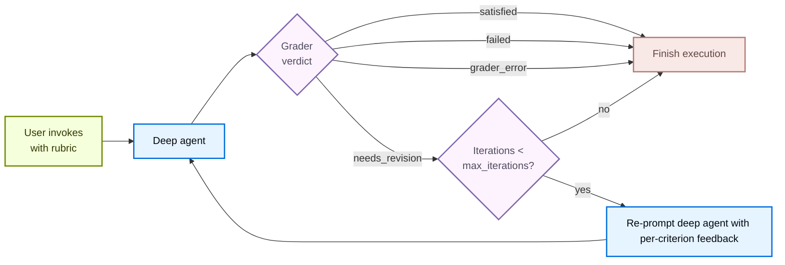

import RubricConfigurePy from '/snippets/code-samples/rubric-configure-py.mdx';
import RubricInvokePy from '/snippets/code-samples/rubric-invoke-py.mdx';
import RubricOnEvaluationPy from '/snippets/code-samples/rubric-on-evaluation-py.mdx';
import RubricStreamPy from '/snippets/code-samples/rubric-stream-py.mdx';
import RubricCodeGenerationMiddlewarePy from '/snippets/code-samples/rubric-code-generation-middleware-py.mdx';
import RubricCodeGenerationAgentPy from '/snippets/code-samples/rubric-code-generation-agent-py.mdx';
import RubricCodeGenerationInvokePy from '/snippets/code-samples/rubric-code-generation-invoke-py.mdx';

<Note>
`RubricMiddleware` 需要 `deepagents>=0.6.5`。它处于 [**beta**](/oss/versioning) 阶段；API 未来可能发生变化。
</Note>

有些 agent 任务对“完成”的定义很清楚，但工作模型第一次不一定能可靠命中：例如，符合音节格式的俳句、所有测试都通过的重构、覆盖所有必需章节的报告。`RubricMiddleware` 允许你把“什么算完成”写成 rubric，然后让 agent **自我评估并迭代**，直到满足 rubric（或者达到配置的最大迭代上限）。

**LLM-as-a-judge** 是一种模式：一个语言模型按照既定标准评估另一个模型的输出。在 [LangSmith evaluations](/langsmith/evaluation-concepts#llm-as-judge) 中，LLM-as-a-judge evaluator 会离线批量给应用输出打分。`RubricMiddleware` 在运行时应用同样的模式：Deep Agent 产生输出后，专门的 grader model 会按你的 rubric 审查整个 transcript，并驱动修改，直到每个标准都通过（或者达到配置的迭代上限）。

当 deep agent 完成推理后，LLM-as-a-judge grader sub-agent 会审查输出并返回判定。如果返回 `needs_revision`，每个标准的反馈会被注入回对话，agent 再运行一轮。循环会在 `satisfied`、`max_iterations_reached`、`failed` 或 `grader_error` 时终止。

## 配置 middleware

在调用 `create_deep_agent` 时，把 `RubricMiddleware` 加到 `middleware` 列表中：

<RubricConfigurePy />

| 参数 | 是否必填 | 默认值 | 说明 |
| --- | --- | --- | --- |
| `model` | 是 | `None` | LLM-as-a-judge grader sub-agent 使用的 chat model。可接受 `"provider:model-id"` 字符串或 `BaseChatModel` 实例。通常会比 deep agent 的工作模型更小或更便宜。 |
| `system_prompt` | 否 | 内置 grader prompt | 自定义评分指令。若不提供，则回退到默认 system prompt，用于说明 grader 的判定格式以及它可使用的工具。 |
| `tools` | 否 | `None` | grader 在给出判定前可以调用的工具（运行测试、统计 token、读取文件）。如果为空，grader 只根据 transcript 推理。 |
| `max_iterations` | 否 | `3` | 每次 rubric 尝试允许的最大 grader 迭代次数，必须是正整数。达到上限且仍未得到 `satisfied` 判定时，agent 以 `max_iterations_reached` 结束。 |
| `on_evaluation` | 否 | `None` | 每次评分迭代后都会触发的可选回调，适用于 `invoke()`、`stream()` 或 `stream_events()`。可用于日志、定制指标、eval dataset 或 UI 更新。 |

## 在调用时传入 rubric

在 invocation state 中传入 `rubric` 字符串即可启动自我评估循环。可以使用 `invoke()` 进行一次阻塞调用，也可以使用带有 [`CustomTransformer`](/oss/langchain/event-streaming#custom-updates) 的 [`stream_events(..., version="v3")`](/oss/langchain/event-streaming) 在 `stream.custom` 上接收实时评分事件：

<Tabs>
    <Tab title="invoke()">
        <RubricInvokePy />
    </Tab>
    <Tab title="stream_events()">
        <RubricStreamPy />

        Rubric 评分会在 `stream.custom` 上发出以下自定义事件：

        | 事件 | 触发时机 | 负载字段 |
        | --- | --- | --- |
        | `rubric_evaluation_start` | 在 grader 运行之前。 | <ul><li>`type`: 事件名</li><li>`grading_run_id`: 同一次 rubric 尝试中的所有事件共享</li><li>`iteration`: 当前评分轮次的从 0 开始的索引</li></ul> |
        | `rubric_evaluation_end` | 在 grader 返回后，或在 grader 抛出异常后。 | <ul><li>`type`: 事件名</li><li>`grading_run_id`: 同一次 rubric 尝试中的所有事件共享</li><li>`iteration`: 当前 grader 轮次的从 0 开始的索引</li><li>`result`: 这一轮的终态判定</li><li>`explanation`: grader 的摘要说明</li><li>`criteria`: 每个标准的判定结果</li></ul> |
    </Tab>
</Tabs>

### Rubric 判定

当 deep agent 完成推理并产生输出后，LLM-as-a-judge grader sub-agent 会根据 rubric 审查输出，并产生以下判定之一：

| 状态 | 含义 | 是否回到前一轮？ |
| --- | --- | --- |
| `satisfied` | rubric 中的每个标准都通过。 | 否 |
| `needs_revision` | 至少有一个标准未通过；grader 反馈会被注入，agent 会再次运行。 | 是 |
| `max_iterations_reached` | grader 仍然希望修改，但已经达到 `max_iterations`。 | 否 |
| `failed` | grader 判断 rubric 格式有问题，或无法根据 transcript 评估。 | 否 |
| `grader_error` | LLM-as-a-judge grader sub-agent 自身抛出异常（provider 超时、缺少凭据、结构化响应格式错误等）。 | 否 |

## 观察迭代进度

`on_evaluation` 是一个回调，它会在每次评分迭代后触发，携带 grader 的判定，无论你调用的是 `invoke()` 还是 `stream_events()`。如果你没有通过 `CustomTransformer` 从 `stream.custom` 读取 rubric 事件，也没有用 [LangSmith 跟踪运行](/langsmith/trace-with-langgraph)，它就是了解评分过程中发生了什么的主要方式。

<RubricOnEvaluationPy />

middleware 会在每次 [grader pass](#grader-pass-events) 后把一个 `RubricEvaluation` 字典传给你的函数。`RubricEvaluation` 字典包含：

| 字段 | 类型 | 说明 |
| --- | --- | --- |
| `grading_run_id` | `str` | 同一次 rubric 尝试中每次评估共享的标识符。当调用方提供不同的 `rubric` 时，或者同一个 `rubric` 在终态判定后再次调用时，会开启新一轮。 |
| `iteration` | `int` | 当前 grader pass 在该轮中的从 0 开始的索引。 |
| `result` | `str` | 这一轮 grader 的判定：`satisfied`、`needs_revision`、`failed` 或 `grader_error`。 |
| `explanation` | `str` | grader 的自由文本摘要。在基础设施失败时，这里会包含异常类型和消息。 |
| `criteria` | `list` | 每个标准的判定结果。每一项要么是 `{name, passed: true}`，要么是 `{name, passed: false, gap}`；其中 `gap` 是对未通过标准的可执行反馈。 |

### Grader pass 事件

| 事件 | 说明 |
| ----- | ------------- |
| **成功评分** | 每轮都会触发一次，包括中间的 `needs_revision` 判定，以及最终的 `satisfied` 或 `failed` 判定。   当 grader 返回 `needs_revision` 但已经达到 `max_iterations` 时，回调仍然会收到 `result: "needs_revision"`（grader 的判定）。该运行的终态状态在私有状态 `_rubric_status` 中是 `max_iterations_reached`，而不在 evaluation 记录中。可以在 `invoke` 完成后检查 `_rubric_status`，或者把最后一条 `_rubric_evaluations` 与 `_rubric_iterations` 一起读取，用来判断是否耗尽上限。 |
| **Grader 异常** | 会以 `result: "grader_error"` 触发，`explanation` 会从异常中派生，`criteria` 为空列表。 |
| **你的回调出错** | 异常会被记录并抑制。评分循环会继续。不要用 `on_evaluation` 强制控制流（例如通过抛错来停止 agent）。 |

## 跨调用持久化 rubric

一次 `agent.invoke()` 或 `agent.stream_events()` 调用会把 rubric 循环执行到完成，并以终态判定结束：`satisfied`、`failed` 或 `max_iterations_reached`。

若要让 rubric 继续贯穿后续调用，请附加一个 [checkpointer](/oss/langgraph/checkpointers#checkpoints)，并在调用时传入相同的 `thread_id`。在这种情况下，相同的 `rubric` 会一直保留到你传入新的 rubric 为止，后续的 `invoke()` 或 `stream_events()` 也会继续使用它。

中断（`KeyboardInterrupt`、`asyncio.CancelledError`）会不经捕获地从 `agent.invoke()` 和 `agent.stream_events()` 中向外传播。对于已 checkpoint 的线程，下一次使用同一个 rubric 的调用会继续未完成的评分运行。

## 示例：生成经过验证的 Python 代码

下面的示例构建了一个 deep agent，用来编写 `find_duplicates` 函数。它先定义一次 `RubricMiddleware`，把它附加到 agent 上，然后在 invoke 时传入 `rubric` 字符串。

这个示例没有让 grader 抽象地推理正确性，而是给它提供了 `run_test_suite` 工具来直接验证行为。grader 会在给出判定前调用这个工具获取更多信息；如果没有提供工具，它就会回退到根据 transcript 推理。

<Steps>
<Step title="定义 RubricMiddleware">

这个 middleware 在基础 agent 之上增加了一个 LLM-as-a-judge grader 循环。配置 grader model、可选的自定义 prompt、用于收集证据的工具，以及最大迭代上限。

<RubricCodeGenerationMiddlewarePy />

</Step>
<Step title="传给 deep agent">

agent 的 `system_prompt` 说明它如何完成任务，而 rubric 则告诉 grader 如何评判任务。

<RubricCodeGenerationAgentPy />

</Step>
<Step title="连同人类消息和 rubric 一起调用">

在 invocation 时，把用户请求放进 `messages`，再在 `rubric` 中提供一个按行分隔的检查清单，让 grader 去逐项标记是否满足。如果输入 state 没有提供 `rubric`，middleware 就不会运行。

<RubricCodeGenerationInvokePy />

</Step>
</Steps>

在 agent 产出结果后，grader 会接管并逐项检查输出：例如，`test_unhashable` 在输入包含不可哈希类型时是否会抛出 `TypeError`。如果有任何问题，grader 会给出反馈，然后 agent 会修改实现并把结果再交回 grader。
