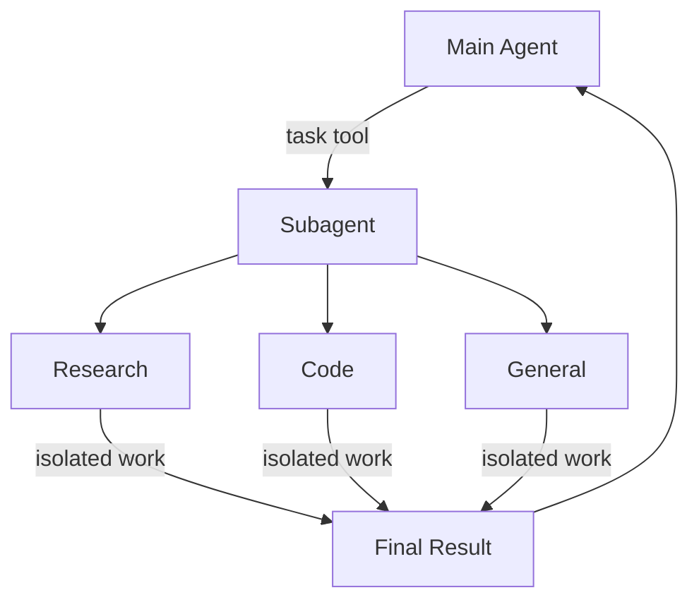

import SubagentBasicPy from '/snippets/code-samples/subagent-basic-py.mdx';
import SubagentBasicJs from '/snippets/code-samples/subagent-basic-js.mdx';
import SubagentStreamProgressPy from '/snippets/code-samples/subagent-stream-progress-py.mdx';
import SubagentStreamProgressJs from '/snippets/code-samples/subagent-stream-progress-js.mdx';
深度代理可以创建子代理来委派工作。您可以在“subagents”参数中指定自定义子代理。子代理对于[上下文隔离](https://www.dbreunig.com/2025/06/26/how-to-fix-your-context.html#context-quarantine)（保持主代理的上下文干净）和提供专门指令很有用。

本页介绍**同步**子代理，其中主管程序会阻塞，直到子代理完成。对于长时间运行的任务、并行工作流或需要中途引导和取消的情况，请参阅[异步子代理](/oss/deepagents/async-subagents)。

## 为什么要使用子代理？

子代理解决了**上下文膨胀问题**。当代理使用具有大量输出的工具（网络搜索、文件读取、数据库查询）时，上下文窗口很快就会被中间结果填满。子代理隔离了这些详细的工作——主代理仅接收最终结果，而不是产生该结果的数十个工具调用。

**何时使用子代理：**
- ✅ 多步骤任务会扰乱主要代理的上下文
- ✅ 需要自定义说明或工具的专业领域
- ✅ 需要不同模型能力的任务
- ✅ 当你想让主要代理人专注于高层协调时

**何时不使用子代理：**
- ❌ 简单的单步任务
- ❌当你需要维护中间上下文时
- ❌ 当开销超过收益时

## 配置

`subagents` 应该是字典或 @[`CompiledSubAgent`] 对象的列表。有两种类型：

### 默认子代理

Deep Agents 会自动添加同步“通用”子代理，除非您已经提供了具有该名称的同步子代理。

“通用”子代理默认具有文件系统工具，并且可以使用其他工具/中间件进行自定义。

- 要替换​​它，请传递您自己的名为“通用”的子代理。
- 要重命名或重新提示自动添加的版本，请在活动的 [harness profile](/oss/deepagents/profiles#harness-profiles) 上设置 `general_ Purpose_subagent=GeneralPurposeSubagentProfile(...)`。
- 要禁用它，请参阅下面的[不使用子代理运行](#running-without-subagents)。

### 在没有子代理的情况下运行

要在没有“task”工具的情况下运行代理，请执行以下两件事：

1. 在活动的 [harness profile](/oss/deepagents/profiles#harness-profiles) 上设置 `general_ Purpose_subagent=GeneralPurposeSubagentProfile(enabled=False)`。
2. 通过 `create_deep_agent` 上的 `subagents=` 不传递任何同步子代理。

当至少有一个同步子代理存在时，深度代理仅附加@[`SubAgentMiddleware`]（和`task`工具）。无论是默认代理还是调用者提供的代理，代理都可以在没有委派的情况下运行。

异步子代理不受影响——它们通过自己的中间件和工具流动，如[异步子代理](/oss/deepagents/async-subagents)中所述。
<Tip>
不要在这里使用“excluded_middleware”——“SubAgentMiddleware”是必需的脚手架，列出它会引发“ValueError”。 “general_ Purpose_subagent.enabled = False”旋钮是受支持的路径。
</Tip>
## 自定义子代理

您可以使用“subagents”参数使用特定工具定义专门的子代理。例如，担任代码审查员、网络研究员或测试运行员。

对于大多数用例，使用 [SubAgent dictionaries](#subagent-dictionary-based) 将子代理定义为字典。对于复杂的工作流程，请使用 [`CompiledSubAgent`](#compiledsubagent)：

### 子代理（基于字典）

将子代理定义为与 @[`SubAgent`] 规范匹配的字典，其中包含以下字段：
:::python
|领域 |类型 |描述 |
|--------|------|-------------|
| `名称` | `str` |必需的。子代理的唯一标识符。主代理在调用“task()”工具时使用此名称。子代理名称成为“AIMessage”和流媒体的元数据，这有助于区分代理。 |
| `描述` | `str` |必需的。描述该子代理的作用。具体并以行动为导向。主代理使用它来决定何时进行委托。 |
| `系统提示` | `str` |必需的。子代理的说明。自定义子代理必须定义自己的子代理。包括工具使用指南和输出格式要求。<br></br>不继承自主代理。 |
| `工具` | `列表[可调用]` |选修的。子代理可以使用的工具。保持最小化并仅包含需要的内容。<br></br>默认从主代理继承。指定后，将完全覆盖继承的工具。 |
| `模型` | `str` \| `BaseChatModel` |选修的。覆盖主要代理的模型。省略使用主代理的模型。<br></br>默认继承自主代理。您可以传递模型标识符字符串，如“openai:gpt-5.5”（使用“provider:model”格式）或 LangChain 聊天模型对象（“init_chat_model("gpt-5.5")”或“ChatOpenAI(model="gpt-5.5")”）。 |
| `中间件` | `列表[中间件]` |选修的。用于自定义行为、日志记录或速率限制的附加中间件。<br></br>不继承自主代理。附加到[默认子代理堆栈](/oss/deepagents/customization#default-stack-synchronous-subagents)。 |
| `中断_on` | `dict[str, 布尔 \|中断配置]` |选修的。为特定工具配置 [people-in-the-loop](/oss/deepagents/ human-in-the-loop)。选项：“True”、“False”或带有“allowed_decisions”的“InterruptOnConfig”。需要检查点。<br></br>默认继承自主代理。子代理值覆盖默认值。 |
| `技能` | `列表[str]` |选修的。 [Skills](/oss/deepagents/skills) 源路径。指定后，子代理将从这些目录加载技能（例如，`["/skills/research/", "/skills/web-search/"]`）。这允许子代理拥有与主代理不同的技能集。<br></br>不继承自主代理。只有通用子代理才能继承主代理的技能。当子代理具有技能时，它会运行自己独立的 @[`SkillsMiddleware`] 实例。技能状态是完全隔离的 - 子代理加载的技能对父代理不可见，反之亦然。 |
| `响应格式` | `响应格式` |选修的。子代理的[结构化输出](/oss/langchain/structured-output)架构。设置后，父代理会收到 JSON 格式的子代理结果，而不是自由格式的文本。接受 Pydantic 模型、“ToolStrategy(...)”、“ProviderStrategy(...)”或原始模式类型。请参阅[结构化输出](#structed-output)。 |
| `权限` | `列表[文件系统权限]` |选修的。子代理的[文件系统权限规则](/oss/deepagents/permissions)。设置后，**完全替换**父代理的权限。<br></br>默认从主代理继承。 |
:::

:::js
|领域 |类型 |描述 |
|--------|------|-------------|
| `名称` | `str` |必需的。子代理的唯一标识符。主代理在调用“task()”工具时使用此名称。子代理名称成为“AIMessage”和流媒体的元数据，这有助于区分代理。 |
| `描述` | `str` |必需的。描述该子代理的作用。具体并以行动为导向。主代理使用它来决定何时进行委托。 |
| `系统提示` | `str` |必需的。子代理的说明。自定义子代理必须定义自己的子代理。包括工具使用指南和输出格式要求。<br></br>不继承自主代理。 |
| `工具` | `列表[可调用]` |选修的。子代理可以使用的工具。保持最小化并仅包含需要的内容。<br></br>默认从主代理继承。指定后，将完全覆盖继承的工具。 |
| `模型` | `str` \| `BaseChatModel` |选修的。覆盖主要代理的模型。省略使用主代理的模型。<br></br>默认继承自主代理。您可以传递模型标识符字符串，如“openai:gpt-5.5”（使用“provider:model”格式）或 LangChain 聊天模型对象（“await initChatModel("gpt-5.5")”或“new ChatOpenAI({ model: "gpt-5.5" })”）。 |
| `名称` | `字符串` |必需的。子代理的唯一标识符。主代理在调用“task()”工具时使用此名称。子代理名称成为“AIMessage”和流媒体的元数据，这有助于区分代理。 |
| `描述` | `字符串` |必需的。描述该子代理的作用。具体并以行动为导向。主代理使用它来决定何时进行委托。 |
| `系统提示` | `字符串` |必需的。子代理的说明。自定义子代理必须定义自己的子代理。包括工具使用指南和输出格式要求。<br></br>不继承自主代理。 |
| `工具` | `结构化工具[]` |选修的。子代理可以使用的工具。保持最小化并仅包含需要的内容。<br></br>默认从主代理继承。指定后，将完全覆盖继承的工具。 |
| `模型` | `LanguageModelLike \|字符串`|选修的。覆盖主要代理的模型。省略使用主代理的模型。<br></br>默认继承自主代理。您可以传递模型标识符字符串，如“openai:gpt-5.5”（使用“provider:model”格式）或 LangChain 聊天模型对象（“await initChatModel("gpt-5.5")”或“new ChatOpenAI({ model: "gpt-5.5" })”）。 |
| `中间件` | `AgentMiddleware[]` |选修的。用于自定义行为、日志记录或速率限制的附加中间件。<br></br>不继承自主代理。附加到[默认子代理堆栈](/oss/deepagents/customization#default-stack-synchronous-subagents)。 |
| `中断` | `记录<字符串，布尔值\|中断配置>` |选修的。为特定工具配置 [people-in-the-loop](/oss/deepagents/ human-in-the-loop)。选项：“真”、“假”。或带有“allowed_decisions”的“InterruptOnConfig”。需要检查点。<br></br>默认继承自主代理。子代理值覆盖默认值。 |
| `技能` | `字符串[]` |选修的。 [Skills](/oss/deepagents/skills) 源路径。指定后，子代理将从这些目录加载技能（例如，`["/skills/research/", "/skills/web-search/"]`）。这允许子代理拥有与主代理不同的技能集。<br></br>不继承自主代理。只有通用子代理才能继承主代理的技能。当子代理具有技能时，它会运行自己独立的 @[`SkillsMiddleware`] 实例。技能状态是完全隔离的 - 子代理加载的技能对父代理不可见，反之亦然。 |
| `响应格式` | `响应格式` |选修的。子代理的[结构化输出](/oss/langchain/structured-output)架构。设置后，父代理会收到 JSON 格式的子代理结果，而不是自由格式的文本。接受 Zod 模式、JSON 模式对象、`toolStrategy(...)` 或 `providerStrategy(...)`。请参阅[结构化输出](#structed-output)。 |
| `权限` | `文件系统权限[]` |选修的。子代理的[文件系统权限规则](/oss/deepagents/permissions)。设置后，**完全替换**父代理的权限。<br></br>默认从主代理继承。 |
:::
### 编译子代理

对于复杂的工作流程，请使用预构建的 LangGraph 图作为 @[`CompiledSubAgent`]：

|领域 |类型 |描述 |
|--------|------|-------------|
| `名称` | `str` |必需的。子代理的唯一标识符。子代理名称成为“AIMessage”和流媒体的元数据，这有助于区分代理。 |
| `描述` | `str` |必需的。该子代理的作用。 |
| `可运行` | `可运行` |必需的。已编译的 LangGraph 图（必须首先调用 `.compile()`）。 |

## 使用子代理
:::python
<SubagentBasicPy />
:::

:::js
<SubagentBasicJs />
:::
## 使用 CompiledSubAgent

对于更复杂的用例，您可以使用 @[`CompiledSubAgent`] 提供自定义子代理。
您可以使用 LangChain 的 @[`create_agent`] 创建自定义子代理，或者使用 [graph API](/oss/langgraph/graph-api) 创建自定义 LangGraph 图形。

如果您要创建自定义 LangGraph 图表，请确保该图表有一个[名为“messages”的状态键](/oss/langgraph/quickstart#2-define-state)：
:::python
```python
from deepagents import create_deep_agent, CompiledSubAgent
from langchain.agents import create_agent

# Create a custom agent graph
custom_graph = create_agent(
    model=your_model,
    tools=specialized_tools,
    prompt="You are a specialized agent for data analysis..."
)

# Use it as a custom subagent
custom_subagent = CompiledSubAgent(
    name="data-analyzer",
    description="Specialized agent for complex data analysis tasks",
    runnable=custom_graph
)

subagents = [custom_subagent]

agent = create_deep_agent(
    model="google_genai:gemini-3.5-flash",
    tools=[internet_search],
    system_prompt=research_instructions,
    subagents=subagents
)
```
:::

:::js
```typescript
import { createDeepAgent, CompiledSubAgent } from "deepagents";
import { createAgent } from "langchain";

// Create a custom agent graph
const customGraph = createAgent({
  model: yourModel,
  tools: specializedTools,
  prompt: "You are a specialized agent for data analysis...",
});

// Use it as a custom subagent
const customSubagent: CompiledSubAgent = {
  name: "data-analyzer",
  description: "Specialized agent for complex data analysis tasks",
  runnable: customGraph,
};

const subagents = [customSubagent];

const agent = createDeepAgent({
  model: "google_genai:gemini-3.5-flash",
  tools: [internetSearch],
  systemPrompt: researchInstructions,
  subagents: subagents,
});
```
:::
## 动态子代理

默认情况下，主代理通过“任务”工具调用委托给子代理（它可以一次性发出多个子代理以并行运行它们）。附加了[解释器](/oss/deepagents/interpreters)后，代理可以从代码**分派子代理——使用循环、分支和并行批处理来跨多个项目展开工作并以编程方式合成结果。这称为[动态子代理](/oss/deepagents/dynamic-subagents)。

当工作跨越多个独立单元（查看目录中的每个文件、对一批工单进行分类）、需要多个视角或从递归分析中受益时，可以使用动态子代理。
<Warning>
动态子代理使用解释器运行时，它位于 [**beta**](/oss/versioning) 中。 API 和生命周期行为可能会在版本之间发生变化。
</Warning>
### 启用动态子代理

一旦代理同时拥有子代理和解释器中间件，动态子代理就变得可用。安装 QuickJS 解释器包，然后将“CodeInterpreterMiddleware”添加到您的代理中。
:::python
<CodeGroup>
```bash pip
pip install -U "deepagents[quickjs]"
```

```bash uv
uv add "deepagents[quickjs]"
```
</CodeGroup>

```python
from deepagents import create_deep_agent
from langchain_quickjs import CodeInterpreterMiddleware

agent = create_deep_agent(
    model="openai:gpt-5.5",
    subagents=[{
        "name": "reviewer",
        "description": "Reviews code for security issues, citing lines and severity",
        "system_prompt": "You are a security-focused code reviewer. Report issues with line numbers and severity.",
    }],
    middleware=[CodeInterpreterMiddleware()],
)
```

<Note>
只要代理具有子代理和解释器中间件，动态子代理调度就会默认打开。传递“CodeInterpreterMiddleware(subagents=False)”以要求通过正常的“task”工具路径进行调度。解释器需要 `langchain-quickjs>=0.1.0` 和 Python `>=3.11`。
</Note>
:::

:::js
<CodeGroup>
```bash npm
npm install deepagents @langchain/quickjs
```

```bash pnpm
pnpm add deepagents @langchain/quickjs
```

```bash yarn
yarn add deepagents @langchain/quickjs
```
</CodeGroup>

```typescript
import { createDeepAgent } from "deepagents";
import { createCodeInterpreterMiddleware } from "@langchain/quickjs";

const agent = createDeepAgent({
  model: "openai:gpt-5.5",
  subagents: [{
    name: "reviewer",
    description: "Reviews code for security issues, citing lines and severity",
    systemPrompt: "You are a security-focused code reviewer. Report issues with line numbers and severity.",
  }],
  middleware: [createCodeInterpreterMiddleware()],
});
```

<Note>
只要代理具有子代理和解释器中间件，动态子代理调度就会默认打开。传递“createCodeInterpreterMiddleware({ subagents: false })”以要求通过正常的“task”工具路径进行调度。
</Note>
:::
### 触发动态编排

动态调度是隐式的：代理决定根据任务的形状（而不是每次调用标志）从代码中分散工作。
<Tip>
**“工作流”一词是一个有用的触发器。**内置解释器系统提示将“工作流”视为通过解释器组织工作的信号 - 从代码中使用“task()”调度子代理。将请求表述为“工作流”是一个有意的杠杆，您可以选择动态编排：当您希望代理从代码中展开工作时，请包含它。对于单一的直接授权，请清楚地表达请求。
</Tip>
例如，将请求表述为“工作流”，选择从代码中进行扇出：
:::python
```python
result = await agent.ainvoke({
    "messages": [{"role": "user", "content": "Run a workflow that reviews every file in src/routes/ and summarizes the top risks."}]
})
```
:::

:::js
```typescript
const result = await agent.invoke({
  messages: [{ role: "user", content: "Run a workflow that reviews every file in src/routes/ and summarizes the top risks." }],
});
```
:::
有关配置、高级编排模式和安全注意事项，请参阅[动态子代理](/oss/deepagents/dynamic-subagents)。

### 与编码剂一起使用

尝试动态子代理的最快方法是使用“dcode”，这是基于深度代理构建的 LangChain 终端编码代理。它附带启用的代码解释器，因此动态子代理可以开箱即用，无需连接任何东西。

安装`dcode`：
```bash
curl -LsSf https://langch.in/dcode | bash
```
运行它：
```bash
dcode
```
要触发动态子代理，请要求“工作流程”。代理不会编写工作本身或通过其本机“任务”工具管理扇出，而是编写一个编排脚本，调用内置的“task()”全局并在代码解释器中运行它。例如：“运行工作流来检查 src/ 中的每个文件以进行 SQL 注入。”

当子代理生成时，“dcode”会在动态子代理面板中显示它们，并按调度分为多个阶段。
<Frame>

</Frame>
`dcode` 是尝试此操作的最快方法，但您也可以在您选择的编码代理中使用动态子代理而不是 [ACP](/oss/deepagents/acp)（例如，Zed）。

## 流媒体

深度代理支持来自协调器和每个委派子代理的流式更新。
:::python
使用 [`stream_events`](/oss/deepagents/event-streaming) 获取类型化投影 - 子代理、消息、工具调用和值的单独迭代器 - 这样您就可以独立使用每个项目。
:::

:::js
使用 [`streamEvents`](/oss/deepagents/event-streaming) 获取类型化投影（子代理、消息、工具调用和值的单独迭代器），以便您可以独立使用每个项目。
:::
### 流式传输子代理进度

最简单的模式是迭代“stream.subagents”来跟踪每个委托任务的启动、运行和完成。每个子代理句柄都会公开“.name”、“.messages”、“.tool_calls”和“.output”。
:::python

<SubagentStreamProgressPy />

:::

:::js

<SubagentStreamProgressJs />

:::
### LangSmith 追踪

当您的深度代理运行时，子代理或协调器执行的所有运行都将在“lc_agent_name”键下的元数据中包含代理名称，例如“{'lc_agent_name': 'research-agent'}”。这使您可以在 LangSmith 中通过子代理来识别和过滤运行。


<Tip>
在 [LangSmith](https://smith.langchain.com) 中打开运行，将协调器跟踪与每个子代理运行进行比较。按照[可观测性快速入门](/langsmith/observability-quickstart) 进行设置。我们建议您还设置 [LangSmith Engine](/langsmith/engine)，它可以监视您的痕迹、检测问题并提出修复建议。
</Tip>
## 在 LangSmith 中按子代理过滤

由于每个子代理的“名称”在其生成的每次运行中都会写入“lc_agent_name”元数据键，因此您可以使用 LangSmith 的元数据过滤将所有运行与特定子代理隔离，这对于调试、监控或比较子代理随时间的行为非常有用。

### LangSmith UI 中的过滤器

1. 在 [LangSmith](https://smith.langchain.com) 中打开您的追踪项目。
2. 将视图切换到“跟踪项目”页面上的“**运行**”以查看各个跨度。
3. 单击“**添加过滤器**”并选择“**元数据**”。
4. 将 **Key** 设置为 `lc_agent_name`，将 **Value** 设置为子代理名称（例如，`research-agent`）。

这仅显示该子代理生成的运行。您可以将过滤器保存为命名视图以供重复使用。有关过滤选项的完整参考，请参阅[过滤跟踪](/langsmith/filter-traces-in-application)。

### 使用 SDK 以编程方式过滤

使用 LangSmith 过滤器查询语言中的“has”比较器来匹配元数据键值对的运行：
```python
from langsmith import Client

client = Client()

runs = client.list_runs(
    project_name="<your-project>",
    filter='has(metadata, \'{"lc_agent_name": "research-agent"}\')',
)

for run in runs:
    print(run.name, run.start_time, run.status)
```
要从_any_命名的子代理（不包括主代理）获取运行，请过滤根本具有“lc_agent_name”键的运行：
```python
runs = client.list_runs(
    project_name="<your-project>",
    filter="has(metadata, 'lc_agent_name')",
)
```
有关完整的过滤器查询语言参考，请参阅[跟踪查询语法](/langsmith/trace-query-syntax)。

## 结构化输出

子代理支持结构化输出，因此父代理接收可预测、可解析的 JSON，而不是自由格式的文本。
:::python
<Note>
子代理的结构化输出需要 `deepagents>=0.5.3`。
</Note>
在子代理配置上传递“response_format”。当子代理完成时，其结构化响应将被 JSON 序列化并作为“ToolMessage”内容返回给父代理。该模式接受 @[`create_agent`] 支持的任何内容：Pydantic 模型、`ToolStrategy(...)`、`ProviderStrategy(...)` 或原始模式类型。
```python
from pydantic import BaseModel, Field

from deepagents import create_deep_agent


class ResearchFindings(BaseModel):
    """Structured findings from a research task."""
    summary: str = Field(description="Summary of findings")
    confidence: float = Field(description="Confidence score from 0 to 1")
    sources: list[str] = Field(description="List of source URLs")

research_subagent = {
    "name": "researcher",
    "description": "Researches topics and returns structured findings",
    "system_prompt": "Research the given topic thoroughly. Return your findings.",
    "tools": [web_search],
    "response_format": ResearchFindings,
}

agent = create_deep_agent(
    model="claude-sonnet-4-6",
    subagents=[research_subagent],
)

result = await agent.ainvoke(
    {"messages": [{"role": "user", "content": "Research recent advances in quantum computing"}]}
)

# The parent's ToolMessage contains JSON-serialized structured data:
# '{"summary": "...", "confidence": 0.87, "sources": ["https://..."]}'
```
:::

:::js
<Note>
子代理的结构化输出需要 `deepagents>=1.8.4`。
</Note>
在子代理配置上传递“responseFormat”。当子代理完成时，其结构化响应将被 JSON 序列化并作为“ToolMessage”内容返回给父代理。该模式接受 `createAgent` 支持的任何内容：Zod 模式、JSON 模式对象、`toolStrategy(...)` 或 `providerStrategy(...)`。
```typescript
import { z } from "zod";
import { createDeepAgent } from "deepagents";

const ResearchFindings = z.object({
  summary: z.string().describe("Summary of findings"),
  confidence: z.number().describe("Confidence score from 0 to 1"),
  sources: z.array(z.string()).describe("List of source URLs"),
});

const researchSubagent = {
  name: "researcher",
  description: "Researches topics and returns structured findings",
  systemPrompt: "Research the given topic thoroughly. Return your findings.",
  tools: [webSearch],
  responseFormat: ResearchFindings,
};

const agent = createDeepAgent({
  model: "claude-sonnet-4-6",
  subagents: [researchSubagent],
});

const result = await agent.invoke({
  messages: [{ role: "user", content: "Research recent advances in quantum computing" }],
});

// The parent's ToolMessage contains JSON-serialized structured data:
// '{"summary": "...", "confidence": 0.87, "sources": ["https://..."]}'
```
:::
如果没有“response_format”，父代理将按原样接收子代理的最后一条消息文本。有了它，父级始终会获得与架构匹配的有效 JSON，这在父级需要以编程方式处理结果或将其传递给下游工具时非常有用。

有关模式类型和策略（工具调用与提供者本机）的完整详细信息，请参阅[结构化输出](/oss/langchain/structured-output)。

## 通用子代理

除了任何用户定义的子代理之外，每个深度代理都可以随时访问“通用”子代理。该子代理：

- 使用自己的[应用了配置文件覆盖的默认系统提示符](/oss/deepagents/customization#prompt- assembly)
- 可以使用所有相同的工具
- 使用相同的模型（除非被覆盖）
- 继承主代理的技能（配置技能时）

### 覆盖通用子代理
:::python
在“子代理”列表中包含一个带有“name=”general- Purpose“”的子代理以替换默认值。使用它可以为通用子代理配置不同的模型、工具或系统提示：
```python
from deepagents import create_deep_agent

# Main agent uses Gemini; general-purpose subagent uses GPT
agent = create_deep_agent(
    model="google_genai:gemini-3.5-flash",
    tools=[internet_search],
    subagents=[
        {
            "name": "general-purpose",
            "description": "General-purpose agent for research and multi-step tasks",
            "system_prompt": "You are a general-purpose assistant.",
            "tools": [internet_search],
            "model": "openai:gpt-5.5",  # Different model for delegated tasks
        },
    ],
)
```
:::

:::js
在“子代理”列表中包含一个具有“名称：“通用””的子代理以替换默认值。使用它可以为通用子代理配置不同的模型、工具或系统提示：
```typescript
import { createDeepAgent } from "deepagents";

// Main agent uses Gemini; general-purpose subagent uses GPT
const agent = await createDeepAgent({
  model: "google_genai:gemini-3.5-flash",
  tools: [internetSearch],
  subagents: [
    {
      name: "general-purpose",
      description: "General-purpose agent for research and multi-step tasks",
      systemPrompt: "You are a general-purpose assistant.",
      tools: [internetSearch],
      model: "openai:gpt-5.5",  // Different model for delegated tasks
    },
  ],
});
```
:::
当您为子代理提供通用名称时，不会添加默认的通用子代理。您的规格完全取代了它。

要完全删除内置通用子代理而不是替换它，请将活动线束配置文件的通用子代理“enabled”标志设置为“False”。

### 何时使用它

通用子代理非常适合上下文隔离，无需专门的行为。主代理可以将复杂的多步骤任务委托给该子代理，并返回简洁的结果，而不会因中间工具调用而导致臃肿。
<Card title="Example">
它不是由主代理进行 10 次网络搜索并用结果填充其上下文，而是委托给通用子代理：`task(name="general- Purpose", task="研究量子计算趋势")`。子代理在内部执行所有搜索并仅返回摘要。
</Card>
###技能传承

使用`create_deep_agent`配置[技能](/oss/deepagents/skills)时：

- **通用子代理**：自动继承主代理的技能
- **自定义子代理**：默认情况下不继承技能 - 使用 `skills` 参数赋予他们自己的技能
<Note>
只有配置了技能的子代理才会获得“SkillsMiddleware”实例，而没有“skills”参数的自定义子代理则不会。当存在时，技能状态在两个方向上完全隔离：父级的技能对子级不可见，并且子级的技能不会传播回父级。
</Note>

:::python
```python
from deepagents import create_deep_agent

# Research subagent with its own skills
research_subagent = {
    "name": "researcher",
    "description": "Research assistant with specialized skills",
    "system_prompt": "You are a researcher.",
    "tools": [web_search],
    "skills": ["/skills/research/", "/skills/web-search/"],  # Subagent-specific skills
}

agent = create_deep_agent(
    model="google_genai:gemini-3.5-flash",
    skills=["/skills/main/"],  # Main agent and GP subagent get these
    subagents=[research_subagent],  # Gets only /skills/research/ and /skills/web-search/
)
```
:::

:::js
```typescript
import { createDeepAgent, SubAgent } from "deepagents";

// Research subagent with its own skills
const researchSubagent: SubAgent = {
  name: "researcher",
  description: "Research assistant with specialized skills",
  systemPrompt: "You are a researcher.",
  tools: [webSearch],
  skills: ["/skills/research/", "/skills/web-search/"],  // Subagent-specific skills
};

const agent = createDeepAgent({
  model: "google_genai:gemini-3.5-flash",
  skills: ["/skills/main/"],  // Main agent and GP subagent get these
  subagents: [researchSubagent],  // Gets only /skills/research/ and /skills/web-search/
});
```
:::
## 最佳实践

### 写出清晰的描述

主代理使用描述来决定调用哪个子代理。具体一点：

✅ **好：** `“分析财务数据并通过置信度得分生成投资见解”`

❌ **坏：** `“做财务工作”`

### 保持系统提示详细

包括有关如何使用工具和格式化输出的具体指南：
:::python
```python
research_subagent = {
    "name": "research-agent",
    "description": "Conducts in-depth research using web search and synthesizes findings",
    "system_prompt": """You are a thorough researcher. Your job is to:

    1. Break down the research question into searchable queries
    2. Use internet_search to find relevant information
    3. Synthesize findings into a comprehensive but concise summary
    4. Cite sources when making claims

    Output format:
    - Summary (2-3 paragraphs)
    - Key findings (bullet points)
    - Sources (with URLs)

    Keep your response under 500 words to maintain clean context.""",
    "tools": [internet_search],
}
```
:::

:::js
```typescript
const researchSubagent = {
  name: "research-agent",
  description: "Conducts in-depth research using web search and synthesizes findings",
  systemPrompt: `You are a thorough researcher. Your job is to:

  1. Break down the research question into searchable queries
  2. Use internet_search to find relevant information
  3. Synthesize findings into a comprehensive but concise summary
  4. Cite sources when making claims

  Output format:
  - Summary (2-3 paragraphs)
  - Key findings (bullet points)
  - Sources (with URLs)

  Keep your response under 500 words to maintain clean context.`,
  tools: [internetSearch],
};
```
:::
### 最小化工具集

只为子代理提供他们需要的工具。这可以提高注意力和安全性：
:::python
```python
# ✅ Good: Focused tool set
email_agent = {
    "name": "email-sender",
    "tools": [send_email, validate_email],  # Only email-related
}

# ❌ Bad: Too many tools
email_agent = {
    "name": "email-sender",
    "tools": [send_email, web_search, database_query, file_upload],  # Unfocused
}
```
:::

:::js
```typescript
// ✅ Good: Focused tool set
const emailAgent = {
  name: "email-sender",
  tools: [sendEmail, validateEmail],  // Only email-related
};

// ❌ Bad: Too many tools
const emailAgentBad = {
  name: "email-sender",
  tools: [sendEmail, webSearch, databaseQuery, fileUpload],  // Unfocused
};
```
:::
### 按任务选择模型

不同的模型擅长不同的任务：
:::python
```python
subagents = [
    {
        "name": "contract-reviewer",
        "description": "Reviews legal documents and contracts",
        "system_prompt": "You are an expert legal reviewer...",
        "tools": [read_document, analyze_contract],
        "model": "google_genai:gemini-3.5-flash",  # Large context for long documents
    },
    {
        "name": "financial-analyst",
        "description": "Analyzes financial data and market trends",
        "system_prompt": "You are an expert financial analyst...",
        "tools": [get_stock_price, analyze_fundamentals],
        "model": "openai:gpt-5.5",  # Better for numerical analysis
    },
]
```
:::

:::js
```typescript
const subagents = [
  {
    name: "contract-reviewer",
    description: "Reviews legal documents and contracts",
    systemPrompt: "You are an expert legal reviewer...",
    tools: [readDocument, analyzeContract],
    model: "google_genai:gemini-3.5-flash",  // Large context for long documents
  },
  {
    name: "financial-analyst",
    description: "Analyzes financial data and market trends",
    systemPrompt: "You are an expert financial analyst...",
    tools: [getStockPrice, analyzeFundamentals],
    model: "gpt-5.5",  // Better for numerical analysis
  },
];
```
:::
### 返回简洁的结果

指示子代理返回摘要，而不是原始数据：
:::python
```python
data_analyst = {
    "system_prompt": """Analyze the data and return:
    1. Key insights (3-5 bullet points)
    2. Overall confidence score
    3. Recommended next actions

    Do NOT include:
    - Raw data
    - Intermediate calculations
    - Detailed tool outputs

    Keep response under 300 words."""
}
```
:::

:::js
```typescript
const dataAnalyst = {
  systemPrompt: `Analyze the data and return:
  1. Key insights (3-5 bullet points)
  2. Overall confidence score
  3. Recommended next actions

  Do NOT include:
  - Raw data
  - Intermediate calculations
  - Detailed tool outputs

  Keep response under 300 words.`,
};
```
:::
## 常见模式

### 多个专业子代理

为不同的域创建专门的子代理：
:::python
```python
from deepagents import create_deep_agent

subagents = [
    {
        "name": "data-collector",
        "description": "Gathers raw data from various sources",
        "system_prompt": "Collect comprehensive data on the topic",
        "tools": [web_search, api_call, database_query],
    },
    {
        "name": "data-analyzer",
        "description": "Analyzes collected data for insights",
        "system_prompt": "Analyze data and extract key insights",
        "tools": [statistical_analysis],
    },
    {
        "name": "report-writer",
        "description": "Writes polished reports from analysis",
        "system_prompt": "Create professional reports from insights",
        "tools": [format_document],
    },
]

agent = create_deep_agent(
    model="google_genai:gemini-3.5-flash",
    system_prompt="You coordinate data analysis and reporting. Use subagents for specialized tasks.",
    subagents=subagents
)
```
:::

:::js
```typescript
import { createDeepAgent } from "deepagents";

const subagents = [
  {
    name: "data-collector",
    description: "Gathers raw data from various sources",
    systemPrompt: "Collect comprehensive data on the topic",
    tools: [webSearch, apiCall, databaseQuery],
  },
  {
    name: "data-analyzer",
    description: "Analyzes collected data for insights",
    systemPrompt: "Analyze data and extract key insights",
    tools: [statisticalAnalysis],
  },
  {
    name: "report-writer",
    description: "Writes polished reports from analysis",
    systemPrompt: "Create professional reports from insights",
    tools: [formatDocument],
  },
];

const agent = createDeepAgent({
  model: "google_genai:gemini-3.5-flash",
  systemPrompt: "You coordinate data analysis and reporting. Use subagents for specialized tasks.",
  subagents: subagents,
});
```
:::
**工作流程：**
1. 主代理人制定高层计划
2. 将数据收集委托给数据收集者
3. 将结果传递给数据分析器
4. 向报告撰写者发送见解
5. 编译最终输出

每个子代理都在干净的上下文中工作，仅专注于其任务。

## 上下文管理

当您使用[运行时上下文](/oss/langchain/runtime)调用父代理时，该上下文会自动传播到所有子代理。每个子代理运行都会接收您在父“invoke”/“ainvoke”调用中传递的相同运行时上下文。

这意味着在任何子代理内运行的工具都可以访问您提供给父​​代理的相同上下文值：
:::python
```python
from dataclasses import dataclass

from deepagents import create_deep_agent
from langchain.messages import HumanMessage
from langchain.tools import tool, ToolRuntime

@dataclass
class Context:
    user_id: str
    session_id: str

@tool
def get_user_data(query: str, runtime: ToolRuntime[Context]) -> str:
    """Fetch data for the current user."""
    user_id = runtime.context.user_id
    return f"Data for user {user_id}: {query}"

research_subagent = {
    "name": "researcher",
    "description": "Conducts research for the current user",
    "system_prompt": "You are a research assistant.",
    "tools": [get_user_data],
}

agent = create_deep_agent(
    model="google_genai:gemini-3.5-flash",
    subagents=[research_subagent],
    context_schema=Context,
)

# Context flows to the researcher subagent and its tools automatically
result = await agent.invoke(
    {"messages": [HumanMessage("Look up my recent activity")]},
    context=Context(user_id="user-123", session_id="abc"),
)
```
:::

:::js
```typescript
import { createDeepAgent } from "deepagents";
import { tool } from "langchain";
import type { ToolRuntime } from "@langchain/core/tools";
import { z } from "zod";

const contextSchema = z.object({
  userId: z.string(),
  sessionId: z.string(),
});

const getUserData = tool(
  async (input, runtime: ToolRuntime<unknown, typeof contextSchema>) => {
    const userId = runtime.context?.userId;
    return `Data for user ${userId}: ${input.query}`;
  },
  {
    name: "get_user_data",
    description: "Fetch data for the current user",
    schema: z.object({ query: z.string() }),
  }
);

const researchSubagent = {
  name: "researcher",
  description: "Conducts research for the current user",
  systemPrompt: "You are a research assistant.",
  tools: [getUserData],
};

const agent = createDeepAgent({
  model: "google_genai:gemini-3.5-flash",
  subagents: [researchSubagent],
  contextSchema,
});

// Context flows to the researcher subagent and its tools automatically
const result = await agent.invoke(
  { messages: [new HumanMessage("Look up my recent activity")] },
  { context: { userId: "user-123", sessionId: "abc" } },
);
```
:::
### 每个子代理上下文

所有子代理都接收相同的父上下文。要传递特定于特定子代理的配置，请在平面“上下文”映射中使用**命名空间键**（带有子代理名称的前缀键，例如“researcher：max_深度”），**或**将这些设置建模为上下文类型上的单独字段：
:::python
```python
from dataclasses import dataclass

from langchain.messages import HumanMessage
from langchain.tools import tool, ToolRuntime

@dataclass
class Context:
    user_id: str
    researcher_max_depth: int | None = None
    fact_checker_strict_mode: bool | None = None

result = await agent.invoke(
    {"messages": [HumanMessage("Research this and verify the claims")]},
    context=Context(
        user_id="user-123",
        researcher_max_depth=3,
        fact_checker_strict_mode=True,
    ),
)

@tool
def verify_claim(claim: str, runtime: ToolRuntime[Context]) -> str:
    """Verify a factual claim."""
    strict_mode = runtime.context.fact_checker_strict_mode or False
    if strict_mode:
        return strict_verification(claim)
    return basic_verification(claim)
```
:::

:::js
```typescript
import { tool } from "langchain";
import type { ToolRuntime } from "@langchain/core/tools";
import { z } from "zod";

const contextSchema = z.object({
  userId: z.string(),
  researcherMaxDepth: z.number().optional(),
  factCheckerStrictMode: z.boolean().optional(),
});

const result = await agent.invoke(
  { messages: [new HumanMessage("Research this and verify the claims")] },
  {
    context: {
      userId: "user-123",                        // shared by all agents
      "researcher:maxDepth": 3,                  // only for researcher
      "fact-checker:strictMode": true,           // only for fact-checker
    },
  },
);

const verifyClaim = tool(
  async (input, runtime: ToolRuntime<unknown, typeof contextSchema>) => {
    const strictMode = runtime.context?.factCheckerStrictMode ?? false;
    if (strictMode) {
      return strictVerification(input.claim);
    }
    return basicVerification(input.claim);
  },
  {
    name: "verify_claim",
    description: "Verify a factual claim",
    schema: z.object({ claim: z.string() }),
  }
);
```
:::
### 识别哪个子代理调用了工具

当父代理和多个子代理之间共享同一工具时，您可以使用“lc_agent_name”元数据（与 [streaming](#streaming) 中使用的值相同）来确定哪个代理发起了呼叫：
:::python
```python
from langchain.tools import tool, ToolRuntime

@tool
def shared_lookup(query: str, runtime: ToolRuntime) -> str:
    """Look up information."""
    agent_name = runtime.config.get("metadata", {}).get("lc_agent_name")
    if agent_name == "fact-checker":
        return strict_lookup(query)
    return general_lookup(query)
```
:::

:::js
```typescript
import { tool } from "langchain";
import type { ToolRuntime } from "@langchain/core/tools";

const sharedLookup = tool(
  async (input, runtime: ToolRuntime) => {
    const agentName = runtime.config?.metadata?.lc_agent_name;
    if (agentName === "fact-checker") {
      return strictLookup(input.query);
    }
    return generalLookup(input.query);
  },
  {
    name: "shared_lookup",
    description: "Look up information from various sources",
    schema: z.object({ query: z.string() }),
  }
);
```
:::
您可以组合这两种模式——在分支工具行为时从“runtime.context”读取特定于代理的设置，并从“runtime.config”元数据读取“lc_agent_name”。
:::python
```python
from langchain.tools import tool, ToolRuntime

@tool
def flexible_search(query: str, runtime: ToolRuntime[Context]) -> str:
    """Search with agent-specific settings."""
    agent_name = runtime.config.get("metadata", {}).get("lc_agent_name", "unknown")
    ctx = runtime.context
    if agent_name == "researcher":
        max_results = ctx.researcher_max_depth or 5
    else:
        max_results = 5
    include_raw = False

    return perform_search(query, max_results=max_results, include_raw=include_raw)
```
:::

:::js
```typescript
const flexibleSearch = tool(
  async (input, runtime: ToolRuntime<unknown, typeof contextSchema>) => {
    const agentName = runtime.config?.metadata?.lc_agent_name ?? "unknown";
    const ctx = runtime.context;
    const maxResults =
      agentName === "researcher" ? ctx?.researcherMaxDepth ?? 5 : 5;
    const includeRaw = false;

    return performSearch(input.query, { maxResults, includeRaw });
  },
  {
    name: "flexible_search",
    description: "Search with agent-specific settings",
    schema: z.object({ query: z.string() }),
  }
);
```
:::
## 故障排除

### 子代理未被调用

**问题**：主代理尝试自己完成工作而不是委派工作。

**解决方案**：

1. **使描述更具体：**

   :::蟒蛇
   ````蟒蛇
   # ✅ 好
   {"name": "research-specialist", "description": "使用网络搜索对特定主题进行深入研究。当您需要需要多次搜索的详细信息时使用。"}

   # ❌ 不好
   {“name”：“helper”，“description”：“帮助处理东西”}
   ````
   :::

   :::js
   ``打字稿
   // ✅ 好
   { name: "research-specialist", description: "使用网络搜索对特定主题进行深入研究。当您需要需要多次搜索的详细信息时使用。" }

   // ❌ 不好
   { name: "helper", description: "帮助处理事情" }
   ````
   :::

2. **指示主代理进行委托：**

:::蟒蛇
   ````蟒蛇
   代理 = create_deep_agent(
       模型=“google_genai：gemini-3.5-flash”，
       system_prompt="""...您的指示...

       重要提示：对于复杂的任务，请使用 task() 工具委托给您的子代理。
       这可以保持上下文干净并提高结果。""",
       子代理=[...]
   ）
   ````
   :::

   :::js
   ``打字稿
   const 代理 = createDeepAgent({
     系统提示：`...您的指令...

     重要提示：对于复杂的任务，请使用 task() 工具委托给您的子代理。
     这可以保持您的上下文干净并提高结果。`,
     子代理：[...]
   });
   ````
   :::

### 上下文仍然变得臃肿

**问题**：尽管使用了子代理，上下文仍被填满。

**解决方案**：

1. **指示子代理返回简洁的结果：**

   :::蟒蛇
   ````蟒蛇
   系统提示=“”“...

重要提示：仅返回基本摘要。
   请勿包含原始数据、中间搜索结果或详细的工具输出。
   您的回复不应超过 500 字。"""
   ````
   :::

   :::js
   ``打字稿
   系统提示：`...

   重要提示：仅返回基本摘要。
   请勿包含原始数据、中间搜索结果或详细的工具输出。
   您的回复不应超过 500 字。`
   ````
   :::

2. **使用文件系统处理大数据：**

   :::蟒蛇
   ````蟒蛇
   system_prompt="""当您收集大量数据时：
   1.将原始数据保存到/data/raw_results.txt
   2. 数据处理与分析
   3.仅返回分析摘要

   这可以保持上下文干净。"""
   ````
   :::

:::js
   ``打字稿
   systemPrompt: `当你收集大量数据时：
   1.将原始数据保存到/data/raw_results.txt
   2. 数据处理与分析
   3.仅返回分析摘要

   这可以保持上下文的干净。
   ````
   :::

### 选择了错误的子代理

**问题**：主代理为任务调用不适当的子代理。

**解决方案**：在描述中清楚地区分子代理：
:::python
```python
subagents = [
    {
        "name": "quick-researcher",
        "description": "For simple, quick research questions that need 1-2 searches. Use when you need basic facts or definitions.",
    },
    {
        "name": "deep-researcher",
        "description": "For complex, in-depth research requiring multiple searches, synthesis, and analysis. Use for comprehensive reports.",
    }
]
```
:::

:::js
```typescript
const subagents = [
  {
    name: "quick-researcher",
    description: "For simple, quick research questions that need 1-2 searches. Use when you need basic facts or definitions.",
  },
  {
    name: "deep-researcher",
    description: "For complex, in-depth research requiring multiple searches, synthesis, and analysis. Use for comprehensive reports.",
  }
];
```
:::
