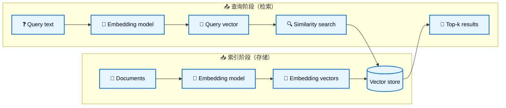

## 概览

[vector store](/oss/integrations/vectorstores) 用于存储[嵌入后的](/oss/integrations/embeddings)数据，并执行相似度搜索。



### 接口

LangChain 为 vector stores 提供了统一接口，使你可以：

- `addDocuments` - 向 store 中添加文档。
- `delete` - 按 ID 删除已存储文档。
- `similaritySearch` - 查询语义上相似的文档。

这个抽象让你可以在不同实现之间切换，而无需修改应用逻辑。

### 初始化

LangChain 中的大多数 vectorstores 在初始化时都接受一个 embedding model 作为参数。

```typescript
import { OpenAIEmbeddings } from "@langchain/openai";
import { MemoryVectorStore } from "@langchain/classic/vectorstores/memory";

const embeddings = new OpenAIEmbeddings({
  model: "text-embedding-3-small",
});
const vectorStore = new MemoryVectorStore(embeddings);
```

### 添加文档

你可以使用 `addDocuments` 函数向 vector store 添加文档。

```typescript
import { Document } from "@langchain/core/documents";
const document = new Document({
  pageContent: "Hello world",
});
await vectorStore.addDocuments([document]);
```

### 删除文档

你可以使用 `delete` 函数从 vector store 中删除文档。

```typescript
await vectorStore.delete({
  filter: {
    pageContent: "Hello world",
  },
});
```

### 相似度搜索

使用 `similaritySearch` 发起语义查询，它会返回最接近的嵌入文档：

```typescript
const results = await vectorStore.similaritySearch("Hello world", 10);
```


许多 vector stores 还支持如下参数：

* `k`，返回结果数量
* `filter`，基于 metadata 的条件过滤

### 相似度度量与索引

Embedding 相似度通常可以通过以下方式计算：

* **余弦相似度**
* **欧氏距离**
* **点积**

为了高效搜索，通常还会用到 HNSW，Hierarchical Navigable Small World，这类索引方法，不过具体实现取决于所用的 vector store。

### Metadata 过滤

按 metadata，例如来源、日期，过滤可以进一步优化搜索结果：

```typescript
vectorStore.similaritySearch("query", 2, { source: "tweets" });
```

<important>
不同实现对基于 metadata 的过滤支持程度不同。
请查阅你所选 vector store 的具体文档。
</important>

## 顶级集成

**选择 embedding model：**

<AccordionGroup>
<Accordion title="OpenAI">

安装依赖：

<CodeGroup>

```bash npm
npm install @langchain/openai @langchain/core
```
```bash yarn
yarn add @langchain/openai @langchain/core
```
```bash pnpm
pnpm add @langchain/openai @langchain/core
```
</CodeGroup>

添加环境变量：

```bash
OPENAI_API_KEY=your-api-key
```

实例化模型：

```typescript
import { OpenAIEmbeddings } from "@langchain/openai";

const embeddings = new OpenAIEmbeddings({
  model: "text-embedding-3-large"
});
```

</Accordion>
<Accordion title="Azure">

安装依赖

<CodeGroup>

```bash npm
npm install @langchain/openai @langchain/core
```
```bash yarn
yarn add @langchain/openai @langchain/core
```

```bash pnpm
pnpm add @langchain/openai @langchain/core
```
</CodeGroup>

添加环境变量：

```bash
AZURE_OPENAI_API_INSTANCE_NAME=<YOUR_INSTANCE_NAME>
AZURE_OPENAI_API_KEY=<YOUR_KEY>
AZURE_OPENAI_API_VERSION="2024-02-01"
```

实例化模型：

```typescript
import { AzureOpenAIEmbeddings } from "@langchain/openai";

const embeddings = new AzureOpenAIEmbeddings({
  azureOpenAIApiEmbeddingsDeploymentName: "text-embedding-ada-002"
});
```

</Accordion>

<Accordion title="AWS">

安装依赖：

<CodeGroup>

```bash npm
npm i @langchain/aws
```

```bash yarn
yarn add @langchain/aws
```

```bash pnpm
pnpm add @langchain/aws
```

</CodeGroup>

添加环境变量：

```bash
BEDROCK_AWS_REGION=your-region
```

实例化模型：

```typescript
import { BedrockEmbeddings } from "@langchain/aws";

const embeddings = new BedrockEmbeddings({
  model: "amazon.titan-embed-text-v1"
});
```

</Accordion>
<Accordion title="Google Gemini">

安装依赖：

<CodeGroup>
```bash npm
npm i @langchain/google-genai
```

```bash yarn
yarn add @langchain/google-genai
```

```bash pnpm
pnpm add @langchain/google-genai
```
</CodeGroup>

添加环境变量：

```bash
GOOGLE_API_KEY=your-api-key
```

实例化模型：

```typescript
import { GoogleGenerativeAIEmbeddings } from "@langchain/google-genai";

const embeddings = new GoogleGenerativeAIEmbeddings({
  model: "text-embedding-004"
});
```

</Accordion>
<Accordion title="Google Vertex">

安装依赖：

<CodeGroup>

```bash npm
npm i @langchain/google-vertexai
```

```bash yarn
yarn add @langchain/google-vertexai
```

```bash pnpm
pnpm add @langchain/google-vertexai
```
</CodeGroup>

添加环境变量：

```bash
GOOGLE_APPLICATION_CREDENTIALS=credentials.json
```

实例化模型：

```typescript
import { VertexAIEmbeddings } from "@langchain/google-vertexai";

const embeddings = new VertexAIEmbeddings({
  model: "gemini-embedding-001"
});
```

</Accordion>
<Accordion title="MistralAI">

安装依赖：

<CodeGroup>
```bash npm
npm install @langchain/mistralai @langchain/core
```

```bash yarn
yarn add @langchain/mistralai @langchain/core
```

```bash pnpm
pnpm add @langchain/mistralai @langchain/core
```
</CodeGroup>

添加环境变量：

```bash
MISTRAL_API_KEY=your-api-key
```

实例化模型：

```typescript
import { MistralAIEmbeddings } from "@langchain/mistralai";

const embeddings = new MistralAIEmbeddings({
  model: "mistral-embed"
});
```

</Accordion>
<Accordion title="Cohere">

安装依赖：

<CodeGroup>
```bash npm
npm i @langchain/cohere
```

```bash yarn
yarn add @langchain/cohere
```

```bash pnpm
pnpm add @langchain/cohere
```

</CodeGroup>

添加环境变量：

```bash
COHERE_API_KEY=your-api-key
```

实例化模型：

```typescript
import { CohereEmbeddings } from "@langchain/cohere";

const embeddings = new CohereEmbeddings({
  model: "embed-english-v3.0"
});
```

</Accordion>
<Accordion title="Ollama">

安装依赖：

<CodeGroup>
```bash npm
npm install @langchain/ollama @langchain/core
```

```bash yarn
yarn add @langchain/ollama @langchain/core
```

```bash pnpm
pnpm add @langchain/ollama @langchain/core
```
</CodeGroup>

实例化模型：

```typescript
import { OllamaEmbeddings } from "@langchain/ollama";

const embeddings = new OllamaEmbeddings({
  model: "llama2",
  baseUrl: "http://localhost:11434", // Default value
});
```

</Accordion>
</AccordionGroup>

**选择 vector store：**

<AccordionGroup>
<Accordion title="Memory">

<CodeGroup>
```bash
npm i langchain
```

```bash yarn
yarn add langchain
```

```bash pnpm
pnpm add langchain
```
</CodeGroup>

```typescript
import { MemoryVectorStore } from "@langchain/classic/vectorstores/memory";

const vectorStore = new MemoryVectorStore(embeddings);
```

</Accordion>
<Accordion title="MongoDB">

<Tabs>
  <Tab title="Manual embedding">
    <CodeGroup>
    ```bash npm
    npm install @langchain/mongodb mongodb @langchain/core
    ```
    ```bash yarn
    yarn add @langchain/mongodb mongodb @langchain/core
    ```
    ```bash pnpm
    pnpm add @langchain/mongodb mongodb @langchain/core
    ```
    </CodeGroup>

    ```typescript
    import { MongoDBAtlasVectorSearch } from "@langchain/mongodb"
    import { MongoClient } from "mongodb";

    const client = new MongoClient(process.env.MONGODB_ATLAS_URI!);
    const collection = client
      .db(process.env.MONGODB_ATLAS_DB_NAME)
      .collection(process.env.MONGODB_ATLAS_COLLECTION_NAME);

    const vectorStore = new MongoDBAtlasVectorSearch(embeddings, {
      collection,
      indexName: "vector_index",
      textKey: "text",
      embeddingKey: "embedding",
    });
    ```
  </Tab>
  <Tab title="Automated embedding">
    <CodeGroup>
    ```bash npm
    npm install @langchain/mongodb mongodb @langchain/core
    ```
    ```bash yarn
    yarn add @langchain/mongodb mongodb @langchain/core
    ```
    ```bash pnpm
    pnpm add @langchain/mongodb mongodb @langchain/core
    ```
    </CodeGroup>

    ```typescript
    import { MongoDBAtlasVectorSearch } from "@langchain/mongodb"
    import { MongoClient } from "mongodb";

    const client = new MongoClient(process.env.MONGODB_ATLAS_URI!);
    const collection = client
      .db(process.env.MONGODB_ATLAS_DB_NAME)
      .collection(process.env.MONGODB_ATLAS_COLLECTION_NAME);

    const vectorStore = new MongoDBAtlasVectorSearch({ collection });
    ```
  </Tab>
</Tabs>

</Accordion>
<Accordion title="Pinecone">

<CodeGroup>

```bash npm
npm install @langchain/pinecone @langchain/core @pinecone-database/pinecone
```

```bash yarn
yarn add @langchain/pinecone @langchain/core @pinecone-database/pinecone
```

```bash pnpm
pnpm add @langchain/pinecone @langchain/core @pinecone-database/pinecone
```

</CodeGroup>

```typescript
import { PineconeStore } from "@langchain/pinecone";
import { Pinecone as PineconeClient } from "@pinecone-database/pinecone";

const pinecone = new PineconeClient();
const vectorStore = new PineconeStore(embeddings, {
  pineconeIndex,
  maxConcurrency: 5,
});
```

</Accordion>

<Accordion title="Redis">

<CodeGroup>
```bash npm
npm install @langchain/redis @langchain/core redis
```

```bash yarn
yarn add @langchain/redis @langchain/core redis
```

```bash pnpm
pnpm add @langchain/redis @langchain/core redis
```
</CodeGroup>

```typescript
import { RedisVectorStore } from "@langchain/redis";

const vectorStore = new RedisVectorStore(embeddings, {
  redisClient: client,
  indexName: "langchainjs-testing",
});
```

</Accordion>
<Accordion title="Qdrant">

<CodeGroup>
```bash npm
npm install @langchain/qdrant @langchain/core
```

```bash yarn
yarn add @langchain/qdrant @langchain/core
```

```bash pnpm
pnpm add @langchain/qdrant @langchain/core
```

</CodeGroup>

```typescript
import { QdrantVectorStore } from "@langchain/qdrant";

const vectorStore = await QdrantVectorStore.fromExistingCollection(embeddings, {
  url: process.env.QDRANT_URL,
  collectionName: "langchainjs-testing",
});
```

</Accordion>
<Accordion title="Oracle AI Database">

<CodeGroup>
```bash npm
npm i @oracle/langchain-oracledb @langchain/core
```
```bash yarn
yarn add @oracle/langchain-oracledb @langchain/core
```
```bash pnpm
pnpm add @oracle/langchain-oracledb @langchain/core
```
</CodeGroup>

```typescript
import oracledb from "oracledb";
import { OracleEmbeddings, OracleVS } from "@oracle/langchain-oracledb";

const connection = await oracledb.getConnection({
  user: process.env.ORACLE_USER,
  password: process.env.ORACLE_PASSWORD,
  connectionString: process.env.ORACLE_DSN,
});

const embeddings = new OracleEmbeddings(connection, {
  provider: "database",
  model: process.env.DEMO_ONNX_MODEL ?? "DEMO_MODEL",
});

const vectorStore = new OracleVS(embeddings, {
  client: connection,
  tableName: "DEMO_VECTORS",
  query: "Find support tickets mentioning service outages.",
  distanceStrategy: "DOT",
});
await vectorStore.initialize();
```

</Accordion>

<Accordion title="Weaviate">
    <CodeGroup>
        ```bash npm
        npm install @langchain/weaviate @langchain/core weaviate-client
        ```

        ```bash yarn
        yarn add @langchain/weaviate @langchain/core weaviate-client
        ```

        ```bash pnpm
        pnpm add @langchain/weaviate @langchain/core weaviate-client
        ```
    </CodeGroup>

    <CodeGroup>

    ```typescript
    import { WeaviateStore } from "@langchain/weaviate";

    const vectorStore = new WeaviateStore(embeddings, {
        client: weaviateClient,
        indexName: "Langchainjs_test",
    });
    ```
    </CodeGroup>
</Accordion>

</AccordionGroup>

LangChain.js 可以集成多种 vector stores。你可以在下面查看完整列表：

## 所有 vector stores

<Columns cols={3}>
  <Card
    title="Azure DocumentDB"
    icon="link"
    href="/oss/integrations/vectorstores/azure_documentdb"
    arrow="true"
    cta="查看指南"
  />
  <Card
    title="Azure Cosmos DB for NoSQL"
    icon="link"
    href="/oss/integrations/vectorstores/azure_cosmosdb_nosql"
    arrow="true"
    cta="查看指南"
  />
  <Card
    title="Cloudflare Vectorize"
    icon="link"
    href="/oss/integrations/vectorstores/cloudflare_vectorize"
    arrow="true"
    cta="查看指南"
  />
  <Card
    title="Google Cloud SQL for PostgreSQL"
    icon="link"
    href="/oss/integrations/vectorstores/google_cloudsql_pg"
    arrow="true"
    cta="查看指南"
  />
  <Card
    title="In-memory"
    icon="link"
    href="/oss/integrations/vectorstores/memory"
    arrow="true"
    cta="查看指南"
  />
  <Card
    title="Milvus"
    icon="link"
    href="/oss/integrations/vectorstores/milvus"
    arrow="true"
    cta="查看指南"
  />
  <Card
    title="MongoDB Atlas"
    icon="link"
    href="/oss/integrations/vectorstores/mongodb_atlas"
    arrow="true"
    cta="查看指南"
  />
  <Card
    title="Oracle AI Database"
    icon="link"
    href="/oss/integrations/vectorstores/oracleai"
    arrow="true"
    cta="查看指南"
  />
  <Card
    title="Pinecone"
    icon="link"
    href="/oss/integrations/vectorstores/pinecone"
    arrow="true"
    cta="查看指南"
  />
  <Card
    title="Qdrant"
    icon="link"
    href="/oss/integrations/vectorstores/qdrant"
    arrow="true"
    cta="查看指南"
  />
  <Card
    title="Redis"
    icon="link"
    href="/oss/integrations/vectorstores/redis"
    arrow="true"
    cta="查看指南"
  />
  <Card
    title="Weaviate"
    icon="link"
    href="/oss/integrations/vectorstores/weaviate"
    arrow="true"
    cta="查看指南"
  />
  <Card
    title="Neo4j Vector Index"
    icon="link"
    href="/oss/integrations/vectorstores/neo4jvector"
    arrow="true"
    cta="查看指南"
  />
  <Card
    title="PGVector"
    icon="link"
    href="/oss/integrations/vectorstores/pgvector"
    arrow="true"
    cta="查看指南"
  />
  <Card
    title="Turbopuffer"
    icon="link"
    href="/oss/integrations/vectorstores/turbopuffer"
    arrow="true"
    cta="查看指南"
  />
  <Card
    title="YDB"
    icon="link"
    href="/oss/integrations/vectorstores/ydb"
    arrow="true"
    cta="查看指南"
  />
</Columns>
