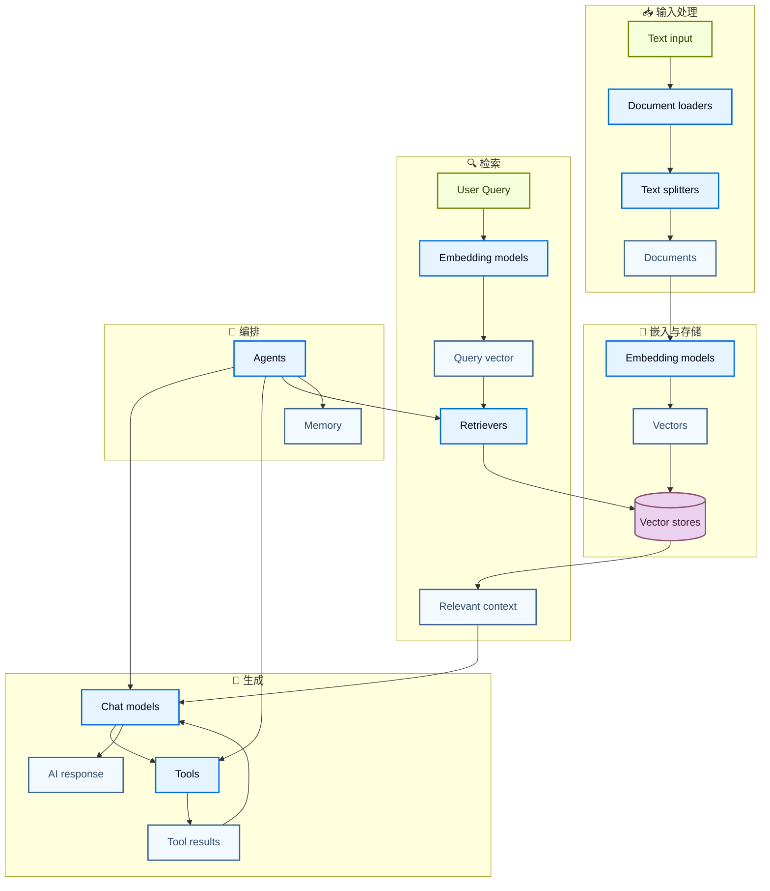
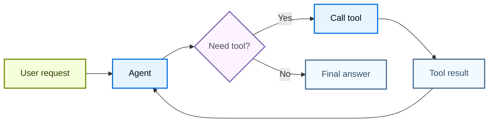
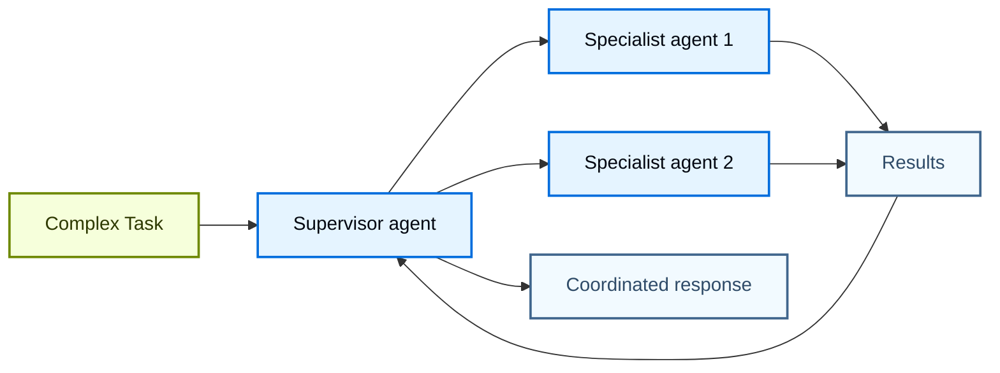

LangChain 的能力来自各个组件彼此协作，从而构建出复杂的 AI 应用。本页通过图示展示不同组件之间的关系。

## 核心组件生态

下面的图展示了 LangChain 的主要组件如何连接起来，形成完整的 AI 应用：

### 组件如何连接

每一层组件都建立在前一层之上：

1. **输入处理** - 将原始数据转换为结构化文档
2. **嵌入与存储** - 将文本转换为可搜索的向量表示
3. **检索** - 根据用户查询找到相关信息
4. **生成** - 使用 AI 模型生成响应，并可选择配合工具使用
5. **编排** - 通过智能体和记忆系统协调一切

## 组件类别

LangChain 将组件组织为以下主要类别：

| 类别 | 作用 | 关键组件 | 使用场景 |
|----------|---------|---------------|-----------|
| **[Models](/oss/langchain/models)** | AI 推理与生成 | Chat models、LLMs、Embedding models | 文本生成、推理、语义理解 |
| **[Tools](/oss/langchain/tools)** | 外部能力 | APIs、数据库等 | 网络搜索、数据访问、计算 |
| **[Agents](/oss/langchain/agents)** | 编排与推理 | ReAct agents、tool calling agents | 非确定性工作流、决策制定 |
| **[Memory](/oss/langchain/short-term-memory)** | 上下文保持 | 消息历史、自定义状态 | 对话、有状态交互 |
| **[Retrievers](/oss/integrations/retrievers)** | 信息访问 | 向量检索器、网页检索器 | RAG、知识库搜索 |
| **[Document processing](/oss/integrations/document_loaders)** | 数据摄取 | 加载器、分割器、转换器 | PDF 处理、网页抓取 |
| **[Vector Stores](/oss/integrations/vectorstores)** | 语义搜索 | Chroma、Pinecone、FAISS | 相似度搜索、向量存储 |

## 常见模式

### RAG（检索增强生成）

### 带工具的智能体

### 多智能体系统

## 了解更多

- [创建智能体](/oss/langchain/agents)
- [使用工具](/oss/langchain/tools)
- [浏览集成](/oss/integrations/providers/overview)
