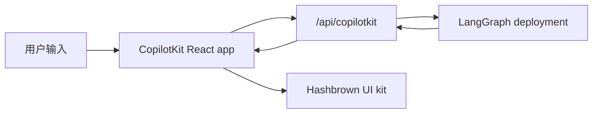

[CopilotKit](https://www.copilotkit.ai/) 提供了完整的 React chat runtime，特别适合与 LangGraph 搭配使用，尤其是在你希望 agent 返回 **结构化 UI payload**，而不仅仅是纯文本的时候。在这种模式下，你的 LangGraph 部署会同时提供 graph API 和一个自定义 CopilotKit endpoint，而前端则把 assistant messages 解析成动态 React 组件。

在服务端，[copilotkit](https://pypi.org/project/copilotkit/) 包提供 [`CopilotKitMiddleware`](https://docs.copilotkit.ai)，因此 LangGraph graph、LangChain agent 或 [Deep Agent](/oss/deepagents/overview) 都可以说 [Agent UI (AG-UI)](https://docs.ag-ui.com/) wire protocol，向 chat UI 流式发送 tool 和 message 事件，并读写共享的 **CopilotKit** 状态片段，同时还附带工具来在 graph 前面挂载兼容 CopilotKit 的 HTTP endpoint。

这种方式适合以下场景：

- 想要一个现成的 chat runtime，而不是自己手动把 `stream.messages` 串起来
- 想要一个自定义服务端 endpoint，在已部署 graph 旁边叠加 provider-specific 行为
- 想要从受限组件注册表中渲染结构化生成式 UI

[CopilotKit for LangGraph](https://docs.copilotkit.ai/langgraph) 还记录了基于同一 middleware 和 clients 的 [generative UI](https://docs.copilotkit.ai/langgraph/generative-ui)、[human in the loop](https://docs.copilotkit.ai/langgraph/human-in-the-loop)（HITL）以及 [shared state](https://docs.copilotkit.ai/langgraph/shared-state)。

<Info>
  关于 CopilotKit 专属 API、UI 模式和运行时配置，请查看
  [CopilotKit docs](https://docs.copilotkit.ai/langgraph)。如果你想看 Deep Agent 的讲解，请查看
  CopilotKit 文档中的 [Deep Agents and CopilotKit](https://docs.copilotkit.ai/langgraph/deep-agents)。
</Info>

import { ExampleEmbed } from "/snippets/example-embed.jsx"

<ExampleEmbed example="copilotkit" minHeight={700} />

## 工作原理

从高层看，CopilotKit 夹在你的 React 应用和 LangGraph 部署之间。前端把会话状态发送到与 graph API 并列挂载的一个自定义 `/api/copilotkit` route，该 route 再把请求转发给 LangGraph，响应则同时带回 assistant messages 和组件注册表可以渲染的结构化 UI payload。

1. **正常部署 graph**，使用 LangSmith 或 LangGraph 开发服务器。
2. **用 HTTP app 扩展部署**，在 graph API 旁边挂载一个 CopilotKit route。
3. **用 `CopilotKit` 包裹前端**，并把它指向那个自定义 runtime URL。
4. **注册动态 UI 组件**，并在渲染时把 assistant responses 解析成这些组件。



:::python
## 你在 Python 服务端能得到什么

[copilotkit](https://pypi.org/project/copilotkit/) 及相关包负责桥接 LangGraph deployment 和 CopilotKit clients。

| 组件 | 作用 |
| --------- | ---- |
| `CopilotKitMiddleware` | 把 CopilotKit 和 AG-UI 状态、请求合并进你的 agent，包括前端 [tool calls](/oss/langchain/agents#tools) 和上下文。把它加到 @[create_agent] 或 @[create_deep_agent] 的 `middleware` 列表里。 |
| `CopilotKitState`（子类） | [自定义状态](/oss/langchain/short-term-memory)：扩展 `CopilotKitState`，把 CopilotKit key 放进 graph state。 |
| `LangGraphAGUIAgent` | 把一个编译后的 graph 打包成一个 runtime 可用的 name 和 description。 |
| `add_langgraph_fastapi_endpoint`（来自 [ag-ui-langgraph](https://pypi.org/project/ag-ui-langgraph/)） | 连接一个 **FastAPI** app，让 CopilotKit 能在同一个 [LangGraph](/oss/langgraph/overview) 进程里运行你的 graph。适用于你在 `langgraph.json` 中添加 [custom `http` app](#extend-the-langgraph-deployment-with-a-custom-endpoint) 的场景，而不是单独起一个 HTTP server。 |

`CopilotKitMiddleware` 对于 @[create_deep_agent] 和通过 @[create_agent] 创建、并把它加入 `middleware` 列表的 graph 来说是同一个 middleware。对于带 `CopilotKitState` 和 FastAPI bridge 的 `create_agent` graph，请参考下面的 [Python `main.py` 示例](#extend-the-langgraph-deployment-with-a-custom-endpoint)。结构化生成式 UI（例如客户端的 `useAgentContext` 和 `output_schema`）还需要额外的 middleware，把 Copilot state 映射成 [structured output](/oss/langchain/agents#structured-output) 策略，和同一节里可展开的 `src/middleware.py` 示例一样。

把 `app` 挂到 `langgraph.json` 的 `http` key 上，遵循的就是通常的 [LangGraph or LangSmith deployment](/oss/langgraph/deploy) 方式，这样一个进程就能同时服务 graph 和同一个 FastAPI app 给 CopilotKit client。
:::

## 安装

对于后端 endpoint：

:::js
```bash
bun add @copilotkit/runtime hono
```
:::

:::python
```bash
uv add copilotkit ag-ui-langgraph fastapi uvicorn
```

middleware 包与 Deep Agents stack 一起使用。请把它和你的 [chat model](/oss/integrations/chat) 包一起安装（这个示例使用 OpenAI）：

<CodeGroup>
```python pip
pip install -U deepagents copilotkit langchain-openai
```

```python uv
uv add deepagents copilotkit langchain-openai
```
</CodeGroup>
:::

对于前端 app：

```bash
bun add @copilotkit/react-core @copilotkit/react-ui @hashbrownai/core @hashbrownai/react
```

:::python
## 在 Deep Agent 中使用 CopilotKit

把 `CopilotKitMiddleware` 加到你传给 @[create_deep_agent] 的 `middleware` 列表里。这个 middleware 让 CopilotKit 可以路由前端 tool calls，并把 chat state 和你的 graph 对齐。把你配置的其他 [middleware](/oss/deepagents/customization#middleware) 也放在同一个列表里。

编译后的 graph 就可以接到支持 CopilotKit 或 AG-UI 的进程里，例如下面的 [FastAPI 模式](#extend-the-langgraph-deployment-with-a-custom-endpoint)，或者 CopilotKit 文档中的 [Deep Agents and CopilotKit](https://docs.copilotkit.ai/langgraph/deep-agents) 这类指南。

```python
from deepagents import create_deep_agent
from copilotkit import CopilotKitMiddleware
from langgraph.checkpoint.memory import MemorySaver


def get_weather(location: str) -> str:
    """Return a simple weather string for a location."""
    return f"The weather in {location} is sunny."


agent = create_deep_agent(
    model="openai:gpt-5.5",
    tools=[get_weather],
    middleware=[CopilotKitMiddleware()],  # AG-UI、frontend tools 和 context
    system_prompt="You are a helpful research assistant.",
    checkpointer=MemorySaver(),
)
```
:::

## 通过自定义 endpoint 扩展 LangGraph 部署

关键点在于，LangGraph deployment 不只是服务 graph。它也可以加载 HTTP app，这样你就能在 deployment 旁边挂载额外 route。

在 `langgraph.json` 中，把 `http.app` 指向你的自定义 app 入口：

:::js
```json
{
  "graphs": {
    "copilotkit_shadify": "./src/agents/copilotkit-shadify.ts:agent"
  },
  "http": {
    "app": "./src/api/app.ts:app"
  }
}
```
:::

:::python
```json
{
  "dependencies": ["."],
  "graphs": {
    "copilotkit_shadify": "./main.py:agent"
  },
  "http": {
    "app": "./main.py:app"
  }
}
```
:::

:::js
然后创建 Hono app，并注册 CopilotKit route：

```ts app.ts
import { Hono } from "hono";
import { registerCopilotKit } from "./copilotkit.js";

export const app = new Hono();

registerCopilotKit(app);
```
:::

:::python
在 Python 中，创建一个 `FastAPI` app，并通过 CopilotKit 的 AG-UI bridge 暴露 LangGraph agent：

```python main.py
from typing import Any, TypedDict

from ag_ui_langgraph import add_langgraph_fastapi_endpoint
from copilotkit import CopilotKitMiddleware, CopilotKitState, LangGraphAGUIAgent
from fastapi import FastAPI
from langchain.agents import create_agent

from src.middleware import apply_structured_output_schema, normalize_context


class AgentState(CopilotKitState):
    pass


class AgentContext(TypedDict, total=False):
    output_schema: dict[str, Any]


agent = create_agent(
    model="openai:gpt-5.5",
    middleware=[
        normalize_context,
        CopilotKitMiddleware(),
        apply_structured_output_schema,
    ],
    context_schema=AgentContext,
    state_schema=AgentState,
    system_prompt=(
        "You are a helpful UI assistant. Build visual responses using the "
        "available components."
    ),
)

app = FastAPI()

add_langgraph_fastapi_endpoint(
    app=app,
    agent=LangGraphAGUIAgent(
        name="copilotkit_shadify",
        description="A UI assistant that returns structured component payloads.",
        graph=agent,
    ),
    path="/",
)
```
:::

这个自定义 app 是最重要的扩展点：它会挂载一个支持 CopilotKit 的 runtime，而不会替换底层的 LangGraph deployment。

:::js
在这个 route 内，创建一个 `CopilotRuntime`，并通过 `LangGraphAgent` 指向已部署的 graph：

```ts expandable copilotkit.ts
import { type Hono } from "hono";

import { createCopilotEndpointSingleRoute, CopilotRuntime } from "@copilotkit/runtime/v2";
import { LangGraphAgent } from "@copilotkit/runtime/langgraph";

const defaultAgentHost = process.env.LANGGRAPH_DEPLOYMENT_URL || "http://127.0.0.1:2024";
const agentUrl = defaultAgentHost.startsWith("http")
  ? defaultAgentHost
  : `http://${defaultAgentHost}`;

class BridgedLangGraphAgent extends LangGraphAgent {
  override prepareRunAgentInput(
    input: Parameters<LangGraphAgent["prepareRunAgentInput"]>[0],
  ): ReturnType<LangGraphAgent["prepareRunAgentInput"]> {
    const prepared = super.prepareRunAgentInput(input);

    return {
      ...prepared,
      context: normalizeCopilotContext(prepared.context) as ReturnType<
        LangGraphAgent["prepareRunAgentInput"]
      >["context"],
    };
  }

  override async getAssistant(): Promise<Awaited<ReturnType<LangGraphAgent["getAssistant"]>>> {
    const assistants = await this.client.assistants.search({
      graphId: this.graphId,
      limit: 100,
    });

    const assistant = assistants.find((candidate) => candidate.graph_id === this.graphId);
    if (assistant) {
      return assistant;
    }

    return super.getAssistant();
  }
}

export function registerCopilotKit(app: Hono) {
  const runtime = new CopilotRuntime({
    agents: {
      default: new BridgedLangGraphAgent({
        deploymentUrl: agentUrl,
        graphId: "copilotkit_shadify",
      }),
    },
  });

  const copilotApp = createCopilotEndpointSingleRoute({
    runtime,
    basePath: "/api/copilotkit",
  });

  app.route("/", copilotApp);
}

function normalizeCopilotContext(context: unknown): unknown {
  if (!Array.isArray(context)) {
    return context;
  }

  const normalizedEntries = context.flatMap((item) => {
    if (!item || typeof item !== "object") {
      return [];
    }

    const entry = item as { description?: unknown; value?: unknown };
    return typeof entry.description === "string" ? [[entry.description, entry.value] as const] : [];
  });

  return Object.fromEntries(normalizedEntries);
}
```

这个 route adapter 只是 TypeScript 方案的一半。你的 LangChain agent 还需要 middleware，读取转发过来的 `output_schema`，并把它转换成模型的结构化 `responseFormat`：

```ts expandable agent.ts
import { createAgent, createMiddleware, toolStrategy } from "langchain";
import { z } from "zod";

import { deepSearchTool, searchWebTool } from "../tools/index.js";

const contextSchema = z.object({
  output_schema: z.unknown().optional(),
});

const structuredOutputMiddleware = createMiddleware({
  name: "CopilotKitStructuredOutput",
  contextSchema,
  wrapModelCall: async (request, handler) => {
    const rawOutputSchema = getRuntimeOutputSchema(request.runtime);
    const schema = normalizeOutputSchema(rawOutputSchema);
    if (!schema) {
      return handler(request);
    }

    const responseFormat = toolStrategy(
      schema as unknown as Parameters<typeof toolStrategy>[0],
      {
        toolMessageContent: "Structured UI response generated.",
      },
    );

    return handler({
      ...request,
      responseFormat,
    });
  },
});

export const agent = createAgent({
  model: process.env.COPILOTKIT_MODEL ?? "google_genai:gemini-3.5-flash",
  contextSchema,
  middleware: [structuredOutputMiddleware],
  tools: [searchWebTool, deepSearchTool],
  systemPrompt: `You are a helpful UI assistant inspired by the CopilotKit Shadify example.

Build rich visual responses with the available UI components when they add value.
Only wrap actual UI layouts inside cards. Plain Markdown answers should stay as Markdown.
Use rows for side-by-side layouts with at most two columns.
Prefer simple, polished outputs over dense dashboards.
When using charts, make labels and values concise and easy to read.
When showing code, prefer the code_block component.
When researching topics, use the available search tools first and then present the result cleanly.`,
});

function normalizeOutputSchema(value: unknown): Record<string, unknown> | null {
  let schema = value;

  if (typeof schema === "string") {
    try {
      schema = JSON.parse(schema);
    } catch {
      return null;
    }
  }

  if (!schema || typeof schema !== "object" || Array.isArray(schema)) {
    return null;
  }

  const normalized = { ...(schema as Record<string, unknown>) };

  if (!normalized.title) {
    normalized.title = "CopilotKitStructuredOutput";
  }

  if (!normalized.description) {
    normalized.description = "Structured response schema for the CopilotKit preview.";
  }

  return normalized;
}

function getRuntimeOutputSchema(runtime: {
  context?: { output_schema?: unknown };
  configurable?: Record<string, unknown>;
}): unknown {
  if (runtime.context?.output_schema !== undefined) {
    return runtime.context.output_schema;
  }

  const configurable = runtime.configurable;
  if (!configurable || typeof configurable !== "object" || Array.isArray(configurable)) {
    return undefined;
  }

  return configurable.output_schema;
}
```

这个 middleware 正是让前端的 `useAgentContext({ description: "output_schema", ... })` 发挥作用的关键。CopilotKit runtime 会转发 schema，而 agent 则把它转换成模型必须遵守的结构化输出契约。
:::

:::python
在 Python 中，等价的工作发生在 middleware 里：先规范化 CopilotKit context，再把 `useAgentContext(...)` 里的 `output_schema` 传给模型的结构化输出配置。

```python expandable src/middleware.py
import json
from collections.abc import Mapping

from langchain.agents.middleware import before_agent, wrap_model_call
from langchain.agents.structured_output import ProviderStrategy


@wrap_model_call
async def apply_structured_output_schema(request, handler):
    schema = None
    runtime = getattr(request, "runtime", None)
    runtime_context = getattr(runtime, "context", None)

    if isinstance(runtime_context, Mapping):
        schema = runtime_context.get("output_schema")

    if schema is None and isinstance(getattr(request, "state", None), dict):
        copilot_context = request.state.get("copilotkit", {}).get("context")
        if isinstance(copilot_context, list):
            for item in copilot_context:
                if isinstance(item, dict) and item.get("description") == "output_schema":
                    schema = item.get("value")
                    break

    if isinstance(schema, str):
        try:
            schema = json.loads(schema)
        except json.JSONDecodeError:
            schema = None

    if isinstance(schema, dict):
        request = request.override(
            response_format=ProviderStrategy(schema=schema, strict=True),
        )

    return await handler(request)


@before_agent
def normalize_context(state, runtime):
    copilotkit_state = state.get("copilotkit", {})
    context = copilotkit_state.get("context")

    if isinstance(context, list):
        normalized = [
            item.model_dump() if hasattr(item, "model_dump") else item
            for item in context
        ]
        return {"copilotkit": {**copilotkit_state, "context": normalized}}

    return None
```
:::

这样就把职责拆开了：

- LangGraph 仍然负责 graph 执行和持久化
- CopilotKit 负责面向聊天的 runtime contract
- 你的自定义 endpoint 把两者粘合在同一个部署里

:::python
当你使用 [CopilotKit](https://docs.copilotkit.ai) runtime adapter 时，请把 CopilotKit `runtimeUrl` 指向 FastAPI（或其他）app 暴露的 route，而不是只指向原始 graph REST surface。
:::
:::js
按照 CopilotKit 文档中关于 [LangGraphHttpAgent](https://docs.copilotkit.ai/langgraph) 的说明，或者 Node **CopilotRuntime** 里的 `LangGraphAgent` 方式来接；**Python** graph 和 middleware 仍然负责定义 tool 行为和 agent 逻辑。
:::

## 组织前端 app

在前端，用 `CopilotKit` 包裹你的 app，并把它指向自定义 runtime URL：

```tsx
import { CopilotKit } from "@copilotkit/react-core";
import { CopilotChat, useAgentContext } from "@copilotkit/react-core/v2";
import { s } from "@hashbrownai/core";

import { useChatKit } from "@/components/chat/chat-kit";
import { chatTheme } from "@/lib/chat-theme";

export function App() {
  return (
    <CopilotKit runtimeUrl={import.meta.env.VITE_RUNTIME_URL ?? "/api/copilotkit"}>
      <Page />
    </CopilotKit>
  );
}

function Page() {
  const chatKit = useChatKit();

  useAgentContext({
    description: "output_schema",
    value: s.toJsonSchema(chatKit.schema),
  });

  return <CopilotChat {...chatTheme} />;
}
```

这里有两个关键点：

- `runtimeUrl="/api/copilotkit"` 会把 chat 发到你的自定义后端 route，而不是直接发给原始 LangGraph API
- `useAgentContext(...)` 会把 UI schema 发送给 agent，这样模型就知道它应该生成什么结构化输出格式

## 注册动态组件

组件注册表位于 `useChatKit()` 中。你要在这里定义 agent 允许生成的组件集合，例如 cards、rows、columns、charts、code blocks 和 buttons。

```tsx
import { s } from "@hashbrownai/core";
import { exposeComponent, exposeMarkdown, useUiKit } from "@hashbrownai/react";

import { Button } from "@/components/ui/button";
import { Card } from "@/components/ui/card";
import { CodeBlock } from "@/components/ui/code-block";
import { Row, Column } from "@/components/ui/layout";
import { SimpleChart } from "@/components/ui/simple-chart";

export function useChatKit() {
  return useUiKit({
    components: [
      exposeMarkdown(),
      exposeComponent(Card, {
        name: "card",
        description: "Card to wrap generative UI content.",
        children: "any",
      }),
      exposeComponent(Row, {
        name: "row",
        props: {
          gap: s.string("Tailwind gap size") as never,
        },
        children: "any",
      }),
      exposeComponent(Column, {
        name: "column",
        children: "any",
      }),
      exposeComponent(SimpleChart, {
        name: "chart",
        props: {
          labels: s.array("Category labels", s.string("A label")),
          values: s.array("Numeric values", s.number("A value")),
        },
        children: false,
      }),
      exposeComponent(CodeBlock, {
        name: "code_block",
        props: {
          code: s.streaming.string("The code to display"),
          language: s.string("Programming language") as never,
        },
        children: false,
      }),
      exposeComponent(Button, {
        name: "button",
        children: "text",
      }),
    ],
  });
}
```

这个注册表就是 agent 和 UI 之间的契约。模型不是在生成任意 JSX，而是在生成必须通过你暴露出来的组件和 props 校验的结构化数据。

## 把 assistant messages 渲染为动态 UI

assistant response 到达后，自定义 message renderer 会决定如何展示它。这个示例里：

- assistant messages 会被按 UI kit schema 解析为结构化 JSON
- 合法的结构化输出会被渲染成真正的 React 组件
- user messages 则继续显示为普通 chat bubble

```tsx
import type { AssistantMessage } from "@ag-ui/core";
import type { RenderMessageProps } from "@copilotkit/react-ui";
import { useJsonParser } from "@hashbrownai/react";
import { memo } from "react";

import { useChatKit } from "@/components/chat/chat-kit";
import { Squircle } from "@/components/squircle";

const AssistantMessageRenderer = memo(function AssistantMessageRenderer({
  message,
}: {
  message: AssistantMessage;
}) {
  const kit = useChatKit();
  const { value } = useJsonParser(message.content ?? "", kit.schema);

  if (!value) return null;

  return (
    <div className="group/msg mt-2 flex w-full justify-start">
      <div className="magic-text-output w-full px-1 py-1">{kit.render(value)}</div>
    </div>
  );
});

export function CustomMessageRenderer({ message }: RenderMessageProps) {
  if (message.role === "assistant") {
    return <AssistantMessageRenderer message={message} />;
  }

  return (
    <div className="flex w-full justify-end">
      <Squircle className="w-full max-w-[64ch] px-4 py-3">
        <pre>{typeof message.content === "string" ? message.content : JSON.stringify(message.content, null, 2)}</pre>
      </Squircle>
    </div>
  );
}
```

这个 renderer 模式正是让集成体验像原生应用的原因：

- CopilotKit 负责 chat state 和 transport
- 自定义 renderer 负责把 assistant payload 变成 UI
- [Hashbrown](https://hashbrown.dev/) 把经过校验的结构化数据变成具体的 React elements

## 资源

- [Deep Agents and CopilotKit](https://docs.copilotkit.ai/langgraph/deep-agents) in the CopilotKit documentation - 端到端 Next.js、dev server 和 **Deep Agent** 路线
- [CopilotKit: LangGraph features](https://docs.copilotkit.ai/langgraph) - generative UI、HITL、shared state
- [LangGraph deployment](/oss/langgraph/deploy) - 生产环境和开发服务器

## 最佳实践

- **保持 custom endpoint 轻薄**：它用来适配 CopilotKit 与 graph deployment，而不是重复实现已经在 graph 里的业务逻辑
- **显式发送 schema**：`useAgentContext` 应当在页面挂载时就描述 UI contract
- **注册受限的组件集合**：只暴露你真正希望模型使用的组件和 props
- **把渲染当成解析步骤**：先把 assistant content 按你的 schema 解析，再进行渲染
- **让 user messages 保持普通文本**：只有 assistant messages 需要结构化 renderer；user messages 可以维持普通 chat bubble
