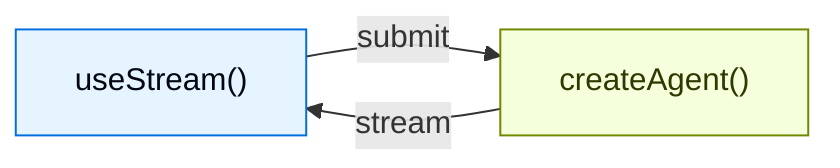

为使用 `createAgent` 创建的智能体构建丰富、可交互的前端。这些模式覆盖了从基础消息渲染，到人类介入审批、队列提交、可持久流重连和时间旅行调试等高级工作流。

LangChain 前端 SDK 不只是为**智能体应用**设计的，也不只是为了 token 流式聊天机器人。用于渲染消息的同一个 hook，还会暴露智能体的持久线程状态、工具调用生命周期、中断、检查点历史和自定义状态值，因此你的 UI 可以成为长时间运行的智能体工作的控制平面。

<Note>
这些模式使用 v1 前端 SDK 包。如果你使用的是更早版本，请参见 [React](https://github.com/langchain-ai/langgraphjs/blob/main/libs/sdk-react/docs/v1-migration.md)、[Vue](https://github.com/langchain-ai/langgraphjs/blob/main/libs/sdk-vue/docs/v1-migration.md)、[Svelte](https://github.com/langchain-ai/langgraphjs/blob/main/libs/sdk-svelte/docs/v1-migration.md) 和 [Angular](https://github.com/langchain-ai/langgraphjs/blob/main/libs/sdk-angular/docs/v1-migration.md) 的迁移指南。
</Note>

## 架构

每种模式都遵循同样的架构：`createAgent` 后端通过 SDK stream API 将状态流式发送到前端。



在后端，`createAgent` 会生成一个编译后的 LangGraph 图，并暴露流式 API。在前端，stream handle 连接到该 API，并提供响应式状态 - 消息、工具调用、中断、值和线程元数据 - 供你用任意框架渲染。

## 为什么使用 LangChain 前端 SDK

大多数 AI UI 库只帮助你把流式文本追加到聊天记录里。
LangChain 的 SDK 暴露了生产级智能体所需的更丰富运行时语义：

| 能力 | 在 UI 中实现什么 |
| --- | --- |
| **持久线程** | 刷新页面、切换设备，或重新加入运行，而不会丢失对话状态。 |
| **类型化智能体状态** | 不只是消息，任何状态键都能渲染：待办事项、流水线输出、引用、沙盒文件、指标，或自定义业务对象。 |
| **工具调用生命周期** | 将待处理、已完成和失败的工具调用显示为专门的 UI 卡片，而不是原始 JSON。 |
| **中断** | 暂停执行以进行人工审批、编辑或补充信息，然后从智能体停止的准确位置恢复。 |
| **检查点** | 基于持久化状态快照构建编辑、重试、分支、审计和时间旅行流程。 |
| **嵌套执行** | 可视化深层智能体、子智能体和图节点，而不会把所有内容压扁成一条难以阅读的流。 |
| **框架原生响应性** | 在 React、Vue、Svelte 或 Angular 中使用同一协议，同时保留惯用的 hooks、composables、stores 或 signals。 |

这些基础能力让你可以设计出这样的 UI：用户可以在智能体工作进行时查看、引导、暂停、恢复和分叉它。

<CodeGroup>

:::python
```python agent.py
from langchain import create_agent
from langgraph.checkpoint.memory import MemorySaver

agent = create_agent(
    model="openai:gpt-5.5",
    tools=[get_weather, search_web],
    checkpointer=MemorySaver(),
)
```

```ts types.ts
export interface GraphState {
  messages: BaseMessage[];
}
```

```tsx Chat.tsx
import { useStream } from "@langchain/react";
import type { GraphState } from "./types";

function Chat() {
  const stream = useStream<GraphState>({
    apiUrl: "http://localhost:2024",
    assistantId: "agent",
  });

  return (
    <div>
      {stream.messages.map((msg) => (
        <Message key={msg.id} message={msg} />
      ))}
    </div>
  );
}
```

:::

:::js
```ts agent.ts
import { createAgent } from "langchain";
import { MemorySaver } from "@langchain/langgraph";

const agent = createAgent({
  model: "openai:gpt-5.5",
  tools: [getWeather, searchWeb],
  checkpointer: new MemorySaver(),
});
```

```tsx Chat.tsx
import { useStream } from "@langchain/react";
import type { agent } from "./agent";

function Chat() {
  const stream = useStream<typeof agent>({
    apiUrl: "http://localhost:2024",
    assistantId: "agent",
  });

  return (
    <div>
      {stream.messages.map((msg) => (
        <Message key={msg.id} message={msg} />
      ))}
    </div>
  );
}
```
:::

</CodeGroup>

React、Vue 和 Svelte 使用 `useStream`。Angular 使用 `injectStream`：

```ts
import { useStream } from "@langchain/react";      // React
import { useStream } from "@langchain/vue";        // Vue
import { useStream } from "@langchain/svelte";     // Svelte
import { injectStream } from "@langchain/angular"; // Angular
```

## 类型推断

为 @[`useStream`]（或者 Angular 中的 @[`injectStream`]）传入类型参数，就能安全访问 `stream.messages`、`stream.toolCalls`、`stream.interrupt`、`stream.values` 和其他响应式状态。

:::python

定义一个与智能体状态 schema 匹配的 TypeScript 接口，并将其作为类型参数传入：

```ts
import type { BaseMessage } from "langchain";

interface AgentState {
  messages: BaseMessage[];
}

const stream = useStream<AgentState>({
  apiUrl: "http://localhost:2024",
  assistantId: "agent",
});
```

使用 `langgraph.json` 中的图名称作为 `assistantId`。在本指南的示例中，把 `typeof myAgent` 替换成你的接口名，例如 `AgentState`。

如果智能体暴露了自定义状态键，请扩展这个接口：

```ts
import type { BaseMessage, Todo } from "langchain";

interface AgentState {
  messages: BaseMessage[];
  todos: Todo[];
}
```

:::

:::js

导入你的智能体，并把 `typeof myAgent` 作为类型参数传入。TypeScript 会从编译后的图中推断状态 schema：

```ts
import type { myAgent } from "./agent";

const stream = useStream<typeof myAgent>({
  apiUrl: "http://localhost:2024",
  assistantId: "agent",
});
```

自定义状态键会自动推断，不需要手动定义接口。

:::

## 模式

### 渲染消息和输出

<CardGroup cols={3}>
  <Card title="Markdown messages" icon="markdown" href="/oss/langchain/frontend/markdown-messages">
    解析并渲染流式 markdown，带有正确的格式和代码高亮。
  </Card>
  <Card title="Structured output" icon="layout-grid" href="/oss/langchain/frontend/structured-output">
    将类型化的智能体响应渲染成自定义 UI 组件，而不是纯文本。
  </Card>
  <Card title="Reasoning tokens" icon="brain" href="/oss/langchain/frontend/reasoning-tokens">
    用可折叠块展示模型的思考过程。
  </Card>
  <Card title="Generative UI" icon="wand" href="/oss/langchain/frontend/generative-ui">
    使用 json-render，从自然语言提示渲染 AI 生成的用户界面。
  </Card>
</CardGroup>

### 展示智能体动作

<CardGroup cols={3}>
  <Card title="Tool calling" icon="tool" href="/oss/langchain/frontend/tool-calling">
    用带有加载和错误状态的丰富、类型安全 UI 卡片展示工具调用。
  </Card>
  <Card title="Headless tools" icon="device-desktop" href="/oss/langchain/frontend/headless-tools">
    在客户端运行浏览器和设备 API，同时在智能体侧保留类型化工具 schema。
  </Card>
  <Card title="Human-in-the-loop" icon="user-check" href="/oss/langchain/frontend/human-in-the-loop">
    暂停智能体以便人工审核，支持批准、拒绝和编辑工作流。
  </Card>
</CardGroup>

### 管理对话

<CardGroup cols={3}>
  <Card title="Branching chat" icon="git-branch" href="/oss/langchain/frontend/branching-chat">
    编辑消息、重新生成响应，并在对话分支之间导航。
  </Card>
  <Card title="Message queues" icon="list-check" href="/oss/langchain/frontend/message-queues">
    在智能体顺序处理消息时，将多条消息加入队列。
  </Card>
</CardGroup>

### 高级流式传输

<CardGroup cols={3}>
  <Card title="Join & rejoin streams" icon="plug-connected" href="/oss/langchain/frontend/join-rejoin">
    与正在运行的智能体流断开并重新连接，同时保留进度。
  </Card>
  <Card title="Time travel" icon="clock" href="/oss/langchain/frontend/time-travel">
    检查、导航并从对话历史中的任意检查点恢复。
  </Card>
</CardGroup>

## 选择前端模式

从你的应用需要回答的 UX 问题开始：

| 如果用户需要... | 从这里开始 |
| --- | --- |
| 了解智能体正在做什么 | [Tool calling](/oss/langchain/frontend/tool-calling) 和 [reasoning tokens](/oss/langchain/frontend/reasoning-tokens) |
| 安全批准敏感操作 | [Human-in-the-loop](/oss/langchain/frontend/human-in-the-loop) |
| 在一次运行仍活跃时发送工作 | [Message queues](/oss/langchain/frontend/message-queues) |
| 离开并回到长时间运行的工作 | [Join & rejoin streams](/oss/langchain/frontend/join-rejoin) |
| 从较早轮次编辑或重试 | [Branching chat](/oss/langchain/frontend/branching-chat) 和 [time travel](/oss/langchain/frontend/time-travel) |
| 将状态渲染为应用，而不是聊天 | [Structured output](/oss/langchain/frontend/structured-output)、[generative UI](/oss/langchain/frontend/generative-ui) 和 [Deep Agents frontend patterns](/oss/deepagents/frontend/overview) |

## 集成

stream API 与 UI 无关。你可以将它与任意组件库或 generative UI 框架一起使用。组件库可以负责展示层，而 LangChain SDK 负责底层的智能体运行时状态、可恢复性、中断和检查点语义。

<CardGroup cols={3}>
  <Card title="AI Elements" icon="package" href="/oss/langchain/frontend/integrations/ai-elements">
    用于 AI 聊天的可组合 shadcn/ui 组件：`Conversation`、`Message`、`Tool`、`Reasoning`。
  </Card>
  <Card title="assistant-ui" icon="package" href="/oss/langchain/frontend/integrations/assistant-ui">
    Headless React 框架，内置线程管理、分支和附件支持。
  </Card>
  <Card title="OpenUI" icon="package" href="/oss/langchain/frontend/integrations/openui">
    使用 openui-lang 组件 DSL，为数据密集型报告和仪表盘提供 generative UI 库。
  </Card>
</CardGroup>
