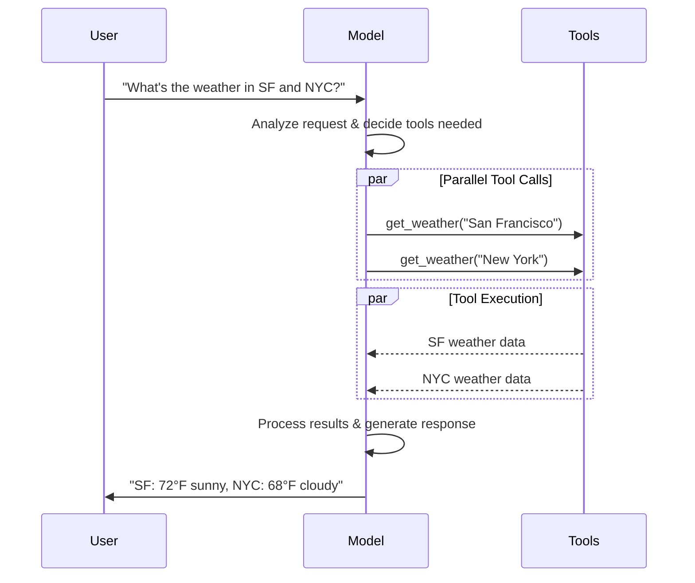
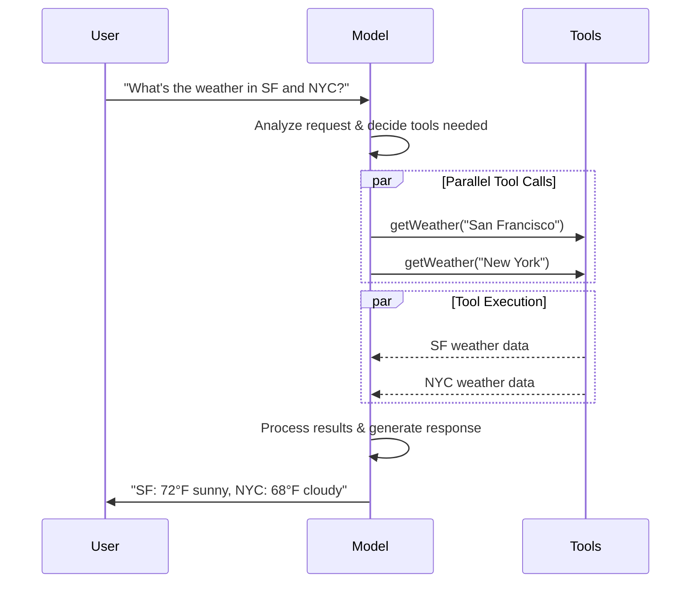
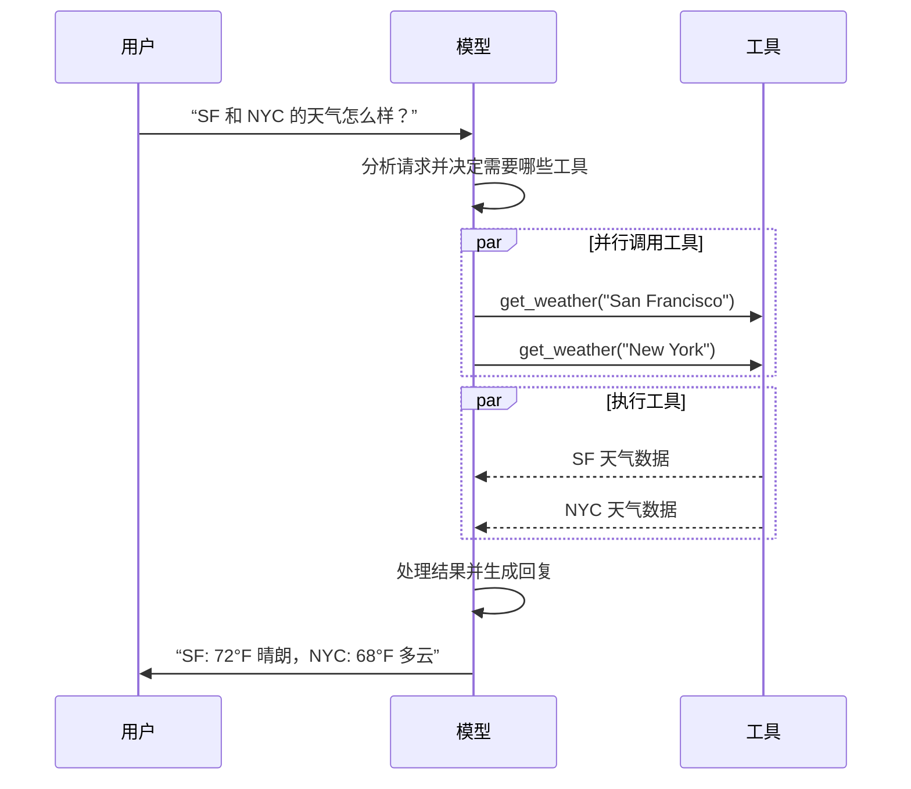
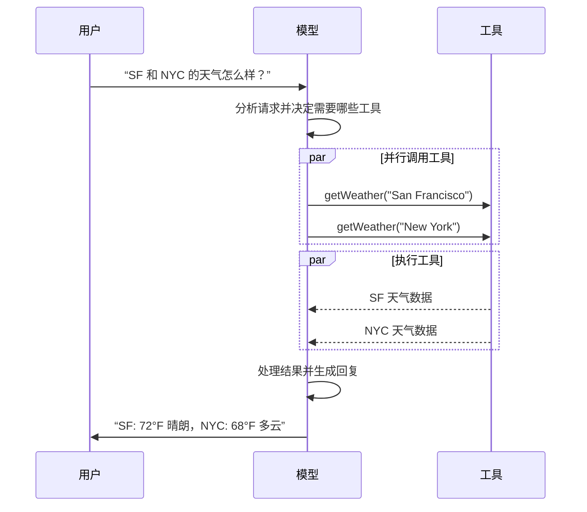

import ChatModelTabsPy from '/snippets/chat-model-tabs.mdx';
import ChatModelTabsJS from '/snippets/chat-model-tabs-js.mdx';

[LLMs](https://en.wikipedia.org/wiki/Large_language_model) 是强大的 AI 工具，能够像人类一样理解和生成文本。它们用途很广，可以写内容、翻译语言、总结信息并回答问题，而不需要针对每个任务单独训练。

除了文本生成外，许多模型还支持：

* <Icon icon="hammer" size={16} /> [工具调用](#tool-calling) - 调用外部工具（例如数据库查询或 API 调用），并把结果用于回复。
* <Icon icon="layout-grid" size={16} /> [结构化输出](#structured-output) - 将模型响应约束为定义好的格式。
* <Icon icon="photo" size={16} /> [多模态](#multimodal) - 处理并返回文本之外的数据，例如图片、音频和视频。
* <Icon icon="brain" size={16} /> [推理](#reasoning) - 模型通过多步推理得出结论。

模型是 [agents](/oss/langchain/agents) 的推理引擎。它们驱动智能体的决策过程，决定要调用哪些工具、如何解释结果，以及何时给出最终答案。

你选择的模型的质量和能力会直接影响智能体的基础可靠性和性能。不同模型擅长的任务不同，有些更擅长遵循复杂指令，有些更擅长结构化推理，还有些支持更大的上下文窗口，能处理更多信息。

LangChain 的标准模型接口让你可以接入许多不同提供商的集成，方便你试验并在模型之间切换，找到最适合自己用例的方案。

关于特定提供商的集成信息和能力，请参见该提供商的 [chat model page](/oss/integrations/chat)。

<Tip>
[LangSmith](/langsmith/observability) 会追踪每次模型调用，方便你对比提供商、检查工具路由并调试失败。请按照 [tracing quickstart](/langsmith/trace-with-langchain) 完成设置。

我们也建议你设置 [LangSmith Engine](/langsmith/engine)，它会监控你的追踪记录、检测问题并提出修复建议。
</Tip>

## 基本用法

模型有两种使用方式：

1. **和智能体一起用** - 在创建 [agent](/oss/langchain/agents#model) 时，可以动态指定模型。
2. **独立使用** - 可以直接调用模型（不经过智能体循环）来做文本生成、分类或提取等任务，而不需要智能体框架。

同一个模型接口在这两种场景下都能工作，这让你可以先从简单场景开始，需要时再扩展到更复杂的基于智能体的工作流。

### 初始化模型

:::python
在 LangChain 中开始使用独立模型的最简单方式，是用 @[`init_chat_model`] 从你选择的 chat model provider 初始化一个模型（下面有示例）：

<ChatModelTabsPy />
```python
response = model.invoke("Why do parrots talk?")
```

更多细节请参见 @[`init_chat_model`][init_chat_model]，包括如何传递模型 [parameters](#parameters)。
:::
:::js
在 LangChain 中开始使用独立模型的最简单方式，是用 `initChatModel` 从你选择的 [chat model provider](/oss/integrations/chat) 初始化一个模型（下面有示例）：

<ChatModelTabsJS />
```typescript
const response = await model.invoke("Why do parrots talk?");
```
更多细节请参见 @[`initChatModel`][initChatModel]，包括如何传递模型 [parameters](#parameters)。
:::

## 工具调用

模型可以请求调用工具来完成诸如查询数据库、搜索网页或运行代码等任务。工具通常由两部分组成：

1. 一个 schema，包括工具名称、描述和/或参数定义（通常是 JSON schema）
2. 一个要执行的函数或 <Tooltip tip="A method that can suspend execution and resume at a later time">coroutine</Tooltip>

<Note>
    你可能会听到 “function calling” 这个术语。我们会把它和 “tool calling” 交替使用。
</Note>

下面是用户和模型之间的基本 tool calling 流程：

:::python

:::

:::js

:::

:::python
要让你定义的工具可供模型使用，必须先用 @[`bind_tools`][BaseChatModel.bind_tools] 绑定它们。后续调用中，模型就可以按需选择任意已绑定工具。
:::

:::js
要让你定义的工具可供模型使用，必须先用 @[`bindTools`][BaseChatModel.bindTools] 绑定它们。后续调用中，模型就可以按需选择任意已绑定工具。
:::

某些模型提供商还支持可以通过模型参数或调用参数启用的 <Tooltip tip="Tools that are executed server-side, such as web search and code interpreters">内置工具</Tooltip>（例如 [`ChatOpenAI`](/oss/integrations/chat/openai)、[`ChatAnthropic`](/oss/integrations/chat/anthropic)）。具体细节请查看相应的 [provider reference](/oss/integrations/providers/overview)。

<Tip>
    关于创建工具的更多细节和其他选项，请参见 [tools guide](/oss/langchain/tools)。
</Tip>

:::python
```python 绑定用户工具
from langchain.tools import tool

@tool
def get_weather(location: str) -> str:
    """获取某个地点的天气。"""
    return f"It's sunny in {location}."


model_with_tools = model.bind_tools([get_weather])  # [!code highlight]

response = model_with_tools.invoke("What's the weather like in Boston?")
for tool_call in response.tool_calls:
    # 查看模型发起的 tool call
    print(f"Tool: {tool_call['name']}")
    print(f"Args: {tool_call['args']}")
```
:::

:::js
```typescript 绑定用户工具
import { tool } from "langchain";
import * as z from "zod";
import { ChatOpenAI } from "@langchain/openai";

const getWeather = tool(
  (input) => `It's sunny in ${input.location}.`,
  {
    name: "get_weather",
    description: "Get the weather at a location.",
    schema: z.object({
      location: z.string().describe("The location to get the weather for"),
    }),
  },
);

const model = new ChatOpenAI({ model: "gpt-5.5" });
const modelWithTools = model.bindTools([getWeather]);  // [!code highlight]

const response = await modelWithTools.invoke("What's the weather like in Boston?");
const toolCalls = response.tool_calls || [];
for (const tool_call of toolCalls) {
  // 查看模型发起的 tool call
  console.log(`Tool: ${tool_call.name}`);
  console.log(`Args: ${tool_call.args}`);
}
```
:::

当绑定了用户定义的工具后，模型响应里会包含一个要执行工具的**请求**。如果你单独使用模型而不是 [agent](/oss/langchain/agents)，那么就需要你自己执行被请求的工具，并把结果传回模型，供后续推理使用。使用 [agent](/oss/langchain/agents) 时，agent loop 会替你处理这个执行循环。

下面我们展示一些常见的 tool calling 用法。

<AccordionGroup>
    <Accordion title="Tool execution loop" icon="refresh">
        当模型返回 tool call 时，你需要执行这些工具，并把结果传回模型。这样就形成了一个对话循环，模型可以利用 tool 结果生成最终回复。LangChain 提供了 [agent](/oss/langchain/agents) 抽象来帮你完成这套编排。

        下面是一个简单示例：

        :::python

        ```python Tool execution loop
        # 绑定（可能是多个）工具到模型上
        model_with_tools = model.bind_tools([get_weather])

        # 步骤 1：模型生成 tool call
        messages = [{"role": "user", "content": "What's the weather in Boston?"}]
        ai_msg = model_with_tools.invoke(messages)
        messages.append(ai_msg)

        # 步骤 2：执行工具并收集结果
        for tool_call in ai_msg.tool_calls:
            # 使用生成的参数执行工具
            tool_result = get_weather.invoke(tool_call)
            messages.append(tool_result)

        # 步骤 3：把结果传回模型，得到最终回复
        final_response = model_with_tools.invoke(messages)
        print(final_response.text)
        # "The current weather in Boston is 72°F and sunny."
        ```

        :::
        :::js

        ```typescript Tool execution loop
        // 绑定（可能是多个）工具到模型上
        const modelWithTools = model.bindTools([get_weather])

        // 步骤 1：模型生成 tool call
        const messages = [{"role": "user", "content": "What's the weather in Boston?"}]
        const ai_msg = await modelWithTools.invoke(messages)
        messages.push(ai_msg)

        // 步骤 2：执行工具并收集结果
        for (const tool_call of ai_msg.tool_calls) {
            // 使用生成的参数执行工具
            const tool_result = await get_weather.invoke(tool_call)
            messages.push(tool_result)
        }

        // 步骤 3：把结果传回模型，得到最终回复
        const final_response = await modelWithTools.invoke(messages)
        console.log(final_response.text)
        // "The current weather in Boston is 72°F and sunny."
        ```

        :::

        每个 @[`ToolMessage`] 都会携带一个 `tool_call_id`，它会和原始 tool call 对应起来，帮助模型把结果和请求关联起来。
    </Accordion>
    <Accordion title="Forcing tool calls" icon="asterisk">
        默认情况下，模型可以根据用户输入自由选择使用哪个已绑定的工具。不过有时你会希望强制选择某个工具，或者在给定列表中的**任意**工具：
### 支持的提供商和模型

LangChain 通过专门的集成包支持所有主流模型提供商。每个提供商包都实现了同样的标准接口，因此你可以在不重写应用逻辑的情况下切换提供商。新的模型名称可以立即使用，无需 LangChain 更新，因为提供商包会把模型名称直接传给提供商的 API。

浏览 [支持的提供商完整列表](/oss/integrations/providers/overview)，或者查看 [Providers and models](/oss/concepts/providers-and-models) 以了解提供商、包和模型名称如何在 LangChain 中协同工作。

### 关键方法

<Card title="Invoke" href="#invoke" icon="send" arrow="true" horizontal>
    模型将消息作为输入，并在生成完整响应后输出消息。
</Card>
<Card title="Stream" href="#stream" icon="broadcast" arrow="true" horizontal>
    调用模型，但在输出生成时实时流式返回。
</Card>
<Card title="Batch" href="#batch" icon="grip-vertical" arrow="true" horizontal>
    一次向模型发送多个请求，以更高效地处理。
</Card>

<Info>
    除了聊天模型，LangChain 还支持其他相邻技术，例如嵌入模型和向量存储。详情请参见 [integrations page](/oss/integrations/providers/overview)。
</Info>

## 参数

聊天模型会接收一些参数，用于配置其行为。支持的参数完整集合会因模型和提供商而异，但常见参数包括：

<ParamField body="model" type="string" required>
   你希望与提供商一起使用的具体模型名称或标识符。你也可以用 `'{model_provider}:{model}'` 的格式，在一个参数里同时指定模型和提供商，例如 `'openai:o1'`。
</ParamField>

:::python
<ParamField body="api_key" type="string">
    用于对模型提供商进行身份验证所需的密钥。通常在你注册模型访问权限时发放。经常通过设置 <Tooltip tip="A variable whose value is set outside the program, typically through functionality built into the operating system or microservice.">environment variable</Tooltip> 来使用。
</ParamField>
:::
:::js
<ParamField body="apiKey" type="string">
    用于对模型提供商进行身份验证所需的密钥。通常在你注册模型访问权限时发放。经常通过设置 <Tooltip tip="A variable whose value is set outside the program, typically through functionality built into the operating system or microservice.">environment variable</Tooltip> 来使用。
</ParamField>
:::

<ParamField body="temperature" type="number">
    控制模型输出的随机性。数字越高，回复越有创造性；越低，输出越确定。
</ParamField>

:::python
<ParamField body="max_tokens" type="number">
    限制响应中 token 的总数，从而有效控制输出长度。
</ParamField>
:::
:::js
<ParamField body="maxTokens" type="number">
    限制响应中 token 的总数，从而有效控制输出长度。
</ParamField>
:::

<ParamField body="timeout" type="number">
    在取消请求之前等待模型响应的最长时间（秒）。
</ParamField>

:::python
<ParamField body="max_retries" type="number" default="6">
    当请求因为网络超时或速率限制等问题失败时，系统会重新发送请求的最大次数。重试采用带抖动的指数退避。网络错误、速率限制（429）和服务器错误（5xx）会自动重试。401（未授权）或 404 这类客户端错误不会重试。对于在不稳定网络上运行的长时间 [agent](/oss/deepagents/overview) 任务，可考虑把它提高到 10–15。
</ParamField>
:::
:::js
<ParamField body="maxRetries" type="number" default="6">
    当请求因为网络超时或速率限制等问题失败时，系统会重新发送请求的最大次数。重试采用带抖动的指数退避。网络错误、速率限制（429）和服务器错误（5xx）会自动重试。401（未授权）或 404 这类客户端错误不会重试。对于在不稳定网络上运行的长时间 [agent](/oss/deepagents/overview) 任务，可考虑把它提高到 10–15。
</ParamField>
:::

:::python
使用 @[`init_chat_model`] 时，请把这些参数作为内联 <Tooltip tip="Arbitrary keyword arguments" cta="Learn more" href="https://www.w3schools.com/python/python_args_kwargs.asp">`**kwargs`</Tooltip> 传入：

```python Initialize using model parameters
model = init_chat_model(
    "claude-sonnet-4-6",
    # 传给模型的 kwargs：
    temperature=0.7,
    timeout=30,
    max_tokens=1000,
    max_retries=6,  # 默认值；在不稳定网络上可以调高
)
```
:::
:::js
使用 `initChatModel` 时，请把这些参数作为内联参数传入：

```typescript Initialize using model parameters
const model = await initChatModel(
    "claude-sonnet-4-6",
    { temperature: 0.7, timeout: 30, maxTokens: 1000, maxRetries: 6 }
)
```
:::

### 连接可靠性

LangChain 聊天模型会自动对失败的 API 请求进行指数退避重试。默认情况下，模型会针对网络错误、速率限制（429）和服务器错误（5xx）最多重试 **6 次**。401（未授权）或 404 这类客户端错误不会重试。

:::python
创建模型时，你可以调整 `max_retries` 和 `timeout`，然后把该实例传给 `create_agent`、`create_deep_agent`，或者直接调用：

```python
from langchain.chat_models import init_chat_model

model = init_chat_model(
    "google_genai:gemini-3.5-flash",
    max_retries=10,  # 在不稳定网络上提高该值（默认：6）
    timeout=120,  # 秒数；在慢速连接上提高该值
)
```
:::

:::js
创建模型时，你可以调整 `maxRetries` 和 `timeout`，然后把该实例传给 `createAgent`、`createDeepAgent`，或者直接调用：

```typescript
import { ChatAnthropic } from "@langchain/anthropic";

const model = new ChatAnthropic({
  model: "google_genai:gemini-3.5-flash",
  maxRetries: 10, // 在不稳定网络上提高该值（默认：6）
  timeout: 120_000, // 毫秒；在慢速连接上提高该值
});
```
:::

<Tip>
    对于在不稳定网络上运行的长时间智能体图，建议使用更高的 `max_retries`（例如 10–15）并配置 [checkpointer](/oss/langgraph/persistence)，这样即使失败，进度也能保留下来。
</Tip>

<Info>
    每个聊天模型集成都可能还有额外参数，用于控制提供商特定功能。

    例如，@[ChatOpenAI] 有 `use_responses_api`，用于决定使用 OpenAI Responses 还是 Completions API。

    若要查找某个聊天模型支持的所有参数，请前往 [chat model integrations](/oss/integrations/chat) 页面。
</Info>

---

## 调用

聊天模型必须被调用后才能生成输出。主要有三种调用方法，各自适合不同场景。

### Invoke

调用模型最直接的方式，是使用 @[`invoke()`][BaseChatModel.invoke] 传入单条消息或消息列表。

:::python
```python 单条消息
response = model.invoke("Why do parrots have colorful feathers?")
print(response)
```
:::

:::js
```typescript 单条消息
const response = await model.invoke("Why do parrots have colorful feathers?");
console.log(response);
```
:::

你也可以向聊天模型传入消息列表来表示对话历史。每条消息都有一个 role，模型会用它来识别对话里是谁发出的消息。

更多关于 role、类型和内容的细节，请参见 [messages](/oss/langchain/messages) 指南。

:::python
```python 字典格式
conversation = [
    {"role": "system", "content": "You are a helpful assistant that translates English to French."},
    {"role": "user", "content": "Translate: I love programming."},
    {"role": "assistant", "content": "J'adore la programmation."},
    {"role": "user", "content": "Translate: I love building applications."}
]

response = model.invoke(conversation)
print(response)  # AIMessage("J'adore créer des applications.")
```
```python 消息对象
from langchain.messages import HumanMessage, AIMessage, SystemMessage

conversation = [
    SystemMessage("You are a helpful assistant that translates English to French."),
    HumanMessage("Translate: I love programming."),
    AIMessage("J'adore la programmation."),
    HumanMessage("Translate: I love building applications.")
]

response = model.invoke(conversation)
print(response)  # AIMessage("J'adore créer des applications.")
```
:::

:::js
```typescript 对象格式
const conversation = [
  { role: "system", content: "You are a helpful assistant that translates English to French." },
  { role: "user", content: "Translate: I love programming." },
  { role: "assistant", content: "J'adore la programmation." },
  { role: "user", content: "Translate: I love building applications." },
];

const response = await model.invoke(conversation);
console.log(response);  // AIMessage("J'adore créer des applications.")
```
```typescript 消息对象
import { HumanMessage, AIMessage, SystemMessage } from "langchain";

const conversation = [
  new SystemMessage("You are a helpful assistant that translates English to French."),
  new HumanMessage("Translate: I love programming."),
  new AIMessage("J'adore la programmation."),
  new HumanMessage("Translate: I love building applications."),
];

const response = await model.invoke(conversation);
console.log(response);  // AIMessage("J'adore créer des applications.")
```
:::

<Info>
    如果调用返回类型是字符串，请确认你用的是聊天模型而不是 LLM。传统的文本补全 LLM 会直接返回字符串。LangChain 聊天模型通常以 `Chat` 开头，例如 @[`ChatOpenAI`](/oss/integrations/chat/openai)。
</Info>

### Stream

大多数模型在生成输出时都可以流式返回内容。通过逐步展示输出，流式传输可以显著改善用户体验，尤其适合较长的回复。

调用 @[`stream()`][BaseChatModel.stream] 会返回一个 <Tooltip tip="An object that progressively provides access to each item of a collection, in order.">iterator</Tooltip>，它会在 chunk 生成时逐个返回。你可以用循环实时处理每个 chunk：

:::python
<CodeGroup>
    ```python Basic text streaming
    for chunk in model.stream("Why do parrots have colorful feathers?"):
        print(chunk.text, end="|", flush=True)
    ```

    ```python Stream tool calls, reasoning, and other content
    for chunk in model.stream("What color is the sky?"):
        for block in chunk.content_blocks:
            if block["type"] == "reasoning" and (reasoning := block.get("reasoning")):
                print(f"Reasoning: {reasoning}")
            elif block["type"] == "tool_call_chunk":
                print(f"Tool call chunk: {block}")
            elif block["type"] == "text":
                print(block["text"])
            else:
                ...
    ```
</CodeGroup>
:::
:::js
<CodeGroup>
    ```typescript Basic text streaming
    const stream = await model.stream("Why do parrots have colorful feathers?");
    for await (const chunk of stream) {
      console.log(chunk.text)
    }
    ```

    ```typescript Stream tool calls, reasoning, and other content
    const stream = await model.stream("What color is the sky?");
    for await (const chunk of stream) {
      for (const block of chunk.contentBlocks) {
        if (block.type === "reasoning") {
          console.log(`Reasoning: ${block.reasoning}`);
        } else if (block.type === "tool_call_chunk") {
          console.log(`Tool call chunk: ${block}`);
        } else if (block.type === "text") {
          console.log(block.text);
        } else {
          ...
        }
      }
    }
    ```
</CodeGroup>
:::

与 [`invoke()`](#invoke) 不同，`invoke()` 会在模型生成完整响应后返回一个 @[`AIMessage`][AIMessage]，而 `stream()` 会返回多个 @[`AIMessageChunk`][AIMessageChunk] 对象，每个对象都包含一部分输出文本。重要的是，流中的每个 chunk 都可以通过相加聚合成完整消息：

:::python
```python 构建 AIMessage
full = None  # None | AIMessageChunk
for chunk in model.stream("What color is the sky?"):
    full = chunk if full is None else full + chunk
    print(full.text)

# The
# The sky
# The sky is
# The sky is typically
# The sky is typically blue
# ...

print(full.content_blocks)
# [{"type": "text", "text": "The sky is typically blue..."}]
```
:::

:::js
```typescript 构建 AIMessage
let full: AIMessageChunk | null = null;
for await (const chunk of stream) {
  full = full ? full.concat(chunk) : chunk;
  console.log(full.text);
}

// The
// The sky
// The sky is
// The sky is typically
// The sky is typically blue
// ...

console.log(full.contentBlocks);
// [{"type": "text", "text": "The sky is typically blue..."}]
```
:::

生成后的消息可以像通过 [`invoke()`](#invoke) 生成的消息一样使用，例如将其聚合到消息历史中，再作为对话上下文传回模型。

<Warning>
    只有在程序中的所有步骤都知道如何处理 chunk 流时，流式传输才有效。例如，如果应用需要先把完整输出保存在内存里再处理，那它就不是流式友好的。
</Warning>

<Accordion title="高级流式主题">
    <Accordion title="Streaming events">
        :::python
        LangChain 聊天模型还可以通过 `astream_events()` 流式输出语义事件。

        这简化了基于事件类型和其他元数据的过滤，并会在后台聚合完整消息。下面是一个示例。

        ```python
        async for event in model.astream_events("Hello"):

            if event["event"] == "on_chat_model_start":
                print(f"Input: {event['data']['input']}")

            elif event["event"] == "on_chat_model_stream":
                print(f"Token: {event['data']['chunk'].text}")

            elif event["event"] == "on_chat_model_end":
                print(f"Full message: {event['data']['output'].text}")

            else:
                pass
        ```
        ```txt
        Input: Hello
        Token: Hi
        Token:  there
        Token: !
        Token:  How
        Token:  can
        Token:  I
        ...
        Full message: Hi there! How can I help today?
        ```

        <Tip>
            查看 @[`astream_events()`][BaseChatModel.astream_events] reference，了解事件类型和其他细节。
        </Tip>
        :::

        :::js
        LangChain 聊天模型还可以通过 [`streamEvents()`][BaseChatModel.streamEvents] 流式输出语义事件。

        这简化了基于事件类型和其他元数据的过滤，并会在后台聚合完整消息。下面是一个示例。

        ```typescript
        const stream = await model.streamEvents("Hello");
        for await (const event of stream) {
            if (event.event === "on_chat_model_start") {
                console.log(`Input: ${event.data.input}`);
            }
            if (event.event === "on_chat_model_stream") {
                console.log(`Token: ${event.data.chunk.text}`);
            }
            if (event.event === "on_chat_model_end") {
                console.log(`Full message: ${event.data.output.text}`);
            }
        }
        ```
        ```txt
        Input: Hello
        Token: Hi
        Token:  there
        Token: !
        Token:  How
        Token:  can
        Token:  I
        ...
        Full message: Hi there! How can I help today?
        ```

        查看 @[`streamEvents()`][BaseChatModel.streamEvents] reference，了解事件类型和其他细节。
        :::
    </Accordion>
    <Accordion title='"Auto-streaming" chat models'>
        LangChain 会在某些情况下自动启用聊天模型的流式模式，即使你没有显式调用 streaming 方法。这在你使用非流式 `invoke` 方法，但仍然想把整个应用（包括聊天模型的中间结果）流式输出时特别有用。

        在 [LangGraph agents](/oss/langchain/agents) 中，例如你可以在 node 内部调用 `model.invoke()`，但如果整体应用处于流式模式，LangChain 会自动切换到底层流式实现。

        #### 它是如何工作的

        当你调用 `invoke()` 时，如果 LangChain 检测到你正在尝试对整个应用进行流式输出，它就会自动切换到内部流式模式。对原本使用 `invoke` 的代码来说，返回结果保持不变；不过在聊天模型流式生成时，LangChain 会负责在回调系统中触发 @[`on_llm_new_token`] 事件。

        :::python
        回调事件可以让 LangGraph 的 `stream()` 和 `astream_events()` 实时展示聊天模型输出。
        :::
        :::js
        回调事件可以让 LangGraph 的 `stream()` 和 `streamEvents()` 实时展示聊天模型输出。
        :::
    </Accordion>
</Accordion>

### Batch

批量处理一组互相独立的模型请求，可以显著提升性能并降低成本，因为这些请求可以并行处理：

:::python
```python Batch
responses = model.batch([
    "Why do parrots have colorful feathers?",
    "How do airplanes fly?",
    "What is quantum computing?"
])
for response in responses:
    print(response)
```

<Note>
    本节描述的是聊天模型方法 @[`batch()`][BaseChatModel.batch]，它会在客户端并行化模型调用。

    它 **不同于** 推理提供商支持的 batch API，例如 [OpenAI](https://platform.openai.com/docs/guides/batch) 或 [Anthropic](https://platform.claude.com/docs/en/build-with-claude/batch-processing#message-batches-api)。
</Note>

默认情况下，@[`batch()`][BaseChatModel.batch] 只会返回整个批次的最终输出。如果你希望在每个输入完成生成时就收到对应输出，可以使用 @[`batch_as_completed()`][BaseChatModel.batch_as_completed]：

```python Yield batch responses upon completion
for response in model.batch_as_completed([
    "Why do parrots have colorful feathers?",
    "How do airplanes fly?",
    "What is quantum computing?"
]):
    print(response)
```
<Note>
    使用 @[`batch_as_completed()`][BaseChatModel.batch_as_completed] 时，结果可能会乱序到达。每个结果都包含输入索引，方便你在需要时重建原始顺序。
</Note>

<Tip>
    当使用 @[`batch()`][BaseChatModel.batch] 或 @[`batch_as_completed()`][BaseChatModel.batch_as_completed] 处理大量输入时，你可能希望控制最大并发数。可以在 @[`RunnableConfig`] 字典中设置 @[`max_concurrency`][RunnableConfig(max_concurrency)] 属性。

    ```python Batch with max concurrency
    model.batch(
        list_of_inputs,
        config={
            'max_concurrency': 5,  # 限制为 5 个并发调用
        }
    )
    ```

    更多支持属性请参见 @[`RunnableConfig`] reference。
</Tip>

更多批处理细节请参见 @[reference][BaseChatModel.batch]。
:::

## 工具调用

模型可以请求调用工具来执行任务，例如从数据库获取数据、搜索网页或运行代码。工具由以下两部分组成：

1. 一个 schema，其中包含工具名称、描述和/或参数定义，通常是 JSON schema
2. 一个函数或 <Tooltip tip="一种可以暂停执行并在稍后恢复的方法">协程</Tooltip>，用于执行该工具

<Note>
    你可能会听到“function calling”这个术语。我们将它与“tool calling”交替使用。
</Note>

下面是用户与模型之间的基础工具调用流程：

:::python

:::

:::js

:::

:::python
要让模型可以使用你定义的工具，必须先用 @[`bind_tools`][BaseChatModel.bind_tools] 将这些工具绑定进去。之后的调用中，模型可以按需选择任意一个已绑定工具。
:::

:::js
要让模型可以使用你定义的工具，必须先用 @[`bindTools`][BaseChatModel.bindTools] 将这些工具绑定进去。之后的调用中，模型可以按需选择任意一个已绑定工具。
:::

某些模型提供方会提供可在模型或调用参数中启用的 <Tooltip tip="在服务端执行的工具，例如网页搜索和代码解释器">内置工具</Tooltip>（例如 [`ChatOpenAI`](/oss/integrations/chat/openai)、[`ChatAnthropic`](/oss/integrations/chat/anthropic)）。具体细节请查看对应的 [provider reference](/oss/integrations/providers/overview)。

<Tip>
    需要了解工具的细节以及其他创建方式，请参见 [tools guide](/oss/langchain/tools)。
</Tip>

:::python
```python Binding user tools
from langchain.tools import tool

@tool
def get_weather(location: str) -> str:
    """Get the weather at a location."""
    return f"It's sunny in {location}."


model_with_tools = model.bind_tools([get_weather])  # [!code highlight]

response = model_with_tools.invoke("What's the weather like in Boston?")
for tool_call in response.tool_calls:
    # View tool calls made by the model
    print(f"Tool: {tool_call['name']}")
    print(f"Args: {tool_call['args']}")
```
:::

:::js
```typescript Binding user tools
import { tool } from "langchain";
import * as z from "zod";
import { ChatOpenAI } from "@langchain/openai";

const getWeather = tool(
  (input) => `It's sunny in ${input.location}.`,
  {
    name: "get_weather",
    description: "Get the weather at a location.",
    schema: z.object({
      location: z.string().describe("The location to get the weather for"),
    }),
  },
);

const model = new ChatOpenAI({ model: "gpt-5.5" });
const modelWithTools = model.bindTools([getWeather]);  // [!code highlight]

const response = await modelWithTools.invoke("What's the weather like in Boston?");
const toolCalls = response.tool_calls || [];
for (const tool_call of toolCalls) {
  // View tool calls made by the model
  console.log(`Tool: ${tool_call.name}`);
  console.log(`Args: ${tool_call.args}`);
}
```
:::

当绑定用户定义的工具时，模型的回复会包含一个执行工具的 **请求**。如果你单独使用模型，而不是通过 [agent](/oss/langchain/agents) 使用，那么就需要你自己执行请求的工具，并把结果回传给模型，供后续推理使用。使用 [agent](/oss/langchain/agents) 时，agent 循环会替你处理工具执行流程。

下面展示了一些常见的工具调用用法。

<AccordionGroup>
    <Accordion title="工具执行循环" icon="refresh">
        当模型返回 tool calls 时，你需要执行这些工具，并把结果传回模型。这样就形成一个对话循环，模型可以利用工具结果生成最终回复。LangChain 提供了 [agent](/oss/langchain/agents) 抽象来帮你完成这套编排。

        下面是一个简单示例：

        :::python

        ```python Tool execution loop
        # 将一个或多个工具绑定到模型
        model_with_tools = model.bind_tools([get_weather])

        # 第 1 步：模型生成 tool calls
        messages = [{"role": "user", "content": "What's the weather in Boston?"}]
        ai_msg = model_with_tools.invoke(messages)
        messages.append(ai_msg)

        # 第 2 步：执行工具并收集结果
        for tool_call in ai_msg.tool_calls:
            # 使用生成的参数执行工具
            tool_result = get_weather.invoke(tool_call)
            messages.append(tool_result)

        # 第 3 步：把结果传回模型，生成最终回复
        final_response = model_with_tools.invoke(messages)
        print(final_response.text)
        # "The current weather in Boston is 72°F and sunny."
        ```

        :::
        :::js

        ```typescript Tool execution loop
        // 将一个或多个工具绑定到模型
        const modelWithTools = model.bindTools([get_weather])

        // 第 1 步：模型生成 tool calls
        const messages = [{"role": "user", "content": "What's the weather in Boston?"}]
        const ai_msg = await modelWithTools.invoke(messages)
        messages.push(ai_msg)

        // 第 2 步：执行工具并收集结果
        for (const tool_call of ai_msg.tool_calls) {
            // 使用生成的参数执行工具
            const tool_result = await get_weather.invoke(tool_call)
            messages.push(tool_result)
        }

        // 第 3 步：把结果传回模型，生成最终回复
        const final_response = await modelWithTools.invoke(messages)
        console.log(final_response.text)
        // "The current weather in Boston is 72°F and sunny."
        ```

        :::

        每个由工具返回的 @[`ToolMessage`] 都包含一个与原始 tool call 对应的 `tool_call_id`，便于模型把结果和请求关联起来。
    </Accordion>
    <Accordion title="强制调用工具" icon="asterisk">
        默认情况下，模型可以根据用户输入自由选择要使用的已绑定工具。不过，你可能希望强制它选择某个工具，确保模型使用某个特定工具，或者使用给定列表中的 **任意** 一个工具：

        :::python

        <CodeGroup>
            ```python Force use of any tool
            model_with_tools = model.bind_tools([tool_1], tool_choice="any")
            ```
            ```python Force use of specific tools
            model_with_tools = model.bind_tools([tool_1], tool_choice="tool_1")
            ```
        </CodeGroup>

        :::
        :::js

        <CodeGroup>
            ```typescript Force use of any tool
            const modelWithTools = model.bindTools([tool_1], { toolChoice: "any" })
            ```
            ```typescript Force use of specific tools
            const modelWithTools = model.bindTools([tool_1], { toolChoice: "tool_1" })
            ```
        </CodeGroup>
        :::
    </Accordion>
    <Accordion title="并行工具调用" icon="stack-2">
        许多模型在合适的时候都支持并行调用多个工具。这样模型就能同时从不同来源收集信息。

        :::python

        ```python Parallel tool calls
        model_with_tools = model.bind_tools([get_weather])

        response = model_with_tools.invoke(
            "What's the weather in Boston and Tokyo?"
        )


        # 模型可能会生成多个 tool calls
        print(response.tool_calls)
        # [
        #   {'name': 'get_weather', 'args': {'location': 'Boston'}, 'id': 'call_1'},
        #   {'name': 'get_weather', 'args': {'location': 'Tokyo'}, 'id': 'call_2'},
        # ]


        # 执行所有工具（可以通过 async 并行执行）
        results = []
        for tool_call in response.tool_calls:
            if tool_call['name'] == 'get_weather':
                result = get_weather.invoke(tool_call)
            ...
            results.append(result)
        ```

        :::
        :::js

        ```typescript Parallel tool calls
        const modelWithTools = model.bind_tools([get_weather])

        const response = await modelWithTools.invoke(
            "What's the weather in Boston and Tokyo?"
        )


        // 模型可能会生成多个 tool calls
        console.log(response.tool_calls)
        // [
        //   { name: 'get_weather', args: { location: 'Boston' }, id: 'call_1' },
        //   { name: 'get_time', args: { location: 'Tokyo' }, id: 'call_2' }
        // ]


        // 执行所有工具（可以通过 async 并行执行）
        const results = []
        for (const tool_call of response.tool_calls || []) {
            if (tool_call.name === 'get_weather') {
                const result = await get_weather.invoke(tool_call)
                results.push(result)
            }
        }
        ```

        :::

        模型会根据所请求操作之间是否相互独立，智能判断何时适合并行执行。

        <Tip>
        大多数支持工具调用的模型默认都会启用并行工具调用。有些模型（包括 [OpenAI](/oss/integrations/chat/openai) 和 [Anthropic](/oss/integrations/chat/anthropic)）允许你关闭这一功能。要关闭时，请设置 `parallel_tool_calls=False`：
        ```python
        model.bind_tools([get_weather], parallel_tool_calls=False)
        ```
        </Tip>
    </Accordion>
    <Accordion title="流式工具调用" icon="rss">
        在流式响应中，tool calls 会通过 @[`ToolCallChunk`] 逐步构建。这让你能在 tool call 生成过程中就看到它们，而不必等到完整响应结束。

        :::python

        ```python Streaming tool calls
        for chunk in model_with_tools.stream(
            "What's the weather in Boston and Tokyo?"
        ):
            # tool call chunks 会逐步到达
            for tool_chunk in chunk.tool_call_chunks:
                if name := tool_chunk.get("name"):
                    print(f"Tool: {name}")
                if id_ := tool_chunk.get("id"):
                    print(f"ID: {id_}")
                if args := tool_chunk.get("args"):
                    print(f"Args: {args}")

        # 输出：
        # Tool: get_weather
        # ID: call_SvMlU1TVIZugrFLckFE2ceRE
        # Args: {"lo
        # Args: catio
        # Args: n": "B
        # Args: osto
        # Args: n"}
        # Tool: get_weather
        # ID: call_QMZdy6qInx13oWKE7KhuhOLR
        # Args: {"lo
        # Args: catio
        # Args: n": "T
        # Args: okyo
        # Args: "}
        ```

        你可以把这些 chunk 累积起来，拼出完整的 tool call：

        ```python Accumulate tool calls
        gathered = None
        for chunk in model_with_tools.stream("What's the weather in Boston?"):
            gathered = chunk if gathered is None else gathered + chunk
            print(gathered.tool_calls)
        ```

        :::
        :::js

        ```typescript Streaming tool calls
        const stream = await modelWithTools.stream(
            "What's the weather in Boston and Tokyo?"
        )
        for await (const chunk of stream) {
            // tool call chunks 会逐步到达
            if (chunk.tool_call_chunks) {
                for (const tool_chunk of chunk.tool_call_chunks) {
                console.log(`Tool: ${tool_chunk.get('name', '')}`)
                console.log(`Args: ${tool_chunk.get('args', '')}`)
                }
            }
        }

        // 输出：
        // Tool: get_weather
        // Args:
        // Tool:
        // Args: {"loc
        // Tool:
        // Args: ation": "BOS"}
        // Tool: get_time
        // Args:
        // Tool:
        // Args: {"timezone": "Tokyo"}
        ```

        你可以把这些 chunk 累积起来，拼出完整的 tool call：

        ```typescript Accumulate tool calls
        let full: AIMessageChunk | null = null
        const stream = await modelWithTools.stream("What's the weather in Boston?")
        for await (const chunk of stream) {
            full = full ? full.concat(chunk) : chunk
            console.log(full.contentBlocks)
        }
        ```

        :::
    </Accordion>
</AccordionGroup>

---

## Structured output

模型可以被要求以符合给定 schema 的格式返回回复。这有助于确保输出可以被轻松解析，并用于后续处理。LangChain 支持多种 schema 类型和结构化输出强制方式。

<Tip>
    想了解结构化输出，请参见 [Structured output](/oss/langchain/structured-output)。
</Tip>

:::python
<Tabs>
    <Tab title="Pydantic">
        [Pydantic models](https://docs.pydantic.dev/latest/concepts/models/#basic-model-usage) 提供最丰富的能力，包括字段校验、描述和嵌套结构。

        ```python
        from pydantic import BaseModel, Field

        class Movie(BaseModel):
            """一部包含详细信息的电影。"""
            title: str = Field(description="电影标题")
            year: int = Field(description="电影上映年份")
            director: str = Field(description="电影导演")
            rating: float = Field(description="电影评分，满分 10 分")

        model_with_structure = model.with_structured_output(Movie)
        response = model_with_structure.invoke("Provide details about the movie Inception")
        print(response)  # Movie(title="Inception", year=2010, director="Christopher Nolan", rating=8.8)
        ```
    </Tab>
    <Tab title="TypedDict">
        Python 的 `TypedDict` 提供了一种比 Pydantic 更简单的替代方案，适合不需要运行时校验的场景。

        ```python
        from typing_extensions import TypedDict, Annotated

        class MovieDict(TypedDict):
            """一部包含详细信息的电影。"""
            title: Annotated[str, ..., "电影标题"]
            year: Annotated[int, ..., "电影上映年份"]
            director: Annotated[str, ..., "电影导演"]
            rating: Annotated[float, ..., "电影评分，满分 10 分"]

        model_with_structure = model.with_structured_output(MovieDict)
        response = model_with_structure.invoke("Provide details about the movie Inception")
        print(response)  # {'title': 'Inception', 'year': 2010, 'director': 'Christopher Nolan', 'rating': 8.8}
        ```
    </Tab>
    <Tab title="JSON Schema">
        提供 [JSON Schema](https://json-schema.org/understanding-json-schema/about) 可以获得最大的控制力和互操作性。

        ```python
        import json

        json_schema = {
            "title": "Movie",
            "description": "A movie with details",
            "type": "object",
            "properties": {
                "title": {
                    "type": "string",
                    "description": "电影标题"
                },
                "year": {
                    "type": "integer",
                    "description": "电影上映年份"
                },
                "director": {
                    "type": "string",
                    "description": "电影导演"
                },
                "rating": {
                    "type": "number",
                    "description": "电影评分，满分 10 分"
                }
            },
            "required": ["title", "year", "director", "rating"]
        }

        model_with_structure = model.with_structured_output(
            json_schema,
            method="json_schema",
        )
        response = model_with_structure.invoke("Provide details about the movie Inception")
        print(response)  # {'title': 'Inception', 'year': 2010, ...}
        ```
    </Tab>
</Tabs>
:::

:::js
<Tabs>
    <Tab title="Zod">
        [zod schema](https://zod.dev/) 是定义输出 schema 的首选方式。请注意，当提供 zod schema 时，模型输出也会通过 zod 的 parse 方法进行校验。

        ```typescript
        import * as z from "zod";

        const Movie = z.object({
          title: z.string().describe("电影标题"),
          year: z.number().describe("电影上映年份"),
          director: z.string().describe("电影导演"),
          rating: z.number().describe("电影评分，满分 10 分"),
        });

        const modelWithStructure = model.withStructuredOutput(Movie);

        const response = await modelWithStructure.invoke("Provide details about the movie Inception");
        console.log(response);
        // {
        //   title: "Inception",
        //   year: 2010,
        //   director: "Christopher Nolan",
        //   rating: 8.8,
        // }
        ```
    </Tab>
    <Tab title="JSON Schema">
        为了获得最大的控制力或互操作性，你也可以提供原始 JSON Schema。

        ```typescript
        const jsonSchema = {
          "title": "Movie",
          "description": "A movie with details",
          "type": "object",
          "properties": {
            "title": {
              "type": "string",
              "description": "电影标题",
            },
            "year": {
              "type": "integer",
              "description": "电影上映年份",
            },
            "director": {
              "type": "string",
              "description": "电影导演",
            },
            "rating": {
              "type": "number",
              "description": "电影评分，满分 10 分",
            },
          },
          "required": ["title", "year", "director", "rating"],
        }

        const modelWithStructure = model.withStructuredOutput(
          jsonSchema,
          { method: "jsonSchema" },
        )

        const response = await modelWithStructure.invoke("Provide details about the movie Inception")
        console.log(response)  // {'title': 'Inception', 'year': 2010, ...}
        ```
    </Tab>
    <Tab title="Standard Schema">
        任何实现了 [Standard Schema](https://standardschema.dev/) 规范的库提供的 schema 也都受支持。Standard Schema 对象会通过 schema 的 `~standard.validate()` 方法在运行时校验。

        ```typescript
        import * as v from "valibot";
        import { toStandardJsonSchema } from "@valibot/to-json-schema";

        const Movie = toStandardJsonSchema(
          v.object({
            title: v.pipe(v.string(), v.description("电影标题")),
            year: v.pipe(v.number(), v.description("电影上映年份")),
            director: v.pipe(v.string(), v.description("电影导演")),
            rating: v.pipe(v.number(), v.description("电影评分，满分 10 分")),
          })
        );

        const modelWithStructure = model.withStructuredOutput(Movie);

        const response = await modelWithStructure.invoke("Provide details about the movie Inception");
        console.log(response);
        // {
        //   title: "Inception",
        //   year: 2010,
        //   director: "Christopher Nolan",
        //   rating: 8.8,
        // }
        ```
    </Tab>
</Tabs>
:::

:::python
<Note>
    **结构化输出的关键注意事项**

    - **Method 参数**：某些提供方支持不同的结构化输出方法：
        - `'json_schema'`：使用提供方提供的专用结构化输出能力。
        - `'function_calling'`：通过强制 [tool call](#tool-calling) 且遵循给定 schema 来推导结构化输出。
        - `'json_mode'`：某些提供方提供的 `'json_schema'` 前身。它会生成有效 JSON，但 schema 必须在提示词中描述。
    - **Include raw**：设置 `include_raw=True` 可以同时拿到解析后的输出和原始 AI 消息。
    - **Validation**：Pydantic 模型会自动校验。`TypedDict` 和 JSON Schema 需要手动校验。

    有关支持的方法和配置选项，请参见对应的 [provider's integration page](/oss/integrations/providers/overview)。
</Note>
:::

:::js
<Note>
    **结构化输出的关键注意事项：**

    - **Method 参数**：某些提供方支持不同的方法（`'jsonSchema'`、`'functionCalling'`、`'jsonMode'`）
    - **Include raw**：使用 @[`includeRaw: true`][BaseChatModel.with_structured_output(include_raw)] 可同时拿到解析后的输出和原始 @[`AIMessage`]
    - **Validation**：Zod 和 Standard Schema 对象会自动校验，而 JSON Schema 需要手动校验
    - **Standard Schema**：任何实现了 [Standard Schema](https://standardschema.dev/) 规范的 schema 库都受支持，并会在运行时校验

    有关支持的方法和配置选项，请参见对应的 [provider's integration page](/oss/integrations/providers/overview)。
</Note>
:::

<Accordion title="示例：消息输出与解析后的结构并存">

有时在返回解析后的表示之外，同时返回原始 @[`AIMessage`] 对象会很有用，这样你就可以访问诸如 [token counts](#token-usage) 之类的响应元数据。要这样做，请在调用 @[`with_structured_output`][BaseChatModel.with_structured_output] 时设置 @[`include_raw=True`][BaseChatModel.with_structured_output(include_raw)]：

    :::python
    ```python
    from pydantic import BaseModel, Field

    class Movie(BaseModel):
        """一部包含详细信息的电影。"""
        title: str = Field(description="电影标题")
        year: int = Field(description="电影上映年份")
        director: str = Field(description="电影导演")
        rating: float = Field(description="电影评分，满分 10 分")

    model_with_structure = model.with_structured_output(Movie, include_raw=True)  # [!code highlight]
    response = model_with_structure.invoke("Provide details about the movie Inception")
    response
    # {
    #     "raw": AIMessage(...),
    #     "parsed": Movie(title=..., year=..., ...),
    #     "parsing_error": None,
    # }
    ```
    :::

    :::js
    ```typescript
    import * as z from "zod";

    const Movie = z.object({
      title: z.string().describe("电影标题"),
      year: z.number().describe("电影上映年份"),
      director: z.string().describe("电影导演"),  // [!code highlight]
      rating: z.number().describe("电影评分，满分 10 分"),
    });

    const modelWithStructure = model.withStructuredOutput(Movie, { includeRaw: true });

    const response = await modelWithStructure.invoke("Provide details about the movie Inception");
    console.log(response);
    // {
    //   raw: AIMessage { ... },
    //   parsed: { title: "Inception", ... }
    // }
    ```
    :::
</Accordion>
<Accordion title="示例：嵌套结构">
    schema 可以嵌套：
    :::python
    <CodeGroup>
        ```python Pydantic BaseModel
        from pydantic import BaseModel, Field

        class Actor(BaseModel):
            name: str
            role: str

        class MovieDetails(BaseModel):
            title: str
            year: int
            cast: list[Actor]
            genres: list[str]
            budget: float | None = Field(None, description="预算，单位为百万美元")

        model_with_structure = model.with_structured_output(MovieDetails)
        ```

        ```python TypedDict
        from typing_extensions import Annotated, TypedDict

        class Actor(TypedDict):
            name: str
            role: str

        class MovieDetails(TypedDict):
            title: str
            year: int
            cast: list[Actor]
            genres: list[str]
            budget: Annotated[float | None, ..., "预算，单位为百万美元"]

        model_with_structure = model.with_structured_output(MovieDetails)
        ```
    </CodeGroup>
    :::

    :::js
    ```typescript
    import * as z from "zod";

    const Actor = z.object({
      name: z.string(),
      role: z.string(),
    });

    const MovieDetails = z.object({
      title: z.string(),
      year: z.number(),
      cast: z.array(Actor),
      genres: z.array(z.string()),
      budget: z.number().nullable().describe("预算，单位为百万美元"),
    });

    const modelWithStructure = model.withStructuredOutput(MovieDetails);
    ```
    :::
</Accordion>

---

## Advanced topics

### 模型配置文件

<Info>
    模型配置文件需要 `langchain>=1.1`。
</Info>

:::python
LangChain 聊天模型可以通过 `profile` 属性暴露一组受支持的特性和能力：

```python
model.profile
# {
#   "max_input_tokens": 400000,
#   "image_inputs": True,
#   "reasoning_output": True,
#   "tool_calling": True,
#   ...
# }
```

完整字段请参见 [API reference](https://reference.langchain.com/python/langchain-core/language_models/model_profile/ModelProfile)。

模型配置文件中的大部分数据由 [models.dev](https://github.com/sst/models.dev) 项目提供，这是一个提供模型能力数据的开源项目。这些数据会与 LangChain 额外添加的字段一起使用，并随着上游项目演进保持同步。

模型配置文件数据可以帮助应用动态适配模型能力。例如：

1. [Summarization middleware](/oss/langchain/middleware/built-in#summarization) 可以根据模型的上下文窗口大小触发总结。
2. `create_agent` 中的 [Structured output](/oss/langchain/structured-output) 策略可以自动推断，例如通过检查是否支持原生结构化输出特性。
3. 模型输入可以根据支持的 [modalities](#multimodal) 和最大输入 token 数进行门控。
4. [Deep Agents Code](/oss/deepagents/code) 会把 [interactive model switcher](/oss/deepagents/code/providers#which-models-appear-in-the-switcher) 过滤到那些 profile 报告支持 `tool_calling` 且支持文本 I/O 的模型，并在选择器详情视图中显示上下文窗口大小和能力标记。

<Accordion title="更新或覆盖 profile 数据">
    如果 profile 数据缺失、过期或错误，可以修改它。

    **选项 1，快速修复**

    你可以用任意有效 profile 实例化聊天模型：

    ```python
    custom_profile = {
        "max_input_tokens": 100_000,
        "tool_calling": True,
        "structured_output": True,
        # ...
    }
    model = init_chat_model("...", profile=custom_profile)
    ```

    `profile` 也是一个普通的 `dict`，可以就地更新。如果模型实例会被共享，建议使用 `model_copy` 避免修改共享状态。

    ```python
    new_profile = model.profile | {"key": "value"}
    model.model_copy(update={"profile": new_profile})
    ```

    **选项 2，修复上游数据**

    这些数据的主要来源是 [models.dev](https://models.dev/) 项目。这些数据会与 LangChain [integration packages](/oss/integrations/providers/overview) 中的额外字段和覆盖项合并，并随这些包一起发布。

    可以通过以下流程更新 model profile 数据：

    1. （如有需要）通过向 [models.dev](https://models.dev/) 的 [GitHub repository](https://github.com/sst/models.dev) 提交 pull request 来更新源数据。
    2. （如有需要）通过向 LangChain [integration package](/oss/integrations/providers/overview) 提交 pull request，更新 `langchain_<package>/data/profile_augmentations.toml` 中的额外字段和覆盖项。
    3. 使用 [`langchain-model-profiles`](https://pypi.org/project/langchain-model-profiles/) CLI 工具从 [models.dev](https://models.dev/) 拉取最新数据，合并 augmentations，并更新 profile 数据：

    ```bash
    pip install langchain-model-profiles
    ```

    ```bash
    langchain-profiles refresh --provider <provider> --data-dir <data_dir>
    ```

    该命令会：
    - 从 models.dev 下载 `<provider>` 的最新数据
    - 合并 `<data_dir>` 中 `profile_augmentations.toml` 的 augmentations
    - 将合并后的 profiles 写入 `<data_dir>` 中的 `profiles.py`

    例如：在 [LangChain monorepo](https://github.com/langchain-ai/langchain) 中的 [`libs/partners/anthropic`](https://github.com/langchain-ai/langchain/tree/master/libs/partners/anthropic) 下：

    ```bash
    uv run --with langchain-model-profiles --provider anthropic --data-dir langchain_anthropic/data
    ```
</Accordion>

:::

:::js
LangChain 聊天模型可以通过 `profile` 属性暴露一组受支持的特性和能力：

```typescript
model.profile;
// {
//   maxInputTokens: 400000,
//   imageInputs: true,
//   reasoningOutput: true,
//   toolCalling: true,
//   ...
// }
```

完整字段请参见 [API reference](https://reference.langchain.com/javascript/langchain-core/language_models/profile/ModelProfile)。

模型配置文件中的大部分数据由 [models.dev](https://github.com/sst/models.dev) 项目提供，这是一个提供模型能力数据的开源项目。这些数据会与 LangChain 额外添加的字段一起使用，并随着上游项目演进保持同步。

模型配置文件数据可以帮助应用动态适配模型能力。例如：

1. [Summarization middleware](/oss/langchain/middleware/built-in#summarization) 可以根据模型的上下文窗口大小触发总结。
2. `createAgent` 中的 [Structured output](/oss/langchain/structured-output) 策略可以自动推断，例如通过检查是否支持原生结构化输出特性。
3. 模型输入可以根据支持的 [modalities](#multimodal) 和最大输入 token 数进行门控。
4. [Deep Agents Code](/oss/deepagents/code) 会把 [interactive model switcher](/oss/deepagents/code/providers#which-models-appear-in-the-switcher) 过滤到那些 profile 报告支持 `tool_calling` 且支持文本 I/O 的模型，并在选择器详情视图中显示上下文窗口大小和能力标记。

<Accordion title="修改 profile 数据">
    如果 profile 数据缺失、过期或错误，可以修改它。

    **选项 1，快速修复**

    你可以用任意有效 profile 实例化聊天模型：

    ```typescript
    const customProfile = {
    maxInputTokens: 100_000,
    toolCalling: true,
    structuredOutput: true,
    // ...
    };
    const model = initChatModel("...", { profile: customProfile });
    ```

    **选项 2，修复上游数据**

    这些数据的主要来源是 [models.dev](https://models.dev/) 项目。这些数据会与 LangChain [integration packages](/oss/integrations/providers/overview) 中的额外字段和覆盖项合并，并随这些包一起发布。

    可以通过以下流程更新 model profile 数据：

    1. （如有需要）通过向 [models.dev](https://models.dev/) 的 [GitHub repository](https://github.com/sst/models.dev) 提交 pull request 来更新源数据。
    2. （如有需要）通过向 LangChain [integration package](/oss/integrations/providers/overview) 提交 pull request，更新 `langchain-<package>/profiles.toml` 中的额外字段和覆盖项。
</Accordion>

:::

<Warning>
    模型配置文件是一个 beta 功能。profile 的格式可能会变化。
</Warning>

### 多模态

某些模型可以处理并返回图像、音频和视频等非文本数据。你可以通过提供 [content blocks](/oss/langchain/messages#message-content) 向模型传入非文本数据。

<Tip>
    所有具备多模态能力的 LangChain 聊天模型都支持：

    1. 跨 provider 的标准格式（见 [our messages guide](/oss/langchain/messages)）
    2. OpenAI [chat completions](https://platform.openai.com/docs/api-reference/chat) 格式
    3. 该特定 provider 的原生格式（例如 Anthropic 模型接受 Anthropic 原生格式）
</Tip>

查看消息指南中的 [multimodal section](/oss/langchain/messages#multimodal) 了解详情。

<Tooltip tip="并不是所有 LLM 都一样！" cta="查看 reference" href="https://models.dev/">Some models</Tooltip> 也可以在回复中返回多模态数据。如果被要求这样做，生成的 @[`AIMessage`] 会包含多模态类型的 content blocks。

:::python
```python Multimodal output
response = model.invoke("Create a picture of a cat")
print(response.content_blocks)
# [
#     {"type": "text", "text": "Here's a picture of a cat"},
#     {"type": "image", "base64": "...", "mime_type": "image/jpeg"},
# ]
```
:::

:::js
```typescript Multimodal output
const response = await model.invoke("Create a picture of a cat");
console.log(response.contentBlocks);
// [
//   { type: "text", text: "Here's a picture of a cat" },
//   { type: "image", data: "...", mimeType: "image/jpeg" },
// ]
```
:::

有关具体 provider 的细节，请参见 [integrations page](/oss/integrations/providers/overview)。

### 推理

许多模型都能进行多步推理，从而得出结论。这意味着它们会把复杂问题拆解为更小、更容易处理的步骤。

**如果底层模型支持，** 你可以把这个推理过程暴露出来，更好地理解模型是如何得到最终答案的。

:::python
<CodeGroup>
    ```python Stream reasoning output
    for chunk in model.stream("Why do parrots have colorful feathers?"):
        reasoning_steps = [r for r in chunk.content_blocks if r["type"] == "reasoning"]
        print(reasoning_steps if reasoning_steps else chunk.text)
    ```

    ```python Complete reasoning output
    response = model.invoke("Why do parrots have colorful feathers?")
    reasoning_steps = [b for b in response.content_blocks if b["type"] == "reasoning"]
    print(" ".join(step["reasoning"] for step in reasoning_steps))
    ```
</CodeGroup>
:::

:::js
<CodeGroup>
    ```typescript Stream reasoning output
    const stream = model.stream("Why do parrots have colorful feathers?");
    for await (const chunk of stream) {
        const reasoningSteps = chunk.contentBlocks.filter(b => b.type === "reasoning");
        console.log(reasoningSteps.length > 0 ? reasoningSteps : chunk.text);
    }
    ```

    ```typescript Complete reasoning output
    const response = await model.invoke("Why do parrots have colorful feathers?");
    const reasoningSteps = response.contentBlocks.filter(b => b.type === "reasoning");
    console.log(reasoningSteps.map(step => step.reasoning).join(" "));
    ```
</CodeGroup>
:::

根据模型不同，你有时可以指定其在推理上投入多少努力。类似地，你也可以要求模型完全关闭推理。这可能表现为分类式的“档位”（例如 `'low'` 或 `'high'`），也可能是整数 token 预算。

有关详情，请参见你对应聊天模型的 [integrations page](/oss/integrations/providers/overview) 或 [reference](https://reference.langchain.com/python/integrations/)。


### 本地模型

LangChain 支持在你自己的硬件上本地运行模型。这在数据隐私至关重要、你想调用自定义模型，或者想避免使用云模型产生费用时尤其有用。

[Ollama](/oss/integrations/chat/ollama) 是在本地运行聊天模型和嵌入模型最简单的方法之一。

{/* TODO: whenever we have a better integrations directory, x-ref to that page with a local query filter */}

### Prompt 缓存

许多 provider 提供 prompt 缓存功能，可以减少重复处理相同 token 时的延迟和成本。你可以在三个层级使用缓存：

- **隐式 provider 缓存：** 如果请求命中缓存，provider 会自动把节省的成本返还给你，无需任何配置。示例：[OpenAI](/oss/integrations/chat/openai) 和 [Gemini](/oss/integrations/chat/google_generative_ai)。
- **provider 级显式控制：** provider 允许你手动标记缓存点，以便更好地控制或保证成本节省。这些控制方式与底层 provider/API 行为一致。示例：
    - @[`ChatOpenAI`]（通过 `prompt_cache_key`）
    - Anthropic content-block [`cache_control`](/oss/integrations/chat/anthropic#prompt-caching)
    - [Gemini](https://reference.langchain.com/python/integrations/langchain_google_genai/)。
:::python
    - AWS Bedrock [`cachePoint`](/oss/integrations/chat/bedrock#prompt-caching) blocks
- **LangChain middleware：** 对于 agents，middleware 让 LangChain 能优化稳定 system prompt 和 tool content 的缓存。示例：
    - Anthropic 的 [`AnthropicPromptCachingMiddleware`](/oss/integrations/middleware/anthropic#prompt-caching)
    - AWS Bedrock 的 [`BedrockPromptCachingMiddleware`](/oss/integrations/middleware/aws#prompt-caching)
:::

<Warning>
    Prompt 缓存通常只会在超过最小输入 token 阈值后生效。详情请参见 [provider pages](/oss/integrations/chat)。
</Warning>

缓存使用情况会体现在模型响应的 [usage metadata](/oss/langchain/messages#token-usage) 中。

### 服务端工具使用

某些 provider 支持服务端 [tool-calling](#tool-calling) 循环：模型可以与网页搜索、代码解释器和其他工具交互，并在一次对话回合中分析结果。

如果模型在服务端调用了工具，响应消息的内容会包含表示工具调用及其结果的内容。访问响应的 [content blocks](/oss/langchain/messages#standard-content-blocks) 会以 provider 无关的格式返回服务端工具调用和结果：

:::python
```python Invoke with server-side tool use
from langchain.chat_models import init_chat_model

model = init_chat_model("gpt-5.4-mini")

tool = {"type": "web_search"}
model_with_tools = model.bind_tools([tool])

response = model_with_tools.invoke("What was a positive news story from today?")
print(response.content_blocks)
```
```python Result expandable
[
    {
        "type": "server_tool_call",
        "name": "web_search",
        "args": {
            "query": "positive news stories today",
            "type": "search"
        },
        "id": "ws_abc123"
    },
    {
        "type": "server_tool_result",
        "tool_call_id": "ws_abc123",
        "status": "success"
    },
    {
        "type": "text",
        "text": "Here are some positive news stories from today...",
        "annotations": [
            {
                "end_index": 410,
                "start_index": 337,
                "title": "article title",
                "type": "citation",
                "url": "..."
            }
        ]
    }
]
```
:::
:::js
```typescript
import { initChatModel } from "langchain";

const model = await initChatModel("gpt-5.4-mini");
const modelWithTools = model.bindTools([{ type: "web_search" }])

const message = await modelWithTools.invoke("What was a positive news story from today?");
console.log(message.contentBlocks);
```
:::
这表示的是一次单独的对话回合；与客户端 [tool-calling](#tool-calling) 不同，这里不需要传入对应的 [ToolMessage](/oss/langchain/messages#tool-message) 对象。

请参见你所用 provider 的 [integration page](/oss/integrations/chat)，查看可用工具及其使用细节。

### 速率限制

许多聊天模型 provider 会对给定时间段内可发起的调用次数设置限制。如果触发速率限制，通常会收到 provider 返回的速率限制错误，需要等待一段时间后再发起更多请求。

为了帮助管理速率限制，聊天模型集成在初始化时接受 `rate_limiter` 参数，用来控制请求发送速率。

<Accordion title="初始化并使用 rate limiter" icon="gauge">
    LangChain 内置了一个（可选的）@[`InMemoryRateLimiter`]。它是线程安全的，可以被同一进程中的多个线程共享。

    ```python Define a rate limiter
    from langchain_core.rate_limiters import InMemoryRateLimiter

    rate_limiter = InMemoryRateLimiter(
        requests_per_second=0.1,  # 1 request every 10s
        check_every_n_seconds=0.1,  # Check every 100ms whether allowed to make a request
        max_bucket_size=10,  # Controls the maximum burst size.
    )

    model = init_chat_model(
        model="gpt-5.5",
        model_provider="openai",
        rate_limiter=rate_limiter  # [!code highlight]
    )
    ```

    <Warning>
        提供的 rate limiter 只能限制单位时间内的请求数量。如果你还需要按请求大小限制，它不会帮上忙。
    </Warning>
</Accordion>
:::

### Base URL 和代理设置

对于实现了 OpenAI Chat Completions API 的 provider，你可以配置自定义 base URL。

<Warning>
    `model_provider="openai"`（或直接使用 `ChatOpenAI`）面向的是官方 OpenAI API 规范。路由器和代理提供的 provider-specific 字段可能不会被提取或保留。

    对于 OpenRouter 和 LiteLLM，更推荐使用专门的集成：
    - [通过 `ChatOpenRouter` 使用 OpenRouter](/oss/integrations/chat/openrouter)（`langchain-openrouter`）
    - [通过 `ChatLiteLLM` / `ChatLiteLLMRouter` 使用 LiteLLM](/oss/integrations/chat)（`langchain-litellm`）
</Warning>

<Accordion title="自定义 base URL" icon="link">
    :::python
    许多模型 provider 都提供 OpenAI 兼容 API（例如 [Together AI](https://www.together.ai/)、[vLLM](https://github.com/vllm-project/vllm)）。你可以通过指定合适的 `base_url` 参数来使用 @[`init_chat_model`]：

    ```python
    model = init_chat_model(
        model="MODEL_NAME",
        model_provider="openai",
        base_url="BASE_URL",
        api_key="YOUR_API_KEY",
    )
    ```
    :::

    :::js
    许多模型 provider 都提供 OpenAI 兼容 API（例如 [Together AI](https://www.together.ai/)、[vLLM](https://github.com/vllm-project/vllm)）。你可以通过指定合适的 `base_url` 参数来使用 `initChatModel`：

    ```python
    model = initChatModel(
        "MODEL_NAME",
        {
            modelProvider: "openai",
            baseUrl: "BASE_URL",
            apiKey: "YOUR_API_KEY",
        }
    )
    ```
    :::

    <Note>
        当直接实例化聊天模型类时，参数名可能因 provider 不同而异。请查看对应的 [reference](/oss/integrations/providers/overview)。
    </Note>
</Accordion>

:::python
<Accordion title="HTTP proxy configuration" icon="shield">
    对于需要 HTTP 代理的部署，某些模型集成支持代理配置：

    ```python
    from langchain_openai import ChatOpenAI

    model = ChatOpenAI(
        model="gpt-5.5",
        openai_proxy="http://proxy.example.com:8080"
    )
    ```

<Note>
    代理支持因集成而异。请查看具体模型 provider 的 [reference](/oss/integrations/providers/overview) 了解代理配置选项。
</Note>

</Accordion>
:::


### Log probabilities

某些模型可以通过在初始化时设置 `logprobs` 参数，返回 token 级别的 log probability，用于表示某个 token 出现的可能性：

:::python
```python
model = init_chat_model(
    model="gpt-5.5",
    model_provider="openai"
).bind(logprobs=True)

response = model.invoke("Why do parrots talk?")
print(response.response_metadata["logprobs"])
```
:::

:::js
```typescript
const model = new ChatOpenAI({
    model: "gpt-5.5",
    logprobs: true,
});

const responseMessage = await model.invoke("Why do parrots talk?");

responseMessage.response_metadata.logprobs.content.slice(0, 5);
```
:::

### Token usage

许多模型 provider 会在调用响应中返回 token usage 信息。可用时，这些信息会包含在相应模型生成的 @[`AIMessage`] 对象上。更多细节请参见 [messages](/oss/langchain/messages) 指南。

:::python
<Note>
    某些 provider API，尤其是 OpenAI 和 Azure OpenAI chat completions，在流式上下文中要求用户显式选择接收 token usage 数据。详情请参见集成指南中的 [streaming usage metadata](/oss/integrations/chat/openai#streaming-usage-metadata)。
</Note>
:::

:::python
你可以像下面这样，通过 callback 或 context manager 跟踪应用中跨模型的 token 总量：

<Tabs>
    <Tab title="Callback handler">
        ```python
        from langchain.chat_models import init_chat_model
        from langchain_core.callbacks import UsageMetadataCallbackHandler

        model_1 = init_chat_model(model="gpt-5.4-mini")
        model_2 = init_chat_model(model="claude-haiku-4-5-20251001")

        callback = UsageMetadataCallbackHandler()
        result_1 = model_1.invoke("Hello", config={"callbacks": [callback]})
        result_2 = model_2.invoke("Hello", config={"callbacks": [callback]})
        print(callback.usage_metadata)
        ```
        ```python
        {
            'gpt-5.4-mini': {
                'input_tokens': 8,
                'output_tokens': 10,
                'total_tokens': 18,
                'input_token_details': {'audio': 0, 'cache_read': 0},
                'output_token_details': {'audio': 0, 'reasoning': 0}
            },
            'claude-haiku-4-5-20251001': {
                'input_tokens': 8,
                'output_tokens': 21,
                'total_tokens': 29,
                'input_token_details': {'cache_read': 0, 'cache_creation': 0}
            }
        }
        ```
    </Tab>
    <Tab title="Context manager">
        ```python
        from langchain.chat_models import init_chat_model
        from langchain_core.callbacks import get_usage_metadata_callback

        model_1 = init_chat_model(model="gpt-5.4-mini")
        model_2 = init_chat_model(model="claude-haiku-4-5-20251001")

        with get_usage_metadata_callback() as cb:
            model_1.invoke("Hello")
            model_2.invoke("Hello")
            print(cb.usage_metadata)
        ```
        ```python
        {
            'gpt-5.4-mini': {
                'input_tokens': 8,
                'output_tokens': 10,
                'total_tokens': 18,
                'input_token_details': {'audio': 0, 'cache_read': 0},
                'output_token_details': {'audio': 0, 'reasoning': 0}
            },
            'claude-haiku-4-5-20251001': {
                'input_tokens': 8,
                'output_tokens': 21,
                'total_tokens': 29,
                'input_token_details': {'cache_read': 0, 'cache_creation': 0}
            }
        }
        ```
    </Tab>
</Tabs>
:::

### 调用配置

:::python
调用模型时，可以通过 `config` 参数传入 @[`RunnableConfig`] 字典来提供额外配置。这能让你在运行时控制执行行为、回调和元数据跟踪。
:::

:::js
调用模型时，可以通过 `config` 参数传入 @[`RunnableConfig`] 对象来提供额外配置。这能让你在运行时控制执行行为、回调和元数据跟踪。
:::

常见配置项包括：

:::python
```python Invocation with config
response = model.invoke(
    "Tell me a joke",
    config={
        "run_name": "joke_generation",      # Custom name for this run
        "tags": ["humor", "demo"],          # Tags for categorization
        "metadata": {"user_id": "123"},     # Custom metadata
        "callbacks": [my_callback_handler], # Callback handlers
    }
)
```
:::

:::js
```typescript Invocation with config
const response = await model.invoke(
    "Tell me a joke",
    {
        runName: "joke_generation",      // Custom name for this run
        tags: ["humor", "demo"],          // Tags for categorization
        metadata: {"user_id": "123"},     // Custom metadata
        callbacks: [my_callback_handler], // Callback handlers
    }
)
```
:::

这些配置值在以下场景尤其有用：
- 通过 [LangSmith](/langsmith/observability) tracing 进行调试
- 实现自定义日志或监控
- 在生产环境中控制资源使用
- 在复杂流水线中跟踪调用

:::python
<Accordion title="关键配置属性">
    <ParamField body="run_name" type="string">
        在日志和 tracing 中标识这次具体调用。不会继承给子调用。
    </ParamField>

    <ParamField body="tags" type="string[]">
        由所有子调用继承的标签，用于在调试工具中筛选和组织。
    </ParamField>

    <ParamField body="metadata" type="object">
        用于跟踪额外上下文的自定义键值对，由所有子调用继承。
    </ParamField>

    <ParamField body="max_concurrency" type="number">
        使用 @[`batch()`][BaseChatModel.batch] 或 @[`batch_as_completed()`][BaseChatModel.batch_as_completed] 时，控制并行调用的最大数量。
    </ParamField>

    <ParamField body="callbacks" type="array">
        用于在执行期间监控并响应事件的处理器。
    </ParamField>

    <ParamField body="recursion_limit" type="number">
        用于防止复杂流水线中无限循环的最大递归深度。
    </ParamField>
</Accordion>
:::

:::js
<Accordion title="关键配置属性">
    <ParamField body="runName" type="string">
        在日志和 tracing 中标识这次具体调用。不会继承给子调用。
    </ParamField>

    <ParamField body="tags" type="string[]">
        由所有子调用继承的标签，用于在调试工具中筛选和组织。
    </ParamField>

    <ParamField body="metadata" type="object">
        用于跟踪额外上下文的自定义键值对，由所有子调用继承。
    </ParamField>

    <ParamField body="maxConcurrency" type="number">
        使用 `batch()` 时，控制并行调用的最大数量。
    </ParamField>

    <ParamField body="callbacks" type="CallbackHandler[]">
        用于在执行期间监控并响应事件的处理器。
    </ParamField>

    <ParamField body="recursion_limit" type="number">
        用于防止复杂流水线中无限循环的最大递归深度。
    </ParamField>
</Accordion>
:::

<Tip>
    查看完整 @[`RunnableConfig`] reference 了解所有受支持的属性。
</Tip>

:::python
### 可配置模型

你还可以通过指定 @[`configurable_fields`][BaseChatModel.configurable_fields] 来创建运行时可配置的模型。如果你没有指定 model 值，那么 `'model'` 和 `'model_provider'` 默认就会变成可配置项。

```python
from langchain.chat_models import init_chat_model

configurable_model = init_chat_model(temperature=0)

configurable_model.invoke(
    "what's your name",
    config={"configurable": {"model": "gpt-5-nano"}},  # 使用 GPT-5-Nano 运行
)
configurable_model.invoke(
    "what's your name",
    config={"configurable": {"model": "claude-sonnet-4-6"}},  # 使用 Claude 运行
)
```

<Accordion title="带默认值的可配置模型">
    我们可以创建一个带默认模型值的可配置模型，指定哪些参数可配置，并为可配置参数添加前缀：

    ```python
    first_model = init_chat_model(
            model="gpt-5.4-mini",
            temperature=0,
            configurable_fields=("model", "model_provider", "temperature", "max_tokens"),
            config_prefix="first",  # 当你有多个模型组成的 chain 时很有用
    )

    first_model.invoke("what's your name")
    ```

    ```python
    first_model.invoke(
        "what's your name",
        config={
            "configurable": {
                "first_model": "claude-sonnet-4-6",
                "first_temperature": 0.5,
                "first_max_tokens": 100,
            }
        },
    )
    ```

    更多关于 `configurable_fields` 和 `config_prefix` 的细节，请参见 @[`init_chat_model`] reference。
</Accordion>

<Accordion title="以声明式方式使用可配置模型">
    我们可以在可配置模型上像普通实例化的聊天模型对象那样调用 `bind_tools`、`with_structured_output`、`with_configurable` 等声明式操作，并以同样的方式串联可配置模型。

    ```python
    from pydantic import BaseModel, Field


    class GetWeather(BaseModel):
        """Get the current weather in a given location"""

            location: str = Field(description="The city and state, e.g. San Francisco, CA")


    class GetPopulation(BaseModel):
        """Get the current population in a given location"""

            location: str = Field(description="The city and state, e.g. San Francisco, CA")


    model = init_chat_model(temperature=0)
    model_with_tools = model.bind_tools([GetWeather, GetPopulation])

    model_with_tools.invoke(
        "what's bigger in 2024 LA or NYC", config={"configurable": {"model": "gpt-5.4-mini"}}
    ).tool_calls
    ```
    ```
    [
        {
            'name': 'GetPopulation',
            'args': {'location': 'Los Angeles, CA'},
            'id': 'call_Ga9m8FAArIyEjItHmztPYA22',
            'type': 'tool_call'
        },
        {
            'name': 'GetPopulation',
            'args': {'location': 'New York, NY'},
            'id': 'call_jh2dEvBaAHRaw5JUDthOs7rt',
            'type': 'tool_call'
        }
    ]
    ```
    ```python
    model_with_tools.invoke(
        "what's bigger in 2024 LA or NYC",
        config={"configurable": {"model": "claude-sonnet-4-6"}},
    ).tool_calls
    ```
    ```
    [
        {
            'name': 'GetPopulation',
            'args': {'location': 'Los Angeles, CA'},
            'id': 'toolu_01JMufPf4F4t2zLj7miFeqXp',
            'type': 'tool_call'
        },
        {
            'name': 'GetPopulation',
            'args': {'location': 'New York City, NY'},
            'id': 'toolu_01RQBHcE8kEEbYTuuS8WqY1u',
            'type': 'tool_call'
        }
    ]
    ```
</Accordion>
:::

### 动态模型选择

动态模型会在 <Tooltip tip="你的 agent 执行环境，包含不可变配置和会在整个执行过程中持续存在的上下文数据（例如用户 ID、会话详情或应用特定配置）。">runtime</Tooltip> 根据当前 <Tooltip tip="在 agent 执行过程中流动的数据，包括消息、自定义字段以及需要在处理期间跟踪和可能修改的任何信息（例如用户偏好或工具使用统计）。">state</Tooltip> 和上下文被选中。这支持更复杂的路由逻辑和成本优化。

:::python

要使用动态模型，可以用 @[`@wrap_model_call`] 装饰器创建 middleware，在请求中修改模型：

```python
from langchain_openai import ChatOpenAI
from langchain.agents import create_agent
from langchain.agents.middleware import wrap_model_call, ModelRequest, ModelResponse


basic_model = ChatOpenAI(model="gpt-5.4-mini")
advanced_model = ChatOpenAI(model="gpt-5.5")

@wrap_model_call
def dynamic_model_selection(request: ModelRequest, handler) -> ModelResponse:
    """根据对话复杂度选择模型。"""
    message_count = len(request.state["messages"])

    if message_count > 10:
        # 对更长的对话使用更强的模型
        model = advanced_model
    else:
        model = basic_model

    return handler(request.override(model=model))

agent = create_agent(
    model=basic_model,  # 默认模型
    tools=tools,
    middleware=[dynamic_model_selection]
)
```

<Warning>
预绑定模型（已经调用过 @[`bind_tools`][BaseChatModel.bind_tools] 的模型）在使用结构化输出时不受支持。如果你需要把动态模型选择和结构化输出一起用，请确保传给 middleware 的模型没有预先绑定。
</Warning>

:::
:::js

要使用动态模型，可以创建 `wrapModelCall` middleware，在请求中修改模型：

```ts
import { ChatOpenAI } from "@langchain/openai";
import { createAgent, createMiddleware } from "langchain";

const basicModel = new ChatOpenAI({ model: "gpt-5.4-mini" });
const advancedModel = new ChatOpenAI({ model: "gpt-5.5" });

const dynamicModelSelection = createMiddleware({
  name: "DynamicModelSelection",
  wrapModelCall: (request, handler) => {
    // 根据对话复杂度选择模型
    const messageCount = request.messages.length;

    return handler({
        ...request,
        model: messageCount > 10 ? advancedModel : basicModel,
    });
  },
});

const agent = createAgent({
  model: "gpt-5.4-mini", // 基础模型（messageCount ≤ 10 时使用）
  tools,
  middleware: [dynamicModelSelection],
});
```

有关 middleware 和高级模式的更多细节，请参见 [middleware documentation](/oss/langchain/middleware)。
:::

<Tip>
有关模型配置的细节，请参见 [Models](/oss/langchain/models)。有关动态模型选择模式，请参见 [Dynamic model in middleware](/oss/langchain/middleware#dynamic-model)。
</Tip>

:::js
```typescript Batch
const responses = await model.batch([
  "Why do parrots have colorful feathers?",
  "How do airplanes fly?",
  "What is quantum computing?",
  "Why do parrots have colorful feathers?",
  "How do airplanes fly?",
  "What is quantum computing?",
]);
for (const response of responses) {
  console.log(response);
}
```

<Tip>
    当使用 `batch()` 处理大量输入时，你可能希望控制最大并发数。可以在 @[`RunnableConfig`] 字典中设置 `maxConcurrency` 属性。

    ```typescript Batch with max concurrency
    model.batch(
      listOfInputs,
      {
        maxConcurrency: 5,  // 限制为 5 个并发调用
      }
    )
    ```

    更多支持属性请参见 @[`RunnableConfig`] reference。
</Tip>

更多批处理细节请参见 @[reference][BaseChatModel.batch]。
:::
