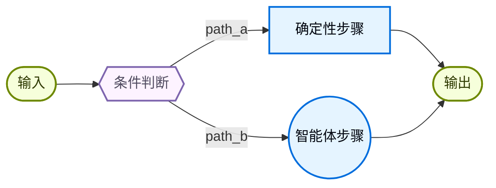
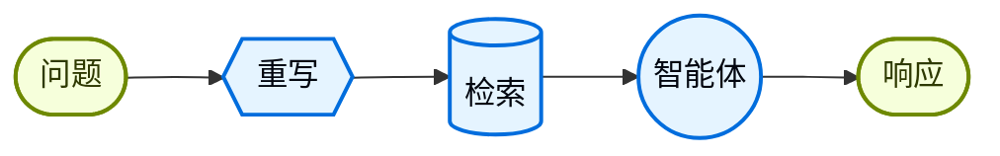

在 **自定义工作流** 架构中，你可以使用 [LangGraph](/oss/langgraph/overview) 定义自己的执行流。你对图结构拥有完全控制权，包括顺序步骤、条件分支、循环和并行执行。



## 主要特点

* 对图结构拥有完全控制权
* 可以把确定性逻辑和智能体行为混合在一起
* 支持顺序步骤、条件分支、循环和并行执行
* 可以把其他模式嵌入为工作流中的节点

## 何时使用

当标准模式（子智能体、技能等）无法满足你的需求，或者你需要把确定性逻辑和智能体行为混合起来，或者你的场景需要复杂路由或多阶段处理时，就使用自定义工作流。

工作流中的每个节点都可以是一个简单函数、一次 LLM 调用，或一个带有 [tools](/oss/langchain/tools) 的完整 [agent](/oss/langchain/agents)。你也可以在自定义工作流里组合其他架构，例如把一个多智能体系统嵌成单个节点。

完整示例见下方教程。

<Card
    title="教程：用路由构建多源知识库"
    icon="book"
    href="/oss/langchain/multi-agent/router-knowledge-base"
    arrow cta="了解更多"
>
    [路由模式](/oss/langchain/multi-agent/router) 就是自定义工作流的一个例子。本教程会带你构建一个并行查询 GitHub、Notion 和 Slack，然后综合结果的路由器。
>
</Card>

## 基础实现

核心思路是在任意 LangGraph 节点中直接调用 LangChain 智能体，把自定义工作流的灵活性和预构建智能体的便利性结合起来：

:::python
```python
from langchain.agents import create_agent
from langgraph.graph import StateGraph, START, END

agent = create_agent(model="openai:gpt-5.5", tools=[...])

def agent_node(state: State) -> dict:
    """调用 LangChain 智能体的 LangGraph 节点。"""
    result = agent.invoke({
        "messages": [{"role": "user", "content": state["query"]}]
    })
    return {"answer": result["messages"][-1].content}

# 构建一个简单工作流
workflow = (
    StateGraph(State)
    .add_node("agent", agent_node)
    .add_edge(START, "agent")
    .add_edge("agent", END)
    .compile()
)
```
:::
:::js
```typescript
import { z } from "zod";
import { createAgent } from "langchain";
import { StateGraph, START, END, StateSchema, MessagesValue } from "@langchain/langgraph";

const agent = createAgent({ model: "openai:gpt-5.5", tools: [...] });

const AgentState = new StateSchema({
  messages: MessagesValue,
  query: z.string(),
});

const agentNode: GraphNode<typeof AgentState> = (state) => {
  // 调用 LangChain 智能体的 LangGraph 节点
  const result = await agent.invoke({
    messages: [{ role: "user", content: state.query }]
  });
  return { answer: result.messages.at(-1)?.content };
}

// 构建一个简单工作流
const workflow = new StateGraph(State)
  .addNode("agent", agentNode)
  .addEdge(START, "agent")
  .addEdge("agent", END)
  .compile();
```
:::

## 示例：RAG 流水线

一个常见用例是把 [retrieval](/oss/langchain/retrieval) 和智能体结合起来。这个例子会构建一个 WNBA 统计助手，从知识库中检索内容，并且还能抓取实时新闻。

<Accordion title="自定义 RAG 工作流">

这个工作流展示了三类节点：

- **模型节点**（Rewrite）：使用 [structured output](/oss/langchain/structured-output) 重写用户问题，让检索更准确。
- **确定性节点**（Retrieve）：执行向量相似度搜索，不涉及 LLM。
- **智能体节点**（Agent）：基于检索到的上下文进行推理，并且可以通过工具获取更多信息。



<Tip>
你可以用 LangGraph state 在工作流步骤之间传递信息。这样每个部分都能读取和更新结构化字段，方便在不同节点之间共享数据和上下文。
</Tip>

:::python
```python
from typing import TypedDict
from pydantic import BaseModel
from langgraph.graph import StateGraph, START, END
from langchain.agents import create_agent
from langchain.tools import tool
from langchain_openai import ChatOpenAI, OpenAIEmbeddings
from langchain_core.vectorstores import InMemoryVectorStore

class State(TypedDict):
    question: str
    rewritten_query: str
    documents: list[str]
    answer: str

# WNBA 知识库，包含阵容、比赛结果和球员数据
embeddings = OpenAIEmbeddings()
vector_store = InMemoryVectorStore(embeddings)
vector_store.add_texts([
    # 阵容
    "New York Liberty 2024 roster: Breanna Stewart, Sabrina Ionescu, Jonquel Jones, Courtney Vandersloot.",
    "Las Vegas Aces 2024 roster: A'ja Wilson, Kelsey Plum, Jackie Young, Chelsea Gray.",
    "Indiana Fever 2024 roster: Caitlin Clark, Aliyah Boston, Kelsey Mitchell, NaLyssa Smith.",
    # 比赛结果
    "2024 WNBA Finals: New York Liberty defeated Minnesota Lynx 3-2 to win the championship.",
    "June 15, 2024: Indiana Fever 85, Chicago Sky 79. Caitlin Clark had 23 points and 8 assists.",
    "August 20, 2024: Las Vegas Aces 92, Phoenix Mercury 84. A'ja Wilson scored 35 points.",
    # 球员数据
    "A'ja Wilson 2024 season stats: 26.9 PPG, 11.9 RPG, 2.6 BPG. Won MVP award.",
    "Caitlin Clark 2024 rookie stats: 19.2 PPG, 8.4 APG, 5.7 RPG. Won Rookie of the Year.",
    "Breanna Stewart 2024 stats: 20.4 PPG, 8.5 RPG, 3.5 APG.",
])
retriever = vector_store.as_retriever(search_kwargs={"k": 5})

@tool
def get_latest_news(query: str) -> str:
    """获取最新的 WNBA 新闻和动态。"""
    # 这里放你的新闻 API
    return "Latest: The WNBA announced expanded playoff format for 2025..."

agent = create_agent(
    model="openai:gpt-5.5",
    tools=[get_latest_news],
)

model = ChatOpenAI(model="gpt-5.5")

class RewrittenQuery(BaseModel):
    query: str

def rewrite_query(state: State) -> dict:
    """重写用户问题，以便更好地进行检索。"""
    system_prompt = """Rewrite this query to retrieve relevant WNBA information.
The knowledge base contains: team rosters, game results with scores, and player statistics (PPG, RPG, APG).
Focus on specific player names, team names, or stat categories mentioned."""
    response = model.with_structured_output(RewrittenQuery).invoke([
        {"role": "system", "content": system_prompt},
        {"role": "user", "content": state["question"]}
    ])
    return {"rewritten_query": response.query}

def retrieve(state: State) -> dict:
    """根据重写后的问题检索文档。"""
    docs = retriever.invoke(state["rewritten_query"])
    return {"documents": [doc.page_content for doc in docs]}

def call_agent(state: State) -> dict:
    """使用检索到的上下文生成答案。"""
    context = "\n\n".join(state["documents"])
    prompt = f"Context:\n{context}\n\nQuestion: {state['question']}"
    response = agent.invoke({"messages": [{"role": "user", "content": prompt}]})
    return {"answer": response["messages"][-1].content_blocks}

workflow = (
    StateGraph(State)
    .add_node("rewrite", rewrite_query)
    .add_node("retrieve", retrieve)
    .add_node("agent", call_agent)
    .add_edge(START, "rewrite")
    .add_edge("rewrite", "retrieve")
    .add_edge("retrieve", "agent")
    .add_edge("agent", END)
    .compile()
)

result = workflow.invoke({"question": "Who won the 2024 WNBA Championship?"})
print(result["answer"])
```

<Info>
在生产环境中，请使用持久化向量存储（例如 [Valkey](/oss/integrations/vectorstores/valkey)、[Databricks Vector Search](/oss/integrations/vectorstores/databricks_vector_search) 或 [MongoDB Atlas](/oss/integrations/vectorstores/mongodb_atlas)）来代替 `InMemoryVectorStore`。请参见[所有向量存储](/oss/integrations/vectorstores)。
</Info>
:::
:::js
```typescript
import { StateGraph, Annotation, START, END } from "@langchain/langgraph";
import { createAgent, tool } from "langchain";
import { ChatOpenAI, OpenAIEmbeddings } from "@langchain/openai";
import { MemoryVectorStore } from "@langchain/classic/vectorstores/memory";
import * as z from "zod";

const State = Annotation.Root({
  question: Annotation<string>(),
  rewrittenQuery: Annotation<string>(),
  documents: Annotation<string[]>(),
  answer: Annotation<string>(),
});

// WNBA 知识库，包含阵容、比赛结果和球员数据
const embeddings = new OpenAIEmbeddings();
const vectorStore = await MemoryVectorStore.fromTexts(
  [
    // 阵容
    "New York Liberty 2024 roster: Breanna Stewart, Sabrina Ionescu, Jonquel Jones, Courtney Vandersloot.",
    "Las Vegas Aces 2024 roster: A'ja Wilson, Kelsey Plum, Jackie Young, Chelsea Gray.",
    "Indiana Fever 2024 roster: Caitlin Clark, Aliyah Boston, Kelsey Mitchell, NaLyssa Smith.",
    // 比赛结果
    "2024 WNBA Finals: New York Liberty defeated Minnesota Lynx 3-2 to win the championship.",
    "June 15, 2024: Indiana Fever 85, Chicago Sky 79. Caitlin Clark had 23 points and 8 assists.",
    "August 20, 2024: Las Vegas Aces 92, Phoenix Mercury 84. A'ja Wilson scored 35 points.",
    // 球员数据
    "A'ja Wilson 2024 season stats: 26.9 PPG, 11.9 RPG, 2.6 BPG. Won MVP award.",
    "Caitlin Clark 2024 rookie stats: 19.2 PPG, 8.4 APG, 5.7 RPG. Won Rookie of the Year.",
    "Breanna Stewart 2024 stats: 20.4 PPG, 8.5 RPG, 3.5 APG.",
  ],
  [{}, {}, {}, {}, {}, {}, {}, {}, {}],
  embeddings
);

const retriever = vectorStore.asRetriever({ k: 5 });

const getLatestNews = tool(
  async ({ query }) => {
    // 这里放你的新闻 API
    return "Latest: The WNBA announced expanded playoff format for 2025...";
  },
  {
    name: "get_latest_news",
    description: "获取最新的 WNBA 新闻和动态",
    schema: z.object({ query: z.string() }),
  }
);

const agent = createAgent({
  model: "openai:gpt-5.5",
  tools: [getLatestNews],
});

const model = new ChatOpenAI({ model: "gpt-5.5" });

const RewrittenQuery = z.object({ query: z.string() });

async function rewriteQuery(state: typeof State.State) {
  const systemPrompt = `Rewrite this query to retrieve relevant WNBA information.
The knowledge base contains: team rosters, game results with scores, and player statistics (PPG, RPG, APG).
Focus on specific player names, team names, or stat categories mentioned.`;
  const response = await model.withStructuredOutput(RewrittenQuery).invoke([
    { role: "system", content: systemPrompt },
    { role: "user", content: state.question },
  ]);
  return { rewrittenQuery: response.query };
}

async function retrieve(state: typeof State.State) {
  const docs = await retriever.invoke(state.rewrittenQuery);
  return { documents: docs.map((doc) => doc.pageContent) };
}

async function callAgent(state: typeof State.State) {
  const context = state.documents.join("\n\n");
  const prompt = `Context:\n${context}\n\nQuestion: ${state.question}`;
  const response = await agent.invoke({
    messages: [{ role: "user", content: prompt }],
  });
  return { answer: response.messages.at(-1)?.contentBlocks };
}

const workflow = new StateGraph(State)
  .addNode("rewrite", rewriteQuery)
  .addNode("retrieve", retrieve)
  .addNode("agent", callAgent)
  .addEdge(START, "rewrite")
  .addEdge("rewrite", "retrieve")
  .addEdge("retrieve", "agent")
  .addEdge("agent", END)
  .compile();

const result = await workflow.invoke({
  question: "Who won the 2024 WNBA Championship?",
});
console.log(result.answer);
```

<Info>
在生产环境中，请使用持久化向量存储（例如 [Weaviate](/oss/integrations/vectorstores/weaviate)、[Pinecone](/oss/integrations/vectorstores/pinecone) 或 [MongoDB Atlas](/oss/integrations/vectorstores/mongodb_atlas)）来代替 `MemoryVectorStore`。请参见[所有向量存储](/oss/integrations/vectorstores)。
</Info>
:::

</Accordion>
