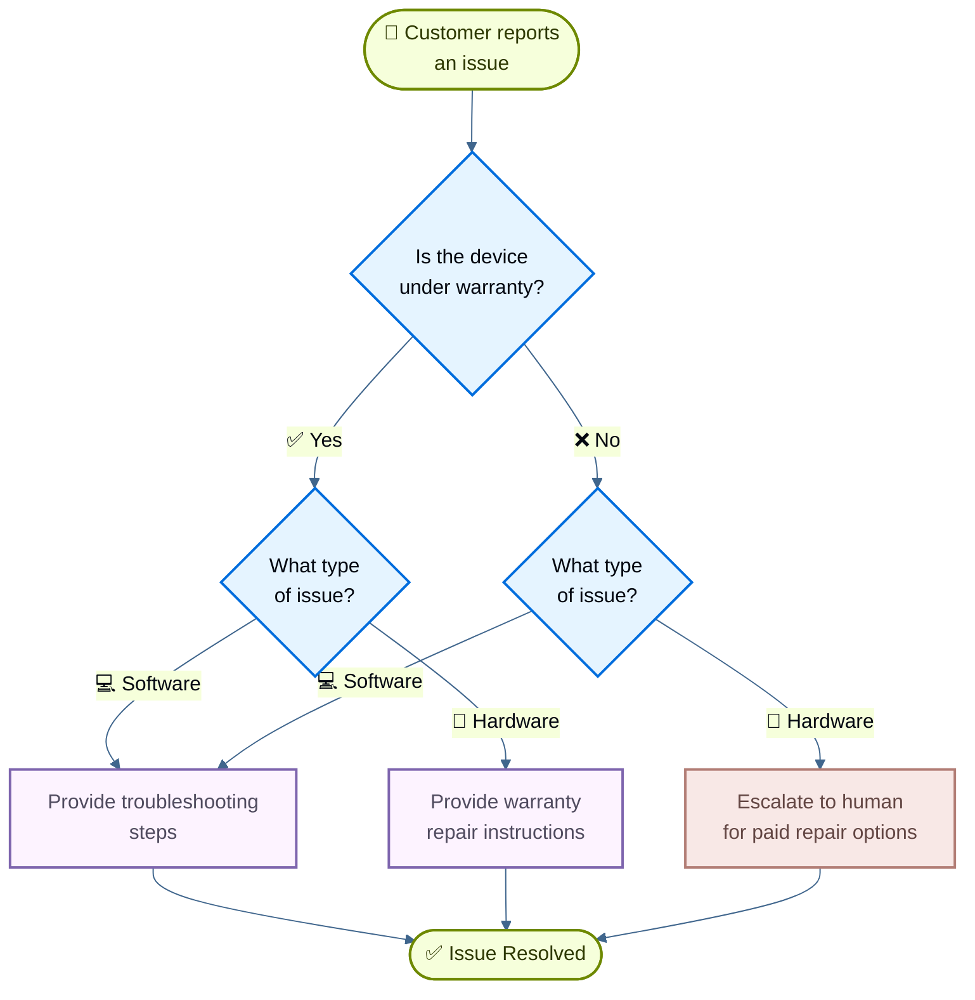

import ChatModelTabsPy from '/snippets/chat-model-tabs.mdx';
import ChatModelTabsJs from '/snippets/chat-model-tabs-js.mdx';

[state machine pattern](/oss/langchain/multi-agent/handoffs) 描述的是这样一类工作流：agent 的行为会随着任务进入不同状态而变化。本教程展示了如何通过 tool call 动态改变单个 agent 的配置，也就是根据当前 state 更新它可用的工具和指令，从而实现一个 state machine。这个 state 可以来自多个来源：agent 过去的动作（tool call）、外部 state（例如 API 调用结果），甚至初始用户输入（例如通过分类器判断用户意图）。

在本教程里，你会构建一个客户支持 agent，它会：

- 在继续之前先收集保修信息。
- 把问题分类为硬件问题或软件问题。
- 提供解决方案，或者升级给人工支持。
- 在多轮对话中维护 conversation state。

与 [subagents pattern](/oss/langchain/multi-agent/subagents-personal-assistant) 不同，后者是把 sub-agent 当作工具来调用，**state machine pattern** 使用的是一个单独的 agent，只是它的配置会随着 workflow 的进展而变化。每个“step”其实都只是同一个底层 agent 的一种不同配置（system prompt + tools），并根据 state 动态选择。

下面是我们要构建的 workflow：



## 设置

### 安装

本教程需要 `langchain` 包：

:::python
<CodeGroup>
```bash pip
pip install langchain
```
```bash uv
uv add langchain
```
```bash conda
conda install langchain -c conda-forge
```
</CodeGroup>
:::

:::js
<CodeGroup>
```bash npm
npm install langchain
```
```bash yarn
yarn add langchain
```
```bash pnpm
pnpm add langchain
```
</CodeGroup>
:::

更多细节请参见 [Installation guide](/oss/langchain/install)。

### LangSmith

先配置 [LangSmith](https://smith.langchain.com)，以便查看 agent 内部发生了什么。然后设置以下环境变量：

:::python
<CodeGroup>
```bash bash
export LANGSMITH_TRACING="true"
export LANGSMITH_API_KEY="..."
```
```python python
import getpass
import os

os.environ["LANGSMITH_TRACING"] = "true"
os.environ["LANGSMITH_API_KEY"] = getpass.getpass()
```
</CodeGroup>
:::

:::js
<CodeGroup>
```bash bash
export LANGSMITH_TRACING="true"
export LANGSMITH_API_KEY="..."
```
```typescript typescript
process.env.LANGSMITH_TRACING = "true";
process.env.LANGSMITH_API_KEY = "...";
```
</CodeGroup>
:::

### 选择 LLM

从 LangChain 的集成套件里选择一个 chat model：

:::python
<ChatModelTabsPy />
:::

:::js
<ChatModelTabsJs />
:::

## 1. 定义自定义 state

先定义一个自定义 state schema，用来跟踪当前处于哪个 step：

:::python
```python
from langchain.agents import AgentState
from typing_extensions import NotRequired
from typing import Literal

# Define the possible workflow steps
SupportStep = Literal["warranty_collector", "issue_classifier", "resolution_specialist"]  # [!code highlight]

class SupportState(AgentState):  # [!code highlight]
    """State for customer support workflow."""
    current_step: NotRequired[SupportStep]  # [!code highlight]
    warranty_status: NotRequired[Literal["in_warranty", "out_of_warranty"]]
    issue_type: NotRequired[Literal["hardware", "software"]]
```
:::

## 2. 创建管理 workflow state 的工具

创建会更新 workflow state 的工具。这些工具让 agent 可以记录信息，并切换到下一步。

关键在于使用 `Command` 来更新 state，包括 `current_step` 字段：

:::python
```python
from langchain.tools import tool, ToolRuntime
from langchain.messages import ToolMessage
from langgraph.types import Command

@tool
def record_warranty_status(
    status: Literal["in_warranty", "out_of_warranty"],
    runtime: ToolRuntime[None, SupportState],
) -> Command:  # [!code highlight]
    """记录客户的保修状态，并切换到问题分类步骤。"""
    return Command(  # [!code highlight]
        update={  # [!code highlight]
            "messages": [
                ToolMessage(
                    content=f"Warranty status recorded as: {status}",
                    tool_call_id=runtime.tool_call_id,
                )
            ],
            "warranty_status": status,
            "current_step": "issue_classifier",  # [!code highlight]
        }
    )


@tool
def record_issue_type(
    issue_type: Literal["hardware", "software"],
    runtime: ToolRuntime[None, SupportState],
) -> Command:  # [!code highlight]
    """记录问题类型，并切换到解决步骤。"""
    return Command(  # [!code highlight]
        update={  # [!code highlight]
            "messages": [
                ToolMessage(
                    content=f"Issue type recorded as: {issue_type}",
                    tool_call_id=runtime.tool_call_id,
                )
            ],
            "issue_type": issue_type,
            "current_step": "resolution_specialist",  # [!code highlight]
        }
    )


@tool
def escalate_to_human(reason: str) -> str:
    """将案件升级给人工支持专员。"""
    # 在真实系统里，这里会创建工单、通知工作人员等。
    return f"Escalating to human support. Reason: {reason}"


@tool
def provide_solution(solution: str) -> str:
    """向客户提供解决方案。"""
    return f"Solution provided: {solution}"
```
:::

:::js
```typescript
import { z } from "zod";
import { tool, ToolMessage, type ToolRuntime } from "langchain";
import { Command } from "@langchain/langgraph";

const recordWarrantyStatus = tool(
  async (input, config: ToolRuntime<typeof SupportState.State>) => {
    return new Command({ // [!code highlight]
      update: { // [!code highlight]
        messages: [
          new ToolMessage({
            content: `Warranty status recorded as: ${input.status}`,
            tool_call_id: config.toolCallId,
          }),
        ],
        warrantyStatus: input.status,
        currentStep: "issue_classifier", // [!code highlight]
      },
    });
  },
  {
    name: "record_warranty_status",
    description:
      "Record the customer's warranty status and transition to issue classification.",
    schema: z.object({
      status: WarrantyStatusSchema,
    }),
  }
);

const recordIssueType = tool(
  async (input, config: ToolRuntime<typeof SupportState.State>) => {
    return new Command({ // [!code highlight]
      update: { // [!code highlight]
        messages: [
          new ToolMessage({
            content: `Issue type recorded as: ${input.issueType}`,
            tool_call_id: config.toolCallId,
          }),
        ],
        issueType: input.issueType,
        currentStep: "resolution_specialist", // [!code highlight]
      },
    });
  },
  {
    name: "record_issue_type",
    description:
      "Record the type of issue and transition to resolution specialist.",
    schema: z.object({
      issueType: IssueTypeSchema,
    }),
  }
);

const escalateToHuman = tool(
  async (input) => {
    // 在真实系统里，这里会创建工单、通知工作人员等。
    return `Escalating to human support. Reason: ${input.reason}`;
  },
  {
    name: "escalate_to_human",
    description: "Escalate the case to a human support specialist.",
    schema: z.object({
      reason: z.string(),
    }),
  }
);

const provideSolution = tool(
  async (input) => {
    return `Solution provided: ${input.solution}`;
  },
  {
    name: "provide_solution",
    description: "Provide a solution to the customer's issue.",
    schema: z.object({
      solution: z.string(),
    }),
  }
);
```
:::

这个步骤管理工具会把 `warranty_status` 和 `issue_type` 记录到 state 里，并把 `current_step` 更新到下一阶段。

## 3. 定义 step 配置

为每个 step 定义 prompt 和 tools。先把每个 step 的 prompt 写成常量：

<Accordion title="查看完整 prompt 定义">

:::python
```python
# 为每个 step 定义常量，便于引用
WARRANTY_COLLECTOR_PROMPT = """你是一个帮助处理设备问题的客户支持 agent。

CURRENT STAGE: Warranty verification

在这个步骤里，你需要：
1. 友好地向客户打招呼
2. 询问设备是否仍在保修期内
3. 使用 record_warranty_status 记录回复并进入下一步

保持对话自然友好，不要一次问太多问题。"""

ISSUE_CLASSIFIER_PROMPT = """你是一个帮助处理设备问题的客户支持 agent。

CURRENT STAGE: Issue classification
CUSTOMER INFO: Warranty status is {warranty_status}

在这个步骤里，你需要：
1. 让客户描述遇到的问题
2. 判断它是硬件问题（物理损坏、部件损坏）还是软件问题（应用崩溃、性能问题）
3. 使用 record_issue_type 记录分类并进入下一步

如果信息不清楚，先追问再分类。"""

RESOLUTION_SPECIALIST_PROMPT = """你是一个帮助处理设备问题的客户支持 agent。

CURRENT STAGE: Resolution
CUSTOMER INFO: Warranty status is {warranty_status}, issue type is {issue_type}

在这个步骤里，你需要：
1. 对于 SOFTWARE 问题：使用 provide_solution 提供排查步骤
2. 对于 HARDWARE 问题：
   - 如果 IN WARRANTY：使用 provide_solution 说明保修维修流程
   - 如果 OUT OF WARRANTY：使用 escalate_to_human 提供付费维修选项

给出的解决方案要具体且有帮助。"""
```
:::

:::js
```typescript
// 为每个 step 定义常量，便于引用
const WARRANTY_COLLECTOR_PROMPT = `你是一个帮助处理设备问题的客户支持 agent。

CURRENT STAGE: Warranty verification

在这个步骤里，你需要：
1. 友好地向客户打招呼
2. 询问设备是否仍在保修期内
3. 使用 record_warranty_status 记录回复并进入下一步

保持对话自然友好，不要一次问太多问题。`;

const ISSUE_CLASSIFIER_PROMPT = `你是一个帮助处理设备问题的客户支持 agent。

CURRENT STAGE: Issue classification
CUSTOMER INFO: Warranty status is {warranty_status}

在这个步骤里，你需要：
1. 让客户描述遇到的问题
2. 判断它是硬件问题（物理损坏、部件损坏）还是软件问题（应用崩溃、性能问题）
3. 使用 record_issue_type 记录分类并进入下一步

如果信息不清楚，先追问再分类。`;

const RESOLUTION_SPECIALIST_PROMPT = `你是一个帮助处理设备问题的客户支持 agent。

CURRENT STAGE: Resolution
CUSTOMER INFO: Warranty status is {warranty_status}, issue type is {issue_type}

在这个步骤里，你需要：
1. 对于 SOFTWARE 问题：使用 provide_solution 提供排查步骤
2. 对于 HARDWARE 问题：
   - 如果 IN WARRANTY：使用 provide_solution 说明保修维修流程
   - 如果 OUT OF WARRANTY：使用 escalate_to_human 提供付费维修选项

给出的解决方案要具体且有帮助。`;
```
:::

</Accordion>

然后用字典把 step 名称映射到对应配置：

:::python
```python
# Step configuration: maps step name to (prompt, tools, required_state)
STEP_CONFIG = {
    "warranty_collector": {
        "prompt": WARRANTY_COLLECTOR_PROMPT,
        "tools": [record_warranty_status],
        "requires": [],
    },
    "issue_classifier": {
        "prompt": ISSUE_CLASSIFIER_PROMPT,
        "tools": [record_issue_type],
        "requires": ["warranty_status"],
    },
    "resolution_specialist": {
        "prompt": RESOLUTION_SPECIALIST_PROMPT,
        "tools": [provide_solution, escalate_to_human],
        "requires": ["warranty_status", "issue_type"],
    },
}
```
:::

:::js
```typescript
// Step configuration: maps step name to (prompt, tools, required_state)
const STEP_CONFIG = {
  warranty_collector: {
    prompt: WARRANTY_COLLECTOR_PROMPT,
    tools: [recordWarrantyStatus],
    requires: [],
  },
  issue_classifier: {
    prompt: ISSUE_CLASSIFIER_PROMPT,
    tools: [recordIssueType],
    requires: ["warrantyStatus"],
  },
  resolution_specialist: {
    prompt: RESOLUTION_SPECIALIST_PROMPT,
    tools: [provideSolution, escalateToHuman],
    requires: ["warrantyStatus", "issueType"],
  },
} as const;
```
:::

这个基于字典的配置方式很适合：
- 一眼看清所有 step
- 只要再加一个 entry 就能新增 step
- 理解 workflow 的依赖关系（`requires` 字段）
- 使用带 state 变量的 prompt 模板（例如 `{warranty_status}`）

## 4. 创建基于 step 的 middleware

创建一个 middleware，从 state 里读取 `current_step`，并应用对应配置。这里用 `@wrap_model_call` 装饰器来写一个更简洁的实现：

:::python
```python
from langchain.agents.middleware import wrap_model_call, ModelRequest, ModelResponse
from typing import Callable


@wrap_model_call  # [!code highlight]
def apply_step_config(
    request: ModelRequest,
    handler: Callable[[ModelRequest], ModelResponse],
) -> ModelResponse:
    """根据当前 step 配置 agent 行为。"""
    # 获取当前 step（首次交互默认是 warranty_collector）
    current_step = request.state.get("current_step", "warranty_collector")  # [!code highlight]

    # 查找 step 配置
    stage_config = STEP_CONFIG[current_step]  # [!code highlight]

    # 校验所需 state 是否存在
    for key in stage_config["requires"]:
        if request.state.get(key) is None:
            raise ValueError(f"{key} must be set before reaching {current_step}")

    # 用 state 值格式化 prompt（支持 {warranty_status}、{issue_type} 等）
    system_prompt = stage_config["prompt"].format(**request.state)

    # 注入 system prompt 和 step 专属 tools
    request = request.override(  # [!code highlight]
        system_prompt=system_prompt,  # [!code highlight]
        tools=stage_config["tools"],  # [!code highlight]
    )

    return handler(request)
```
:::

:::js
```typescript
import { createMiddleware } from "langchain";

const applyStepMiddleware = createMiddleware({
  name: "applyStep",
  stateSchema: SupportState,
  wrapModelCall: async (request, handler) => {
    // 获取当前 step（首次交互默认是 warranty_collector）
    const currentStep = request.state.currentStep ?? "warranty_collector"; // [!code highlight]

    // 查找 step 配置
    const stepConfig = STEP_CONFIG[currentStep]; // [!code highlight]

    // 校验所需 state 是否存在
    for (const key of stepConfig.requires) {
      if (request.state[key] === undefined) {
        throw new Error(`${key} must be set before reaching ${currentStep}`);
      }
    }

    // 用 state 值格式化 prompt（支持 {warrantyStatus}、{issueType} 等）
    let systemPrompt: string = stepConfig.prompt;
    for (const [key, value] of Object.entries(request.state)) {
      systemPrompt = systemPrompt.replace(`{${key}}`, String(value ?? ""));
    }

    // 注入 system prompt 和 step 专属 tools
    return handler({
      ...request, // [!code highlight]
      systemPrompt, // [!code highlight]
      tools: [...stepConfig.tools], // [!code highlight]
    });
  },
});
```
:::

这个 middleware 会：

1. **读取当前 step**：从 state 里拿 `current_step`（默认是 `warranty_collector`）。
2. **查找配置**：找到 `STEP_CONFIG` 里对应的配置项。
3. **校验依赖**：确认所需的 state 字段已经存在。
4. **格式化 prompt**：把 state 值注入 prompt 模板。
5. **注入 tools**：把当前 step 对应的 tools 传给模型。

## 5. 创建 agent

现在创建带有 step middleware 和 checkpointer 的 agent：

:::python
```python
from langchain.agents import create_agent
from langgraph.checkpoint.memory import InMemorySaver

# 收集所有 step 配置里的 tools
all_tools = [
    record_warranty_status,
    record_issue_type,
    provide_solution,
    escalate_to_human,
]

# 使用 step-based configuration 创建 agent
agent = create_agent(
    model,
    tools=all_tools,
    state_schema=SupportState,  # [!code highlight]
    middleware=[apply_step_config],  # [!code highlight]
    checkpointer=InMemorySaver(),  # [!code highlight]
)
```
:::

:::js
```typescript
import { createAgent } from "langchain";
import { MemorySaver } from "@langchain/langgraph";
import { ChatOpenAI } from "@langchain/openai";

// 收集所有 step 配置里的 tools
const allTools = [
  recordWarrantyStatus,
  recordIssueType,
  provideSolution,
  escalateToHuman,
];

// 初始化模型
const model = new ChatOpenAI({
  model: "gpt-5.4-mini",
  temperature: 0.7,
});

// 使用 step-based configuration 创建 agent
const agent = createAgent({
  model,
  tools: allTools,
  stateSchema: SupportState,  // [!code highlight]
  middleware: [applyStepMiddleware],  // [!code highlight]
  checkpointer: new MemorySaver(),  // [!code highlight]
});
```
:::

<Note>
**为什么需要 checkpointer？** checkpointer 会在对话轮次之间保存 state。没有它，`current_step` 在用户发送下一条消息时就会丢失，workflow 也会断掉。
</Note>

## 6. Test the workflow

测试完整 workflow：

:::python
```python
from langchain.messages import HumanMessage
from langchain_core.utils.uuid import uuid7

# Configuration for this conversation thread
thread_id = str(uuid7())
config = {"configurable": {"thread_id": thread_id}}

# Turn 1: Initial message - starts with warranty_collector step
print("=== Turn 1: Warranty Collection ===")
result = agent.invoke(
    {"messages": [HumanMessage("Hi, my phone screen is cracked")]},
    config
)
for msg in result['messages']:
    msg.pretty_print()

# Turn 2: User responds about warranty
print("\n=== Turn 2: Warranty Response ===")
result = agent.invoke(
    {"messages": [HumanMessage("Yes, it's still under warranty")]},
    config
)
for msg in result['messages']:
    msg.pretty_print()
print(f"Current step: {result.get('current_step')}")

# Turn 3: User describes the issue
print("\n=== Turn 3: Issue Description ===")
result = agent.invoke(
    {"messages": [HumanMessage("The screen is physically cracked from dropping it")]},
    config
)
for msg in result['messages']:
    msg.pretty_print()
print(f"Current step: {result.get('current_step')}")

# Turn 4: Resolution
print("\n=== Turn 4: Resolution ===")
result = agent.invoke(
    {"messages": [HumanMessage("What should I do?")]},
    config
)
for msg in result['messages']:
    msg.pretty_print()
```
:::

:::js
```typescript
import { HumanMessage } from "@langchain/core/messages";
import { v7 as uuid7 } from "uuid";

// Configuration for this conversation thread
const threadId = uuid7();
const config = { configurable: { thread_id: threadId } };

// Turn 1: Initial message - starts with warranty_collector step
console.log("=== Turn 1: Warranty Collection ===");
let result = await agent.invoke(
  { messages: [new HumanMessage("Hi, my phone screen is cracked")] },
  config
);
for (const msg of result.messages) {
  console.log(msg.content);
}

// Turn 2: User responds about warranty
console.log("\n=== Turn 2: Warranty Response ===");
result = await agent.invoke(
  { messages: [new HumanMessage("Yes, it's still under warranty")] },
  config
);
for (const msg of result.messages) {
  console.log(msg.content);
}
console.log(`Current step: ${result.currentStep}`);

// Turn 3: User describes the issue
console.log("\n=== Turn 3: Issue Description ===");
result = await agent.invoke(
  { messages: [new HumanMessage("The screen is physically cracked from dropping it")] },
  config
);
for (const msg of result.messages) {
  console.log(msg.content);
}
console.log(`Current step: ${result.currentStep}`);

// Turn 4: Resolution
console.log("\n=== Turn 4: Resolution ===");
result = await agent.invoke(
  { messages: [new HumanMessage("What should I do?")] },
  config
);
for (const msg of result.messages) {
  console.log(msg.content);
}
```
:::

Expected flow:
1. **Warranty verification step**: Asks about warranty status.
2. **Issue classification step**: Asks about the problem and determines that it is hardware.
3. **Resolution step**: Provides warranty repair instructions.

## 7. Understanding state transitions

让我们逐轮看一下会发生什么：

### Turn 1: Initial message

:::python
```python
{
    "messages": [HumanMessage("Hi, my phone screen is cracked")],
    "current_step": "warranty_collector"  # Default value
}
```
:::

:::js
```typescript
{
  messages: [new HumanMessage("Hi, my phone screen is cracked")],
  currentStep: "warranty_collector"  // Default value
}
```
:::

middleware 会应用：
- System prompt: `WARRANTY_COLLECTOR_PROMPT`
- Tools: `[record_warranty_status]`

### Turn 2: After warranty recorded

:::python
Tool call: `record_warranty_status("in_warranty")` returns:
```python
Command(update={
    "warranty_status": "in_warranty",
    "current_step": "issue_classifier"  # State transition!
})
```
:::

:::js
Tool call: `recordWarrantyStatus("in_warranty")` returns:
```typescript
new Command({
  update: {
    warrantyStatus: "in_warranty",
    currentStep: "issue_classifier"  // State transition!
  }
})
```
:::

下一轮，middleware 会应用：
- System prompt: `ISSUE_CLASSIFIER_PROMPT`（使用 `warranty_status="in_warranty"` 格式化）
- Tools: `[record_issue_type]`

### Turn 3: After issue classified

:::python
Tool call: `record_issue_type("hardware")` returns:
```python
Command(update={
    "issue_type": "hardware",
    "current_step": "resolution_specialist"  # State transition!
})
```
:::

:::js
Tool call: `recordIssueType("hardware")` returns:
```typescript
new Command({
  update: {
    issueType: "hardware",
    currentStep: "resolution_specialist"  // State transition!
  }
})
```
:::

下一轮，middleware 会应用：
- System prompt: `RESOLUTION_SPECIALIST_PROMPT`（使用 `warranty_status` 和 `issue_type` 格式化）
- Tools: `[provide_solution, escalate_to_human]`

关键点在于：**Tools drive the workflow**，它们通过更新 `current_step` 推进流程；**middleware responds**，在下一轮应用对应配置。

## 8. Manage message history

随着 agent 逐步推进，message history 会增长。可以使用 [summarization middleware](/oss/langchain/short-term-memory#summarize-messages) 压缩早期消息，同时保留对话上下文：

:::python
```python
from langchain.agents import create_agent
from langchain.agents.middleware import SummarizationMiddleware  # [!code highlight]
from langgraph.checkpoint.memory import InMemorySaver

agent = create_agent(
    model,
    tools=all_tools,
    state_schema=SupportState,
    middleware=[
        apply_step_config,
        SummarizationMiddleware(  # [!code highlight]
            model="gpt-5.4-mini",
            trigger=("tokens", 4000),
            keep=("messages", 10)
        )
    ],
    checkpointer=InMemorySaver(),
)
```
:::

:::js
```typescript
import { createAgent, SummarizationMiddleware } from "langchain";  // [!code highlight]
import { MemorySaver } from "@langchain/langgraph";

const agent = createAgent({
  model,
  tools: allTools,
  stateSchema: SupportState,
  middleware: [
    applyStepMiddleware,
    new SummarizationMiddleware({  // [!code highlight]
      model: "gpt-5.4-mini",
      trigger: { tokens: 4000 },
      keep: { messages: 10 },
    }),
  ],
  checkpointer: new MemorySaver(),
});
```
:::

更多记忆管理技巧请参见 [short-term memory guide](/oss/langchain/short-term-memory)。

## 9. Add flexibility: Go back

有些 workflow 需要允许用户返回上一步来更正信息，例如修改保修状态或问题分类。不过，并不是所有跳转都合理，例如退款完成后通常不能回退。对于这个支持流程，我们会添加工具，让用户能回到保修核验和问题分类步骤。

<Tip>
如果你的 workflow 需要在大多数步骤之间任意跳转，可以先想想是否真的需要结构化 workflow。这个模式最适合“清晰顺序推进、偶尔允许回退更正”的场景。
</Tip>

给 resolution 步骤添加“返回上一步”工具：

:::python
```python
@tool
def go_back_to_warranty() -> Command:  # [!code highlight]
    """Go back to warranty verification step."""
    return Command(update={"current_step": "warranty_collector"})  # [!code highlight]


@tool
def go_back_to_classification() -> Command:  # [!code highlight]
    """Go back to issue classification step."""
    return Command(update={"current_step": "issue_classifier"})  # [!code highlight]


# Update the resolution_specialist configuration to include these tools
STEP_CONFIG["resolution_specialist"]["tools"].extend([
    go_back_to_warranty,
    go_back_to_classification
])
```
:::

:::js
```typescript
import { tool } from "langchain";
import { Command } from "@langchain/langgraph";
import { z } from "zod";

const goBackToWarranty = tool(  // [!code highlight]
  async () => {
    return new Command({ update: { currentStep: "warranty_collector" } });  // [!code highlight]
  },
  {
    name: "go_back_to_warranty",
    description: "Go back to warranty verification step.",
    schema: z.object({}),
  }
);

const goBackToClassification = tool(  // [!code highlight]
  async () => {
    return new Command({ update: { currentStep: "issue_classifier" } });  // [!code highlight]
  },
  {
    name: "go_back_to_classification",
    description: "Go back to issue classification step.",
    schema: z.object({}),
  }
);

// Update the resolution_specialist configuration to include these tools
STEP_CONFIG.resolution_specialist.tools.push(
  goBackToWarranty,
  goBackToClassification
);
```
:::

更新 resolution specialist 的 prompt，把这些工具说明加进去：

:::python
```python
RESOLUTION_SPECIALIST_PROMPT = """You are a customer support agent helping with device issues.

CURRENT STAGE: Resolution
CUSTOMER INFO: Warranty status is {warranty_status}, issue type is {issue_type}

At this step, you need to:
1. For SOFTWARE issues: provide troubleshooting steps using provide_solution
2. For HARDWARE issues:
   - If IN WARRANTY: explain warranty repair process using provide_solution
   - If OUT OF WARRANTY: escalate_to_human for paid repair options

If the customer indicates any information was wrong, use:
- go_back_to_warranty to correct warranty status
- go_back_to_classification to correct issue type

Be specific and helpful in your solutions."""
```
:::

:::js
```typescript
const RESOLUTION_SPECIALIST_PROMPT = `You are a customer support agent helping with device issues.

CURRENT STAGE: Resolution
CUSTOMER INFO: Warranty status is {warrantyStatus}, issue type is {issueType}

At this step, you need to:
1. For SOFTWARE issues: provide troubleshooting steps using provide_solution
2. For HARDWARE issues:
   - If IN WARRANTY: explain warranty repair process using provide_solution
   - If OUT OF WARRANTY: escalate_to_human for paid repair options

If the customer indicates any information was wrong, use:
- go_back_to_warranty to correct warranty status
- go_back_to_classification to correct issue type

Be specific and helpful in your solutions.`;
```
:::

现在 agent 就能处理更正了：

:::python
```python
result = agent.invoke(
    {"messages": [HumanMessage("Actually, I made a mistake - my device is out of warranty")]},
    config
)
# Agent will call go_back_to_warranty and restart the warranty verification step
```
:::

:::js
```typescript
const result = await agent.invoke(
  { messages: [new HumanMessage("Actually, I made a mistake - my device is out of warranty")] },
  config
);
// Agent will call go_back_to_warranty and restart the warranty verification step
```
:::

## Complete example

下面把所有内容放到一个可运行脚本里：

<Expandable title="Complete code" defaultOpen={false}>
:::python
```python
"""
Customer Support State Machine Example

This example demonstrates the state machine pattern.
A single agent dynamically changes its behavior based on the current_step state,
creating a state machine for sequential information collection.
"""

from langchain_core.utils.uuid import uuid7

from langgraph.checkpoint.memory import InMemorySaver
from langgraph.types import Command
from typing import Callable, Literal
from typing_extensions import NotRequired

from langchain.agents import AgentState, create_agent
from langchain.agents.middleware import wrap_model_call, ModelRequest, ModelResponse, SummarizationMiddleware
from langchain.chat_models import init_chat_model
from langchain.messages import HumanMessage, ToolMessage
from langchain.tools import tool, ToolRuntime

model = init_chat_model("google_genai:gemini-3.5-flash")


# Define the possible workflow steps
SupportStep = Literal["warranty_collector", "issue_classifier", "resolution_specialist"]


class SupportState(AgentState):
    """State for customer support workflow."""

    current_step: NotRequired[SupportStep]
    warranty_status: NotRequired[Literal["in_warranty", "out_of_warranty"]]
    issue_type: NotRequired[Literal["hardware", "software"]]


@tool
def record_warranty_status(
    status: Literal["in_warranty", "out_of_warranty"],
    runtime: ToolRuntime[None, SupportState],
) -> Command:
    """Record the customer's warranty status and transition to issue classification."""
    return Command(
        update={
            "messages": [
                ToolMessage(
                    content=f"Warranty status recorded as: {status}",
                    tool_call_id=runtime.tool_call_id,
                )
            ],
            "warranty_status": status,
            "current_step": "issue_classifier",
        }
    )


@tool
def record_issue_type(
    issue_type: Literal["hardware", "software"],
    runtime: ToolRuntime[None, SupportState],
) -> Command:
    """Record the type of issue and transition to resolution specialist."""
    return Command(
        update={
            "messages": [
                ToolMessage(
                    content=f"Issue type recorded as: {issue_type}",
                    tool_call_id=runtime.tool_call_id,
                )
            ],
            "issue_type": issue_type,
            "current_step": "resolution_specialist",
        }
    )


@tool
def escalate_to_human(reason: str) -> str:
    """Escalate the case to a human support specialist."""
    # In a real system, this would create a ticket, notify staff, etc.
    return f"Escalating to human support. Reason: {reason}"


@tool
def provide_solution(solution: str) -> str:
    """Provide a solution to the customer's issue."""
    return f"Solution provided: {solution}"


# Define prompts as constants
WARRANTY_COLLECTOR_PROMPT = """You are a customer support agent helping with device issues.

CURRENT STEP: Warranty verification

At this step, you need to:
1. Greet the customer warmly
2. Ask if their device is under warranty
3. Use record_warranty_status to record their response and move to the next step

Be conversational and friendly. Don't ask multiple questions at once."""

ISSUE_CLASSIFIER_PROMPT = """You are a customer support agent helping with device issues.

CURRENT STEP: Issue classification
CUSTOMER INFO: Warranty status is {warranty_status}

At this step, you need to:
1. Ask the customer to describe their issue
2. Determine if it's a hardware issue (physical damage, broken parts) or software issue (app crashes, performance)
3. Use record_issue_type to record the classification and move to the next step

If unclear, ask clarifying questions before classifying."""

RESOLUTION_SPECIALIST_PROMPT = """You are a customer support agent helping with device issues.

CURRENT STEP: Resolution
CUSTOMER INFO: Warranty status is {warranty_status}, issue type is {issue_type}

At this step, you need to:
1. For SOFTWARE issues: provide troubleshooting steps using provide_solution
2. For HARDWARE issues:
   - If IN WARRANTY: explain warranty repair process using provide_solution
   - If OUT OF WARRANTY: escalate_to_human for paid repair options

Be specific and helpful in your solutions."""


# Step configuration: maps step name to (prompt, tools, required_state)
STEP_CONFIG = {
    "warranty_collector": {
        "prompt": WARRANTY_COLLECTOR_PROMPT,
        "tools": [record_warranty_status],
        "requires": [],
    },
    "issue_classifier": {
        "prompt": ISSUE_CLASSIFIER_PROMPT,
        "tools": [record_issue_type],
        "requires": ["warranty_status"],
    },
    "resolution_specialist": {
        "prompt": RESOLUTION_SPECIALIST_PROMPT,
        "tools": [provide_solution, escalate_to_human],
        "requires": ["warranty_status", "issue_type"],
    },
}


@wrap_model_call
def apply_step_config(
    request: ModelRequest,
    handler: Callable[[ModelRequest], ModelResponse],
) -> ModelResponse:
    """Configure agent behavior based on the current step."""
    current_step = request.state.get("current_step", "warranty_collector")
    stage_config = STEP_CONFIG[current_step]

    for key in stage_config["requires"]:
        if request.state.get(key) is None:
            raise ValueError(f"{key} must be set before reaching {current_step}")

    system_prompt = stage_config["prompt"].format(**request.state)

    request = request.override(
        system_prompt=system_prompt,
        tools=stage_config["tools"],
    )

    return handler(request)


# Create the agent with step-based configuration
all_tools = [
    record_warranty_status,
    record_issue_type,
    provide_solution,
    escalate_to_human,
]
agent = create_agent(
    model,
    tools=all_tools,
    state_schema=SupportState,
    middleware=[apply_step_config],
    checkpointer=InMemorySaver(),
)
```
:::

:::js
```typescript
import { HumanMessage } from "@langchain/core/messages";
import { createAgent, createMiddleware } from "langchain";
import { ChatOpenAI } from "@langchain/openai";
import { MemorySaver, Command } from "@langchain/langgraph";
import { z } from "zod";

const SupportStepSchema = z.enum(["warranty_collector", "issue_classifier", "resolution_specialist"]);
const WarrantyStatusSchema = z.enum(["in_warranty", "out_of_warranty"]);
const IssueTypeSchema = z.enum(["hardware", "software"]);

const SupportState = new StateSchema({
  currentStep: SupportStepSchema.optional(),
  warrantyStatus: WarrantyStatusSchema.optional(),
  issueType: IssueTypeSchema.optional(),
});

// ... rest of the full JS example
```
:::

</Expandable>

## Next steps

- 了解 [subagents pattern](/oss/langchain/multi-agent/subagents-personal-assistant)，用于集中编排。
- 浏览 [middleware](/oss/langchain/middleware)，看看还能实现哪些动态行为。
- 阅读 [multi-agent overview](/oss/langchain/multi-agent)，对比不同模式。
- 使用 [LangSmith](https://smith.langchain.com) 调试并监控你的 multi-agent 系统。
