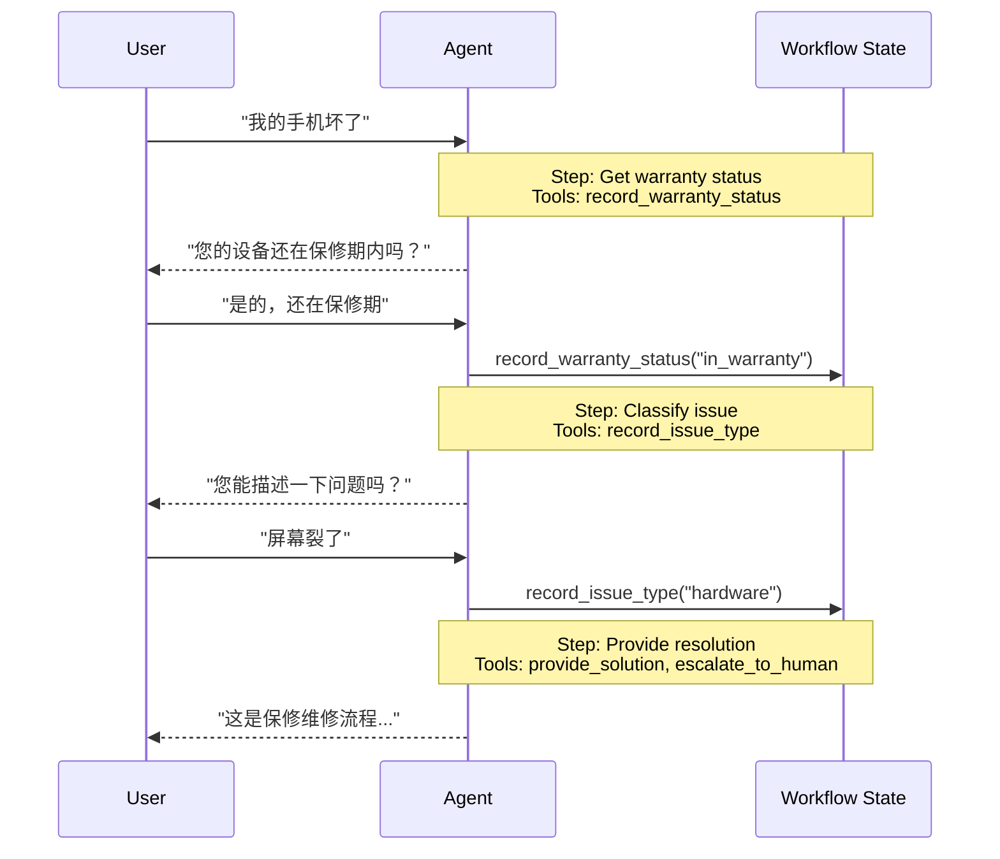

在 **交接** 架构中，行为会根据 state 动态变化。核心机制是：[tools](/oss/langchain/tools) 更新一个跨轮次持久化的 state 变量（例如 `current_step` 或 `active_agent`），系统再读取这个变量来调整行为，要么切换不同配置（系统提示词、工具），要么路由到另一个 [agent](/oss/langchain/agents)。这个模式既支持不同智能体之间的交接，也支持单个智能体内部的动态配置切换。

<Tip>
**handoffs** 这个术语最早由 [OpenAI](https://openai.github.io/openai-agents-python/handoffs/) 提出，指使用工具调用（例如 `transfer_to_sales_agent`）在智能体或状态之间转移控制权。
</Tip>



## 主要特点

* 基于 state 的行为：行为会随着 state 变量变化（例如 `current_step` 或 `active_agent`）
* 基于工具的转移：工具会更新 state 变量，从而切换到新的状态
* 直接与用户交互：每个状态的配置都会直接处理用户消息
* 持久化 state：state 会跨会话轮次保留

## 何时使用

当你需要强制执行顺序约束（只有满足前置条件后才开放某些能力）、智能体需要在不同状态下直接和用户对话，或者你在构建多阶段对话流程时，就使用交接模式。这个模式在客服场景中特别有用，例如需要先收集保修 ID，再处理退款。

## 基础实现

核心机制是一个 [tool](/oss/langchain/tools)，它返回一个用于更新 state 的 [`Command`](/oss/langgraph/graph-api#command)，从而触发切换到新步骤或新智能体：

:::python
```python
from langchain.tools import tool
from langchain.messages import ToolMessage
from langgraph.types import Command

@tool
def transfer_to_specialist(runtime) -> Command:
    """Transfer to the specialist agent."""
    return Command(
        update={
            "messages": [
                ToolMessage(  # [!code highlight]
                    content="Transferred to specialist",
                    tool_call_id=runtime.tool_call_id  # [!code highlight]
                )
            ],
            "current_step": "specialist"  # Triggers behavior change
        }
    )
```
:::
:::js
```typescript
import { tool, ToolMessage, type ToolRuntime } from "langchain";
import { Command } from "@langchain/langgraph";
import { z } from "zod";

const transferToSpecialist = tool(
  async (_, config: ToolRuntime<typeof StateSchema>) => {
    return new Command({
      update: {
        messages: [
          new ToolMessage({  // [!code highlight]
            content: "Transferred to specialist",
            tool_call_id: config.toolCallId  // [!code highlight]
          })
        ],
        currentStep: "specialist"  // Triggers behavior change
      }
    });
  },
  {
    name: "transfer_to_specialist",
    description: "Transfer to the specialist agent.",
    schema: z.object({})
  }
);
```
:::

<Note>
**为什么要包含 `ToolMessage`？** 当 LLM 调用工具时，它预期会收到一个回复。带有匹配 `tool_call_id` 的 `ToolMessage` 可以完成这个请求-响应循环；如果没有它，对话历史就会变得不完整。只要你的交接工具会更新消息，这一点就必须做到。
</Note>

完整实现请看下面教程。

<Card
    title="教程：使用交接构建客服系统"
    icon="users"
    href="/oss/langchain/multi-agent/handoffs-customer-support"
    arrow cta="了解更多"
>
    了解如何使用交接模式构建客服智能体，其中一个智能体会在不同配置之间切换。
</Card>

## 实现方式

实现交接有两种方式：**[单智能体 + middleware](#single-agent-with-middleware)**（一个智能体，动态配置）或者 **[多个智能体子图](#multiple-agent-subgraphs)**（不同智能体作为图节点）。

### 单智能体 + middleware

单个智能体会根据 state 改变行为。middleware 会拦截每次模型调用，并动态调整系统提示词和可用工具。工具通过更新 state 变量来触发状态切换：

:::python
```python
from langchain.tools import ToolRuntime, tool
from langchain.messages import ToolMessage
from langgraph.types import Command

@tool
def record_warranty_status(
    status: str,
    runtime: ToolRuntime[None, SupportState]
) -> Command:
    """Record warranty status and transition to next step."""
    return Command(
        update={
            "messages": [
                ToolMessage(
                    content=f"Warranty status recorded: {status}",
                    tool_call_id=runtime.tool_call_id
                )
            ],
            "warranty_status": status,
            "current_step": "specialist"  # Update state to trigger transition
        }
    )
```
:::
:::js
```typescript
import { tool, ToolMessage, type ToolRuntime } from "langchain";
import { Command } from "@langchain/langgraph";
import { z } from "zod";

const recordWarrantyStatus = tool(
  async ({ status }, config: ToolRuntime<typeof StateSchema>) => {
    return new Command({
      update: {
        messages: [
          new ToolMessage({
            content: `Warranty status recorded: ${status}`,
            tool_call_id: config.toolCallId,
          }),
        ],
        warrantyStatus: status,
        currentStep: "specialist", // Update state to trigger transition
      },
    });
  },
  {
    name: "record_warranty_status",
    description: "Record warranty status and transition to next step.",
    schema: z.object({
      status: z.string(),
    }),
  }
);
```
:::

<Accordion title="完整示例：使用 middleware 的客服系统">

:::python
```python
from langchain.agents import AgentState, create_agent
from langchain.agents.middleware import wrap_model_call, ModelRequest, ModelResponse
from langchain.tools import tool, ToolRuntime
from langchain.messages import ToolMessage
from langgraph.types import Command
from typing import Callable

# 1. 定义带 current_step 跟踪器的 state
class SupportState(AgentState):  # [!code highlight]
    """Track which step is currently active."""
    current_step: str = "triage"  # [!code highlight]
    warranty_status: str | None = None

# 2. 工具通过 Command 更新 current_step
@tool
def record_warranty_status(
    status: str,
    runtime: ToolRuntime[None, SupportState]
) -> Command:  # [!code highlight]
    """Record warranty status and transition to next step."""
    return Command(update={  # [!code highlight]
        "messages": [  # [!code highlight]
            ToolMessage(
                content=f"Warranty status recorded: {status}",
                tool_call_id=runtime.tool_call_id
            )
        ],
        "warranty_status": status,
        # Transition to next step
        "current_step": "specialist"    # [!code highlight]
    })

# 3. middleware 根据 current_step 应用动态配置
@wrap_model_call  # [!code highlight]
def apply_step_config(
    request: ModelRequest,
    handler: Callable[[ModelRequest], ModelResponse]
) -> ModelResponse:
    """Configure agent behavior based on current_step."""
    step = request.state.get("current_step", "triage")  # [!code highlight]

    # 将各步骤映射到对应配置
    configs = {
        "triage": {
            "prompt": "Collect warranty information...",
            "tools": [record_warranty_status]
        },
        "specialist": {
            "prompt": "Provide solutions based on warranty: {warranty_status}",
            "tools": [provide_solution, escalate]
        }
    }

    config = configs[step]
    request = request.override(  # [!code highlight]
        system_prompt=config["prompt"].format(**request.state),  # [!code highlight]
        tools=config["tools"]  # [!code highlight]
    )
    return handler(request)

# 4. 用 middleware 创建智能体
agent = create_agent(
    model,
    tools=[record_warranty_status, provide_solution, escalate],
    state_schema=SupportState,
    middleware=[apply_step_config],  # [!code highlight]
    checkpointer=InMemorySaver()  # Persist state across turns  # [!code highlight]
)
```
:::
:::js
```typescript
import {
  createAgent,
  createMiddleware,
  tool,
  ToolMessage,
  type ToolRuntime,
  type GraphNode,
} from "langchain";
import { Command, StateSchema, MessagesValue } from "@langchain/langgraph";
import { z } from "zod";

const SupportState = new StateSchema({
  messages: MessagesValue,
  currentStep: z.string().default("triage"),
  warrantyStatus: z.string().optional(),
});

const recordWarrantyStatus = tool(
  async ({ status }, config: ToolRuntime<typeof SupportState.State>) => {
    return new Command({
      update: {
        messages: [
          new ToolMessage({
            content: `Warranty status recorded: ${status}`,
            tool_call_id: config.toolCallId,
          }),
        ],
        warrantyStatus: status,
        currentStep: "specialist", // Update state to trigger transition
      },
    });
  },
  {
    name: "record_warranty_status",
    description: "Record warranty status and transition to next step.",
    schema: z.object({ status: z.string() }),
  }
);

const applyStepConfig = createMiddleware({
  name: "applyStepConfig",
  stateSchema: SupportState, // [!code highlight]
  wrapModelCall: async (request, handler) => {
    const step = request.state.currentStep || "triage"; // [!code highlight]

    // Map steps to their configurations
    const configs = {
      triage: {
        prompt: "Collect warranty information...",
        tools: [recordWarrantyStatus],
      },
      specialist: {
        prompt: `Provide solutions based on warranty: ${request.state.warrantyStatus}`,
        tools: [provideSolution, escalate],
      },
    };

    const config = configs[step as keyof typeof configs];
    return handler({
      ...request,
      systemPrompt: config.prompt,
      tools: config.tools,
    });
  },
});

const agent = createAgent({
  model,
  tools: [recordWarrantyStatus, provideSolution, escalate],
  middleware: [applyStepConfig], // [!code highlight]
  checkpointer: new MemorySaver(), // Persist state across turns  // [!code highlight]
});
```
:::

</Accordion>

### 多个智能体子图

多个不同智能体会作为图中的独立节点存在。交接工具使用 `Command.PARENT` 在智能体节点之间导航，并指定下一个要执行的节点。

<Warning>
子图交接需要谨慎的 **[context engineering](/oss/langchain/context-engineering)**。和单智能体 middleware（消息历史自然流动）不同，你必须显式决定哪些消息在智能体之间传递。做错了就会让智能体收到格式错误的历史或过大的上下文。下面的 [Context engineering](#context-engineering) 会详细说明。
</Warning>

:::python
```python
from langchain.messages import AIMessage, ToolMessage
from langchain.tools import tool, ToolRuntime
from langgraph.types import Command

@tool
def transfer_to_sales(
    runtime: ToolRuntime,
) -> Command:
    """Transfer to the sales agent."""
    last_ai_message = next(  # [!code highlight]
        msg for msg in reversed(runtime.state["messages"]) if isinstance(msg, AIMessage)  # [!code highlight]
    )  # [!code highlight]
    transfer_message = ToolMessage(  # [!code highlight]
        content="Transferred to sales agent",  # [!code highlight]
        tool_call_id=runtime.tool_call_id,  # [!code highlight]
    )  # [!code highlight]
    return Command(
        goto="sales_agent",
        update={
            "active_agent": "sales_agent",
            "messages": [last_ai_message, transfer_message],  # [!code highlight]
        },
        graph=Command.PARENT
    )
```
:::
:::js
```typescript
import {
  tool,
  ToolMessage,
  AIMessage,
  type ToolRuntime,
} from "langchain";
import { Command, StateSchema, MessagesValue } from "@langchain/langgraph";

const CustomState = new StateSchema({
  messages: MessagesValue,
});

const transferToSales = tool(
  async (_, runtime: ToolRuntime<typeof CustomState.State>) => {
    const lastAiMessage = runtime.state.messages // [!code highlight]
      .reverse() // [!code highlight]
      .find(AIMessage.isInstance); // [!code highlight]

    const transferMessage = new ToolMessage({ // [!code highlight]
      content: "Transferred to sales agent", // [!code highlight]
      tool_call_id: runtime.toolCallId, // [!code highlight]
    }); // [!code highlight]
    return new Command({
      goto: "sales_agent",
      update: {
        activeAgent: "sales_agent",
        messages: [lastAiMessage, transferMessage].filter(Boolean), // [!code highlight]
      },
      graph: Command.PARENT,
    });
  },
  {
    name: "transfer_to_sales",
    description: "Transfer to the sales agent.",
    schema: z.object({}),
  }
);
```
:::

<Accordion title="完整示例：使用交接的销售与客服系统">

这个例子展示了一个多智能体系统，其中销售智能体和客服智能体是独立的图节点，交接工具允许它们彼此转移对话。

:::python
```python
from typing import Literal

from langchain.agents import AgentState, create_agent
from langchain.messages import AIMessage, ToolMessage
from langchain.tools import tool, ToolRuntime
from langgraph.graph import StateGraph, START, END
from langgraph.types import Command
from typing_extensions import NotRequired


# 1. 定义带 active_agent 跟踪器的 state
class MultiAgentState(AgentState):
    active_agent: NotRequired[str]


# 2. 创建交接工具
@tool
def transfer_to_sales(
    runtime: ToolRuntime,
) -> Command:
    """Transfer to the sales agent."""
    last_ai_message = next(  # [!code highlight]
        msg for msg in reversed(runtime.state["messages"]) if isinstance(msg, AIMessage)  # [!code highlight]
    )  # [!code highlight]
    transfer_message = ToolMessage(  # [!code highlight]
        content="Transferred to sales agent from support agent",  # [!code highlight]
        tool_call_id=runtime.tool_call_id,  # [!code highlight]
    )  # [!code highlight]
    return Command(
        goto="sales_agent",
        update={
            "active_agent": "sales_agent",
            "messages": [last_ai_message, transfer_message],  # [!code highlight]
        },
        graph=Command.PARENT,
    )


@tool
def transfer_to_support(
    runtime: ToolRuntime,
) -> Command:
    """Transfer to the support agent."""
    last_ai_message = next(  # [!code highlight]
        msg for msg in reversed(runtime.state["messages"]) if isinstance(msg, AIMessage)  # [!code highlight]
    )  # [!code highlight]
    transfer_message = ToolMessage(  # [!code highlight]
        content="Transferred to support agent from sales agent",  # [!code highlight]
        tool_call_id=runtime.tool_call_id,  # [!code highlight]
    )  # [!code highlight]
    return Command(
        goto="support_agent",
        update={
            "active_agent": "support_agent",
            "messages": [last_ai_message, transfer_message],  # [!code highlight]
        },
        graph=Command.PARENT,
    )


# 3. 创建带交接工具的智能体
sales_agent = create_agent(
    model="google_genai:gemini-3.5-flash",
    tools=[transfer_to_support],
    system_prompt="You are a sales agent. Help with sales inquiries. If asked about technical issues or support, transfer to the support agent.",
)

support_agent = create_agent(
    model="google_genai:gemini-3.5-flash",
    tools=[transfer_to_sales],
    system_prompt="You are a support agent. Help with technical issues. If asked about pricing or purchasing, transfer to the sales agent.",
)


# 4. 创建调用这些智能体的节点
def call_sales_agent(state: MultiAgentState) -> Command:
    """Node that calls the sales agent."""
    response = sales_agent.invoke(state)
    return response


def call_support_agent(state: MultiAgentState) -> Command:
    """Node that calls the support agent."""
    response = support_agent.invoke(state)
    return response


# 5. 创建路由器，判断是结束还是继续
def route_after_agent(
    state: MultiAgentState,
) -> Literal["sales_agent", "support_agent", "__end__"]:
    """Route based on active_agent, or END if the agent finished without handoff."""
    messages = state.get("messages", [])

    # Check the last message - if it's an AIMessage without tool calls, we're done
    if messages:
        last_msg = messages[-1]
        if isinstance(last_msg, AIMessage) and not last_msg.tool_calls:  # [!code highlight]
            return "__end__"  # [!code highlight]

    # Otherwise route to the active agent
    active = state.get("active_agent", "sales_agent")
    return active if active else "sales_agent"


def route_initial(
    state: MultiAgentState,
) -> Literal["sales_agent", "support_agent"]:
    """Route to the active agent based on state, default to sales agent."""
    return state.get("active_agent") or "sales_agent"


# 6. 构建图
builder = StateGraph(MultiAgentState)
builder.add_node("sales_agent", call_sales_agent)
builder.add_node("support_agent", call_support_agent)

# 根据初始 active_agent 进行条件路由
builder.add_conditional_edges(START, route_initial, ["sales_agent", "support_agent"])

# 每个智能体执行后，检查是否应结束或转到另一个智能体
builder.add_conditional_edges(
    "sales_agent", route_after_agent, ["sales_agent", "support_agent", END]
)
builder.add_conditional_edges(
    "support_agent", route_after_agent, ["sales_agent", "support_agent", END]
)

graph = builder.compile()
result = graph.invoke(
    {
        "messages": [
            {
                "role": "user",
                "content": "Hi, I'm having trouble with my account login. Can you help?",
            }
        ]
    }
)

for msg in result["messages"]:
    msg.pretty_print()
```
:::
:::js
```typescript
import {
  StateGraph,
  START,
  END,
  StateSchema,
  MessagesValue,
  Command,
  ConditionalEdgeRouter,
  GraphNode,
} from "@langchain/langgraph";
import { createAgent, AIMessage, ToolMessage } from "langchain";
import { tool, ToolRuntime } from "@langchain/core/tools";
import { z } from "zod/v4";

// 1. 定义带 active_agent 跟踪器的 state
const MultiAgentState = new StateSchema({
  messages: MessagesValue,
  activeAgent: z.string().optional(),
});

// 2. 创建交接工具
const transferToSales = tool(
  async (_, runtime: ToolRuntime<typeof MultiAgentState.State>) => {
    const lastAiMessage = [...runtime.state.messages] // [!code highlight]
      .reverse() // [!code highlight]
      .find(AIMessage.isInstance); // [!code highlight]
    const transferMessage = new ToolMessage({ // [!code highlight]
      content: "Transferred to sales agent from support agent", // [!code highlight]
      tool_call_id: runtime.toolCallId, // [!code highlight]
    }); // [!code highlight]
    return new Command({
      goto: "sales_agent",
      update: {
        activeAgent: "sales_agent",
        messages: [lastAiMessage, transferMessage].filter(Boolean), // [!code highlight]
      },
      graph: Command.PARENT,
    });
  },
  {
    name: "transfer_to_sales",
    description: "Transfer to the sales agent.",
    schema: z.object({}),
  }
);

const transferToSupport = tool(
  async (_, runtime: ToolRuntime<typeof MultiAgentState.State>) => {
    const lastAiMessage = [...runtime.state.messages] // [!code highlight]
      .reverse() // [!code highlight]
      .find(AIMessage.isInstance); // [!code highlight]
    const transferMessage = new ToolMessage({ // [!code highlight]
      content: "Transferred to support agent from sales agent", // [!code highlight]
      tool_call_id: runtime.toolCallId, // [!code highlight]
    }); // [!code highlight]
    return new Command({
      goto: "support_agent",
      update: {
        activeAgent: "support_agent",
        messages: [lastAiMessage, transferMessage].filter(Boolean), // [!code highlight]
      },
      graph: Command.PARENT,
    });
  },
  {
    name: "transfer_to_support",
    description: "Transfer to the support agent.",
    schema: z.object({}),
  }
);

// 3. 创建带交接工具的智能体
const salesAgent = createAgent({
  model: "google_genai:gemini-3.5-flash",
  tools: [transferToSupport],
  systemPrompt:
    "You are a sales agent. Help with sales inquiries. If asked about technical issues or support, transfer to the support agent.",
});

const supportAgent = createAgent({
  model: "google_genai:gemini-3.5-flash",
  tools: [transferToSales],
  systemPrompt:
    "You are a support agent. Help with technical issues. If asked about pricing or purchasing, transfer to the sales agent.",
});

// 4. 创建调用这些智能体的节点
const callSalesAgent: GraphNode<typeof MultiAgentState.State> = async (state) => {
  const response = await salesAgent.invoke(state);
  return response;
};

const callSupportAgent: GraphNode<typeof MultiAgentState.State> = async (state) => {
  const response = await supportAgent.invoke(state);
  return response;
};

// 5. 创建路由器，判断是结束还是继续
const routeAfterAgent: ConditionalEdgeRouter<{ InputSchema: typeof MultiAgentState.State; Nodes: "sales_agent" | "support_agent" }> = (state) => {
  const messages = state.messages ?? [];

  // Check the last message - if it's an AIMessage without tool calls, we're done
  if (messages.length > 0) {
    const lastMsg = messages[messages.length - 1];
    if (lastMsg instanceof AIMessage && !lastMsg.tool_calls?.length) { // [!code highlight]
      return END; // [!code highlight]
    } // [!code highlight]
  }

  // Otherwise route to the active agent
  const active = state.activeAgent ?? "sales_agent";
  return active as "sales_agent" | "support_agent";
};

const routeInitial: ConditionalEdgeRouter<{ InputSchema: typeof MultiAgentState.State; Nodes: "sales_agent" | "support_agent" }> = (state) => {
  // Route to the active agent based on state, default to sales agent
  return (state.activeAgent ?? "sales_agent") as
    | "sales_agent"
    | "support_agent";
};

// 6. 构建图
const builder = new StateGraph(MultiAgentState)
  .addNode("sales_agent", callSalesAgent)
  .addNode("support_agent", callSupportAgent)
  // 根据初始 activeAgent 进行条件路由
  .addConditionalEdges(START, routeInitial, [
    "sales_agent",
    "support_agent",
  ])
  // 每个智能体执行后，检查是否应结束或转到另一个智能体
  .addConditionalEdges("sales_agent", routeAfterAgent, [
    "sales_agent",
    "support_agent",
    END,
  ])
  .addConditionalEdges("support_agent", routeAfterAgent, [
    "sales_agent",
    "support_agent",
    END,
  ]);

const graph = builder.compile();
const result = await graph.invoke({
  messages: [
    {
      role: "user",
      content: "Hi, I'm having trouble with my account login. Can you help?",
    },
  ],
});

for (const msg of result.messages) {
  console.log(msg.content);
}
```
:::

</Accordion>

<Tip>
大多数交接场景都应该优先使用 **单智能体 + middleware**，因为它更简单。只有在你需要定制化很强的智能体实现时，才使用 **多个智能体子图**（例如某个节点本身就是一个复杂图，包含反思或检索步骤）。
</Tip>

#### Context engineering

在子图交接里，你可以精确控制哪些消息在智能体之间流动。这种精度对保持有效的对话历史、避免上下文膨胀非常关键。更多内容见 [context engineering](/oss/langchain/context-engineering)。

**处理交接时的上下文**

在智能体之间交接时，你需要保证对话历史仍然有效。LLM 期望工具调用和工具响应成对出现，所以当你使用 `Command.PARENT` 交接到另一个智能体时，必须同时包含：

1. **包含工具调用的 `AIMessage`**（触发交接的那条消息）
2. **表示交接完成的 `ToolMessage`**（对这次工具调用的人工响应）

如果没有这对消息，接收方智能体会看到不完整的对话，并可能报错或产生意外行为。

下面的例子假设只调用了交接工具，没有并行工具调用：

:::python
```python
@tool
def transfer_to_sales(runtime: ToolRuntime) -> Command:
    # 获取触发这次交接的 AIMessage
    last_ai_message = runtime.state["messages"][-1]

    # 创建一个人工的工具响应，完成配对
    transfer_message = ToolMessage(
        content="Transferred to sales agent",
        tool_call_id=runtime.tool_call_id,
    )

    return Command(
        goto="sales_agent",
        update={
            "active_agent": "sales_agent",
            # 只传这两条消息，不传完整子智能体历史
            "messages": [last_ai_message, transfer_message],
        },
        graph=Command.PARENT,
    )
```
:::

:::js
```typescript
const transferToSales = tool(
  async (_, runtime: ToolRuntime<typeof MultiAgentState.State>) => {
    // 获取触发这次交接的 AIMessage
    const lastAiMessage = runtime.state.messages.at(-1);

    // 创建一个人工的工具响应，完成配对
    const transferMessage = new ToolMessage({
      content: "Transferred to sales agent",
      tool_call_id: runtime.toolCallId,
    });

    return new Command({
      goto: "sales_agent",
      update: {
        activeAgent: "sales_agent",
        // 只传这两条消息，不传完整子智能体历史
        messages: [lastAiMessage, transferMessage],
      },
      graph: Command.PARENT,
    });
  },
  {
    name: "transfer_to_sales",
    description: "Transfer to the sales agent.",
    schema: z.object({}),
  }
);
```
:::

<Note>
**为什么不传入所有子智能体消息？** 虽然你可以把完整子智能体对话都放进交接里，但这经常会带来问题。接收方智能体可能会被无关的内部推理搞糊涂，而且 token 成本也会不必要地增加。只传递这对交接消息，可以让父图的上下文保持聚焦在高层编排上。如果接收方需要更多上下文，考虑把子智能体工作总结成 `ToolMessage` 内容，而不是传递原始消息历史。
</Note>

**把控制权交回给用户**

当把控制权交回给用户（结束智能体回合）时，确保最后一条消息是 `AIMessage`。这样既能保持有效的对话历史，也能向用户界面表明智能体已经完成工作。

## 实现注意事项

在设计多智能体系统时，请考虑：

* **上下文过滤策略**：每个智能体是接收完整对话历史、筛选后的片段，还是摘要？不同智能体可能根据角色需要不同的上下文。
* **工具语义**：明确交接工具只是更新路由 state，还是还会产生副作用。例如，`transfer_to_sales()` 是否还应该创建 support ticket，还是应该把这件事拆成单独动作？
* **token 效率**：在上下文完整性和 token 成本之间找到平衡。随着对话变长，摘要和选择性上下文传递会越来越重要。
