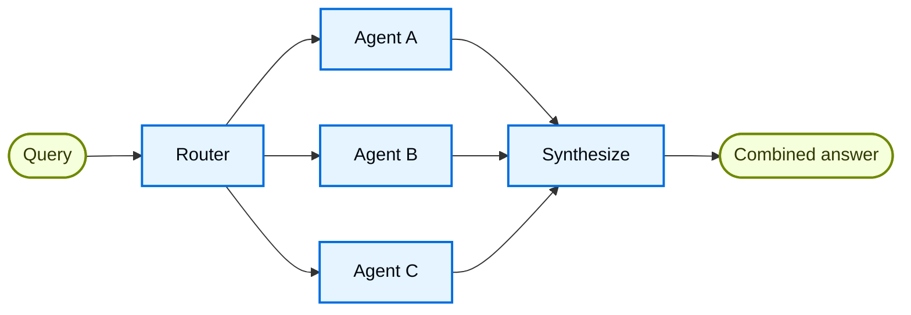

在 **router** 架构中，路由步骤会对输入进行分类，并把它导向专门的 [agents](/oss/langchain/agents)。当你有彼此独立的 **verticals**（分别需要自己的智能体的知识领域）时，这种模式就很有用。



## 关键特征

* Router 会拆解查询
* 会并行调用零个或多个专门智能体
* 结果会合成为一个连贯的回复

## 何时使用

当你有彼此独立的 verticals（分别需要自己的智能体的知识领域）、需要并行查询多个来源，并且想把结果合成为一个组合回复时，就使用 router 模式。

## 基本实现

Router 会对查询分类，并把它导向合适的智能体。单智能体路由使用 [`Command`](/oss/langgraph/graph-api#command)，并行 fan-out 到多个智能体使用 [`Send`](/oss/langgraph/graph-api#send)。

<Tabs>
<Tab title="单个智能体">

使用 `Command` 路由到单个专门智能体：

:::python
```python
from langgraph.types import Command

def classify_query(query: str) -> str:
    """使用 LLM 对查询分类，并确定合适的智能体。"""
    # 分类逻辑写在这里
    ...

def route_query(state: State) -> Command:
    """根据查询分类把请求路由到合适的智能体。"""
    active_agent = classify_query(state["query"])

    # 路由到选中的智能体
    return Command(goto=active_agent)
```
:::
:::js
```typescript
import { z } from "zod";
import { Command } from "@langchain/langgraph";

const ClassificationResult = z.object({
  query: z.string(),
  agent: z.string(),
});

function classifyQuery(query: string): z.infer<typeof ClassificationResult> {
  // 使用 LLM 对查询分类，并确定合适的智能体
  // 分类逻辑写在这里
  ...
}

function routeQuery(state: z.infer<typeof ClassificationResult>) {
  const classification = classifyQuery(state.query);

  // 路由到选中的智能体
  return new Command({ goto: classification.agent });
}
```
:::

</Tab>
<Tab title="多个智能体（并行）">

使用 `Send` 并行 fan-out 到多个专门智能体：

:::python
```python
from typing import TypedDict
from langgraph.types import Send

class ClassificationResult(TypedDict):
    query: str
    agent: str

def classify_query(query: str) -> list[ClassificationResult]:
    """使用 LLM 对查询分类，并确定要调用哪些智能体。"""
    # 分类逻辑写在这里
    ...

def route_query(state: State):
    """根据查询分类把请求路由到相关智能体。"""
    classifications = classify_query(state["query"])

    # 并行 fan-out 到选中的智能体
    return [
        Send(c["agent"], {"query": c["query"]})
        for c in classifications
    ]
```
:::
:::js
```typescript
import { z } from "zod";
import { Command } from "@langchain/langgraph";

const ClassificationResult = z.object({
  query: z.string(),
  agent: z.string(),
});

function classifyQuery(query: string): z.infer<typeof ClassificationResult>[] {
  // 使用 LLM 对查询分类，并确定要调用哪些智能体
  // 分类逻辑写在这里
  ...
}

function routeQuery(state: typeof State.State) {
  const classifications = classifyQuery(state.query);

  // 并行 fan-out 到选中的智能体
  return classifications.map(
    (c) => new Send(c.agent, { query: c.query })
  );
}
```
:::

</Tab>
</Tabs>

完整实现请看下面的教程。

<Card title="教程：用路由构建多来源知识库" icon="book" href="/oss/langchain/multi-agent/router-knowledge-base">
构建一个并行查询 GitHub、Notion 和 Slack 的 router，然后把结果合成为连贯回答。内容包括状态定义、专门智能体、使用 `Send` 的并行执行，以及结果合成。
</Card>

## 无状态 vs 有状态

两种方法：
* [**无状态 router**](#stateless) 独立处理每个请求
* [**有状态 router**](#stateful) 在请求之间保留对话历史

## 无状态

每个请求都独立路由，没有调用间记忆。对于多轮对话，请看 [有状态 router](#stateful)。

<Tip>
**Router vs. Subagents**：这两种模式都可以把工作分配给多个智能体，但它们在路由决策方式上不同：

- **Router**：由专门的路由步骤（通常是一段单独的 LLM 调用或基于规则的逻辑）对输入分类并分发到智能体。Router 本身通常不保留对话历史，也不负责多轮编排，它更像一个预处理步骤。
- **Subagents**：主监督智能体会在持续对话中动态决定下一步要调用哪个 [subagents](/oss/langchain/multi-agent/subagents)。主智能体会保留上下文，能在多轮里调用多个子智能体，并编排复杂的多步骤工作流。

当你有清晰的输入分类、想要确定性或轻量级分类时，用 **router**。当你需要灵活、感知对话上下文的编排，并且希望 LLM 基于不断变化的上下文决定下一步做什么时，用 **supervisor**。
</Tip>

## 有状态

对于多轮对话，你需要在多次调用之间保留上下文。

### 工具封装

最简单的方法：把无状态 router 包装成一个工具，让会话型智能体来调用。会话型智能体负责记忆和上下文；router 保持无状态。这样就避免了在多个并行智能体之间管理对话历史的复杂性。

:::python
```python
@tool
def search_docs(query: str) -> str:
    """搜索多个文档来源。"""
    result = workflow.invoke({"query": query})  # [!code highlight]
    return result["final_answer"]

# 会话型智能体把 router 当作工具使用
conversational_agent = create_agent(
    model,
    tools=[search_docs],
    prompt="You are a helpful assistant. Use search_docs to answer questions."
)
```
:::
:::js
```typescript
const searchDocs = tool(
  async ({ query }) => {
    const result = await workflow.invoke({ query }); // [!code highlight]
    return result.finalAnswer;
  },
  {
    name: "search_docs",
    description: "Search across multiple documentation sources",
    schema: z.object({
      query: z.string().describe("The search query"),
    }),
  }
);

// 会话型智能体把 router 当作工具使用
const conversationalAgent = createAgent({
  model,
  tools: [searchDocs],
  systemPrompt: "You are a helpful assistant. Use search_docs to answer questions.",
});
```
:::

### 完整持久化

如果你需要 router 自己保留状态，请使用 [persistence](/oss/langchain/short-term-memory) 来存储消息历史。路由到某个智能体时，从 state 中取出之前的消息，并有选择地把它们包含进该智能体的上下文中——这就是 [context engineering](/oss/langchain/context-engineering) 的一个手段。

<Warning>
**有状态 router 需要自定义历史管理。** 如果 router 在多轮之间切换智能体，当不同智能体的语气或提示词不同，用户可能会觉得对话不够自然。并行调用时，你需要在 router 层面维护历史（输入和合成输出），并在路由逻辑中利用这些历史。可以考虑 [handoffs pattern](/oss/langchain/multi-agent/handoffs) 或 [subagents pattern](/oss/langchain/multi-agent/subagents)——它们对多轮对话的语义更清晰。
</Warning>
