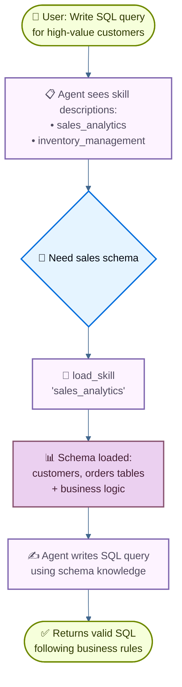

import ChatModelTabsPy from '/snippets/chat-model-tabs.mdx';
import ChatModelTabsJs from '/snippets/chat-model-tabs-js.mdx';

本教程展示如何使用 **progressive disclosure**，这是一种上下文管理技术：agent 按需加载信息，而不是一开始就全部加载，从而实现 **skills**（基于 prompt 的专门指令）。agent 通过 tool call 加载 skills，而不是动态修改 system prompt；它会为每个任务只发现并加载所需的 skill。

**使用场景：** 设想你要构建一个帮助在大型企业里编写 SQL 查询的 agent。你的组织可能为不同业务垂直方向维护独立的数据仓库，或者只有一个包含成千上万张表的单体数据库。无论哪种情况，一开始加载所有 schema 都会撑爆上下文窗口。progressive disclosure 通过只在需要时加载相关 schema 来解决这个问题。这个架构也让不同的产品负责人和业务方能独立贡献和维护各自垂直领域的 skill。

**你将构建什么：** 一个带有两个 skill（sales analytics 和 inventory management）的 SQL query assistant。agent 会先在 system prompt 里看到轻量的 skill 描述，然后只在用户查询相关时，通过 tool call 加载完整的数据库 schema 和业务逻辑。

<Note>
关于包含查询执行、错误修正和校验的完整 SQL agent 示例，请参见 [SQL Agent tutorial](/oss/langchain/sql-agent)。本教程聚焦 progressive disclosure 模式，这种模式可以应用到任意领域。
</Note>

<Tip>
progressive disclosure 这个概念最早由 Anthropic 推广，用于构建可扩展的 agent skills system。这个方法采用三层架构（metadata → core content → detailed resources），让 agent 只在需要时加载信息。关于这个技术的更多内容，请参见 [Equipping agents for the real world with Agent Skills](https://www.anthropic.com/engineering/equipping-agents-for-the-real-world-with-agent-skills)。
</Tip>

## 它是如何工作的

当用户请求一个 SQL 查询时，流程如下：



**为什么要用 progressive disclosure：**
- **减少上下文占用** - 任务只加载需要的 2 到 3 个 skill，而不是把全部 skill 都放进去
- **支持团队自治** - 不同团队可以独立开发专门的 skill，类似其他 multi-agent 架构
- **可扩展性强** - 即使有几十个或几百个 skill，也不会撑爆上下文
- **简化对话历史** - 只需要一个 agent 和一条对话线程

**什么是 skill：** Claude Code 推广的 skill 主要是基于 prompt 的：它们是针对特定业务任务的自包含专门指令单元。在 Claude Code 里，skill 以文件系统里的目录形式暴露，通过文件操作被发现。skill 用 prompt 来指导行为，也可以提供工具使用说明，或者包含供 coding agent 执行的示例代码。

<Tip>
带 progressive disclosure 的 skill 可以看作 [RAG (Retrieval-Augmented Generation)](/oss/deepagents/rag) 的一种形式，其中每个 skill 都是一个 retrieval unit，不过它不一定依赖 embeddings 或 keyword search，而是通过用于浏览内容的工具（比如文件操作，或者本教程里的直接查询）。
</Tip>

**权衡：**
- **延迟**：按需加载 skill 需要额外的 tool call，因此第一次需要某个 skill 的请求会更慢
- **工作流控制**：基础实现通常依赖 prompt 来引导 skill 使用，你无法在不加自定义逻辑的情况下强制“总是先试 A 再试 B”这样的硬约束

<Tip>
**实现你自己的 skills system**

当你自己构建 skills 实现时（就像本教程中这样），核心概念是 progressive disclosure，也就是按需加载信息。除此之外，具体实现方式完全由你决定：

- **存储**：数据库、S3、内存数据结构，或任何后端
- **发现**：直接查询（本教程）、大规模 skill 集合用 RAG、文件系统扫描，或 API 调用
- **加载逻辑**：自定义延迟特性，并添加搜索 skill 内容或排序相关性的逻辑
- **副作用**：定义 skill 被加载时会发生什么，比如暴露与该 skill 相关的工具（第 8 节会讲到）

这种灵活性让你可以围绕性能、存储和工作流控制做针对性优化。
</Tip>

## 设置

### 安装

本教程需要 `langchain` 包：

:::python
<CodeGroup>
```bash pip
pip install langchain
```
```bash uv
uv add langchain
```
```bash conda
conda install langchain -c conda-forge
```
</CodeGroup>
:::

:::js
<CodeGroup>
```bash npm
npm install langchain
```
```bash yarn
yarn add langchain
```
```bash pnpm
pnpm add langchain
```
</CodeGroup>
:::

更多细节请参见 [Installation guide](/oss/langchain/install)。

### LangSmith

先配置 [LangSmith](https://smith.langchain.com)，用来检查 agent 内部发生了什么。然后设置以下环境变量：

:::python
<CodeGroup>
```bash bash
export LANGSMITH_TRACING="true"
export LANGSMITH_API_KEY="..."
```
```python python
import getpass
import os

os.environ["LANGSMITH_TRACING"] = "true"
os.environ["LANGSMITH_API_KEY"] = getpass.getpass()
```
</CodeGroup>
:::

:::js
<CodeGroup>
```bash bash
export LANGSMITH_TRACING="true"
export LANGSMITH_API_KEY="..."
```
```typescript typescript
process.env.LANGSMITH_TRACING = "true";
process.env.LANGSMITH_API_KEY = "...";
```
</CodeGroup>
:::

### 选择 LLM

从 LangChain 的集成套件里选择一个 chat model：

:::python
<ChatModelTabsPy />
:::

:::js
<ChatModelTabsJs />
:::

## 1. 定义 skills

先定义 skills 的结构。每个 skill 都有名称、简短描述（显示在 system prompt 里）和完整内容（按需加载）：

:::python
```python
from typing import TypedDict

class Skill(TypedDict):  # [!code highlight]
    """A skill that can be progressively disclosed to the agent."""
    name: str  # Unique identifier for the skill
    description: str  # 1-2 sentence description to show in system prompt
    content: str  # Full skill content with detailed instructions
```
:::

:::js
```typescript
import { z } from "zod";

// A skill that can be progressively disclosed to the agent
const SkillSchema = z.object({  // [!code highlight]
  name: z.string(),  // Unique identifier for the skill
  description: z.string(),  // 1-2 sentence description to show in system prompt
  content: z.string(),  // Full skill content with detailed instructions
});

type Skill = z.infer<typeof SkillSchema>;
```
:::

现在为 SQL query assistant 定义示例 skill。这些 skill 的设计思路是：**描述轻量**（提前展示给 agent）但 **内容详尽**（只在需要时加载）：

<Accordion title="查看完整 skill 定义">

:::python
```python
SKILLS: list[Skill] = [
    {
        "name": "sales_analytics",
        "description": "Database schema and business logic for sales data analysis including customers, orders, and revenue.",
        "content": """# Sales Analytics Schema

## Tables

### customers
- customer_id (PRIMARY KEY)
- name
- email
- signup_date
- status (active/inactive)
- customer_tier (bronze/silver/gold/platinum)

### orders
- order_id (PRIMARY KEY)
- customer_id (FOREIGN KEY -> customers)
- order_date
- status (pending/completed/cancelled/refunded)
- total_amount
- sales_region (north/south/east/west)

### order_items
- item_id (PRIMARY KEY)
- order_id (FOREIGN KEY -> orders)
- product_id
- quantity
- unit_price
- discount_percent

## Business Logic

**Active customers**: status = 'active' AND signup_date <= CURRENT_DATE - INTERVAL '90 days'

**Revenue calculation**: Only count orders with status = 'completed'. Use total_amount from orders table, which already accounts for discounts.

**Customer lifetime value (CLV)**: Sum of all completed order amounts for a customer.

**High-value orders**: Orders with total_amount > 1000

## Example Query

-- Get top 10 customers by revenue in the last quarter
SELECT
    c.customer_id,
    c.name,
    c.customer_tier,
    SUM(o.total_amount) as total_revenue
FROM customers c
JOIN orders o ON c.customer_id = o.customer_id
WHERE o.status = 'completed'
  AND o.order_date >= CURRENT_DATE - INTERVAL '3 months'
GROUP BY c.customer_id, c.name, c.customer_tier
ORDER BY total_revenue DESC
LIMIT 10;
""",
    },
    {
        "name": "inventory_management",
        "description": "Database schema and business logic for inventory tracking including products, warehouses, and stock levels.",
        "content": """# Inventory Management Schema

## Tables

### products
- product_id (PRIMARY KEY)
- product_name
- sku
- category
- unit_cost
- reorder_point (minimum stock level before reordering)
- discontinued (boolean)

### warehouses
- warehouse_id (PRIMARY KEY)
- warehouse_name
- location
- capacity

### inventory
- inventory_id (PRIMARY KEY)
- product_id (FOREIGN KEY -> products)
- warehouse_id (FOREIGN KEY -> warehouses)
- quantity_on_hand
- last_updated

### stock_movements
- movement_id (PRIMARY KEY)
- product_id (FOREIGN KEY -> products)
- warehouse_id (FOREIGN KEY -> warehouses)
- movement_type (inbound/outbound/transfer/adjustment)
- quantity (positive for inbound, negative for outbound)
- movement_date
- reference_number

## Business Logic

**Available stock**: quantity_on_hand from inventory table where quantity_on_hand > 0

**Products needing reorder**: Products where total quantity_on_hand across all warehouses is less than or equal to the product's reorder_point

**Active products only**: Exclude products where discontinued = true unless specifically analyzing discontinued items

**Stock valuation**: quantity_on_hand * unit_cost for each product

## Example Query

-- Find products below reorder point across all warehouses
SELECT
    p.product_id,
    p.product_name,
    p.reorder_point,
    SUM(i.quantity_on_hand) as total_stock,
    p.unit_cost,
    (p.reorder_point - SUM(i.quantity_on_hand)) as units_to_reorder
FROM products p
JOIN inventory i ON p.product_id = i.product_id
WHERE p.discontinued = false
GROUP BY p.product_id, p.product_name, p.reorder_point, p.unit_cost
HAVING SUM(i.quantity_on_hand) <= p.reorder_point
ORDER BY units_to_reorder DESC;
""",
    },
]
```
:::

:::js
```typescript
import { context } from "langchain";

const SKILLS: Skill[] = [
  {
    name: "sales_analytics",
    description:
      "Database schema and business logic for sales data analysis including customers, orders, and revenue.",
    content: context`
    # Sales Analytics Schema

    ## Tables

    ### customers
    - customer_id (PRIMARY KEY)
    - name
    - email
    - signup_date
    - status (active/inactive)
    - customer_tier (bronze/silver/gold/platinum)

    ### orders
    - order_id (PRIMARY KEY)
    - customer_id (FOREIGN KEY -> customers)
    - order_date
    - status (pending/completed/cancelled/refunded)
    - total_amount
    - sales_region (north/south/east/west)

    ### order_items
    - item_id (PRIMARY KEY)
    - order_id (FOREIGN KEY -> orders)
    - product_id
    - quantity
    - unit_price
    - discount_percent

    ## Business Logic

    **Active customers**:
    status = 'active' AND signup_date <= CURRENT_DATE - INTERVAL '90 days'

    **Revenue calculation**:
    Only count orders with status = 'completed'.
    Use total_amount from orders table, which already accounts for discounts.

    **Customer lifetime value (CLV)**:
    Sum of all completed order amounts for a customer.

    **High-value orders**:
    Orders with total_amount > 1000

    ## Example Query

    -- Get top 10 customers by revenue in the last quarter
    SELECT
        c.customer_id,
        c.name,
        c.customer_tier,
        SUM(o.total_amount) as total_revenue
    FROM customers c
    JOIN orders o ON c.customer_id = o.customer_id
    WHERE o.status = 'completed'
    AND o.order_date >= CURRENT_DATE - INTERVAL '3 months'
    GROUP BY c.customer_id, c.name, c.customer_tier
    ORDER BY total_revenue DESC
    LIMIT 10;`,
  },
  {
    name: "inventory_management",
    description:
      "Database schema and business logic for inventory tracking including products, warehouses, and stock levels.",
    content: context`
    # Inventory Management Schema

    ## Tables

    ### products
    - product_id (PRIMARY KEY)
    - product_name
    - sku
    - category
    - unit_cost
    - reorder_point (minimum stock level before reordering)
    - discontinued (boolean)

    ### warehouses
    - warehouse_id (PRIMARY KEY)
    - warehouse_name
    - location
    - capacity

    ### inventory
    - inventory_id (PRIMARY KEY)
    - product_id (FOREIGN KEY -> products)
    - warehouse_id (FOREIGN KEY -> warehouses)
    - quantity_on_hand
    - last_updated

    ### stock_movements
    - movement_id (PRIMARY KEY)
    - product_id (FOREIGN KEY -> products)
    - warehouse_id (FOREIGN KEY -> warehouses)
    - movement_type (inbound/outbound/transfer/adjustment)
    - quantity (positive for inbound, negative for outbound)
    - movement_date
    - reference_number

    ## Business Logic

    **Available stock**:
    quantity_on_hand from inventory table where quantity_on_hand > 0

    **Products needing reorder**:
    Products where total quantity_on_hand across all warehouses is less
    than or equal to the product's reorder_point

    **Active products only**:
    Exclude products where discontinued = true unless specifically analyzing discontinued items

    **Stock valuation**:
    quantity_on_hand * unit_cost for each product

    ## Example Query

    -- Find products below reorder point across all warehouses
    SELECT
        p.product_id,
        p.product_name,
        p.reorder_point,
        SUM(i.quantity_on_hand) as total_stock,
        p.unit_cost,
        (p.reorder_point - SUM(i.quantity_on_hand)) as units_to_reorder
    FROM products p
    JOIN inventory i ON p.product_id = i.product_id
    WHERE p.discontinued = false
    GROUP BY p.product_id, p.product_name, p.reorder_point, p.unit_cost
    HAVING SUM(i.quantity_on_hand) <= p.reorder_point
    ORDER BY units_to_reorder DESC;`,
  },
];
```
:::

## 2. 创建技能加载工具

创建一个 tool，用于按需加载完整 skill 内容：

:::python
```python
from langchain.tools import tool

@tool  # [!code highlight]
def load_skill(skill_name: str) -> str:
    """Load the full content of a skill into the agent's context.

    Use this when you need detailed information about how to handle a specific
    type of request. This will provide you with comprehensive instructions,
    policies, and guidelines for the skill area.

    Args:
        skill_name: The name of the skill to load (e.g., "expense_reporting", "travel_booking")
    """
    # Find and return the requested skill
    for skill in SKILLS:
        if skill["name"] == skill_name:
            return f"Loaded skill: {skill_name}\n\n{skill['content']}"  # [!code highlight]

    # Skill not found
    available = ", ".join(s["name"] for s in SKILLS)
    return f"Skill '{skill_name}' not found. Available skills: {available}"
```
:::

:::js
```typescript
import { tool } from "langchain";
import { z } from "zod";

const loadSkill = tool(  // [!code highlight]
  async ({ skillName }) => {
    // Find and return the requested skill
    const skill = SKILLS.find((s) => s.name === skillName);
    if (skill) {
      return `Loaded skill: ${skillName}\n\n${skill.content}`;  // [!code highlight]
    }

    // Skill not found
    const available = SKILLS.map((s) => s.name).join(", ");
    return `Skill '${skillName}' not found. Available skills: ${available}`;
  },
  {
    name: "load_skill",
    description: `Load the full content of a skill into the agent's context.

Use this when you need detailed information about how to handle a specific
type of request. This will provide you with comprehensive instructions,
policies, and guidelines for the skill area.`,
    schema: z.object({
      skillName: z.string().describe("The name of the skill to load"),
    }),
  }
);
```
:::

`load_skill` tool 会把完整 skill 内容作为字符串返回，然后作为 ToolMessage 加入对话。关于如何创建和使用工具，请参见 [Tools guide](/oss/langchain/tools)。

## 3. 构建 skill middleware

创建一个自定义 middleware，把 skill 描述注入 system prompt。这样 agent 可以知道有哪些 skill，但不会一开始就加载完整内容。

<Note>
本指南演示的是自定义 middleware 的写法。有关 middleware 概念和模式的完整说明，请参见 [custom middleware documentation](/oss/langchain/middleware/custom)。
</Note>

:::python
```python
from langchain.agents.middleware import ModelRequest, ModelResponse, AgentMiddleware
from langchain.messages import SystemMessage
from typing import Callable

class SkillMiddleware(AgentMiddleware):  # [!code highlight]
    """Middleware that injects skill descriptions into the system prompt."""

    # Register the load_skill tool as a class variable
    tools = [load_skill]  # [!code highlight]

    def __init__(self):
        """Initialize and generate the skills prompt from SKILLS."""
        # Build skills prompt from the SKILLS list
        skills_list = []
        for skill in SKILLS:
            skills_list.append(
                f"- **{skill['name']}**: {skill['description']}"
            )
        self.skills_prompt = "\n".join(skills_list)

    def wrap_model_call(
        self,
        request: ModelRequest,
        handler: Callable[[ModelRequest], ModelResponse],
    ) -> ModelResponse:
        """Sync: Inject skill descriptions into system prompt."""
        # Build the skills addendum
        skills_addendum = ( # [!code highlight]
            f"\n\n## Available Skills\n\n{self.skills_prompt}\n\n" # [!code highlight]
            "Use the load_skill tool when you need detailed information " # [!code highlight]
            "about handling a specific type of request." # [!code highlight]
        )

        # Append to system message content blocks
        new_content = list(request.system_message.content_blocks) + [
            {"type": "text", "text": skills_addendum}
        ]
        new_system_message = SystemMessage(content=new_content)
        modified_request = request.override(system_message=new_system_message)
        return handler(modified_request)
```
:::

:::js
```typescript
import { createMiddleware } from "langchain";

// Build skills prompt from the SKILLS list
const skillsPrompt = SKILLS.map(
  (skill) => `- **${skill.name}**: ${skill.description}`
).join("\n");

const skillMiddleware = createMiddleware({  // [!code highlight]
  name: "skillMiddleware",
  tools: [loadSkill],  // [!code highlight]
  wrapModelCall: async (request, handler) => {
    // Build the skills addendum
    const skillsAddendum =  // [!code highlight]
      `\n\n## Available Skills\n\n${skillsPrompt}\n\n` +  // [!code highlight]
      "Use the load_skill tool when you need detailed information " +  // [!code highlight]
      "about handling a specific type of request.";  // [!code highlight]

    // Append to system prompt
    const newSystemPrompt = request.systemPrompt + skillsAddendum;

    return handler({
      ...request,
      systemPrompt: newSystemPrompt,
    });
  },
});
```
:::

这个 middleware 会把 skill 描述附加到 system prompt，让 agent 在不加载完整内容的情况下知道有哪些 skill。`load_skill` tool 以 class variable 的形式注册，因此 agent 可以直接调用。

<Note>
**生产环境注意事项**：为了简单起见，这个教程会在 `__init__` 中加载 skill 列表。生产系统里，你可能更希望在 `before_agent` hook 中加载，这样可以定期刷新 skill 列表，反映新增或修改后的内容。更多信息请参见 [before_agent hook documentation](/oss/langchain/middleware/custom#node-style-hooks)。
</Note>

## 4. 创建支持 skill 的 agent

现在创建带有 skill middleware 和 checkpointer 的 agent：

:::python
```python
from langchain.agents import create_agent
from langgraph.checkpoint.memory import InMemorySaver

# Create the agent with skill support
agent = create_agent(
    model,
    system_prompt=(
        "You are a SQL query assistant that helps users "
        "write queries against business databases."
    ),
    middleware=[SkillMiddleware()],  # [!code highlight]
    checkpointer=InMemorySaver(),
)
```
:::

:::js
```typescript
import { createAgent } from "langchain";
import { MemorySaver } from "@langchain/langgraph";

// Create the agent with skill support
const agent = createAgent({
  model,
  systemPrompt:
    "You are a SQL query assistant that helps users " +
    "write queries against business databases.",
  middleware: [skillMiddleware],  // [!code highlight]
  checkpointer: new MemorySaver(),
});
```
:::

agent 现在可以在 system prompt 中看到 skill 描述，并且可以在需要时调用 `load_skill` 获取完整内容。checkpointer 会维护跨轮次的对话历史。

## 5. 测试 progressive disclosure

用一个需要特定 skill 知识的问题来测试 agent：

:::python
```python
from langchain_core.utils.uuid import uuid7

# Configuration for this conversation thread
thread_id = str(uuid7())
config = {"configurable": {"thread_id": thread_id}}

# Ask for a SQL query
result = agent.invoke(  # [!code highlight]
    {
        "messages": [
            {
                "role": "user",
                "content": (
                    "Write a SQL query to find all customers "
                    "who made orders over $1000 in the last month"
                ),
            }
        ]
    },
    config
)

# Print the conversation
for message in result["messages"]:
    if hasattr(message, 'pretty_print'):
        message.pretty_print()
    else:
        print(f"{message.type}: {message.content}")
```
:::

:::js
```typescript
// Configuration for this conversation thread
const threadId = crypto.randomUUID();
const config = { configurable: { thread_id: threadId } };

// Ask for a SQL query
const result = await agent.invoke(  // [!code highlight]
  {
    messages: [
      {
        role: "user",
        content:
          "Write a SQL query to find all customers " +
          "who made orders over $1000 in the last month",
      },
    ],
  },
  config
);

// Print the conversation
for (const message of result.messages) {
  console.log(`${message._getType()}: ${message.content}`);
}
```
:::

Expected output:

```text
================================ Human Message =================================

Write a SQL query to find all customers who made orders over $1000 in the last month
================================== Ai Message ==================================
Tool Calls:
  load_skill (call_abc123)
 Call ID: call_abc123
  Args:
    skill_name: sales_analytics
================================= Tool Message =================================
Name: load_skill

Loaded skill: sales_analytics

# Sales Analytics Schema

## Tables

### customers
- customer_id (PRIMARY KEY)
- name
- email
- signup_date
- status (active/inactive)
- customer_tier (bronze/silver/gold/platinum)

### orders
- order_id (PRIMARY KEY)
- customer_id (FOREIGN KEY -> customers)
- order_date
- status (pending/completed/cancelled/refunded)
- total_amount
- sales_region (north/south/east/west)

[... rest of schema ...]

## Business Logic

**High-value orders**: Orders with `total_amount > 1000`
**Revenue calculation**: Only count orders with `status = 'completed'`

================================== Ai Message ==================================

Here's a SQL query to find all customers who made orders over $1000 in the last month:

```sql
SELECT DISTINCT
    c.customer_id,
    c.name,
    c.email,
    c.customer_tier
FROM customers c
JOIN orders o ON c.customer_id = o.customer_id
WHERE o.total_amount > 1000
  AND o.status = 'completed'
  AND o.order_date >= CURRENT_DATE - INTERVAL '1 month'
ORDER BY c.customer_id;
```

This query:
- Joins customers with their orders
- Filters for high-value orders (>$1000) using the total_amount field
- Only includes completed orders (as per the business logic)
- Restricts to orders from the last month
- Returns distinct customers to avoid duplicates if they made multiple qualifying orders
```

这个 agent 先在 system prompt 里看到轻量 skill 描述，判断问题需要 sales 数据库知识，然后调用 `load_skill("sales_analytics")` 获取完整 schema 和业务逻辑，最后据此写出符合数据库约定的查询。

## 6. Advanced: Add constraints with custom state

<Accordion title="Optional: Track loaded skills and enforce tool constraints">

You can add constraints to enforce that certain tools are only available after specific skills have been loaded. This requires tracking which skills have been loaded in custom agent state.

### Define custom state

First, extend the agent state to track loaded skills:

:::python
```python
from langchain.agents.middleware import AgentState

class CustomState(AgentState):  # [!code highlight]
    skills_loaded: NotRequired[list[str]]  # Track which skills have been loaded  # [!code highlight]
```
:::

:::js
```typescript
import { StateSchema } from "@langchain/langgraph";
import { z } from "zod";

const CustomState = new StateSchema({
  skillsLoaded: z.array(z.string()).optional(),  // Track which skills have been loaded  // [!code highlight]
});
```
:::

### Update load_skill to modify state

Modify the `load_skill` tool to update state when a skill is loaded:

:::python
```python
from langgraph.types import Command  # [!code highlight]
from langchain.tools import tool, ToolRuntime
from langchain.messages import ToolMessage  # [!code highlight]

@tool
def load_skill(skill_name: str, runtime: ToolRuntime) -> Command:  # [!code highlight]
    """Load the full content of a skill into the agent's context.

    Use this when you need detailed information about how to handle a specific
    type of request. This will provide you with comprehensive instructions,
    policies, and guidelines for the skill area.

    Args:
        skill_name: The name of the skill to load
    """
    # Find and return the requested skill
    for skill in SKILLS:
        if skill["name"] == skill_name:
            skill_content = f"Loaded skill: {skill_name}\n\n{skill['content']}"

            # Update state to track loaded skill
            return Command(  # [!code highlight]
                update={  # [!code highlight]
                    "messages": [  # [!code highlight]
                        ToolMessage(  # [!code highlight]
                            content=skill_content,  # [!code highlight]
                            tool_call_id=runtime.tool_call_id,  # [!code highlight]
                        )  # [!code highlight]
                    ],  # [!code highlight]
                    "skills_loaded": [skill_name],  # [!code highlight]
                }  # [!code highlight]
            )  # [!code highlight]

    # Skill not found
    available = ", ".join(s["name"] for s in SKILLS)
    return Command(
        update={
            "messages": [
                ToolMessage(
                    content=f"Skill '{skill_name}' not found. Available skills: {available}",
                    tool_call_id=runtime.tool_call_id,
                )
            ]
        }
    )
```
:::

:::js
```typescript
import { tool, ToolMessage, type ToolRuntime } from "langchain";
import { Command } from "@langchain/langgraph";  // [!code highlight]
import { z } from "zod";

const loadSkill = tool(  // [!code highlight]
  async ({ skillName }, runtime: ToolRuntime<typeof CustomState.State>) => {
    // Find and return the requested skill
    const skill = SKILLS.find((s) => s.name === skillName);

    if (skill) {
      const skillContent = `Loaded skill: ${skillName}\n\n${skill.content}`;

      // Update state to track loaded skill
      return new Command({  // [!code highlight]
        update: {  // [!code highlight]
          messages: [  // [!code highlight]
            new ToolMessage({  // [!code highlight]
              content: skillContent,  // [!code highlight]
              tool_call_id: runtime.toolCallId,  // [!code highlight]
            }),  // [!code highlight]
          ],  // [!code highlight]
          skillsLoaded: [skillName],  // [!code highlight]
        },  // [!code highlight]
      });  // [!code highlight]
    }

    // Skill not found
    const available = SKILLS.map((s) => s.name).join(", ");
    return new Command({
      update: {
        messages: [
          new ToolMessage({
            content: `Skill '${skillName}' not found. Available skills: ${available}`,
            tool_call_id: runtime.toolCallId,
          }),
        ],
      },
    });
  },
  {
    name: "load_skill",
    description: `Load the full content of a skill into the agent's context.`,
    schema: z.object({
      skillName: z.string().describe("The name of the skill to load"),
    }),
  }
);
```
:::

### Create constrained tool

Create a tool that's only usable after a specific skill has been loaded:

:::python
```python
@tool
def write_sql_query(  # [!code highlight]
    query: str,
    vertical: str,
    runtime: ToolRuntime,
) -> str:
    """Write and validate a SQL query for a specific business vertical.

    This tool helps format and validate SQL queries. You must load the
    appropriate skill first to understand the database schema.

    Args:
        query: The SQL query to write
        vertical: The business vertical (sales_analytics or inventory_management)
    """
    # Check if the required skill has been loaded
    skills_loaded = runtime.state.get("skills_loaded", [])  # [!code highlight]

    if vertical not in skills_loaded:  # [!code highlight]
        return (  # [!code highlight]
            f"Error: You must load the '{vertical}' skill first "  # [!code highlight]
            f"to understand the database schema before writing queries. "  # [!code highlight]
            f"Use load_skill('{vertical}') to load the schema."  # [!code highlight]
        )  # [!code highlight]

    # Validate and format the query
    return (
        f"SQL Query for {vertical}:\n\n"
        f"```sql\n{query}\n```\n\n"
        f"✓ Query validated against {vertical} schema\n"
        f"Ready to execute against the database."
    )
```
:::

:::js
```typescript
const writeSqlQuery = tool(  // [!code highlight]
  async ({ query, vertical }, runtime: ToolRuntime<typeof CustomState.State>) => {
    // Check if the required skill has been loaded
    const skillsLoaded = runtime.state.skillsLoaded ?? [];  // [!code highlight]

    if (!skillsLoaded.includes(vertical)) {  // [!code highlight]
      return (  // [!code highlight]
        `Error: You must load the '${vertical}' skill first ` +  // [!code highlight]
        `to understand the database schema before writing queries. ` +  // [!code highlight]
        `Use load_skill('${vertical}') to load the schema.`  // [!code highlight]
      );  // [!code highlight]
    }

    // Validate and format the query
    return (
      `SQL Query for ${vertical}:\n\n` +
      `\`\`\`sql\n${query}\n\`\`\`\n\n` +
      `✓ Query validated against ${vertical} schema\n` +
      `Ready to execute against the database.`
    );
  },
  {
    name: "write_sql_query",
    description: `Write and validate a SQL query for a specific business vertical.

This tool helps format and validate SQL queries. You must load the
appropriate skill first to understand the database schema.`,
    schema: z.object({
      query: z.string().describe("The SQL query to write"),
      vertical: z.string().describe("The business vertical (sales_analytics or inventory_management)"),
    }),
  }
);
```
:::

### Update middleware and agent

Update the middleware to use the custom state schema：

:::python
```python
class SkillMiddleware(AgentMiddleware[CustomState]):  # [!code highlight]
    """Middleware that injects skill descriptions into the system prompt."""

    state_schema = CustomState  # [!code highlight]
    tools = [load_skill, write_sql_query]  # [!code highlight]

    # ... rest of the middleware implementation stays the same
```
:::

:::js
```typescript
const skillMiddleware = createMiddleware({  // [!code highlight]
  name: "skillMiddleware",
  stateSchema: CustomState,  // [!code highlight]
  tools: [loadSkill, writeSqlQuery],  // [!code highlight]
  // ... rest of the middleware implementation stays the same
});
```
:::

Create the agent with the middleware that registers the constrained tool:

:::python
```python
agent = create_agent(
    model,
    system_prompt=(
        "You are a SQL query assistant that helps users "
        "write queries against business databases."
    ),
    middleware=[SkillMiddleware()],  # [!code highlight]
    checkpointer=InMemorySaver(),
)
```
:::

:::js
```typescript
const agent = createAgent({
  model,
  systemPrompt:
    "You are a SQL query assistant that helps users " +
    "write queries against business databases.",
  middleware: [skillMiddleware],  // [!code highlight]
  checkpointer: new MemorySaver(),
});
```
:::

现在如果 agent 试图在加载对应 skill 之前就使用 `write_sql_query`，它会收到一条错误信息，提示先加载相应 skill，例如 `sales_analytics` 或 `inventory_management`。这样能确保 agent 在尝试验证查询之前，已经具备必要的 schema 知识。

</Accordion>

## Complete example

<Accordion title="View complete runnable script">

下面是把本教程所有部分组合在一起的可运行示例：

:::python
```python
from langchain_core.utils.uuid import uuid7
from typing import TypedDict, NotRequired
from langchain.tools import tool
from langchain.agents import create_agent
from langchain.agents.middleware import ModelRequest, ModelResponse, AgentMiddleware
from langchain.messages import SystemMessage
from langgraph.checkpoint.memory import InMemorySaver
from typing import Callable

# Define skill structure
class Skill(TypedDict):
    """A skill that can be progressively disclosed to the agent."""
    name: str
    description: str
    content: str

# Define skills with schemas and business logic
SKILLS: list[Skill] = [
    {
        "name": "sales_analytics",
        "description": "Database schema and business logic for sales data analysis including customers, orders, and revenue.",
        "content": """# Sales Analytics Schema

## Tables

### customers
- customer_id (PRIMARY KEY)
- name
- email
- signup_date
- status (active/inactive)
- customer_tier (bronze/silver/gold/platinum)

### orders
- order_id (PRIMARY KEY)
- customer_id (FOREIGN KEY -> customers)
- order_date
- status (pending/completed/cancelled/refunded)
- total_amount
- sales_region (north/south/east/west)

### order_items
- item_id (PRIMARY KEY)
- order_id (FOREIGN KEY -> orders)
- product_id
- quantity
- unit_price
- discount_percent

## Business Logic

**Active customers**: status = 'active' AND signup_date <= CURRENT_DATE - INTERVAL '90 days'

**Revenue calculation**: Only count orders with status = 'completed'. Use total_amount from orders table, which already accounts for discounts.

**Customer lifetime value (CLV)**: Sum of all completed order amounts for a customer.

**High-value orders**: Orders with total_amount > 1000

## Example Query

-- Get top 10 customers by revenue in the last quarter
SELECT
    c.customer_id,
    c.name,
    c.customer_tier,
    SUM(o.total_amount) as total_revenue
FROM customers c
JOIN orders o ON c.customer_id = o.customer_id
WHERE o.status = 'completed'
  AND o.order_date >= CURRENT_DATE - INTERVAL '3 months'
GROUP BY c.customer_id, c.name, c.customer_tier
ORDER BY total_revenue DESC
LIMIT 10;
""",
    },
    {
        "name": "inventory_management",
        "description": "Database schema and business logic for inventory tracking including products, warehouses, and stock levels.",
        "content": """# Inventory Management Schema

## Tables

### products
- product_id (PRIMARY KEY)
- product_name
- sku
- category
- unit_cost
- reorder_point (minimum stock level before reordering)
- discontinued (boolean)

### warehouses
- warehouse_id (PRIMARY KEY)
- warehouse_name
- location
- capacity

### inventory
- inventory_id (PRIMARY KEY)
- product_id (FOREIGN KEY -> products)
- warehouse_id (FOREIGN KEY -> warehouses)
- quantity_on_hand
- last_updated

### stock_movements
- movement_id (PRIMARY KEY)
- product_id (FOREIGN KEY -> products)
- warehouse_id (FOREIGN KEY -> warehouses)
- movement_type (inbound/outbound/transfer/adjustment)
- quantity (positive for inbound, negative for outbound)
- movement_date
- reference_number

## Business Logic

**Available stock**: quantity_on_hand from inventory table where quantity_on_hand > 0

**Products needing reorder**: Products where total quantity_on_hand across all warehouses is less than or equal to the product's reorder_point

**Active products only**: Exclude products where discontinued = true unless specifically analyzing discontinued items

**Stock valuation**: quantity_on_hand * unit_cost for each product

## Example Query

-- Find products below reorder point across all warehouses
SELECT
    p.product_id,
    p.product_name,
    p.reorder_point,
    SUM(i.quantity_on_hand) as total_stock,
    p.unit_cost,
    (p.reorder_point - SUM(i.quantity_on_hand)) as units_to_reorder
FROM products p
JOIN inventory i ON p.product_id = i.product_id
WHERE p.discontinued = false
GROUP BY p.product_id, p.product_name, p.reorder_point, p.unit_cost
HAVING SUM(i.quantity_on_hand) <= p.reorder_point
ORDER BY units_to_reorder DESC;
""",
    },
]

# Create skill loading tool
@tool
def load_skill(skill_name: str) -> str:
    """Load the full content of a skill into the agent's context.

    Use this when you need detailed information about how to handle a specific
    type of request. This will provide you with comprehensive instructions,
    policies, and guidelines for the skill area.

    Args:
        skill_name: The name of the skill to load (e.g., "sales_analytics", "inventory_management")
    """
    # Find and return the requested skill
    for skill in SKILLS:
        if skill["name"] == skill_name:
            return f"Loaded skill: {skill_name}\n\n{skill['content']}"

    # Skill not found
    available = ", ".join(s["name"] for s in SKILLS)
    return f"Skill '{skill_name}' not found. Available skills: {available}"

# Create skill middleware
class SkillMiddleware(AgentMiddleware):
    """Middleware that injects skill descriptions into the system prompt."""

    # Register the load_skill tool as a class variable
    tools = [load_skill]

    def __init__(self):
        """Initialize and generate the skills prompt from SKILLS."""
        # Build skills prompt from the SKILLS list
        skills_list = []
        for skill in SKILLS:
            skills_list.append(
                f"- **{skill['name']}**: {skill['description']}"
            )
        self.skills_prompt = "\n".join(skills_list)

    def wrap_model_call(
        self,
        request: ModelRequest,
        handler: Callable[[ModelRequest], ModelResponse],
    ) -> ModelResponse:
        """Sync: Inject skill descriptions into system prompt."""
        # Build the skills addendum
        skills_addendum = (
            f"\n\n## Available Skills\n\n{self.skills_prompt}\n\n"
            "Use the load_skill tool when you need detailed information "
            "about handling a specific type of request."
        )

        # Append to system message content blocks
        new_content = list(request.system_message.content_blocks) + [
            {"type": "text", "text": skills_addendum}
        ]
        new_system_message = SystemMessage(content=new_content)
        modified_request = request.override(system_message=new_system_message)
        return handler(modified_request)

# Initialize your chat model (replace with your model)
# Example: from langchain_anthropic import ChatAnthropic
# model = ChatAnthropic(model="claude-3-5-sonnet-20241022")
from langchain_openai import ChatOpenAI
model = ChatOpenAI(model="gpt-5.5")

# Create the agent with skill support
agent = create_agent(
    model,
    system_prompt=(
        "You are a SQL query assistant that helps users "
        "write queries against business databases."
    ),
    middleware=[SkillMiddleware()],
    checkpointer=InMemorySaver(),
)

# Example usage
if __name__ == "__main__":
    # Configuration for this conversation thread
    thread_id = str(uuid7())
    config = {"configurable": {"thread_id": thread_id}}

    # Ask for a SQL query
    result = agent.invoke(
        {
            "messages": [
                {
                    "role": "user",
                    "content": (
                        "Write a SQL query to find all customers "
                        "who made orders over $1000 in the last month"
                    ),
                }
            ]
        },
        config
    )

    # Print the conversation
    for message in result["messages"]:
        if hasattr(message, 'pretty_print'):
            message.pretty_print()
        else:
            print(f"{message.type}: {message.content}")
```
:::

:::js
```typescript
import {
  tool,
  createAgent,
  createMiddleware,
  ToolMessage,
  context,
  type ToolRuntime,
} from "langchain";
import { MemorySaver, Command } from "@langchain/langgraph";
import { ChatOpenAI } from "@langchain/openai";
import { z } from "zod";

// A skill that can be progressively disclosed to the agent
const SkillSchema = z.object({
  name: z.string(), // Unique identifier for the skill
  description: z.string(), // 1-2 sentence description to show in system prompt
  content: z.string(), // Full skill content with detailed instructions
});

type Skill = z.infer<typeof SkillSchema>;

const SKILLS: Skill[] = [
  {
    name: "sales_analytics",
    description:
      "Database schema and business logic for sales data analysis including customers, orders, and revenue.",
    content: context`
    # Sales Analytics Schema

    ## Tables

    ### customers
    - customer_id (PRIMARY KEY)
    - name
    - email

    ### orders
    - order_id (PRIMARY KEY)
    - customer_id (FOREIGN KEY -> customers)
    - order_date
    - status (pending/completed/cancelled/refunded)
    - total_amount
    - sales_region (north/south/east/west)

    ### order_items
    - item_id (PRIMARY KEY)
    - order_id (FOREIGN KEY -> orders)
    - product_id
    - quantity
    - unit_price
    - discount_percent

    ## Business Logic

    **Active customers**:
    status = 'active' AND signup_date <= CURRENT_DATE - INTERVAL '90 days'

    **Revenue calculation**:
    Only count orders with status = 'completed'.
    Use total_amount from orders table, which already accounts for discounts.

    **Customer lifetime value (CLV)**:
    Sum of all completed order amounts for a customer.

    **High-value orders**:
    Orders with total_amount > 1000

    ## Example Query

    -- Get top 10 customers by revenue in the last quarter
    SELECT
        c.customer_id,
        c.name,
        c.customer_tier,
        SUM(o.total_amount) as total_revenue
    FROM customers c
    JOIN orders o ON c.customer_id = o.customer_id
    WHERE o.status = 'completed'
    AND o.order_date >= CURRENT_DATE - INTERVAL '3 months'
    GROUP BY c.customer_id, c.name, c.customer_tier
    ORDER BY total_revenue DESC
    LIMIT 10;`,
  },
  {
    name: "inventory_management",
    description:
      "Database schema and business logic for inventory tracking including products, warehouses, and stock levels.",
    content: context`
    # Inventory Management Schema

    ## Tables

    ### products
    - product_id (PRIMARY KEY)
    - product_name
    - sku
    - category
    - unit_cost
    - reorder_point (minimum stock level before reordering)
    - discontinued (boolean)

    ### warehouses
    - warehouse_id (PRIMARY KEY)
    - warehouse_name
    - location
    - capacity

    ### inventory
    - inventory_id (PRIMARY KEY)
    - product_id (FOREIGN KEY -> products)
    - warehouse_id (FOREIGN KEY -> warehouses)
    - quantity_on_hand
    - last_updated

    ### stock_movements
    - movement_id (PRIMARY KEY)
    - product_id (FOREIGN KEY -> products)
    - warehouse_id (FOREIGN KEY -> warehouses)
    - movement_type (inbound/outbound/transfer/adjustment)
    - quantity (positive for inbound, negative for outbound)
    - movement_date
    - reference_number

    ## Business Logic

    **Available stock**:
    quantity_on_hand from inventory table where quantity_on_hand > 0

    **Products needing reorder**:
    Products where total quantity_on_hand across all warehouses is less
    than or equal to the product's reorder_point

    **Active products only**:
    Exclude products where discontinued = true unless specifically analyzing discontinued items

    **Stock valuation**:
    quantity_on_hand * unit_cost for each product

    ## Example Query

    -- Find products below reorder point across all warehouses
    SELECT
        p.product_id,
        p.product_name,
        p.reorder_point,
        SUM(i.quantity_on_hand) as total_stock,
        p.unit_cost,
        (p.reorder_point - SUM(i.quantity_on_hand)) as units_to_reorder
    FROM products p
    JOIN inventory i ON p.product_id = i.product_id
    WHERE p.discontinued = false
    GROUP BY p.product_id, p.product_name, p.reorder_point, p.unit_cost
    HAVING SUM(i.quantity_on_hand) <= p.reorder_point
    ORDER BY units_to_reorder DESC;`,
  },
];
```
:::

这个完整示例包含：
- 带完整数据库 schema 的 skill 定义
- 用于按需加载的 `load_skill` 工具
- 将 skill 描述注入 system prompt 的 `SkillMiddleware`
- 使用 middleware 和 checkpointer 创建 agent
- 展示 agent 如何加载 skill 并编写 SQL 查询的示例用法

要运行此示例，你需要：
1. 安装所需 package：`pip install langchain langchain-openai langgraph`
2. 设置 API key，例如 `export OPENAI_API_KEY=...`
3. 将模型初始化替换为你偏好的 LLM 提供商

</Accordion>

## 实现变体

<Accordion title="查看实现选项和权衡">

本教程把 skill 实现为通过工具调用加载的内存 Python 字典。不过，可以通过多种方式用 skill 实现渐进式披露：

**存储后端：**
- **内存**（本教程）：Skill 定义为 Python 数据结构，访问速度快，没有 I/O 开销。
- **文件系统**（Claude Code 方式）：Skill 是包含文件的目录，通过 `read_file` 等文件操作发现。
- **远程存储**：Skill 存在 S3、数据库、Notion 或 API 中，按需获取。

**Skill 发现**（agent 如何知道有哪些 skill）：
- **System prompt 列表**：在 system prompt 中列出 skill 描述（本教程使用）。
- **基于文件**：扫描目录来发现 skill（Claude Code 方式）。
- **基于 registry**：查询 skill registry 服务或 API 来获取可用 skill。
- **动态查找**：通过工具调用列出可用 skill。

**渐进式披露策略**（如何加载 skill 内容）：
- **单次加载**：在一次工具调用中加载完整 skill 内容（本教程使用）。
- **分页加载**：针对大型 skill，分多页或多个 chunk 加载内容。
- **基于搜索**：在特定 skill 内容中搜索相关章节，例如对 skill 文件使用 grep/read 操作。
- **分层加载**：先加载 skill 概览，再深入到具体小节。

**大小考虑**（未校准的心智模型，请针对你的系统优化）：
- **小型 skill**（< 1K token / 约 750 词）：可以直接放入 system prompt，并通过 prompt caching 降低成本、加快响应。
- **中型 skill**（1-10K token / 约 750-7.5K 词）：适合按需加载，避免上下文开销（本教程）。
- **大型 skill**（> 10K token / 约 7.5K 词，或超过上下文窗口的 5-10%）：应使用分页、基于搜索的加载或分层探索等渐进式披露技术，避免消耗过多上下文。

选择取决于你的需求：内存方式最快，但更新 skill 需要重新部署；基于文件或远程存储可以在不改代码的情况下动态管理 skill。

</Accordion>

## 渐进式披露和上下文工程

<Accordion title="结合 few-shot prompting 和其他技术">

渐进式披露本质上是一种 **[context engineering](/oss/langchain/context-engineering) 技术**，它管理 agent 在何时可以获得哪些信息。本教程聚焦于加载数据库 schema，但同样的原则也适用于其他类型的上下文。

### 结合 few-shot prompting

对于 SQL 查询场景，你可以扩展渐进式披露，动态加载与用户查询匹配的 **few-shot examples**：

**示例方式：**
1. 用户提问："Find customers who have not ordered in 6 months"
2. Agent 加载 `sales_analytics` schema（如本教程所示）
3. Agent 还加载 2-3 个相关示例查询（通过语义搜索或基于 tag 的查找）：
   - 查找不活跃客户的查询
   - 包含日期过滤的查询
   - 连接 customers 和 orders 表的查询
4. Agent 同时使用 schema 知识和示例模式编写查询

这种渐进式披露（按需加载 schema）和动态 few-shot prompting（加载相关示例）的结合，形成了一种强大的上下文工程模式，可以扩展到大型知识库，同时提供高质量、有依据的输出。

</Accordion>

## 后续步骤

- 了解 [middleware](/oss/langchain/middleware)，构建更动态的 agent 行为。
- 探索 [context engineering](/oss/langchain/context-engineering) 技术，管理 agent 上下文。
- 探索用于顺序工作流的 [handoffs pattern](/oss/langchain/multi-agent/handoffs-customer-support)。
- 阅读用于并行任务路由的 [subagents pattern](/oss/langchain/multi-agent/subagents-personal-assistant)。
- 查看 [multi-agent patterns](/oss/langchain/multi-agent)，了解其他专用 agent 方法。
- 使用 [LangSmith](https://smith.langchain.com) 调试和监控 skill 加载。
