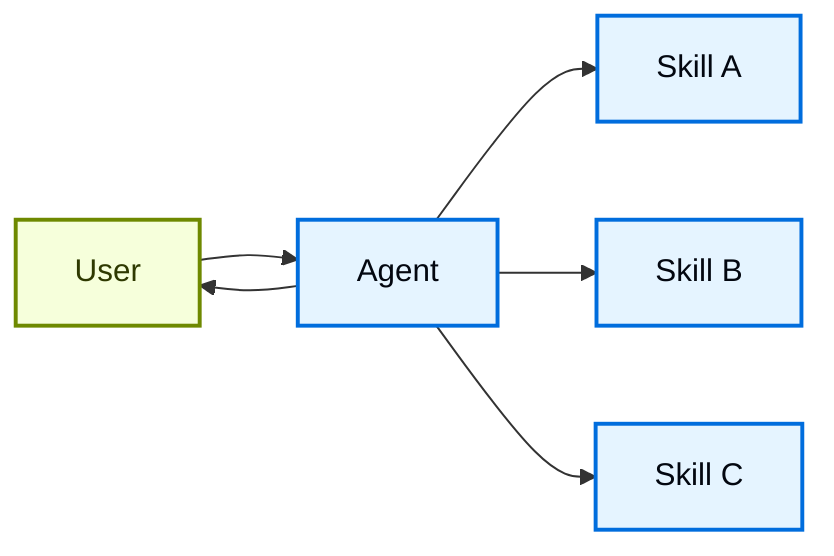

在 **skills** 架构中，专门能力会被打包成可调用的 "skills"，用来增强 [agent](/oss/langchain/agents) 的行为。Skills 主要是由提示词驱动的专门化能力，智能体可以按需调用它们。
要使用内置的 skill 支持，请参见 [Deep Agents](/oss/deepagents/skills)。

<Tip>
这个模式在概念上与 [Agent Skills](https://agentskills.io/) 和 [llms.txt](https://llmstxt.org/)（Jeremy Howard 提出）相同，后者使用工具调用来逐步披露文档。Skills 模式把这种渐进式披露应用到专门提示词和领域知识上，而不只是文档页面。

如果你想要现成可用、能提升 LangChain 生态任务表现的 skills，请参见 [LangChain Skills](https://github.com/langchain-ai/langchain-skills) 仓库。
</Tip>



## 关键特征

* 提示词驱动的专门化：Skills 主要由专门提示词定义
* 渐进式披露：Skills 会根据上下文或用户需要变得可用
* 团队分工：不同团队可以独立开发和维护 skills
* 轻量组合：Skills 比完整子智能体更简单
* 资源感知：Skills 可以引用脚本、模板和其他资源

## 何时使用

当你想让单个 [agent](/oss/langchain/agents) 具有很多可能的专门化、又不需要在 skills 之间强制特定约束，或者不同团队需要独立开发能力时，就使用 skills 模式。常见示例包括编码助手（不同语言或任务的 skills）、知识库（不同领域的 skills）以及创意助手（不同格式的 skills）。

## 基本实现

:::python
```python
from langchain.tools import tool
from langchain.agents import create_agent

@tool
def load_skill(skill_name: str) -> str:
    """加载一个专门的 skill 提示词。

    可用 skills：
    - write_sql：SQL 查询编写专家
    - review_legal_doc：法律文档审阅者

    返回该 skill 的提示词和上下文。
    """
    # 从文件/数据库加载 skill 内容
    ...

agent = create_agent(
    model="gpt-5.5",
    tools=[load_skill],
    system_prompt=(
        "You are a helpful assistant. "
        "You have access to two skills: "
        "write_sql and review_legal_doc. "
        "Use load_skill to access them."
    ),
)
```
:::
:::js
```typescript
import { tool, createAgent } from "langchain";
import * as z from "zod";

const loadSkill = tool(
  async ({ skillName }) => {
    // 从文件/数据库加载 skill 内容
    return "";
  },
  {
    name: "load_skill",
    description: `Load a specialized skill.

Available skills:
- write_sql: SQL query writing expert
- review_legal_doc: Legal document reviewer

Returns the skill's prompt and context.`,
    schema: z.object({
      skillName: z
        .string()
        .describe("Name of skill to load")
    })
  }
);

const agent = createAgent({
  model: "gpt-5.5",
  tools: [loadSkill],
  systemPrompt: (
    "You are a helpful assistant. " +
    "You have access to two skills: " +
    "write_sql and review_legal_doc. " +
    "Use load_skill to access them."
  ),
});
```
:::

完整实现请看下面的教程。

<Card
    title="教程：用按需 skills 构建 SQL 助手"
    icon="wand"
    href="/oss/langchain/multi-agent/skills-sql-assistant"
    arrow cta="了解更多"
>
    了解如何实现带渐进式披露的 skills，也就是让智能体按需加载专门提示词和 schema，而不是一开始就全部加载。
</Card>

## 扩展模式

在编写自定义实现时，你可以通过几种方式扩展基本 skills 模式：

- **动态工具注册**：把渐进式披露和状态管理结合起来，在 skill 加载时注册新的 [tools](/oss/langchain/tools)。例如，加载一个 "database_admin" skill 时，既可以增加专门上下文，也可以注册数据库专用工具（备份、恢复、迁移）。这使用了多智能体模式中相同的 tool-and-state 机制，也就是工具更新状态，从而动态改变智能体能力。

- **层级 skills**：Skills 可以用树状结构定义其他 skills，形成嵌套专门化。例如，加载一个 "data_science" skill 时，可以同时提供 "pandas_expert"、"visualization" 和 "statistical_analysis" 这样的子 skill。每个子 skill 都可以按需独立加载，从而实现更细粒度的领域知识渐进披露。这种层级方法通过把能力组织成可以按需发现和加载的逻辑分组，有助于管理大型知识库。

- **资源感知**：虽然每个 skill 只有一个提示词，但这个提示词可以引用其他资产的位置，并说明智能体什么时候应该使用这些资产。
当这些资产变得相关时，智能体就会知道这些文件存在，并在需要时把它们读入内存来完成任务。
这也遵循渐进式披露模式，并限制了上下文窗口中的信息量。
