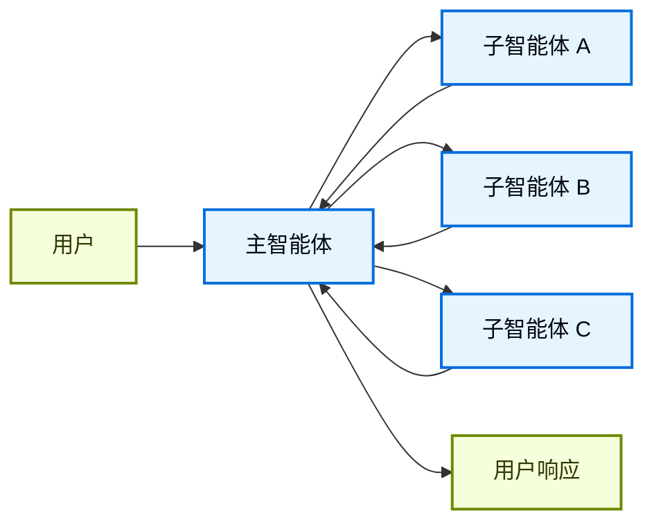
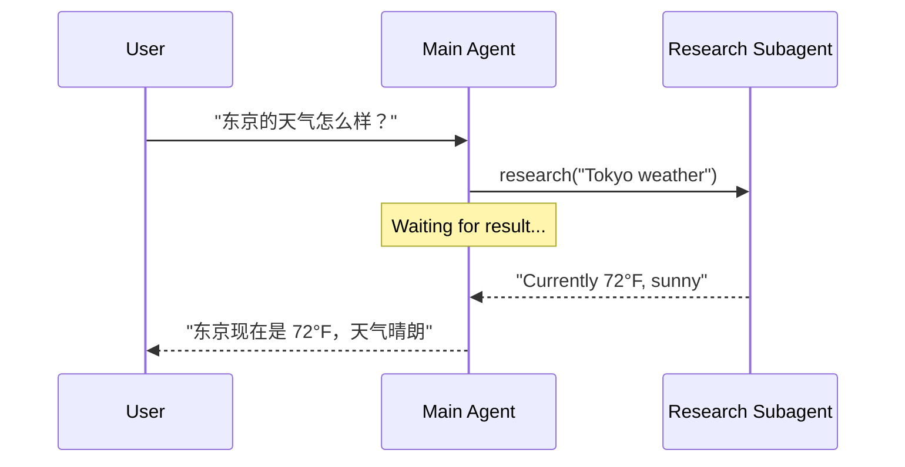
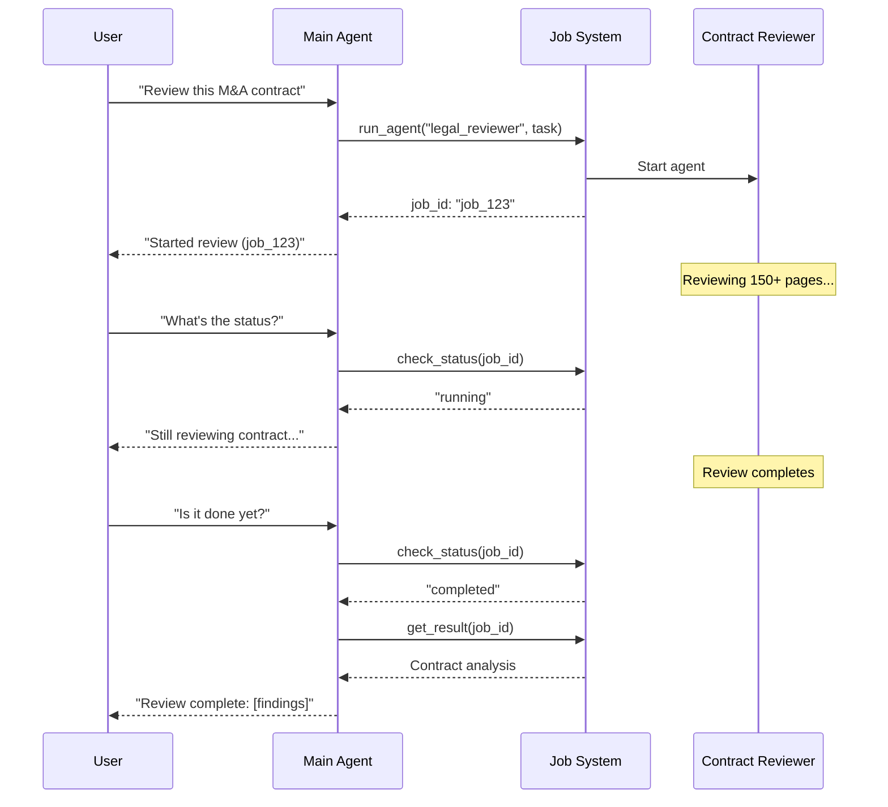
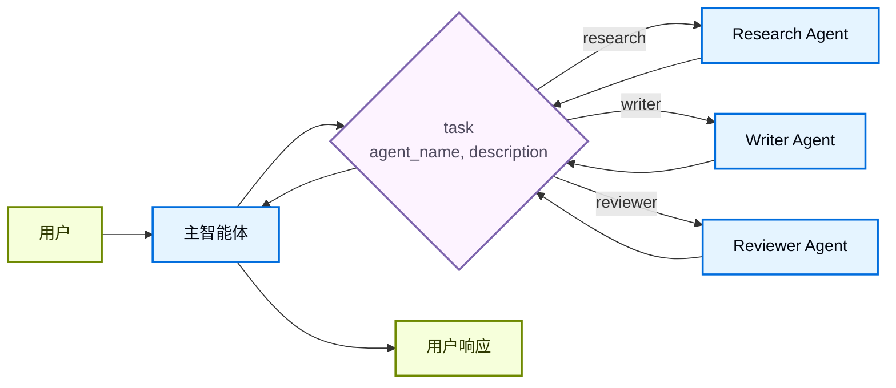

在 **子智能体** 架构中，一个中心主 [agent](/oss/langchain/agents)（通常称为 **supervisor**）会把子智能体当作 [tools](/oss/langchain/tools) 来调用并协调它们。主智能体决定调用哪个子智能体、传入什么输入，以及如何组合结果。子智能体是无状态的，它们不会记住过去的交互，所有对话记忆都由主智能体维护。这带来了 [context](/oss/langchain/context-engineering) 隔离：每次子智能体调用都在干净的上下文窗口里运行，避免主对话上下文膨胀。

如果你想要内置的子智能体支持，请看 [Deep Agents](/oss/deepagents/subagents)。



## 主要特点

* 中心化控制：所有路由都经过主智能体
* 不直接和用户交互：子智能体把结果返回给主智能体，而不是直接给用户（不过你可以在子智能体内部使用 [interrupts](/oss/langgraph/interrupts#pause-using-interrupt) 来让用户参与）
* 通过工具调用子智能体：子智能体是通过工具被调用的
* 并行执行：主智能体可以在一个回合中调用多个子智能体

<Note>
**Supervisor 和 Router 的区别**：supervisor 智能体（这个模式）和 [router](/oss/langchain/multi-agent/router) 不一样。Supervisor 是一个完整智能体，会维护对话上下文，并在多轮中动态决定调用哪些子智能体。Router 通常只是一个分类步骤，它会把请求分发给不同智能体，但不会维护持续的对话状态。
</Note>

## 何时使用

当你有多个彼此独立的领域（例如日历、邮箱、CRM、数据库），子智能体不需要直接和用户对话，或者你想要集中式工作流控制时，就使用子智能体模式。对于只有少量 [tools](/oss/langchain/tools) 的简单场景，使用 [单智能体](/oss/langchain/agents) 就够了。

<Tip>
**子智能体里需要用户交互？** 虽然子智能体通常只把结果返回给主智能体，不会直接和用户对话，但你可以在子智能体内部使用 [interrupts](/oss/langgraph/interrupts#pause-using-interrupt) 暂停执行并获取用户输入。这在子智能体需要确认信息或审批后才能继续时特别有用。主智能体仍然是编排者，但子智能体可以在任务中途收集用户信息。
</Tip>

## 基础实现

核心机制是把子智能体包装成一个工具，让主智能体可以调用：

:::python
```python
from langchain.tools import tool
from langchain.agents import create_agent

# 创建子智能体
subagent = create_agent(model="google_genai:gemini-3.5-flash", tools=[...])

# 将其包装为工具
@tool("research", description="Research a topic and return findings")
def call_research_agent(query: str):
    result = subagent.invoke({"messages": [{"role": "user", "content": query}]})
    return result["messages"][-1].content

# 带有子智能体工具的主智能体
main_agent = create_agent(model="google_genai:gemini-3.5-flash", tools=[call_research_agent])
```
:::
:::js
```typescript
import { createAgent, tool } from "langchain";
import { z } from "zod";

// 创建子智能体
const subagent = createAgent({ model: "google_genai:gemini-3.5-flash", tools: [...] });

// 将其包装为工具
const callResearchAgent = tool(
  async ({ query }) => {
    const result = await subagent.invoke({
      messages: [{ role: "user", content: query }]
    });
    return result.messages.at(-1)?.content;
  },
  {
    name: "research",
    description: "Research a topic and return findings",
    schema: z.object({ query: z.string() })
  }
);

// 带有子智能体工具的主智能体
const mainAgent = createAgent({ model: "google_genai:gemini-3.5-flash", tools: [callResearchAgent] });
```
:::

<Card
    title="教程：用子智能体构建个人助理"
    icon="sitemap"
    href="/oss/langchain/multi-agent/subagents-personal-assistant"
    arrow cta="了解更多"
>
    了解如何使用子智能体模式构建个人助理，其中一个中心主智能体（supervisor）会协调专门的工作智能体。
</Card>

## 设计决策

实现子智能体模式时，你需要做几项关键选择。下表总结了这些选项，下面各节会分别展开。

| 决策 | 选项 |
|----------|---------|
| [**同步 vs. 异步**](#sync-vs-async) | 同步（阻塞） vs. 异步（后台） |
| [**工具模式**](#tool-patterns) | 每个智能体一个工具 vs. 单一分发工具 |
| [**子智能体规格**](#subagent-specs) | 系统提示词 vs. enum 限制 vs. 基于工具的发现（仅单一分发工具） |
| [**子智能体输入**](#subagent-inputs) | 仅查询 vs. 完整上下文 |
| [**子智能体输出**](#subagent-outputs) | 子智能体结果 vs. 完整对话历史 |

## 同步 vs. 异步

子智能体执行可以是 **同步**（阻塞）或 **异步**（后台）的。选择哪一种，取决于主智能体是否需要结果才能继续。

| 模式 | 主智能体行为 | 适合场景 | 取舍 |
|------|---------------------|---------|------|
| **同步** | 等待子智能体完成 | 主智能体需要结果才能继续 | 简单，但会阻塞对话 |
| **异步** | 子智能体在后台运行时继续执行 | 独立任务，用户不应等待 | 响应更快，但更复杂 |

<Tip>
不要把这里的“async”与 Python 的 `async`/`await` 混淆。这里的“异步”指主智能体在后台启动一个任务（通常是独立进程或服务），然后继续执行而不阻塞。
</Tip>

### 同步（默认）

默认情况下，子智能体调用是 **同步** 的：主智能体会等待每个子智能体完成后再继续。当前续动作依赖子智能体结果时，就用同步。



**何时使用同步：**
- 主智能体需要子智能体结果来组织回答
- 任务有先后依赖（例如：取数 → 分析 → 回复）
- 子智能体失败时应阻止主智能体继续回复

**取舍：**
- 实现简单，只要调用并等待
- 用户在所有子智能体完成前看不到响应
- 长任务会让对话卡住

### 异步

当子智能体的工作与主对话流无关时，使用 **异步执行**。主智能体可以启动后台任务，同时仍然保持响应。



**何时使用异步：**
- 子智能体工作与主对话流彼此独立
- 用户在任务进行时仍应能继续聊天
- 你想并行运行多个独立任务

**三工具模式：**
1. **开始任务**：启动后台任务，返回 job ID
2. **检查状态**：返回当前状态（pending、running、completed、failed）
3. **获取结果**：获取已完成任务的结果

**任务完成后的处理**：任务完成后，你的应用需要通知用户。一种做法是：弹出通知，用户点击后发送一条 `HumanMessage`，例如“检查 job_123 并总结结果”。

## 工具模式

把子智能体作为工具暴露给主智能体主要有两种方式：

| 模式 | 适合场景 | 取舍 |
|---------|----------|-----------|
| [**每个智能体一个工具**](#tool-per-agent) | 对每个子智能体的输入/输出有细粒度控制 | 设置更多，但可定制性更强 |
| [**单一分发工具**](#single-dispatch-tool) | 智能体很多、团队分散、偏好约定大于配置 | 组合更简单，但每个智能体的自定义更少 |

### 每个智能体一个工具


核心思路是把子智能体包装成主智能体可以调用的工具：

:::python
```python
from langchain.tools import tool
from langchain.agents import create_agent

# 创建子智能体
subagent = create_agent(model="...", tools=[...])  # [!code highlight]

# 将其包装为工具  # [!code highlight]
@tool("subagent_name", description="subagent_description")  # [!code highlight]
def call_subagent(query: str):  # [!code highlight]
    result = subagent.invoke({"messages": [{"role": "user", "content": query}]})
    return result["messages"][-1].content

# 带有子智能体工具的主智能体  # [!code highlight]
main_agent = create_agent(model="...", tools=[call_subagent])  # [!code highlight]
```
:::
:::js
```typescript
import { createAgent, tool } from "langchain";
import * as z from "zod";

// 创建子智能体
const subagent = createAgent({...});  // [!code highlight]

// 将其包装为工具  // [!code highlight]
const callSubagent = tool(  // [!code highlight]
  async ({ query }) => {  // [!code highlight]
    const result = await subagent.invoke({
      messages: [{ role: "user", content: query }]
    });
    return result.messages.at(-1)?.text;
  },
  {
    name: "subagent_name",
    description: "subagent_description",
    schema: z.object({
      query: z.string().describe("The query to send to subagent")
    })
  }
);

// 带有子智能体工具的主智能体  // [!code highlight]
const mainAgent = createAgent({ model, tools: [callSubagent] });  // [!code highlight]
```
:::

主智能体在决定任务匹配某个子智能体的描述时，会调用这个子智能体工具，收到结果后继续编排。详见 [Context engineering](#context-engineering) 了解更细粒度的控制。

### 单一分发工具

另一种方式是使用一个带参数的工具来调用临时子智能体，处理彼此独立的任务。与 [每个智能体一个工具](#tool-per-agent) 方式不同，这种方式采用约定优先：用单个 `task` 工具把任务描述作为 human message 发送给子智能体，再把子智能体的最终消息作为工具结果返回。

当你想让多个团队分别开发智能体、需要把复杂任务隔离到独立上下文窗口、希望在不修改协调器的情况下扩展新智能体，或者更偏向约定而不是定制时，就使用这种方式。它用更少的灵活性换来更简单的智能体组合和更强的上下文隔离。



**主要特点：**

* 单一任务工具：一个参数化工具就能按名称调用任意注册的子智能体
* 基于约定的调用：按名字选择智能体，把任务作为 human message 传入，最终消息作为工具结果返回
* 团队分工：不同团队可以独立开发和部署智能体
* 智能体发现：可以通过系统提示词（列出可用智能体）或通过 [渐进式披露](/oss/langchain/multi-agent/skills-sql-assistant)（按需通过工具加载智能体信息）来发现子智能体

<Tip>
这种方式有一个有趣之处：子智能体可能和主智能体拥有完全相同的能力。此时，调用子智能体“真正”的目的往往是**上下文隔离**，让复杂的多步任务在隔离的上下文窗口中运行，而不把主智能体的对话历史撑大。子智能体会自主完成工作，并只返回简短摘要，让主线程保持专注和高效。
</Tip>

<Accordion title="带 task 分发器的智能体注册表">

:::python
```python
from langchain.tools import tool
from langchain.agents import create_agent

# 由不同团队开发的子智能体
research_agent = create_agent(
    model="gpt-5.5",
    prompt="You are a research specialist..."
)

writer_agent = create_agent(
    model="gpt-5.5",
    prompt="You are a writing specialist..."
)

# 可用子智能体注册表
SUBAGENTS = {
    "research": research_agent,
    "writer": writer_agent,
}

@tool
def task(
    agent_name: str,
    description: str
) -> str:
    """为任务启动一个临时子智能体。

    可用智能体：
    - research: 调研和事实核查
    - writer: 内容创作和编辑
    """
    agent = SUBAGENTS[agent_name]
    result = agent.invoke({
        "messages": [
            {"role": "user", "content": description}
        ]
    })
    return result["messages"][-1].content

# 主协调智能体
main_agent = create_agent(
    model="gpt-5.5",
    tools=[task],
    system_prompt=(
        "You coordinate specialized sub-agents. "
        "Available: research (fact-finding), "
        "writer (content creation). "
        "Use the task tool to delegate work."
    ),
)
```
:::
:::js
```typescript
import { tool, createAgent } from "langchain";
import * as z from "zod";

// 由不同团队开发的子智能体
const researchAgent = createAgent({
  model: "gpt-5.5",
  prompt: "You are a research specialist...",
});

const writerAgent = createAgent({
  model: "gpt-5.5",
  prompt: "You are a writing specialist...",
});

// 可用子智能体注册表
const SUBAGENTS = {
  research: researchAgent,
  writer: writerAgent,
};

const task = tool(
  async ({ agentName, description }) => {
    const agent = SUBAGENTS[agentName];
    const result = await agent.invoke({
      messages: [
        { role: "user", content: description }
      ],
    });
    return result.messages.at(-1)?.content;
  },
  {
    name: "task",
    description: `Launch an ephemeral subagent.

Available agents:
- research: Research and fact-finding
- writer: Content creation and editing`,
    schema: z.object({
      agentName: z
        .string()
        .describe("Name of agent to invoke"),
      description: z
        .string()
        .describe("Task description"),
    }),
  }
);

// 主协调智能体
const mainAgent = createAgent({
  model: "gpt-5.5",
  tools: [task],
  prompt: (
    "You coordinate specialized sub-agents. " +
    "Available: research (fact-finding), " +
    "writer (content creation). " +
    "Use the task tool to delegate work."
  ),
});
```
:::

</Accordion>

## Context engineering

控制上下文在主智能体和子智能体之间如何流动：

| 类别 | 目的 | 影响 |
|----------|---------|---------|
| [**子智能体规格**](#subagent-specs) | 确保子智能体在该被调用时能被调用 | 主智能体路由决策 |
| [**子智能体输入**](#subagent-inputs) | 确保子智能体能用优化后的上下文良好执行 | 子智能体表现 |
| [**子智能体输出**](#subagent-outputs) | 确保 supervisor 能基于子智能体结果采取行动 | 主智能体表现 |

另可参考我们关于 agent 的完整 [context engineering](/oss/langchain/context-engineering) 指南。

### 子智能体规格

与子智能体相关的 **名称** 和 **描述** 是主智能体判断何时调用哪个子智能体的主要依据。这些都是提示词杠杆，请谨慎选择。

* **名称**：主智能体如何引用子智能体。保持清晰、面向动作，例如 `research_agent`、`code_reviewer`。
* **描述**：主智能体对该子智能体能力的认知。要明确说明它负责哪些任务，以及何时应该使用它。

对于 [单一分发工具](#single-dispatch-tool) 设计，你还必须给主智能体提供它可以调用的子智能体信息。
你可以根据智能体数量以及注册表是否静态或动态，用不同方式提供这些信息：

| 方法 | 适合场景 | 取舍 |
|--------|----------|----------|
| **系统提示词枚举** | 小型、静态智能体列表（< 10 个） | 简单，但智能体变化时需要更新提示词 |
| **enum 限制** | 小型、静态智能体列表（< 10 个） | 类型安全且明确，但智能体变化时需要改代码 |
| **基于工具的发现** | 大型或动态智能体注册表 | 灵活可扩展，但更复杂 |

#### 系统提示词枚举

直接把可用智能体列在主智能体的系统提示词里。主智能体会把这些智能体及其描述当作指令的一部分看到。

**何时使用：**
- 你有一小组固定智能体（< 10 个）
- 智能体注册表很少变化
- 你想要最简单的实现

**示例：**
```python
main_agent = create_agent(
    model="...",
    tools=[task],
    system_prompt=(
        "You coordinate specialized sub-agents. "
        "Available agents:\n"
        "- research: Research and fact-finding\n"
        "- writer: Content creation and editing\n"
        "- reviewer: Code and document review\n"
        "Use the task tool to delegate work."
    ),
)
```

#### 在分发工具上使用 enum 限制

给分发工具的 `agent_name` 参数加上 enum 限制。这样既有类型安全，又能在工具 schema 中明确列出可用智能体。

**何时使用：**
- 你有一小组固定智能体（< 10 个）
- 你希望有类型安全和明确的智能体名称
- 你更喜欢基于 schema 的校验，而不是基于提示词的引导

**示例：**
```python
from enum import Enum

class AgentName(str, Enum):
    RESEARCH = "research"
    WRITER = "writer"
    REVIEWER = "reviewer"

@tool
def task(
    agent_name: AgentName,  # Enum 限制
    description: str
) -> str:
```

#### 基于工具的发现

提供单独的工具（例如 `list_agents` 或 `search_agents`），让主智能体按需发现可用智能体。这支持渐进式披露，也能处理动态注册表。

**何时使用：**
- 你有很多智能体（> 10 个）或者注册表在持续增长
- 智能体注册表经常变化，或者本身就是动态的
- 你想减少提示词大小和 token 用量
- 不同团队独立管理不同智能体

**示例：**
```python
@tool
def list_agents(query: str = "") -> str:
    """列出可用子智能体，可按 query 过滤。"""
    agents = search_agent_registry(query)
    return format_agent_list(agents)

@tool
def task(agent_name: str, description: str) -> str:
    """为任务启动一个临时子智能体。"""
    # ...

main_agent = create_agent(
    model="...",
    tools=[task, list_agents],
    system_prompt="Use list_agents to discover available subagents, then use task to invoke them."
)
```

### 子智能体输入

你可以定制子智能体接收什么上下文来完成任务。凡是静态提示词不方便表达的信息，比如完整消息历史、前序结果或任务元数据，都可以从智能体 state 中取出后传给子智能体。

:::python
```python Subagent inputs example expandable
from langchain.agents import AgentState
from langchain.tools import tool, ToolRuntime

class CustomState(AgentState):
    example_state_key: str

@tool(
    "subagent1_name",
    description="subagent1_description"
)
def call_subagent1(query: str, runtime: ToolRuntime[None, CustomState]):
    # 根据需要把消息转换成合适的输入
    subagent_input = some_logic(query, runtime.state["messages"])
    result = subagent1.invoke({
        "messages": subagent_input,
        # 你也可以按需传递其他 state 键。
        # 记得在主智能体和子智能体的 state schema 中都定义它们。
        "example_state_key": runtime.state["example_state_key"]
    })
    return result["messages"][-1].content
```
:::
:::js
```typescript Subagent inputs example expandable
import { createAgent, tool, AgentState, ToolMessage } from "langchain";
import { Command } from "@langchain/langgraph";
import * as z from "zod";

// 示例：通过 state 把完整对话历史传给子智能体。
const callSubagent1 = tool(
  async ({query}) => {
    const state = getCurrentTaskInput<AgentState>();
    // 根据需要把消息转换成合适的输入
    const subAgentInput = someLogic(query, state.messages);
    const result = await subagent1.invoke({
      messages: subAgentInput,
      // 你也可以按需传递其他 state 键。
      // 记得在主智能体和子智能体的 state schema 中都定义它们。
      exampleStateKey: state.exampleStateKey
    });
    return result.messages.at(-1)?.content;
  },
  {
    name: "subagent1_name",
    description: "subagent1_description",
  }
);
```
:::

### 子智能体输出

你可以定制主智能体收到什么返回值，从而帮助它做出更好的决策。有两种策略：

1. **通过提示词约束子智能体**：明确说明应该返回什么。一个常见失败模式是子智能体做了工具调用或推理，但最终消息里没有包含结果。要提醒它 supervisor 只能看到最终输出。
2. **在代码里格式化**：在返回前调整或增强响应。例如，除了最终文本，还可以通过 [`Command`](/oss/langgraph/graph-api#command) 传回特定 state 键。

:::python
```python Subagent outputs example expandable
from typing import Annotated
from langchain.agents import AgentState
from langchain.tools import InjectedToolCallId
from langgraph.types import Command


@tool(
    "subagent1_name",
    description="subagent1_description"
)
def call_subagent1(
    query: str,
    tool_call_id: Annotated[str, InjectedToolCallId],
) -> Command:
    result = subagent1.invoke({
        "messages": [{"role": "user", "content": query}]
    })
    return Command(update={
        # 传回子智能体的附加 state
        "example_state_key": result["example_state_key"],
        "messages": [
            ToolMessage(
                content=result["messages"][-1].content,
                tool_call_id=tool_call_id
            )
        ]
    })
```
:::
:::js
```typescript Subagent outputs example expandable
import { tool, ToolMessage } from "langchain";
import { Command } from "@langchain/langgraph";
import * as z from "zod";

const callSubagent1 = tool(
  async ({ query }, config) => {
    const result = await subagent1.invoke({
      messages: [{ role: "user", content: query }]
    });

    // 返回 Command 以更新多个 state 键
    return new Command({
      update: {
        // 传回子智能体的附加 state
        exampleStateKey: result.exampleStateKey,
        messages: [
          new ToolMessage({
            content: result.messages.at(-1)?.text,
            tool_call_id: config.toolCall?.id!
          })
        ]
      }
    });
  },
  {
    name: "subagent1_name",
    description: "subagent1_description",
    schema: z.object({
      query: z.string().describe("The query to send to subagent1")
    })
  }
);
```
:::

## 检查点和状态查看

默认情况下，子智能体使用 **inherited checkpointer** 模式。也就是说，每次调用都会从全新 state 开始，支持 [interrupts](/oss/langgraph/interrupts#pause-using-interrupt)，并且可以安全并行运行。如果你希望子智能体维护自己独立的、可持续的对话历史，可以把它编译为 `checkpointer=True`（continuations 模式）。完整对比请看 [subgraph persistence](/oss/langgraph/use-subgraphs#subgraph-persistence)。

因为子智能体是在工具函数内部被调用的，LangGraph 无法 [静态发现](/oss/langgraph/use-subgraphs#view-subgraph-state) 它们。这意味着带 `subgraphs` 的 [`get_state`](/oss/langgraph/use-subgraphs#view-subgraph-state) 不会返回子智能体 state。如果你需要读取嵌套图的 state（例如在 [interrupt](/oss/langgraph/interrupts#pause-using-interrupt) 期间），应改为在自定义图里的 [node function](/oss/langgraph/use-subgraphs#call-a-subgraph-inside-a-node) 中调用子智能体。关于不同模式如何影响 state 可见性，详见 [subgraph persistence](/oss/langgraph/use-subgraphs#subgraph-persistence)。

:::python
<Card
    title="从 langgraph-supervisor 迁移"
    icon="arrow-right"
    href="/oss/migrate/langgraph-supervisor"
    arrow cta="查看指南"
>
    `langgraph-supervisor` 包已经不再积极维护。了解如何从 `create_supervisor` 迁移到子智能体模式，包括通过外部 API 回调实现 interrupt 和 resume 流程。
</Card>
:::
