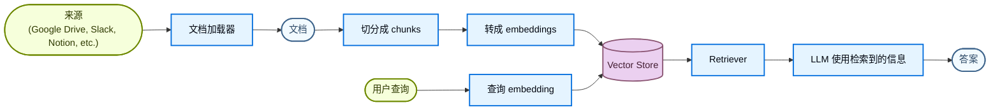
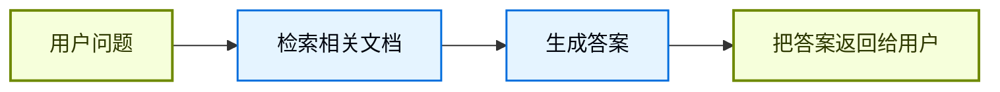
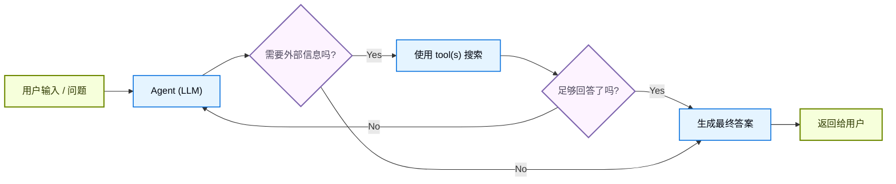
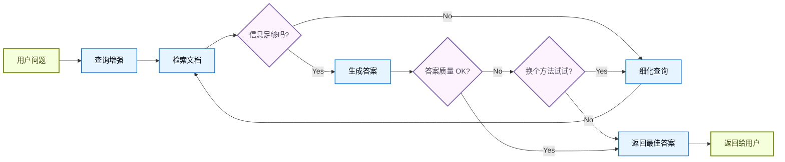

大语言模型（LLM）很强，但有两个关键限制：

* **上下文有限** - 它们一次无法装下整个语料库。
* **知识静态** - 它们的训练数据冻结在某个时间点。

检索通过在查询时拉取相关外部知识来解决这些问题。这就是 **Retrieval-Augmented Generation (RAG)** 的基础：用与问题相关的上下文信息增强 LLM 的回答。

## 构建知识库

**知识库** 是一个在检索过程中使用的文档或结构化数据仓库。

如果你需要自定义知识库，可以用 LangChain 的文档加载器和 vector store 从自己的数据构建。

<Note>
    如果你已经有知识库，例如 SQL 数据库、CRM，或者内部文档系统，你**不需要**重建它。你可以：
    - 在 Agentic RAG 中把它作为智能体的 **tool** 接入。
    - 先查询它，再把检索到的内容作为上下文提供给 LLM（[2-Step RAG](#2-step-rag)）。
</Note>

请看下面的教程，学习如何构建一个可搜索的知识库和最小版 RAG 工作流：

<Card
    title="教程：语义搜索"
    icon="database"
    href="/oss/langchain/knowledge-base"
    arrow cta="了解更多"
>
    了解如何使用 LangChain 的文档加载器、embeddings 和 vector stores，从自己的数据构建一个可搜索知识库。
    在本教程里，你会基于一个 PDF 构建搜索引擎，从而检索出与查询相关的段落。你还会在这个引擎之上实现一个最小版 RAG 工作流，看看外部知识如何融入 LLM 推理。
</Card>

### 从检索到 RAG

检索让 LLM 可以在运行时访问相关上下文。但大多数真实应用会再往前一步：把检索和生成 **整合** 起来，产出更有依据、更多上下文感知的答案。

这就是 **Retrieval-Augmented Generation (RAG)** 的核心想法。检索流水线会成为一个更大系统的基础，它把搜索与生成结合起来。

### 检索流水线

典型的检索工作流如下：



每个组件都是模块化的：你可以替换加载器、切分器、embedding 或 vector store，而不用重写应用逻辑。

### 基础构件

<Columns cols={2}>
    <Card
        title="文档加载器"
        icon="file-import"
        href="/oss/integrations/document_loaders"
        arrow cta="了解更多"
    >
        从外部来源（Google Drive、Slack、Notion 等）导入数据，并返回标准化的 @[`Document`] 对象。
    </Card>

    :::python
    <Card
        title="Text splitters"
        icon="scissors"
        href="/oss/integrations/splitters"
        arrow
        cta="了解更多"
    >
        把大文档切成更小的 chunk，这些 chunk 可单独检索，也更容易放进模型的上下文窗口。
    </Card>
    :::
    <Card
        title="Embedding 模型"
        icon="sitemap"
        href="/oss/integrations/embeddings"
        arrow
        cta="了解更多"
    >
        embedding 模型会把文本转成数值向量，使语义相近的文本在那个向量空间里彼此接近。
    </Card>

    <Card
        title="Vector stores"
        icon="database"
        href="/oss/integrations/vectorstores/"
        arrow
        cta="了解更多"
    >
        用于存储和搜索 embeddings 的专用数据库。
    </Card>

    <Card
        title="Retrievers"
        icon="binoculars"
        href="/oss/integrations/retrievers/"
        arrow
        cta="了解更多"
    >
        retriever 是一个根据非结构化查询返回文档的接口。
    </Card>
</Columns>

## RAG 架构

RAG 可以按系统需求用多种方式实现。下面各节会分别介绍。

| 架构            | 描述                                                                | 控制力   | 灵活性 | 延迟        | 典型场景                                   |
|-----------------|--------------------------------------------------------------------|-----------|-------------|----------------|--------------------------------------------|
| **2-Step RAG**  | 检索总是在生成前执行。简单且可预测。                               | ✅ 高    | ❌ 低       | ⚡ 快         | FAQ、文档机器人                            |
| **Agentic RAG** | 由 LLM 驱动的智能体在推理过程中决定 *何时* 以及 *如何* 检索       | ❌ 低     | ✅ 高      | ⏳ 可变     | 可访问多个工具的研究助理                  |
| **Hybrid**      | 结合两种方法的特点，并加上校验步骤                                | ⚖️ 中   | ⚖️ 中    | ⏳ 可变     | 带质量校验的领域问答                      |

<Info>
**Latency**：在 **2-Step RAG** 中，延迟通常更**可预测**，因为最大 LLM 调用次数是已知且受限的。这里的可预测性假设 LLM 推理时间是主要因素。不过，真实延迟也可能受检索步骤性能影响，例如 API 响应时间、网络延迟或数据库查询，这些都会随所用工具和基础设施而变化。
</Info>

### 2-step RAG

在 **2-Step RAG** 中，检索步骤总是在生成步骤之前执行。这种架构简单且可预测，适合很多场景：当检索相关文档是生成答案的明确前置条件时，它尤其合适。



<Card
    title="教程：Retrieval-Augmented Generation (RAG)"
    icon="robot"
    href="/oss/langchain/rag#rag-chain"
    arrow cta="了解更多"
>
    看看如何构建一个基于数据、能够回答问题的 Q&A chatbot，使用的是 Retrieval-Augmented Generation。
    本教程会讲两种方法：
    * 一个 **RAG agent**，用灵活的 tool 进行搜索，适合通用场景。
    * 一个 **2-step RAG** 链路，每个查询只需要一次 LLM 调用，适合更简单、更高效的任务。
</Card>

### Agentic RAG

**Agentic Retrieval-Augmented Generation (RAG)** 把 RAG 的优势和基于智能体的推理结合起来。不是先检索再回答，而是由一个（LLM 驱动的）智能体一步步推理，并在交互过程中决定 **何时** 以及 **如何** 检索信息。

<Tip>
智能体要启用 RAG 行为，唯一需要的就是能访问一个或多个可获取外部知识的 **tools**，比如文档加载器、web API 或数据库查询。
</Tip>



:::python
```python
import requests
from langchain.tools import tool
from langchain.chat_models import init_chat_model
from langchain.agents import create_agent


@tool
def fetch_url(url: str) -> str:
    """从 URL 获取文本内容。"""
    response = requests.get(url, timeout=10.0)
    response.raise_for_status()
    return response.text

system_prompt = """\
Use fetch_url when you need to fetch information from a web-page; quote relevant snippets.
"""

agent = create_agent(
    model="claude-sonnet-4-6",
    tools=[fetch_url], # A tool for retrieval [!code highlight]
    system_prompt=system_prompt,
)
```
:::

:::js
```typescript
import { tool, createAgent } from "langchain";

const fetchUrl = tool(
    (url: string) => {
        return `Fetched content from ${url}`;
    },
    { name: "fetch_url", description: "Fetch text content from a URL" }
);

const agent = createAgent({
    model: "claude-sonnet-4-0",
    tools: [fetchUrl],
```
:::

<Expandable title="进阶示例：LangGraph llms.txt 的 Agentic RAG">

这个例子实现了一个 **Agentic RAG 系统**，帮助用户查询 LangGraph 文档。智能体先加载 [llms.txt](https://llmstxt.org/)，其中列出了可用的文档 URL，然后可以根据用户问题动态使用 `fetch_documentation` 工具来检索并处理相关内容。

:::python
```python
import requests
from langchain.agents import create_agent
from langchain.messages import HumanMessage
from langchain.tools import tool
from markdownify import markdownify


ALLOWED_DOMAINS = ["https://langchain-ai.github.io/"]
LLMS_TXT = 'https://langchain-ai.github.io/langgraph/llms.txt'


@tool
def fetch_documentation(url: str) -> str:  # [!code highlight]
    """Fetch and convert documentation from a URL"""
    if not any(url.startswith(domain) for domain in ALLOWED_DOMAINS):
        return (
            "Error: URL not allowed. "
            f"Must start with one of: {', '.join(ALLOWED_DOMAINS)}"
        )
    response = requests.get(url, timeout=10.0)
    response.raise_for_status()
    return markdownify(response.text)


# 我们会先抓取 llms.txt 内容，因此这一步可以在不需要 LLM 请求的情况下提前完成。
llms_txt_content = requests.get(LLMS_TXT).text

# Agent 的系统提示词
system_prompt = f"""
You are an expert Python developer and technical assistant.
Your primary role is to help users with questions about LangGraph and related tools.

Instructions:

1. If a user asks a question you're unsure about—or one that likely involves API usage,
   behavior, or configuration—you MUST use the `fetch_documentation` tool to consult the relevant docs.
2. When citing documentation, summarize clearly and include relevant context from the content.
3. Do not use any URLs outside of the allowed domain.
4. If a documentation fetch fails, tell the user and proceed with your best expert understanding.

You can access official documentation from the following approved sources:

{llms_txt_content}

You MUST consult the documentation to get up to date documentation
before answering a user's question about LangGraph.

Your answers should be clear, concise, and technically accurate.
"""

tools = [fetch_documentation]

model = init_chat_model("claude-sonnet-4-0", max_tokens=32_000)

agent = create_agent(
    model=model,
    tools=tools,  # [!code highlight]
    system_prompt=system_prompt,  # [!code highlight]
    name="Agentic RAG",
)

response = agent.invoke({
    'messages': [
        HumanMessage(content=(
            "Write a short example of a langgraph agent using the "
            "prebuilt create react agent. the agent should be able "
            "to look up stock pricing information."
        ))
    ]
})

print(response['messages'][-1].content)
```
:::
:::js
```typescript
import { tool, createAgent, HumanMessage } from "langchain";
import * as z from "zod";

const ALLOWED_DOMAINS = ["https://langchain-ai.github.io/"];
const LLMS_TXT = "https://langchain-ai.github.io/langgraph/llms.txt";

const fetchDocumentation = tool(
  async (input) => {  // [!code highlight]
    if (!ALLOWED_DOMAINS.some((domain) => input.url.startsWith(domain))) {
      return `Error: URL not allowed. Must start with one of: ${ALLOWED_DOMAINS.join(", ")}`;
    }
    const response = await fetch(input.url);
    if (!response.ok) {
      throw new Error(`HTTP error! status: ${response.status}`);
    }
    return response.text();
  },
  {
    name: "fetch_documentation",
    description: "Fetch and convert documentation from a URL",
    schema: z.object({
      url: z.string().describe("The URL of the documentation to fetch"),
    }),
  }
);

const llmsTxtResponse = await fetch(LLMS_TXT);
const llmsTxtContent = await llmsTxtResponse.text();

const systemPrompt = `
You are an expert TypeScript developer and technical assistant.
Your primary role is to help users with questions about LangGraph and related tools.

Instructions:

1. If a user asks a question you're unsure about—or one that likely involves API usage,
   behavior, or configuration—you MUST use the \`fetch_documentation\` tool to consult the relevant docs.
2. When citing documentation, summarize clearly and include relevant context from the content.
3. Do not use any URLs outside of the allowed domain.
4. If a documentation fetch fails, tell the user and proceed with your best expert understanding.

You can access official documentation from the following approved sources:

${llmsTxtContent}

You MUST consult the documentation to get up to date documentation
before answering a user's question about LangGraph.

Your answers should be clear, concise, and technically accurate.
`;

const tools = [fetchDocumentation];

const agent = createAgent({
  model: "claude-sonnet-4-0"
  tools,  // [!code highlight]
  systemPrompt,  // [!code highlight]
  name: "Agentic RAG",
});

const response = await agent.invoke({
  messages: [
    new HumanMessage(
      "Write a short example of a langgraph agent using the " +
      "prebuilt create react agent. the agent should be able " +
      "to look up stock pricing information."
    ),
  ],
});

console.log(response.messages.at(-1)?.content);
```
:::
</Expandable>

<Card
    title="教程：Retrieval-Augmented Generation (RAG)"
    icon="robot"
    href="/oss/langchain/rag"
    arrow cta="了解更多"
>
    看看如何构建一个基于数据、能够回答问题的 Q&A chatbot，使用的是 Retrieval-Augmented Generation。
    本教程会讲两种方法：
    * 一个 **RAG agent**，用灵活的 tool 进行搜索，适合通用场景。
    * 一个 **2-step RAG** 链路，每个查询只需要一次 LLM 调用，适合更简单、更高效的任务。
</Card>

### Hybrid RAG

Hybrid RAG 把 2-Step 和 Agentic RAG 的特点结合起来。它会引入诸如查询预处理、检索校验和生成后校验之类的中间步骤。这类系统比固定流水线更灵活，同时在执行上仍保留一定控制力。

典型组件包括：

* **查询增强**：修改输入问题以提升检索质量。可以重写不清晰的问题、生成多个变体，或者用额外上下文扩展查询。
* **检索校验**：评估检索出的文档是否相关且足够。如果不够，系统可能会重新细化问题并再次检索。
* **答案校验**：检查生成答案的准确性、完整性以及是否与源内容一致。必要时，系统可以重新生成或修订答案。

这种架构通常支持这些步骤之间的多次迭代：



这种架构适合：

* 问题含糊或描述不充分的应用
* 需要校验或质量控制步骤的系统
* 涉及多个来源或迭代优化的工作流

<Card
    title="教程：带自我纠正的 Agentic RAG"
    icon="robot"
    href="/oss/langgraph/agentic-rag"
    arrow cta="了解更多"
>
    一个 **Hybrid RAG** 的示例，把智能体推理、检索和自我纠正结合在一起。
</Card>
