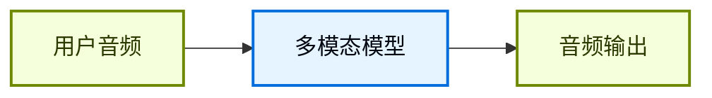

## 概览

聊天界面一直主导着我们和 AI 的交互方式，但多模态 AI 的最新突破正在打开一些令人兴奋的新可能。高质量的生成模型和表现力更强的 text-to-speech（TTS）系统，现在让构建起来像对话伙伴而不是工具的 agent 成为可能。

语音智能体就是其中一个例子。你不再需要键盘和鼠标把输入打进 agent，而是可以用口语和它交互。这通常是一种更自然、更有参与感的交互方式，在某些场景下尤其有用。

### 什么是语音智能体？

语音智能体是可以与用户进行自然口语对话的 [agents](/oss/langchain/agents)。这类 agent 结合了语音识别、自然语言处理、生成式 AI 和 text-to-speech 技术，从而实现流畅自然的对话。

它们适合很多场景，包括：

- 客户支持
- 个人助理
- 免手操作界面
- 辅导和培训

### 语音智能体如何工作？

从高层看，每个语音智能体都需要处理三件事：

1. **Listen** - 捕获音频并转写
2. **Think** - 解释意图、推理、规划
3. **Speak** - 生成音频并把它流回用户

差别在于这些步骤如何编排、如何耦合。实践中，生产级 agent 通常遵循两种主要架构之一：

#### 1. STT > Agent > TTS 架构（“三明治”）

三明治架构由三个独立组件组成：speech-to-text（STT）、基于文本的 LangChain agent，以及 text-to-speech（TTS）。


**优点：**
- 对每个组件都有完全控制权，可以按需替换 STT/TTS provider
- 能直接使用现代文本模态模型的最新能力
- 边界清晰，行为透明

**缺点：**
- 需要编排多个服务
- 管线管理更复杂
- 从语音到文本的转换会丢失部分信息，例如语气和情绪

#### 2. Speech-to-Speech 架构（S2S）

Speech-to-speech 使用一个原生处理音频输入并生成音频输出的多模态模型。



**优点：**
- 架构更简单，移动部件更少
- 对于简单交互，通常延迟更低
- 直接处理音频，可以捕捉语气和其他语音细节

**缺点：**
- 可选模型较少，provider lock-in 风险更高
- 功能可能落后于文本模态模型
- 音频处理的透明度较低
- 可控性和定制能力更弱

本指南演示的是 **三明治架构**，因为它在性能、可控性和对现代模型能力的访问之间取得了平衡。某些 STT 和 TTS provider 下，三明治架构可以把延迟压到 700ms 以下，同时保留模块化组件的控制权。

### Demo 应用概览

我们会按照三明治架构来构建一个基于语音的 agent。这个 agent 会管理一家三明治店的订单。应用会展示三明治架构的全部三个组件，使用 [AssemblyAI](https://www.assemblyai.com/) 做 STT，使用 [Cartesia](https://cartesia.ai/) 做 TTS（当然也可以为大多数 provider 编写适配器）。

完整的参考应用可以在 [voice-sandwich-demo](https://github.com/langchain-ai/voice-sandwich-demo) 仓库中找到。这里我们会逐步讲解这个应用。

这个 demo 使用 WebSockets 实现浏览器和服务器之间的实时双向通信。同样的架构也可以适配电话系统（Twilio、Vonage）或 WebRTC 连接等其他传输方式。

### 架构

这个 demo 实现了一个流式管线，其中每个阶段都会异步处理数据：

**客户端（浏览器）**
- 捕获麦克风音频并将其编码为 PCM
- 与后端服务器建立 WebSocket 连接
- 实时向服务器流式发送音频 chunk
- 接收并播放合成的语音音频

:::python
**服务端（Python）**
:::
:::js
**服务端（Node.js）**
:::

- 接收来自客户端的 WebSocket 连接
- 编排三步管线：
  - [Speech-to-text (STT)](#1-speech-to-text)：把音频转发给 STT provider（例如 AssemblyAI），接收 transcript events
  - [Agent](#2-langchain-agent)：用 LangChain agent 处理 transcripts，流式输出 response tokens
  - [Text-to-speech (TTS)](#3-text-to-speech)：把 agent responses 发送给 TTS provider（例如 Cartesia），接收音频 chunk

- 把合成音频返回给客户端播放

:::python
这个管线使用 async generators，让每个阶段都可以流式处理。这样下游组件可以在上游阶段完成前就开始处理，从而尽量降低端到端延迟。
:::
:::js
这个管线使用 async iterators，让每个阶段都可以流式处理。这样下游组件可以在上游阶段完成前就开始处理，从而尽量降低端到端延迟。
:::

## 设置

有关详细安装说明和设置，请参见 [repository README](https://github.com/langchain-ai/voice-sandwich-demo#readme)。

## 1. 语音转文本

STT 阶段会把传入的音频流转换成文本 transcripts。这个实现使用生产者-消费者模式并发处理音频流式传输和 transcript 接收。

### 关键概念

**生产者-消费者模式**：音频 chunk 会在向 STT 服务发送的同时，持续接收 transcript events。这样在所有音频到齐之前，转写就可以开始。

**事件类型**：
- `stt_chunk`：STT 服务处理音频时给出的部分 transcript
- `stt_output`：最终、格式化后的 transcript，会触发 agent 处理

**WebSocket 连接**：维持到 AssemblyAI 实时 STT API 的持久连接，配置为 16kHz PCM 音频并自动 turn formatting。

### 实现

:::python
```python
from typing import AsyncIterator
import asyncio
from assemblyai_stt import AssemblyAISTT
from events import VoiceAgentEvent

async def stt_stream(
    audio_stream: AsyncIterator[bytes],
) -> AsyncIterator[VoiceAgentEvent]:
    """
    Transform stream: Audio (Bytes) → Voice Events (VoiceAgentEvent)

    Uses a producer-consumer pattern where:
    - Producer: Reads audio chunks and sends them to AssemblyAI
    - Consumer: Receives transcription events from AssemblyAI
    """
    stt = AssemblyAISTT(sample_rate=16000)

    async def send_audio():
        """Background task that pumps audio chunks to AssemblyAI."""
        try:
            async for audio_chunk in audio_stream:
                await stt.send_audio(audio_chunk)
        finally:
            # Signal completion when audio stream ends
            await stt.close()

    # Launch audio sending in background
    send_task = asyncio.create_task(send_audio())

    try:
        # Receive and yield transcription events as they arrive
        async for event in stt.receive_events():
            yield event
    finally:
        # Cleanup
        with contextlib.suppress(asyncio.CancelledError):
            send_task.cancel()
            await send_task
        await stt.close()
```
:::

:::js
```typescript
import { AssemblyAISTT } from "./assemblyai";
import type { VoiceAgentEvent } from "./types";

async function* sttStream(
  audioStream: AsyncIterable<Uint8Array>
): AsyncGenerator<VoiceAgentEvent> {
  const stt = new AssemblyAISTT({ sampleRate: 16000 });
  const passthrough = writableIterator<VoiceAgentEvent>();

  // Producer: pump audio chunks to AssemblyAI
  const producer = (async () => {
    try {
      for await (const audioChunk of audioStream) {
        await stt.sendAudio(audioChunk);
      }
    } finally {
      await stt.close();
    }
  })();

  // Consumer: receive transcription events
  const consumer = (async () => {
    for await (const event of stt.receiveEvents()) {
      passthrough.push(event);
    }
  })();

  try {
    // Yield events as they arrive
    yield* passthrough;
  } finally {
    // Wait for producer and consumer to complete
    await Promise.all([producer, consumer]);
  }
}
```
:::

这个应用实现了一个 AssemblyAI client，用来管理 WebSocket 连接和消息解析。具体实现见下文；其他 STT provider 也可以构建类似的适配器。

<Accordion title="AssemblyAI Client">

:::python
```python
class AssemblyAISTT:
    def __init__(self, api_key: str | None = None, sample_rate: int = 16000):
        self.api_key = api_key or os.getenv("ASSEMBLYAI_API_KEY")
        self.sample_rate = sample_rate
        self._ws: WebSocketClientProtocol | None = None

    async def send_audio(self, audio_chunk: bytes) -> None:
        """Send PCM audio bytes to AssemblyAI."""
        ws = await self._ensure_connection()
        await ws.send(audio_chunk)

    async def receive_events(self) -> AsyncIterator[STTEvent]:
        """Yield STT events as they arrive from AssemblyAI."""
        async for raw_message in self._ws:
            message = json.loads(raw_message)

            if message["type"] == "Turn":
                # Final formatted transcript
                if message.get("turn_is_formatted"):
                    yield STTOutputEvent.create(message["transcript"])
                # Partial transcript
                else:
                    yield STTChunkEvent.create(message["transcript"])

    async def _ensure_connection(self) -> WebSocketClientProtocol:
        """Establish WebSocket connection if not already connected."""
        if self._ws is None:
            url = f"wss://streaming.assemblyai.com/v3/ws?sample_rate={self.sample_rate}&format_turns=true"
            self._ws = await websockets.connect(
                url,
                additional_headers={"Authorization": self.api_key}
            )
        return self._ws
```
:::

:::js
```typescript
export class AssemblyAISTT {
  protected _bufferIterator = writableIterator<VoiceAgentEvent.STTEvent>();
  protected _connectionPromise: Promise<WebSocket> | null = null;

  async sendAudio(buffer: Uint8Array): Promise<void> {
    const conn = await this._connection;
    conn.send(buffer);
  }

  async *receiveEvents(): AsyncGenerator<VoiceAgentEvent.STTEvent> {
    yield* this._bufferIterator;
  }

  protected get _connection(): Promise<WebSocket> {
    if (this._connectionPromise) return this._connectionPromise;

    this._connectionPromise = new Promise((resolve, reject) => {
      const params = new URLSearchParams({
        sample_rate: this.sampleRate.toString(),
        format_turns: "true",
      });
      const url = `wss://streaming.assemblyai.com/v3/ws?${params}`;
      const ws = new WebSocket(url, {
        headers: { Authorization: this.apiKey },
      });

      ws.on("open", () => resolve(ws));

      ws.on("message", (data) => {
        const message = JSON.parse(data.toString());
        if (message.type === "Turn") {
          if (message.turn_is_formatted) {
            this._bufferIterator.push({
              type: "stt_output",
              transcript: message.transcript,
              ts: Date.now()
            });
          } else {
            this._bufferIterator.push({
              type: "stt_chunk",
              transcript: message.transcript,
              ts: Date.now()
            });
          }
        }
      });
    });

    return this._connectionPromise;
  }
}
```
:::

</Accordion>

## 2. LangChain agent

Agent 阶段会通过一个 LangChain [agent](/oss/langchain/agents) 处理文本 transcripts，并流式输出 response tokens。在这个例子里，我们会流式传输 agent 生成的所有 [text content blocks](/oss/langchain/messages#content-block-reference)。

### 关键概念

**流式响应**：agent 使用 [`stream_events(version="v3")`](/oss/langchain/streaming) 和 `stream.messages`，在生成过程中就发出 response tokens，而不是等完整回复生成完毕。这使得 TTS 阶段可以立刻开始合成。

**对话记忆**：通过唯一的 thread ID，[checkpointer](/oss/langchain/short-term-memory) 可以在多个轮次之间保留对话状态。这样 agent 就能引用对话中的前面交换内容。

### 实现

:::python
```python
from langchain_core.utils.uuid import uuid7
from langchain.agents import create_agent
from langchain.messages import HumanMessage
from langgraph.checkpoint.memory import InMemorySaver

# Define agent tools
def add_to_order(item: str, quantity: int) -> str:
    """Add an item to the customer's sandwich order."""
    return f"Added {quantity} x {item} to the order."

def confirm_order(order_summary: str) -> str:
    """Confirm the final order with the customer."""
    return f"Order confirmed: {order_summary}. Sending to kitchen."
