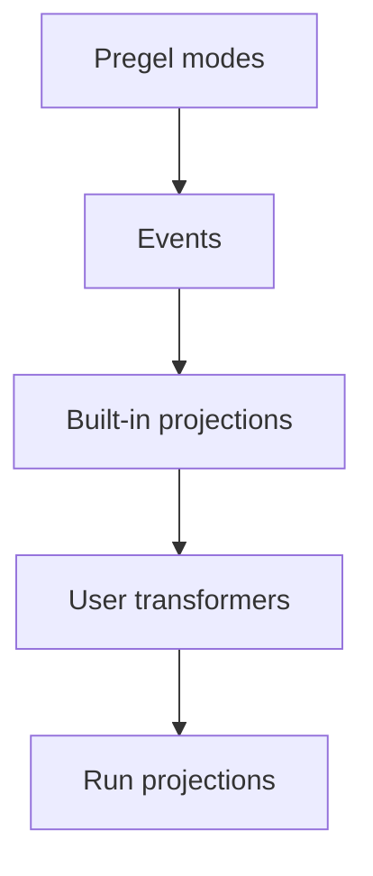

事件流式传输是大多数 LangGraph 应用代码推荐使用的进程内流式传输模型。它会返回一个运行流对象，并且可以同时以多种方式消费。

## 快速开始

:::python
```py
stream = graph.stream_events({
    "messages": [{"role": "user", "content": "What is 42 * 17?"}],
}, version="v3")

for message in stream.messages:
    for token in message.text:
        print(token, end="", flush=True)

final_state = stream.output
```
:::

:::js
```ts
const stream = await graph.streamEvents(
  { messages: [{ role: "user", content: "What is 42 * 17?" }] },
  { version: "v3" }
);

for await (const message of stream.messages) {
  for await (const token of message.text) {
    process.stdout.write(token);
  }
}

const finalState = await stream.output;
```
:::

如果你想对部署在 Agent Server 后面的图进行流式传输，请参阅 [LangSmith Streaming API](/langsmith/streaming)。

## 组件如何协作

流式传输栈有两个主要层：

1. **Streaming** 从 Pregel 引擎中发出原始图执行事件。
2. **Event streaming** 对这些事件进行规范化，经过流 transformer 处理，然后暴露出带类型的投影。

<div className="my-6 rounded-xl border bg-gray-50 p-4 dark:bg-gray-900">
  <div className="mx-auto max-w-2xl space-y-2 text-sm">
    <div className="rounded-lg border border-slate-300 bg-white p-3 text-center dark:border-slate-700 dark:bg-slate-950">
      <div className="font-semibold text-slate-900 dark:text-slate-100">Pregel 引擎</div>
      <div className="mt-1 text-xs text-slate-600 dark:text-slate-300">运行图步骤</div>
    </div>
    <div className="text-center text-xs font-medium uppercase tracking-wide text-slate-500 dark:text-slate-400">发出</div>
    <div className="rounded-lg border border-orange-300 bg-orange-50 p-3 text-center dark:border-orange-800 dark:bg-orange-950">
      <div className="font-semibold text-orange-900 dark:text-orange-100">原始 Pregel 事件</div>
      <div className="mt-1 text-xs text-orange-700 dark:text-orange-300"><code>updates</code>, <code>values</code>, <code>messages</code>, <code>custom</code>, <code>checkpoints</code>, <code>tasks</code>, <code>debug</code></div>
    </div>
    <div className="text-center text-xs font-medium uppercase tracking-wide text-slate-500 dark:text-slate-400">发送到</div>
    <div className="rounded-lg border border-blue-300 bg-blue-50 p-3 text-center dark:border-blue-800 dark:bg-blue-950">
      <div className="font-semibold text-blue-900 dark:text-blue-100">事件路由器</div>
      <div className="mt-1 text-xs text-blue-700 dark:text-blue-300">把每个事件路由到 transformer 管道</div>
    </div>
    <div className="text-center text-xs font-medium uppercase tracking-wide text-slate-500 dark:text-slate-400">级联经过</div>
    <div className="rounded-lg border border-green-300 bg-green-50 p-3 dark:border-green-800 dark:bg-green-950">
      <div className="font-semibold text-green-900 dark:text-green-100">流 transformers</div>
      <div className="mt-2 grid gap-2 text-xs text-green-800 dark:text-green-200 sm:grid-cols-4">
        <div className="rounded border border-green-200 bg-white px-2 py-1 dark:border-green-800 dark:bg-green-950">ValuesTransformer</div>
        <div className="rounded border border-green-200 bg-white px-2 py-1 dark:border-green-800 dark:bg-green-950">MessagesTransformer</div>
        <div className="px-2 py-1 text-center text-green-600 dark:text-green-300">...</div>
        <div className="rounded border border-green-200 bg-white px-2 py-1 dark:border-green-800 dark:bg-green-950">Custom transformers</div>
      </div>
    </div>
    <div className="text-center text-xs font-medium uppercase tracking-wide text-slate-500 dark:text-slate-400">产出</div>
    <div className="rounded-lg border border-purple-300 bg-purple-50 p-3 text-center dark:border-purple-800 dark:bg-purple-950">
      <div className="font-semibold text-purple-900 dark:text-purple-100">事件流</div>
      <div className="mt-1 text-xs text-purple-700 dark:text-purple-300">供应用代码消费的投影事件</div>
    </div>
  </div>
</div>

事件路由器是这两层之间的桥梁。它接收规范化后的 Pregel 事件，并把每个事件传给已注册的流 transformer。内置 transformer 会创建标准投影，例如 `stream.messages`、`stream.values`、`stream.subgraphs` 和 `stream.output`。自定义 transformer 可以在 `stream.extensions` 下添加应用专用投影。

## 事件流提供什么

运行流会在同一条事件流之上暴露带类型的投影：

| 投影 | 用途 |
| ---------- | --- |
| `stream` | 迭代所有协议事件。 |
| `stream.messages` | 流式输出聊天模型消息和 token delta。 |
| `stream.values` | 迭代状态快照并等待最终值。 |
| `stream.output` | 等待最终输出。 |
| `stream.subgraphs` | 发现并观察嵌套图执行。 |
| `stream.interrupts` | 检查 human-in-the-loop interrupt payload。 |
| `stream.interrupted` | 检查运行是否因人工输入而暂停。 |
| `stream.extensions` | 消费自定义流 transformer 投影。 |

多个消费者可以并发读取这些投影。读取 `stream.messages` 不会消耗 `stream.values`、`stream.subgraphs` 或 `stream.output` 所需的事件。

事件流位于 [streaming](/oss/langgraph/streaming) 的上一层。后者通过 `stream_mode` 模式暴露原始图执行事件，例如 `updates`、`values`、`messages`、`custom`、`checkpoints`、`tasks` 和 `debug`。当你需要这些模式的底层访问时使用 streaming；当应用代码更适合带类型的投影时使用 event streaming。

## 流式输出消息

对聊天模型输出使用 `stream.messages`：

:::python
```py
stream = graph.stream_events(input, version="v3")

for message in stream.messages:
    text = str(message.text)
    usage = message.output.usage_metadata

    print(text)
    print(usage)
```
:::

:::js
```ts
const stream = await graph.streamEvents(input, { version: "v3" });

for await (const message of stream.messages) {
  const text = await message.text;
  const usage = await message.usage;

  console.log(text);
  console.log(usage);
}
```
:::

:::python
`message.text` 在同步代码中是可迭代的。你可以逐 token 迭代它来输出，或者调用 `str(message.text)` 获取完整文本。

`message.reasoning` 暴露 reasoning delta，`message.tool_calls` 暴露 tool-call 参数块。如果你需要按精确到达顺序获取文本、reasoning 和 tool-call 块，请直接迭代消息流的原始事件，而不是分别迭代各个投影。
:::

:::js
`message.text` 既是一个 async iterable，也是一个类似 promise 的值。你可以逐 token 迭代它，也可以 await 它来获取完整文本。
:::

## 流式输出子图

使用 `stream.subgraphs` 可以在不解析 namespace 字符串的情况下观察嵌套图工作：

:::python
```py
stream = graph.stream_events(input, version="v3")

for subgraph in stream.subgraphs:
    print(subgraph.graph_name, subgraph.path)

    for message in subgraph.messages:
        print(message.text)
```
:::

:::js
```ts
const stream = await graph.streamEvents(input, { version: "v3" });

for await (const subgraph of stream.subgraphs) {
  console.log(subgraph.name, subgraph.path);

  for await (const message of subgraph.messages) {
    console.log(await message.text);
  }
}
```
:::

`subgraph.graph_name` 是已编译图或 agent 的 `name`。通过工具派发的命名 agent（例如经由 Deep Agents 的 `task` tool 调用的 `create_agent(name=...)`）会以这个名字出现在这里，而打开该作用域的 `lifecycle` 事件会携带一个 `cause`，把它和派发该工具调用关联起来。更多信息请参阅 [Lifecycle](#lifecycle)。

如需产品特定的流，请参阅 [Deep Agents streaming](/oss/deepagents/event-streaming) 了解 subagent 流，并参阅 [LangChain agent streaming](/oss/langchain/streaming) 了解 tool call 和 middleware 事件。

## 流式输出状态

使用 `stream.values` 可以在每一步之后流式输出完整状态快照：

:::python
```py
stream = graph.stream_events(input, version="v3")

for snapshot in stream.values:
    print(snapshot)

final_state = stream.output
```
:::

:::js
```ts
const stream = await graph.streamEvents(input, { version: "v3" });

for await (const snapshot of stream.values) {
  console.log(snapshot);
}

const finalState = await stream.output;
```
:::

## 同时流式输出多个投影

:::python
对于异步代码中的并发消费，可以使用 `astream_events` 和 `asyncio.gather`：

```py
import asyncio

stream = await graph.astream_events(input, version="v3")

async def consume_messages():
    async for message in stream.messages:
        print(f"[llm] node={message.node}")

async def consume_subgraphs():
    async for subgraph in stream.subgraphs:
        print(f"[subgraph] path={subgraph.path}")

await asyncio.gather(consume_messages(), consume_subgraphs())
```

对于同步代码，可以使用 `stream.interleave(...)` 按严格到达顺序消费多个投影：

```py
stream = graph.stream_events(input, version="v3")

for name, item in stream.interleave("values", "messages", "subgraphs"):
    if name == "values":
        print(f"[state] keys={list(item)}")
    elif name == "messages":
        print(f"[llm] node={item.node}")
    elif name == "subgraphs":
        print(f"[subgraph] path={item.path}")
```
:::

:::js
如果你在 JavaScript 中需要多个投影，可以使用并发消费者：

```ts
await Promise.all([
  (async () => {
    for await (const message of stream.messages) {
      console.log(await message.text);
    }
  })(),
  (async () => {
    for await (const subgraph of stream.subgraphs) {
      console.log(subgraph.path);
    }
  })(),
]);
```
:::

## 在 interrupt 之后恢复

当图因人工输入而暂停时，检查 `stream.interrupted` 和 `stream.interrupts`，然后再次调用 `stream_events(..., version="v3")` 并传入 `Command` 来恢复。

恢复需要一个带 checkpointer 编译的图，以及一个包含 thread ID 的 config - 请参阅 [persistence](/oss/langgraph/persistence)。

:::python
```py
from langgraph.types import Command

stream = graph.stream_events(input, version="v3")

for message in stream.messages:
    print(message.text)

if stream.interrupted:
    print(stream.interrupts)

stream = graph.stream_events(
    Command(resume={"decisions": [{"type": "approve"}]}),
    version="v3",
)
final_state = stream.output
```
:::

:::js
```ts
import { Command } from "@langchain/langgraph";

let stream = await graph.streamEvents(input, { version: "v3" });

for await (const message of stream.messages) {
  console.log(await message.text);
}

if (stream.interrupted) {
  console.log(stream.interrupts);
}

stream = await graph.streamEvents(
  new Command({ resume: { decisions: [{ type: "approve" }] } }),
  { version: "v3" }
);
const finalState = await stream.output;
```
:::

## 流式输出所有协议事件

当你需要原始协议事件流时，直接使用 run 对象本身：

:::python
```py
stream = graph.stream_events({
    "messages": [{"role": "user", "content": "What is 42 * 17?"}],
}, version="v3")

for event in stream:
    namespace = event["params"]["namespace"]
    print(namespace, event["method"], event["params"]["data"])
```
:::

:::js
```ts
const stream = await graph.streamEvents(
  { messages: [{ role: "user", content: "What is 42 * 17?" }] },
  { version: "v3" }
);

for await (const event of stream) {
  const namespace = event.params.namespace;
  console.log(namespace, event.method, event.params.data);
}
```
:::

每个事件都是一个 `ProtocolEvent` 封装，包裹着某个 channel 的 payload。transformer 的 `process(event)` 接收到的也是同样的结构。

:::python
```py
class ProtocolEvent(TypedDict):
    seq: int                    # 在单次运行中严格递增；用于排序
    method: str                 # channel 名称："messages"、"values"、"updates"、"custom"、"tools"、"lifecycle" ...
    params: ProtocolEventParams


class ProtocolEventParams(TypedDict):
    namespace: list[str]        # 从根图开始的 "<name>:<runtime_id>" 片段路径；[] 表示根
    timestamp: int              # 墙钟毫秒；可能漂移，不要依赖它排序
    data: Any                   # channel 专属 payload；形状取决于 `method`
```
:::

:::js
```ts
interface ProtocolEvent {
  readonly seq: number;         // 在单次运行中严格递增；用于排序
  readonly method: string;      // channel 名称："messages"、"values"、"updates"、"custom"、"tools"、"lifecycle" ...
  readonly params: {
    readonly namespace: string[];  // 从根图开始的 "<name>:<runtime_id>" 片段路径；[] 表示根
    readonly timestamp: number;    // 墙钟毫秒；可能漂移，不要依赖它排序
    readonly node?: string;        // 发出此事件的图节点（如适用）
    readonly data: unknown;        // channel 专属 payload；形状取决于 `method`
  };
}
```
:::

`namespace` 是从根图到发出事件的作用域路径。根就是空数组 `[]`。每个子执行都会添加一个 `"name:runtime_id"` 片段，因此子图里的工具调用看起来像 `["researcher:6f4d", "tools:91ac"]`。冒号前的 name 是稳定的图名或节点名；后缀是每次调用的 runtime ID。只有当你只关心某个子树时，才需要自己按 namespace 过滤原始事件 - 对嵌套图执行来说，`stream.subgraphs` 已经帮你做了这件事。

## Channels 和事件生命周期

原始事件流经由 channels 传递。channel 名称会出现在事件的 `method` 字段中；每个 channel 都会发出一种特定事件形状。

| Channel | 用途 |
| ------- | ------- |
| `values` | 完整图状态快照。 |
| `updates` | 按节点输出的状态增量。 |
| `messages` | 以 content block 为中心的聊天模型输出。 |
| `tools` | 工具调用开始、流式输出、完成和错误事件。 |
| `lifecycle` | 运行、子图和 subagent 的状态变化。 |
| `checkpoints` | 轻量级 checkpoint 封装，用于分支和 time travel。 |
| `input` | human-in-the-loop 的输入请求和响应。 |
| `tasks` | Pregel 任务创建和结果事件。 |
| `custom` | 来自图代码的用户自定义 payload。 |
| `custom:<name>` | 应用定义的流 transformer 输出。 |

带类型的投影（`stream.messages`、`stream.values` 等）就是基于这些 channels 构建的。你直接迭代 run 对象时，channel 名称会作为原始事件里的 `method` 字段出现。

### 消息

`messages` channel 以 content block 的形式建模输出。data 的 `event` 字段取值如下：

- `message-start`
- `content-block-start`
- `content-block-delta`
- `content-block-finish`
- `message-finish`

Content block 有明确边界：一个 block 先开始，发出零个或多个 delta，然后在同一条消息里的下一个 block 开始前结束。这样可以显式表示 token 流、reasoning block、tool-call block 和多模态内容，而不需要依赖提供方特定格式。`message-finish` 可能包含 token usage；不可恢复的模型调用失败会作为消息错误事件到达。

如果你想直接消费原始 content-block 事件，而不是使用 `stream.messages` 投影：

:::python
```py
for event in stream:
    if event["method"] != "messages":
        continue

    data = event["params"]["data"][0]
    if not isinstance(data, dict):
        continue
    if data.get("event") != "content-block-delta":
        continue

    block = data.get("delta") or {}
    if block.get("type") == "text-delta":
        print(block.get("text", ""), end="", flush=True)
    elif block.get("type") == "reasoning-delta":
        print(f"[thinking]{block.get('reasoning', '')}", end="", flush=True)
```
:::

:::js
```ts
for await (const event of stream) {
  if (event.method !== "messages") continue;

  const data = event.params.data;
  if (data.event !== "content-block-delta") continue;

  const block = data.delta ?? {};
  if (block.type === "text-delta") {
    process.stdout.write(block.text ?? "");
  } else if (block.type === "reasoning-delta") {
    process.stdout.write(`[thinking]${block.reasoning ?? ""}`);
  }
}
```
:::

### Tools

`tools` channel 暴露工具执行。data 的 `event` 字段取值如下：

- `tool-started`
- `tool-output-delta`
- `tool-finished`
- `tool-error`

工具事件通过 tool call ID 关联，所以某次工具执行可以通过 `messages` channel 上对应的 tool-call content block 追溯回它的来源。

### Lifecycle

`lifecycle` channel 跟踪根运行、子图和 subagent 的状态。data 的 `event` 字段取值如下：

- `started`
- `running`
- `completed`
- `failed`
- `interrupted`

除了 `event` 之外，lifecycle data 还可能包含可选的 `graph_name`、`error` 和 `cause`，用于描述子作用域为什么会启动（父工具调用、fan-out send、边转移）。

## 构建你自己的投影

Stream transformer 是 event streaming 里的投影层。它们会观察 protocol events，维护自己的状态，并暴露一个运行的派生视图 - 例如工具活动、token 总数、进度事件、artifact，或者另一种协议的消息。`StreamChannel` 是 transformer 用来发布这些视图的投影原语。

内置投影（`stream.messages`、`stream.values`、`stream.subgraphs`、`stream.output`）以及产品特定投影（LangChain 的 `stream.tool_calls`、Deep Agents 的 `stream.subagents`）本身也是遵循同一契约的 transformer。用户自定义 transformer 可以通过编译时或调用时注册叠加上去，它们的投影会出现在 `stream.extensions` 下。

当现有投影无法满足应用需要的形状时，就自己写一个。

### Transformer 如何工作

Event streaming 从 LangGraph Pregel 引擎的输出流开始。运行时会把这些 chunk 规范化成 protocol events，然后由 stream handler 把每个事件路由到一组 stream transformer 中。



stream handler 是单次流的中央调度器。对于每个 protocol event，它会：

1. 按顺序调用每个已注册 transformer 的 `process(event)` 钩子。
2. 把命名的 `StreamChannel` push 重新连接回 protocol event stream。
3. 除非 transformer 抑制该事件，否则会把它存入 run stream。
4. 在运行结束时，对每个 transformer 调用 `finalize()` 或 `fail()`。

Transformer 只做观察。它们不会回调图运行时。相反，它们消费事件，并把派生值推入 `StreamChannel`、promise 或其他投影对象中。

### Transformer 形状

Transformer 实现 `StreamTransformer` 接口：

:::python
```py
from langgraph.stream import ProtocolEvent, StreamTransformer


class MyTransformer(StreamTransformer):
    def init(self) -> dict:
        ...

    def process(self, event: ProtocolEvent) -> bool:
        ...

    def finalize(self) -> None:
        ...

    def fail(self, err: BaseException) -> None:
        ...
```
:::

:::js
```ts
interface StreamTransformer<TProjection = unknown> {
  init(): TProjection;
  process(event: ProtocolEvent): boolean;
  finalize?(): void | PromiseLike<void>;
  fail?(err: unknown): void;
}
```
:::

- `init()` 会创建投影对象。用户 transformer 的投影会出现在 `stream.extensions` 下。
- `process()` 会观察每个 protocol event。`ProtocolEvent` 的形状请参阅 [流式输出所有协议事件](#stream-all-protocol-events)。只有在你确实想抑制原始事件时，才返回 `false`。
- `finalize()` 会在流成功结束后关闭或解析非 channel 投影。
- `fail()` 会把错误传播到非 channel 投影。

### 声明所需的 stream modes

`required_stream_modes` 控制底层图在流式传输期间会发出哪些 Pregel stream modes。运行时会把所有已注册 transformer 的 `required_stream_modes` 取并集，并把这个并集作为 `stream_mode` 参数传给图的 `.stream()` 调用。**没有任何 transformer 请求的 modes 永远不会发出** - 声明 `("custom",)` 才会让 `custom` 事件真正流经运行。

:::python
```py
class CustomTransformer(StreamTransformer):
    required_stream_modes = ("custom",)  # [!code highlight]

    def process(self, event: ProtocolEvent) -> bool:
        if event["method"] == "custom":
            ...
        return True
```
:::

`process()` 会接收图发出的每个事件，并负责按 `event["method"]` 进行过滤。这个声明只会打开上游事件发出，不会限制 `process()` 能看到什么。有效值就是 Pregel stream modes：`"messages"`、`"tools"`、`"custom"`、`"values"`、`"updates"`、`"checkpoints"`、`"tasks"`、`"debug"`。每个 transformer 都必须声明它会处理的所有 mode - 缺失的 mode 不会被图发出，也永远到不了 `process()`。

### StreamChannel

`StreamChannel` 是 transformer 用来流式传输值的投影原语。它总会在 `stream.extensions.<name>` 上暴露一个可迭代流。构造函数参数决定每次 `push()` 是否也会作为 `custom:<name>` 事件流入运行的主事件流 - 也就是，这个投影的值是否会在你迭代原始 protocol events 时出现。

:::js
| 需求 | 使用 |
| ---- | --- |
| 仅侧通道投影 | `new StreamChannel<T>()` |
| 每次 push 也流入主事件流 | `new StreamChannel<T>(name)` |
:::

:::python
| 需求 | 使用 |
| ---- | --- |
| 仅侧通道投影 | `StreamChannel()` |
| 每次 push 也流入主事件流 | `StreamChannel(name)` |
:::

命名 channel 的 payload 必须是可序列化的，因为每个 push 的值也会成为主流中的一个 `custom:<name>` protocol event。请把 promise、async iterable、类实例和其他进程内对象放在未命名 channel 里。

stream handler 负责 channel 生命周期。`init()` 返回一个 channel 后，运行结束时它会替你关闭或失败这个 channel。Transformer 只负责 push 值。

### 示例：命名 channel

给 `StreamChannel` 传入一个字符串 name，就能通过 `stream.extensions` 暴露一个流式投影，同时把每个 push 的值作为 `custom:<name>` protocol event 发送到运行的主事件流中：

:::python
```py
from typing import TypedDict

from langgraph.stream import ProtocolEvent, StreamChannel, StreamTransformer


class ToolActivity(TypedDict):
    name: str
    status: str


class ToolActivityTransformer(StreamTransformer):
    required_stream_modes = ("tools",)

    def __init__(self, scope: tuple[str, ...] = ()) -> None:
        super().__init__(scope)
        self.activity = StreamChannel[ToolActivity]("tool_activity")

    def init(self) -> dict:
        return {"tool_activity": self.activity}

    def process(self, event: ProtocolEvent) -> bool:
        if event["method"] != "tools":
            return True

        data = event["params"]["data"]
        if isinstance(data, dict) and data.get("tool_name") and data.get("event"):
            status = "error" if data["event"] == "tool-error" else "started"
            self.activity.push({"name": data["tool_name"], "status": status})
        return True
```
:::

:::js
```ts
import { StreamChannel } from "@langchain/langgraph";

const toolActivityTransformer = () => {
  const activity = new StreamChannel<{
    name: string;
    status: "started" | "finished" | "error";
  }>("toolActivity");

  return {
    init: () => ({ toolActivity: activity }),
    process(event) {
      if (event.method === "tools") {
        const data = event.params.data as { tool_name?: string; event?: string };
        if (data.tool_name && data.event) {
          activity.push({
            name: data.tool_name,
            status: data.event === "tool-error" ? "error" : "started",
          });
        }
      }
      return true;
    },
  };
};
```
:::

### 示例：未命名 channel

如果没有 name，这个 channel 就只是一个侧通道投影 - 可以在 `stream.extensions` 中访问，但对迭代原始事件的消费者不可见。对于需要保存进程内对象（promise、async iterable、类实例）且无法序列化到主事件流中的投影，这是更合适的选择。

下面的示例把一个未命名 channel 与 `get_stream_writer` 配合使用，这样图节点就可以发出 `custom` channel 事件，而 transformer 再把这些事件吸收到投影里：

:::python
```py
from langgraph.config import get_stream_writer
from langgraph.stream import ProtocolEvent, StreamChannel, StreamTransformer


def node(state):
    writer = get_stream_writer()
    writer({"kind": "progress", "message": "retrieving context"})
    return state


class CustomTransformer(StreamTransformer):
    required_stream_modes = ("custom",)

    def __init__(self, scope: tuple[str, ...] = ()) -> None:
        super().__init__(scope)
        self.log = StreamChannel()

    def init(self) -> dict:
        return {"custom": self.log}

    def process(self, event: ProtocolEvent) -> bool:
        if event["method"] == "custom":
            self.log.push(event["params"]["data"])
        return True


stream = graph.stream_events(input, version="v3", transformers=[CustomTransformer])

for item in stream.extensions["custom"]:
    print(item)
```
:::

:::js
```ts
import { StreamChannel } from "@langchain/langgraph";

const customTransformer = () => {
  const custom = new StreamChannel<unknown>();

  return {
    init: () => ({ custom }),
    process(event) {
      if (event.method === "custom") {
        custom.push(event.params.data);
      }
      return true;
    },
  };
};
```
:::

### 示例：最终值投影

当投影不应该流入主事件流时，请使用未命名 stream、promise 或其他进程内对象：

:::python
```py
from langgraph.stream import ProtocolEvent, StreamChannel, StreamTransformer


class StatsTransformer(StreamTransformer):
    required_stream_modes = ("messages",)

    def __init__(self, scope: tuple[str, ...] = ()) -> None:
        super().__init__(scope)
        self.total_tokens = 0
        self.total_tokens_log = StreamChannel[int]()

    def init(self) -> dict:
        return {"total_tokens": self.total_tokens_log}

    def process(self, event: ProtocolEvent) -> bool:
        data = event["params"]["data"]
        if isinstance(data, dict):
            usage = data.get("usage") or {}
            self.total_tokens += usage.get("output_tokens") or 0
        return True

    def finalize(self) -> None:
        self.total_tokens_log.push(self.total_tokens)
        self.total_tokens_log.close()
```
:::

:::js
```ts
const statsTransformer = () => {
  let totalTokens = 0;
  let resolveTotal!: (value: number) => void;
  const totalTokensPromise = new Promise<number>((resolve) => {
    resolveTotal = resolve;
  });

  return {
    init: () => ({ totalTokens: totalTokensPromise }),
    process(event) {
      if (event.method === "messages") {
        const data = event.params.data as { usage?: { output_tokens?: number } };
        totalTokens += data.usage?.output_tokens ?? 0;
      }
      return true;
    },
    finalize: () => resolveTotal(totalTokens),
  };
};
```
:::

### 在调用时或编译时注册

在本地试验时，可以在调用时传入 transformer：

:::python
```py
stream = graph.stream_events(
    input,
    version="v3",
    transformers=[StatsTransformer, ToolActivityTransformer],
)
```
:::

:::js
```ts
const stream = await graph.streamEvents(input, {
  version: "v3",
  transformers: [statsTransformer, toolActivityTransformer],
});
```
:::

如果希望图的每次运行都产生这个投影，可以在编译图时把 transformer 编进去：

:::python
```py
graph = builder.compile(
    transformers=[StatsTransformer, ToolActivityTransformer],
)
```
:::

:::js
```ts
const graph = builder.compile({
  transformers: [statsTransformer, toolActivityTransformer],
});
```
:::

### 内置：`ToolCallTransformer`

:::python
LangGraph 内置了 `ToolCallTransformer`。注册它之后，就能在普通 `StateGraph` 上暴露 `stream.tool_calls`：

```py
from langgraph.prebuilt import ToolCallTransformer

stream = graph.stream_events(input, version="v3", transformers=[ToolCallTransformer])

for tool_call in stream.tool_calls:
    print(tool_call.tool_name, tool_call.input)
```
:::

## 相关内容

LangGraph 定义了流式传输原语。如果你想在 LangChain 或 Deep Agents 中使用流式传输，请查看相关产品文档：

- [LangChain agent streaming](/oss/langchain/event-streaming) 介绍 ReAct 风格的 agent 消息、tool call 和 middleware 更新。
- [Deep Agents streaming](/oss/deepagents/event-streaming) 介绍 subagent、嵌套消息和 subagent tool call。
- [LangChain frontend patterns](/oss/langchain/frontend/overview) 和 [LangGraph frontend patterns](/oss/langgraph/frontend/overview) 展示建立在流式状态之上的 UI 用例。
- [LangSmith Streaming API](/langsmith/streaming) 介绍部署在 Agent Server 后面的图如何进行流式传输。

线级事件和 command 格式定义在 [Agent Protocol](https://github.com/langchain-ai/agent-protocol) 仓库中，也可以通过 PyPI 上的 [`langchain-protocol`](https://pypi.org/project/langchain-protocol/) 和 npm 上的 [`@langchain/protocol`](https://www.npmjs.com/package/@langchain/protocol) 使用。
