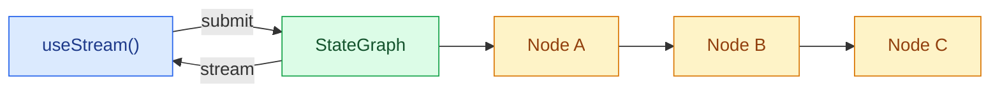

构建可以实时可视化 LangGraph 流程的前端。这些模式展示了如何从自定义 `StateGraph` 工作流中渲染多步图执行、每个节点的状态以及流式内容。

LangGraph 的前端优势在于，UI 可以沿用图的同一结构。节点、state key、checkpoint、interrupt、子图和流式消息都是可见的运行时概念，因此你可以构建解释系统正在做什么的界面，而不是把执行过程隐藏成一条 assistant 消息。

<Note>
这些模式使用的是 v1 前端 SDK 包。如果你使用的是更早版本，请查看 [React](https://github.com/langchain-ai/langgraphjs/blob/main/libs/sdk-react/docs/v1-migration.md)、[Vue](https://github.com/langchain-ai/langgraphjs/blob/main/libs/sdk-vue/docs/v1-migration.md)、[Svelte](https://github.com/langchain-ai/langgraphjs/blob/main/libs/sdk-svelte/docs/v1-migration.md) 和 [Angular](https://github.com/langchain-ai/langgraphjs/blob/main/libs/sdk-angular/docs/v1-migration.md) 的迁移指南。
</Note>

## 架构

LangGraph 图由通过边连接的命名节点组成。每个节点执行一个步骤（分类、检索、分析、综合），并把输出写入特定的 state key。在前端，SDK 的 stream handle 会提供对节点输出、流式 token 和已发现子图的响应式访问，因此你可以把每个节点映射成一个 UI 卡片。



:::python

```python
from langgraph.graph import StateGraph, MessagesState, START, END

class State(MessagesState):
    classification: str
    research: str
    analysis: str
    synthesis: str

graph = StateGraph(State)
graph.add_node("classify", classify_node)
graph.add_node("do_research", research_node)
graph.add_node("analyze", analyze_node)
graph.add_node("synthesize", synthesize_node)
graph.add_edge(START, "classify")
graph.add_edge("classify", "do_research")
graph.add_edge("do_research", "analyze")
graph.add_edge("analyze", "synthesize")
graph.add_edge("synthesize", END)

app = graph.compile()
```

:::

:::js

```ts
import { Annotation, MessagesAnnotation, StateGraph, START, END } from "@langchain/langgraph";

const State = Annotation.Root({
  ...MessagesAnnotation.spec,
  classification: Annotation<string>(),
  research: Annotation<string>(),
  analysis: Annotation<string>(),
  synthesis: Annotation<string>(),
});

const graph = new StateGraph(State)
  .addNode("classify", classifyNode)
  .addNode("do_research", researchNode)
  .addNode("analyze", analyzeNode)
  .addNode("synthesize", synthesizeNode)
  .addEdge(START, "classify")
  .addEdge("classify", "do_research")
  .addEdge("do_research", "analyze")
  .addEdge("analyze", "synthesize")
  .addEdge("synthesize", END)
  .compile();
```

:::

在前端，@[`useStream`] 会暴露 `stream.subgraphs` 用于图节点发现，以及 `useMessages(stream, node)` 之类的 selector 辅助方法，用于读取节点作用域内的流式内容。需要 `synthesis` 这类字段时，`stream.values` 仍然保存完整的图 state。Angular 通过 @[`injectStream`] 提供相同的 stream API 形状。

```ts
import { useStream } from "@langchain/react";

function Pipeline() {
  const stream = useStream<typeof graph>({
    apiUrl: "http://localhost:2024",
    assistantId: "pipeline",
  });

  const classification = stream.values?.classification;
  const research = stream.values?.research;
  const analysis = stream.values?.analysis;
  const graphNodes = [...stream.subgraphs.values()];
}
```

## 这与聊天流有什么不同

自定义图通常支撑的是产品工作流：研究流程、审批流、数据流水线、数据增强、代码审查、规划和多步分析。前端 SDK 让你可以用图原生信号来渲染这些工作流：

| 运行时概念 | 前端 UX |
| --- | --- |
| **命名节点** | 每个图节点对应一个卡片、时间线步骤或状态徽标。 |
| **State key** | 为分类、来源、分析和最终综合结果等类型化输出提供独立 UI 区域。 |
| **流式元数据** | 把增量消息路由到产生它们的节点。 |
| **Checkpoints** | 检查或从之前的图状态恢复，用于调试和审计。 |
| **Interrupts** | 暂停节点以等待人工输入、批准或修正，然后继续。 |
| **子图** | 仅在用户需要更多细节时展示嵌套执行。 |

因为 SDK 直接暴露了这些概念，所以你可以从一个简单的聊天面板扩展到完整的工作流调试器，而无需更改后端协议。

## 模式

<CardGroup cols={2}>
  <Card title="Graph execution" icon="chart-dots" href="/oss/langgraph/frontend/graph-execution">
    可视化多步骤图流程，显示每个节点的状态和流式内容。
  </Card>
  <Card title="Custom stream channels" icon="broadcast" href="/oss/langgraph/frontend/custom-stream-channels">
    把服务器端自定义数据流式传到前端，并通过 `useExtension` 和 `useChannel` 读取。
  </Card>
</CardGroup>

## 相关模式

[LangChain 前端模式](/oss/langchain/frontend/overview) - markdown 消息、工具调用、人机交互、可恢复流和时间旅行 - 也适用于任何 LangGraph 图。无论你使用 `createAgent`、`createDeepAgent` 还是自定义 `StateGraph`，stream API 都提供相同的核心数据模型。
