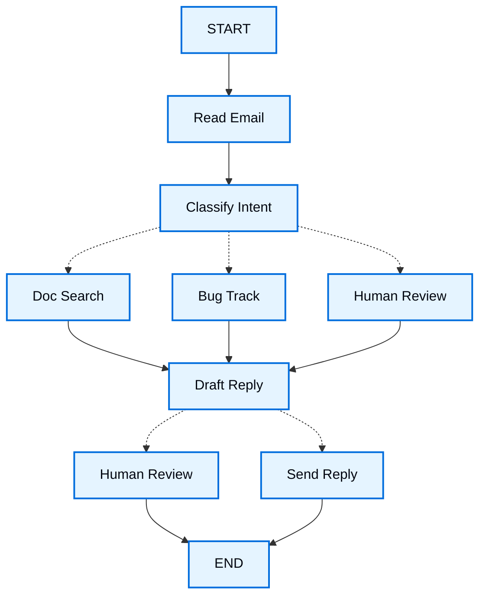

import LanggraphThinkingHitlV2Py from '/snippets/code-samples/langgraph-thinking-hitl-v2-py.mdx';

当你用 LangGraph 构建 agent 时，通常会先把它拆成离散的步骤，也就是 **nodes**。然后，你会描述从每个 node 出发的不同决策和转换。最后，你会通过一个共享的 **state** 把这些 nodes 连接起来，让每个 node 都能读取和写入。

在这篇 walkthrough 里，我们会带你一起思考如何用 LangGraph 构建一个客户支持邮件 agent。

## 从你要自动化的流程开始

假设你需要构建一个 AI agent 来处理客户支持邮件。产品团队给你的需求如下：

```txt
这个 agent 应该能够：

- 读取客户发来的邮件
- 按紧急程度和主题分类
- 搜索相关文档来回答问题
- 起草合适的回复
- 将复杂问题升级给人工客服
- 在需要时安排后续跟进

需要处理的示例场景：

1. 简单产品问题："How do I reset my password?"
2. Bug 报告："The export feature crashes when I select PDF format"
3. 紧急账单问题："I was charged twice for my subscription!"
4. 功能请求："Can you add dark mode to the mobile app?"
5. 复杂技术问题："Our API integration fails intermittently with 504 errors"
```

要在 LangGraph 中实现一个 agent，通常会遵循同样的五个步骤。

## 第 1 步：把工作流拆成离散步骤

先识别流程中的不同步骤。每一步都会变成一个 **node**（只负责做一件事的函数）。然后画出这些步骤之间的连接方式。



这个图里的箭头展示的是可能路径，但实际该走哪条路，是在每个 node 内部决定的。

现在我们已经识别出工作流中的组件，接下来看看每个 node 需要做什么：

- `Read Email`：提取并解析邮件内容
- `Classify Intent`：使用 LLM 对紧急程度和主题进行分类，然后路由到相应动作
- `Doc Search`：在知识库中查询相关信息
- `Bug Track`：在跟踪系统中创建或更新 issue
- `Draft Reply`：生成合适的回复
- `Human Review`：升级给人工客服进行审批或处理
- `Send Reply`：发送邮件回复

<Tip>
注意，有些 node 会决定下一步走向哪里（`Classify Intent`、`Draft Reply`、`Human Review`），而另一些 node 会总是继续到同一个下一步（`Read Email` 总是到 `Classify Intent`，`Doc Search` 总是到 `Draft Reply`）。
</Tip>

## 第 2 步：识别每个步骤需要做什么

对于图中的每个 node，先确定它代表什么类型的操作，以及它需要什么上下文才能正常工作。

<CardGroup cols={2}>
    <Card title="LLM 步骤" icon="brain" href="#llm-steps">
        在你需要理解、分析、生成文本或做推理决策时使用
    </Card>
    <Card title="数据步骤" icon="database" href="#data-steps">
        在你需要从外部来源检索信息时使用
    </Card>
    <Card title="动作步骤" icon="bolt" href="#action-steps">
        在你需要执行外部动作时使用
    </Card>
    <Card title="用户输入步骤" icon="user" href="#user-input-steps">
        在你需要人工介入时使用
    </Card>
</CardGroup>

### LLM 步骤

当某一步需要理解、分析、生成文本或做推理决策时：

<AccordionGroup>
    <Accordion title="Classify intent">
        - 静态上下文（prompt）：分类类别、紧急程度定义、响应格式
        - 动态上下文（来自 state）：邮件内容、发件人信息
        - 目标结果：决定路由的结构化分类结果
    </Accordion>

    <Accordion title="Draft reply">
        - 静态上下文（prompt）：语气指南、公司政策、回复模板
        - 动态上下文（来自 state）：分类结果、搜索结果、客户历史
        - 目标结果：可供审查的专业邮件回复
    </Accordion>
</AccordionGroup>

### 数据步骤

当某一步需要从外部来源检索信息时：

<AccordionGroup>
    <Accordion title="Document search">
        - 参数：根据 intent 和 topic 构造的查询
        - 重试策略：需要，针对短暂失败使用指数退避
        - 缓存：可以缓存常见查询，以减少 API 调用
    </Accordion>

    <Accordion title="Customer history lookup">
        - 参数：来自 state 的客户 email 或 ID
        - 重试策略：需要，但在不可用时回退到基础信息
        - 缓存：需要，使用 TTL 在新鲜度和性能之间平衡
    </Accordion>
</AccordionGroup>

### 动作步骤

当某一步需要执行外部动作时：

<AccordionGroup>
    <Accordion title="Send reply">
        - 执行时机：审批之后（人工或自动）
        - 重试策略：需要，针对网络问题使用指数退避
        - 不应缓存：每次发送都是一次独立动作
    </Accordion>

    <Accordion title="Bug track">
        - 执行时机：只要 intent 是 "bug" 就执行
        - 重试策略：需要，不能丢失 bug 报告
        - 返回值：包含在回复中的 ticket ID
    </Accordion>
</AccordionGroup>

### 用户输入步骤

当某一步需要人工介入时：

<AccordionGroup>
    <Accordion title="Human review node">
        - 决策上下文：原始邮件、草稿回复、紧急程度、分类结果
        - 预期输入格式：审批布尔值，外加可选的编辑后回复
        - 触发条件：高紧急度、复杂问题或质量疑虑
    </Accordion>
</AccordionGroup>

## 第 3 步：设计你的 state

State 是所有 node 都能访问的共享 [memory](/oss/concepts/memory)。你可以把它看作 agent 用来记录在执行流程中学到和决定的一切的笔记本。

### 哪些内容应该放进 state？

针对每一条数据，问自己下面这些问题：

<CardGroup cols={2}>
    <Card title="放进 state" icon="check">
        它是否需要跨步骤保留？如果是，就放进 state。
    </Card>

    <Card title="不要存储" icon="code">
        它能否从其他数据推导出来？如果能，就在需要时计算，而不是存进 state。
    </Card>
</CardGroup>

对于我们的邮件 agent，我们需要追踪这些内容：

- 原始邮件和发件人信息（之后无法重建）
- 分类结果（后续多个 node 都会用到）
- 搜索结果和客户数据（重新获取成本高）
- 草稿回复（需要通过审查流程保留）
- 执行元数据（用于调试和恢复）

### 保持 state 原始，把 prompt 按需格式化

<Tip>
    一个关键原则：你的 state 应该存原始数据，而不是格式化后的文本。需要时在 node 内部再格式化 prompt。
</Tip>

这样分离意味着：

- 不同 node 可以按各自需要，以不同方式格式化同一份数据
- 你可以修改 prompt 模板，而不必改动 state schema
- 调试会更清晰，你能看到每个 node 实际接收的数据
- 你的 agent 可以演进，而不会破坏现有 state

先定义我们的 state：

:::python

```python
from typing import TypedDict, Literal

# 定义邮件分类结构
class EmailClassification(TypedDict):
    intent: Literal["question", "bug", "billing", "feature", "complex"]
    urgency: Literal["low", "medium", "high", "critical"]
    topic: str
    summary: str

class EmailAgentState(TypedDict):
    # 原始邮件数据
    email_content: str
    sender_email: str
    email_id: str

    # 分类结果
    classification: EmailClassification | None

    # 原始搜索 / API 结果
    search_results: list[str] | None  # 原始文档块列表
    customer_history: dict | None  # 来自 CRM 的原始客户数据

    # 生成内容
    draft_response: str | None
    messages: list[str] | None
```

:::

:::js

```typescript
import { StateSchema } from "@langchain/langgraph";
import * as z from "zod";

// 定义邮件分类结构
const EmailClassificationSchema = z.object({
  intent: z.enum(["question", "bug", "billing", "feature", "complex"]),
  urgency: z.enum(["low", "medium", "high", "critical"]),
  topic: z.string(),
  summary: z.string(),
});

const EmailAgentState = new StateSchema({
  // 原始邮件数据
  emailContent: z.string(),
  senderEmail: z.string(),
  emailId: z.string(),

  // 分类结果
  classification: EmailClassificationSchema.optional(),

  // 原始搜索 / API 结果
  searchResults: z.array(z.string()).optional(),  // 原始文档块列表
  customerHistory: z.record(z.string(), z.any()).optional(),  // 来自 CRM 的原始客户数据

  // 生成内容
  responseText: z.string().optional(),
});

type EmailClassificationType = z.infer<typeof EmailClassificationSchema>;
```

:::


请注意，state 只包含原始数据，没有 prompt 模板、格式化字符串，也没有指令。分类输出会被直接作为一个字典存储，原样来自 LLM。

## 第 4 步：构建你的 nodes

:::python

现在我们把每一步都实现成一个函数。LangGraph 里的 node 本质上就是一个 Python 函数，它接收当前 state，并返回对 state 的更新。

:::

:::js

现在我们把每一步都实现成一个函数。LangGraph 里的 node 本质上就是一个 JavaScript 函数，它接收当前 state，并返回对 state 的更新。

:::

### 正确处理错误

不同类型的错误需要不同的处理策略：

| 错误类型 | 谁来修复 | 策略 | 适用场景 |
|------------|--------------|----------|-------------|
| 短暂性错误（网络问题、限流） | 系统（自动） | 重试策略 | 通常重试后能恢复的临时失败 |
| LLM 可恢复错误（工具失败、解析问题） | LLM | 把错误存入 state 并回到循环 | LLM 能看到错误并调整做法 |
| 用户可修复错误（缺少信息、指令不清） | 人工 | 用 `interrupt()` 暂停 | 需要用户输入才能继续 |
| 重试耗尽后的可恢复失败 | 开发者（声明式） | `error_handler` | 重试失败后运行补偿 / 恢复分支 |
| 未预期错误 | 开发者 | 直接冒泡 | 需要调试的未知问题 |

<Tabs>
    <Tab title="短暂性错误" icon="rotate">
        为节点添加重试策略，自动重试网络问题和限流错误。

    :::python

    结合 `timeout=` 可以限制每次尝试的耗时。完整生命周期请参阅 [Fault tolerance](/oss/langgraph/fault-tolerance)。

    ```python
    from langgraph.types import RetryPolicy

    workflow.add_node(
        "search_documentation",
        search_documentation,
        retry_policy=RetryPolicy(max_attempts=3, initial_interval=1.0)
    )
    ```

    :::

    :::js

    ```typescript
    import type { RetryPolicy } from "@langchain/langgraph";

    workflow.addNode(
      "searchDocumentation",
      searchDocumentation,
      {
        retryPolicy: { maxAttempts: 3, initialInterval: 1.0 },
      },
    );
    ```

    :::

    </Tab>

    <Tab title="LLM 可恢复" icon="brain">
        把错误存入 state 并回到循环，这样 LLM 就能看到发生了什么，然后再试一次：

    :::python

    ```python
    from langgraph.types import Command


    def execute_tool(state: State) -> Command[Literal["agent", "execute_tool"]]:
        try:
            result = run_tool(state['tool_call'])
            return Command(update={"tool_result": result}, goto="agent")
        except ToolError as e:
            # 让 LLM 看到发生了什么，然后再试一次
            return Command(
                update={"tool_result": f"Tool error: {str(e)}"},
                goto="agent"
            )
    ```

    :::

    :::js

    ```typescript
    import { Command, GraphNode } from "@langchain/langgraph";

    const executeTool: GraphNode<typeof State> = async (state, config) => {
      try {
        const result = await runTool(state.toolCall);
        return new Command({
          update: { toolResult: result },
          goto: "agent",
        });
      } catch (error) {
        // 让 LLM 看到发生了什么，然后再试一次
        return new Command({
          update: { toolResult: `Tool error: ${error}` },
          goto: "agent"
        });
      }
    }
    ```

    :::

    </Tab>

    <Tab title="用户可修复" icon="user">
        当需要时暂停并向用户收集信息（比如 account ID、订单号或澄清说明）：

    :::python

    ```python
    from langgraph.types import Command


    def lookup_customer_history(state: State) -> Command[Literal["draft_response"]]:
        if not state.get('customer_id'):
            user_input = interrupt({
                "message": "Customer ID needed",
                "request": "Please provide the customer's account ID to look up their subscription history"
            })
            return Command(
                update={"customer_id": user_input['customer_id']},
                goto="lookup_customer_history"
            )
        # 现在继续查询
        customer_data = fetch_customer_history(state['customer_id'])
        return Command(update={"customer_history": customer_data}, goto="draft_response")
    ```

    :::

    :::js

    ```typescript
    import { Command, GraphNode, interrupt } from "@langchain/langgraph";

    const lookupCustomerHistory: GraphNode<typeof State> = async (state, config) => {
      if (!state.customerId) {
        const userInput = interrupt({
          message: "Customer ID needed",
          request: "Please provide the customer's account ID to look up their subscription history",
        });
        return new Command({
          update: { customerId: userInput.customerId },
          goto: "lookupCustomerHistory",
        });
      }
      // 现在继续查询
      const customerData = await fetchCustomerHistory(state.customerId);
      return new Command({
        update: { customerHistory: customerData },
        goto: "draftResponse",
      });
    }
    ```

    :::

    </Tab>

    <Tab title="未预期" icon="alert-triangle">
        让它们直接冒泡用于调试。不要去捕获你无法处理的错误：

    :::python

    ```python
    def send_reply(state: EmailAgentState):
        try:
            email_service.send(state["draft_response"])
        except Exception:
            raise  # 暴露未预期错误
    ```

    :::

    :::js

    ```typescript
    import { Command, GraphNode } from "@langchain/langgraph";

    const sendReply: GraphNode<typeof EmailAgentState> = async (state, config) => {
      try {
        await emailService.send(state.responseText);
      } catch (error) {
        throw error;  // 暴露未预期错误
      }
    }
    ```

    :::

    </Tab>

    <Tab title="Saga / 补偿" icon="arrows-exchange">
        当重试耗尽后，运行一个恢复函数来更新 state，并把流程路由到补偿分支。

    :::python

    完整模式请参阅 [Fault tolerance](/oss/langgraph/fault-tolerance#error-handling)。

    <Note>
    `error_handler` 需要 `langgraph>=1.2`。
    </Note>

    ```python
    from langgraph.errors import NodeError
    from langgraph.types import Command, RetryPolicy

    def payment_error_handler(state: State, error: NodeError) -> Command:
        return Command(
            update={"status": f"compensated: {error.error}"},
            goto="finalize",
        )

    workflow.add_node(
        "charge_payment",
        charge_payment,
        retry_policy=RetryPolicy(max_attempts=3, retry_on=ConnectionError),
        error_handler=payment_error_handler,
    )
    ```

    :::

    </Tab>
</Tabs>


### 实现我们的 email agent nodes

我们会把每个 node 实现成一个简单函数。记住：node 接收 state，执行工作，然后返回更新。

<AccordionGroup>
    <Accordion title="读取和分类 nodes" icon="brain">

    :::python

    ```python
    from typing import Literal
    from langgraph.graph import StateGraph, START, END
    from langgraph.types import interrupt, Command, RetryPolicy
    from langchain_openai import ChatOpenAI
    from langchain.messages import HumanMessage

    llm = ChatOpenAI(model="gpt-5-nano")

    def read_email(state: EmailAgentState) -> dict:
        """提取并解析邮件内容"""
        # 在生产环境中，这里会连接你的邮件服务
        return {
            "messages": [HumanMessage(content=f"Processing email: {state['email_content']}")]
        }

    def classify_intent(state: EmailAgentState) -> Command[Literal["search_documentation", "human_review", "draft_response", "bug_tracking"]]:
        """使用 LLM 对邮件意图和紧急程度进行分类，然后相应路由"""

        # 创建返回 EmailClassification 字典的结构化 LLM
        structured_llm = llm.with_structured_output(EmailClassification)

        # 按需格式化 prompt，不存进 state
        classification_prompt = f"""
        Analyze this customer email and classify it:

        Email: {state['email_content']}
        From: {state['sender_email']}

        Provide classification including intent, urgency, topic, and summary.
        """

        # 直接获取结构化响应字典
        classification = structured_llm.invoke(classification_prompt)

        # 根据分类结果决定下一个 node
        if classification['intent'] == 'billing' or classification['urgency'] == 'critical':
            goto = "human_review"
        elif classification['intent'] in ['question', 'feature']:
            goto = "search_documentation"
        elif classification['intent'] == 'bug':
            goto = "bug_tracking"
        else:
            goto = "draft_response"

        # 把 classification 作为单个字典存入 state
        return Command(
            update={"classification": classification},
            goto=goto
        )
    ```

    :::

    :::js

    ```typescript
    import { StateGraph, START, END, GraphNode, Command } from "@langchain/langgraph";
    import { HumanMessage } from "@langchain/core/messages";
    import { ChatAnthropic } from "@langchain/anthropic";

    const llm = new ChatAnthropic({ model: "claude-sonnet-4-6" });

    const readEmail: GraphNode<typeof EmailAgentState> = async (state, config) => {
      // 提取并解析邮件内容
      // 在生产环境中，这里会连接你的邮件服务
      console.log(`Processing email: ${state.emailContent}`);
      return {};
    }

    const classifyIntent: GraphNode<typeof EmailAgentState> = async (state, config) => {
      // 使用 LLM 对邮件意图和紧急程度进行分类，然后相应路由

      // 创建返回 EmailClassification 对象的结构化 LLM
      const structuredLlm = llm.withStructuredOutput(EmailClassificationSchema);

      // 按需格式化 prompt，不存进 state
      const classificationPrompt = `
      Analyze this customer email and classify it:

      Email: ${state.emailContent}
      From: ${state.senderEmail}

      Provide classification including intent, urgency, topic, and summary.
      `;

      // 直接获取结构化响应对象
      const classification = await structuredLlm.invoke(classificationPrompt);

      // 根据分类结果决定下一个 node
      let nextNode: "searchDocumentation" | "humanReview" | "draftResponse" | "bugTracking";

      if (classification.intent === "billing" || classification.urgency === "critical") {
        nextNode = "humanReview";
      } else if (classification.intent === "question" || classification.intent === "feature") {
        nextNode = "searchDocumentation";
      } else if (classification.intent === "bug") {
        nextNode = "bugTracking";
      } else {
        nextNode = "draftResponse";
      }

      // 把 classification 作为单个对象存入 state
      return new Command({
        update: { classification },
        goto: nextNode,
      });
    }
    ```

    :::

    </Accordion>

    <Accordion title="搜索和跟踪 nodes" icon="database">

    :::python

    ```python
    def search_documentation(state: EmailAgentState) -> Command[Literal["draft_response"]]:
        """搜索知识库，获取相关信息"""

        # 基于分类构造搜索查询
        classification = state.get('classification', {})
        query = f"{classification.get('intent', '')} {classification.get('topic', '')}"

        try:
            # 在这里实现你的搜索逻辑
            # 存储原始搜索结果，不要存格式化文本
            search_results = [
                "Reset password via Settings > Security > Change Password",
                "Password must be at least 12 characters",
                "Include uppercase, lowercase, numbers, and symbols"
            ]
        except SearchAPIError as e:
            # 对于可恢复的搜索错误，存下错误并继续
            search_results = [f"Search temporarily unavailable: {str(e)}"]

        return Command(
            update={"search_results": search_results},  # 存原始结果或错误
            goto="draft_response"
        )

    def bug_tracking(state: EmailAgentState) -> Command[Literal["draft_response"]]:
        """创建或更新 bug 跟踪工单"""

        # 在你的 bug 跟踪系统里创建工单
        ticket_id = "BUG-12345"  # 实际上会通过 API 创建

        return Command(
            update={
                "search_results": [f"Bug ticket {ticket_id} created"],
                "current_step": "bug_tracked"
            },
            goto="draft_response"
        )
    ```

    :::

    :::js

    ```typescript
    import { Command, GraphNode } from "@langchain/langgraph";

    const searchDocumentation: GraphNode<typeof EmailAgentState> = async (state, config) => {
      // 搜索知识库，获取相关信息

      // 基于分类构造搜索查询
      const classification = state.classification!;
      const query = `${classification.intent} ${classification.topic}`;

      let searchResults: string[];

      try {
        // 在这里实现你的搜索逻辑
        // 存储原始搜索结果，不要存格式化文本
        searchResults = [
          "Reset password via Settings > Security > Change Password",
          "Password must be at least 12 characters",
          "Include uppercase, lowercase, numbers, and symbols",
        ];
      } catch (error) {
        // 对于可恢复的搜索错误，存下错误并继续
        searchResults = [`Search temporarily unavailable: ${error}`];
      }

      return new Command({
        update: { searchResults },  // 存原始结果或错误
        goto: "draftResponse",
      });
    }

    const bugTracking: GraphNode<typeof EmailAgentState> = async (state, config) => {
      // 创建或更新 bug 跟踪工单

      // 在你的 bug 跟踪系统里创建工单
      const ticketId = "BUG-12345";  // 实际上会通过 API 创建

      return new Command({
        update: { searchResults: [`Bug ticket ${ticketId} created`] },
        goto: "draftResponse",
      });
    }
    ```
    :::
    </Accordion>

    <Accordion title="回复 nodes" icon="edit">

    :::python

    ```python
    def draft_response(state: EmailAgentState) -> Command[Literal["human_review", "send_reply"]]:
        """结合上下文生成回复，并根据质量决定路由"""

        classification = state.get('classification', {})

        # 按需把原始 state 数据格式化成上下文
        context_sections = []

        if state.get('search_results'):
            # 把搜索结果格式化成 prompt
            formatted_docs = "\n".join([f"- {doc}" for doc in state['search_results']])
            context_sections.append(f"Relevant documentation:\n{formatted_docs}")

        if state.get('customer_history'):
            # 把客户数据格式化成 prompt
            context_sections.append(f"Customer tier: {state['customer_history'].get('tier', 'standard')}")

        # 用格式化后的上下文构造 prompt
        draft_prompt = f"""
        Draft a response to this customer email:
        {state['email_content']}

        Email intent: {classification.get('intent', 'unknown')}
        Urgency level: {classification.get('urgency', 'medium')}

        {chr(10).join(context_sections)}

        Guidelines:
        - Be professional and helpful
        - Address their specific concern
        - Use the provided documentation when relevant
        """

        response = llm.invoke(draft_prompt)

        # 根据紧急程度和 intent 决定是否需要人工审查
        needs_review = (
            classification.get('urgency') in ['high', 'critical'] or
            classification.get('intent') == 'complex'
        )

        # 路由到合适的下一个 node
        goto = "human_review" if needs_review else "send_reply"

        return Command(
            update={"draft_response": response.content},  # 只存原始回复
            goto=goto
        )

    def human_review(state: EmailAgentState) -> Command[Literal["send_reply", END]]:
        """使用 interrupt 暂停以便人工审查，并根据决策路由"""

        classification = state.get('classification', {})

        # interrupt() 必须放在最前面 - 它之前的代码在恢复时会重新执行
        human_decision = interrupt({
            "email_id": state.get('email_id',''),
            "original_email": state.get('email_content',''),
            "draft_response": state.get('draft_response',''),
            "urgency": classification.get('urgency'),
            "intent": classification.get('intent'),
            "action": "Please review and approve/edit this response"
        })

        # 现在处理人工决策
        if human_decision.get("approved"):
            return Command(
                update={"draft_response": human_decision.get("edited_response", state.get('draft_response',''))},
                goto="send_reply"
            )
        else:
            # 拒绝意味着人工将直接处理
            return Command(update={}, goto=END)

    def send_reply(state: EmailAgentState) -> dict:
        """发送邮件回复"""
        # 接入邮件服务
        print(f"Sending reply: {state['draft_response'][:100]}...")
        return {}
    ```

    :::

    :::js

    ```typescript
    import { Command, interrupt } from "@langchain/langgraph";

    const draftResponse: GraphNode<typeof EmailAgentState> = async (state, config) => {
      // 结合上下文生成回复，并根据质量决定路由

      const classification = state.classification!;

      // 按需把原始 state 数据格式化成上下文
      const contextSections: string[] = [];

      if (state.searchResults) {
        // 把搜索结果格式化成 prompt
        const formattedDocs = state.searchResults.map(doc => `- ${doc}`).join("\n");
        contextSections.push(`Relevant documentation:\n${formattedDocs}`);
      }

      if (state.customerHistory) {
        // 把客户数据格式化成 prompt
        contextSections.push(`Customer tier: ${state.customerHistory.tier ?? "standard"}`);
      }

      // 用格式化后的上下文构造 prompt
      const draftPrompt = `
      Draft a response to this customer email:
      ${state.emailContent}

      Email intent: ${classification.intent}
      Urgency level: ${classification.urgency}

      ${contextSections.join("\n\n")}

      Guidelines:
      - Be professional and helpful
      - Address their specific concern
      - Use the provided documentation when relevant
      `;

      const response = await llm.invoke([new HumanMessage(draftPrompt)]);

      // 根据紧急程度和 intent 决定是否需要人工审查
      const needsReview = (
        classification.urgency === "high" ||
        classification.urgency === "critical" ||
        classification.intent === "complex"
      );

      // 路由到合适的下一个 node
      const nextNode = needsReview ? "humanReview" : "sendReply";

      return new Command({
        update: { responseText: response.content.toString() },  // 只存原始回复
        goto: nextNode,
      });
    }

    const humanReview: GraphNode<typeof EmailAgentState> = async (state, config) => {
      // 使用 interrupt 暂停以便人工审查，并根据决策路由
      const classification = state.classification!;

      // interrupt() 必须放在最前面 - 它之前的代码在恢复时会重新执行
      const humanDecision = interrupt({
        emailId: state.emailId,
        originalEmail: state.emailContent,
        draftResponse: state.responseText,
        urgency: classification.urgency,
        intent: classification.intent,
        action: "Please review and approve/edit this response",
      });

      // 现在处理人工决策
      if (humanDecision.approved) {
        return new Command({
          update: { responseText: humanDecision.editedResponse || state.responseText },
          goto: "sendReply",
        });
      } else {
        // 拒绝意味着人工将直接处理
        return new Command({ update: {}, goto: END });
      }
    }

    const sendReply: GraphNode<typeof EmailAgentState> = async (state, config) => {
      // 发送邮件回复
      // 接入邮件服务
      console.log(`Sending reply: ${state.responseText!.substring(0, 100)}...`);
      return {};
    }
    ```

    :::

    </Accordion>
</AccordionGroup>

## 第 5 步：把它连接起来

现在我们把这些 nodes 连接成一个可运行的 graph。因为我们的 nodes 自己负责路由决策，所以我们只需要少量必要的 edges。

要启用带 `interrupt()` 的 [human-in-the-loop](/oss/langgraph/interrupts)，我们需要在编译时带上 [checkpointer](/oss/langgraph/persistence) 来在运行之间保存 state：

<Accordion title="Graph compilation code" icon="sitemap" defaultOpen={true}>

:::python

```python
from langgraph.checkpoint.memory import MemorySaver
from langgraph.types import RetryPolicy

# 创建 graph
workflow = StateGraph(EmailAgentState)

# 添加带合适错误处理的 nodes
workflow.add_node("read_email", read_email)
workflow.add_node("classify_intent", classify_intent)

# 为可能出现短暂性失败的 nodes 添加重试策略
workflow.add_node(
    "search_documentation",
    search_documentation,
    retry_policy=RetryPolicy(max_attempts=3)
)
workflow.add_node("bug_tracking", bug_tracking)
workflow.add_node("draft_response", draft_response)
workflow.add_node("human_review", human_review)
workflow.add_node("send_reply", send_reply)

# 只添加必要的 edges
workflow.add_edge(START, "read_email")
workflow.add_edge("read_email", "classify_intent")
workflow.add_edge("send_reply", END)

# 使用 checkpointer 编译以支持持久化，避免在 Local_Server 场景下使用 checkpointer
memory = MemorySaver()
app = workflow.compile(checkpointer=memory)
```

:::

:::js

```typescript
import { MemorySaver, RetryPolicy } from "@langchain/langgraph";

// 创建 graph
const workflow = new StateGraph(EmailAgentState)
  // 添加带合适错误处理的 nodes
  .addNode("readEmail", readEmail)
  .addNode("classifyIntent", classifyIntent)
  // 为可能出现短暂性失败的 nodes 添加重试策略
  .addNode(
    "searchDocumentation",
    searchDocumentation,
    { retryPolicy: { maxAttempts: 3 } },
  )
  .addNode("bugTracking", bugTracking)
  .addNode("draftResponse", draftResponse)
  .addNode("humanReview", humanReview)
  .addNode("sendReply", sendReply)
  // 只添加必要的 edges
  .addEdge(START, "readEmail")
  .addEdge("readEmail", "classifyIntent")
  .addEdge("sendReply", END);

// 使用 checkpointer 编译以支持持久化
const memory = new MemorySaver();
const app = workflow.compile({ checkpointer: memory });
```
:::

</Accordion>

图结构保持精简，因为路由发生在 nodes 内部，通过 @[`Command`] 对象完成。每个 node 通过类型标注声明自己可以去哪些地方，比如 `Command[Literal["node1", "node2"]]`，让流程保持明确且可追踪。

### 试运行你的 agent

让我们用一个需要人工审查的紧急账单问题来运行 agent：

<Accordion title="Testing the agent" icon="flask">

:::python

<LanggraphThinkingHitlV2Py />

:::

:::js

```typescript
// 用一个紧急账单问题进行测试
const initialState: EmailAgentStateType = {
  emailContent: "I was charged twice for my subscription! This is urgent!",
  senderEmail: "customer@example.com",
  emailId: "email_123"
};

// 使用 thread_id 以支持持久化
const config = { configurable: { thread_id: "customer_123" } };
const result = await app.invoke(initialState, config);
// graph 会在 human_review 处暂停
console.log(`Draft ready for review: ${result.responseText?.substring(0, 100)}...`);
```
```typescript
import { Command } from "@langchain/langgraph";

// 准备好后，提供人工输入以恢复执行
const humanResponse = new Command({
  resume: {
    approved: true,
    editedResponse: "We sincerely apologize for the double charge. I've initiated an immediate refund...",
  }
});

// 恢复执行
const finalResult = await app.invoke(humanResponse, config);
console.log("Email sent successfully!");
```

:::

</Accordion>

graph 在遇到 `interrupt()` 时会暂停，把所有内容保存到 checkpointer，然后等待。它可以在几天后继续，从上次停止的位置原样恢复。`thread_id` 可以确保这段对话的所有 state 都保存在一起。

## 总结与下一步

### 核心要点

构建这个 email agent 之后，我们可以看到 LangGraph 的思考方式：

<CardGroup cols={2}>
    <Card title="拆成离散步骤" icon="sitemap" href="#step-1-map-out-your-workflow-as-discrete-steps">
        每个 node 只做好一件事。这种拆分带来了流式进度更新、可暂停和恢复的持久化执行，以及更清晰的调试体验，因为你可以检查步骤之间的 state。
    </Card>

    <Card title="State 是共享记忆" icon="database" href="#step-3-design-your-state">
        存原始数据，不存格式化文本。这样不同 node 就能以不同方式使用同一份信息。
    </Card>

    <Card title="Nodes 就是函数" icon="code" href="#step-4-build-your-nodes">
        它们接收 state，执行工作，然后返回更新。需要做路由决策时，它们会同时指定 state 更新和下一个目的地。
    </Card>

    <Card title="错误也是流程的一部分" icon="alert-triangle" href="#handle-errors-appropriately">
        短暂失败走重试，LLM 可恢复错误带着上下文回环，用户可修复问题暂停等待输入，未预期错误直接冒泡供调试。
    </Card>

    <Card title="人工输入是一等公民" icon="user" href="/oss/langgraph/interrupts">
        `interrupt()` 函数会无限期暂停执行，保存所有 state，并在你提供输入后从中断处精确恢复。与 node 内的其他操作一起使用时，它必须放在最前面。
    </Card>

    <Card title="图结构自然浮现" icon="sitemap" href="#step-5-wire-it-together">
        你定义必要连接，nodes 负责自己的路由逻辑。这样控制流保持显式且可追踪 - 只要看当前 node，就能理解你的 agent 下一步会做什么。
    </Card>
</CardGroup>

### 高级考虑

<Accordion title="Node 粒度权衡" icon="adjustments">
<Info>
本节讨论 node 粒度设计的取舍。大多数应用可以跳过这一节，直接使用上面的模式。
</Info>

你可能会想：为什么不把 `Read Email` 和 `Classify Intent` 合成一个 node？

或者，为什么要把 Doc Search 和 Draft Reply 分开？

答案在于韧性和可观察性之间的权衡。

**韧性方面的考虑：** LangGraph 的 [persistence layer](/oss/langgraph/persistence) 会在 node 边界创建 checkpoint。工作流在中断或失败后恢复时，会从停止位置所在 node 的开头重新开始。node 越小，checkpoint 越频繁，出错时需要重做的工作就越少。如果把多个操作合并到一个大 node 里，那么一旦在末尾失败，就要从这个 node 的开头把所有步骤重新执行一遍。

这个邮件 agent 之所以这么拆分，是因为：

- **外部服务隔离：** Doc Search 和 Bug Track 是独立 node，因为它们会调用外部 API。如果搜索服务变慢或失败，我们希望把这部分和 LLM 调用隔离开。我们可以只给这些特定 node 添加重试策略，而不影响其他部分。

- **中间状态可见：** 把 `Classify Intent` 单独做成一个 node，可以在采取动作之前检查 LLM 的决定。这对调试和监控很有用 - 你可以准确看到 agent 何时、为何路由到人工审查。

- **不同的失败模式：** LLM 调用、数据库查询和邮件发送有不同的重试策略。拆成独立 node 可以分别配置。

- **可复用性和测试：** 更小的 node 更容易单独测试，也更容易在其他工作流中复用。

另一种同样有效的做法：你可以把 `Read Email` 和 `Classify Intent` 合并成一个 node。这样你会失去在分类前检查原始邮件的能力，而且该 node 一旦失败，就要重复这两个操作。对大多数应用来说，独立 node 带来的可观察性和调试收益值得这点权衡。

应用层面的考虑：第 2 步里关于缓存的讨论（是否缓存搜索结果）属于应用层决策，不是 LangGraph 框架特性。你需要根据自己的需求在 node 函数里实现缓存，LangGraph 不会替你规定。

性能方面的考虑：更多 node 并不意味着更慢。LangGraph 默认会在后台写 checkpoint（[async durability mode](/oss/langgraph/checkpointers#durability-modes)），因此 graph 在 checkpoint 完成前也会继续运行。这意味着你可以用很小的性能代价换来更频繁的 checkpoint。如果有需要，也可以调整这个行为 - 使用 `"exit"` 模式只在完成时 checkpoint，或者使用 `"sync"` 模式让执行阻塞到每次 checkpoint 写完为止。
</Accordion>

### 接下来去哪里

这是一份关于如何用 LangGraph 构建 agent 的入门介绍。你可以在这个基础上继续扩展：

<CardGroup cols={2}>
    <Card title="Human-in-the-loop patterns" icon="user-check" href="/oss/langgraph/interrupts">
        学习如何在执行前添加 tool 审批、批量审批，以及其他模式
    </Card>

    <Card title="子图" icon="hierarchy" href="/oss/langgraph/use-subgraphs">
        为复杂的多步骤操作创建子图
    </Card>

    <Card title="流式输出" icon="broadcast" href="/oss/langgraph/streaming">
        添加流式输出，为用户显示实时进度
    </Card>

    <Card title="可观测性" icon="chart-line" href="/oss/langgraph/observability">
        借助 LangSmith 添加可观测性，用于调试和监控
    </Card>

    <Card title="工具集成" icon="tool" href="/oss/langchain/tools">
        集成更多工具，用于网页搜索、数据库查询和 API 调用
    </Card>

    <Card title="重试逻辑" icon="rotate" href="/oss/langgraph/use-graph-api#add-retry-policies">
        为失败操作实现带指数退避的重试逻辑
    </Card>
</CardGroup>
