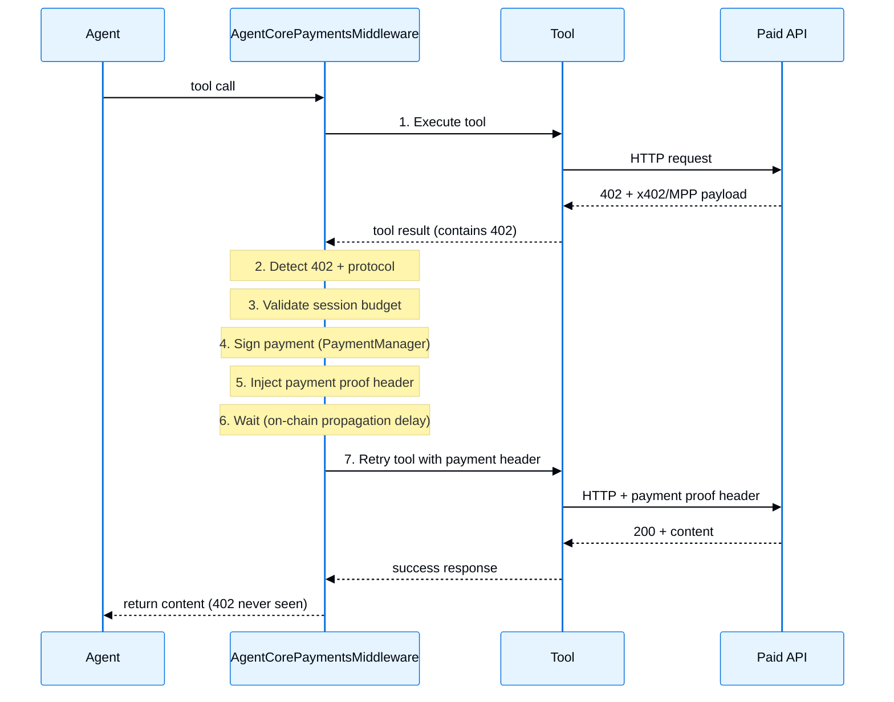

这个 middleware 专为托管在 AWS Bedrock 上的模型设计。更多信息请参阅 [middleware](/oss/langchain/middleware/overview)。

| Middleware | Description |
|------------|-------------|
| [Prompt caching](#prompt-caching) | 通过缓存重复的 prompt 前缀来降低成本 |
| [AgentCore Payments](#agentcore-payments) | 自动处理付费 API 的 x402 和 MPP 微支付 |

## Prompt caching

通过在 Amazon Bedrock 上缓存频繁复用的 prompt 前缀，可以降低推理延迟和输入 token 成本。`BedrockPromptCachingMiddleware` 通过 `model_settings` 启用缓存。`ChatBedrock` 和 `ChatBedrockConverse` 会在请求时把它转换为正确的 AWS wire format。缓存检查点会放在 system prompt、tool definitions，以及支持的情况下最新一条消息之后，这样模型在后续请求中就可以跳过对已见内容的重新计算。不同 API 和模型家族的缓存位置会有所不同：例如，Nova 会跳过某些 tool definition 和 tool-result 场景。

Prompt caching 适用于以下场景：

- 多轮对话，且 system prompt 很长并保持稳定
- 工具定义很多、且在多次调用间保持不变的 agent
- 基于文档的问答，用户会围绕同一份上传内容提出多个问题
- 处理批量任务时需要重复使用静态内容

支持的模型：

- **Anthropic Claude**
- **Amazon Nova**

<Info>
    了解更多关于 [AWS Bedrock prompt caching](https://docs.aws.amazon.com/bedrock/latest/userguide/prompt-caching.html) 的策略和限制。要让缓存检查点生效，缓存内容必须超过 1,024 个 token，有时还会因模型而更高。请参阅[支持的模型、区域和限制](https://docs.aws.amazon.com/bedrock/latest/userguide/prompt-caching.html#prompt-caching-models)。
</Info>

**API reference:** @[`BedrockPromptCachingMiddleware`]

```python ChatBedrockConverse
from langchain_aws import ChatBedrockConverse
from langchain_aws.middleware.prompt_caching import BedrockPromptCachingMiddleware
from langchain.agents import create_agent

agent = create_agent(
    model=ChatBedrockConverse(model="us.anthropic.claude-sonnet-4-5-20250929-v1:0"),
    system_prompt="<Your long system prompt here>",
    middleware=[BedrockPromptCachingMiddleware(ttl="1h")], # [!code highlight]
)
```

```python ChatBedrock
from langchain_aws import ChatBedrock
from langchain_aws.middleware.prompt_caching import BedrockPromptCachingMiddleware
from langchain.agents import create_agent

agent = create_agent(
    model=ChatBedrock(model="us.anthropic.claude-sonnet-4-5-20250929-v1:0"),
    system_prompt="<Your long system prompt here>",
    middleware=[BedrockPromptCachingMiddleware(ttl="5m")], # [!code highlight]
)
```

<Accordion title="配置选项">

<ParamField body="type" type="string" default="ephemeral">
    缓存类型。对于 `ChatBedrock`，当前只支持 `'ephemeral'`。对于 `ChatBedrockConverse`，这个值会被忽略，因为 Converse API 始终使用 `"default"` 缓存类型。
</ParamField>

<ParamField body="ttl" type="string" default="5m">
    缓存内容的存活时间。可选值为 `'5m'` 或 `'1h'`。注意 Amazon Nova 模型只支持 `'5m'`。
</ParamField>

<ParamField body="min_messages_to_cache" type="number" default="0">
    开始缓存前所需的最小消息数量。
</ParamField>

<ParamField body="unsupported_model_behavior" type="string" default="warn">
    当使用不支持的模型时的行为。可选值：`'ignore'`、`'warn'` 或 `'raise'`。
</ParamField>

</Accordion>

<Accordion title="完整示例">

这个 middleware 会缓存每次请求中到最新消息为止的内容。在 TTL 窗口内的后续请求里（5 分钟或 1 小时），之前见过的内容会从缓存中读取，而不是重新处理，从而降低成本和延迟。

**工作方式：**
1. 第一次请求：system prompt、tools 和用户消息会发送到 API 并被缓存
2. 第二次请求：缓存内容会被重新使用。只需要处理新的消息
3. 之后的每一轮都会重复这个模式，每次请求都复用已缓存的对话历史

<Note>
    Prompt caching 可以通过缓存 token 降低 API 成本，但**不会**提供对话记忆。要在多次调用之间保留对话历史，请使用像 `MemorySaver` 这样的 [checkpointer](https://langchain-ai.github.io/langgraph/concepts/persistence/#checkpointer-libraries)。
</Note>

```python
from langchain_aws import ChatBedrockConverse
from langchain_aws.middleware.prompt_caching import BedrockPromptCachingMiddleware
from langchain.agents import create_agent
from langchain_core.runnables import RunnableConfig
from langchain.messages import HumanMessage
from langchain.tools import tool
from langgraph.checkpoint.memory import MemorySaver


@tool
def get_weather(city: str) -> str:
    """获取某个城市的当前天气。"""
    return f"The weather in {city} is sunny and 72F."


# System prompt 必须超过 1,024 个 token，缓存才会生效
LONG_PROMPT = (
    "You are a helpful weather assistant with deep expertise in meteorology, "
    "climate science, and atmospheric phenomena. When answering questions about "
    "weather, provide accurate and up-to-date information. "
    + "You should always strive to give the most helpful response possible. " * 85
)

agent = create_agent(
    model=ChatBedrockConverse(model="us.anthropic.claude-sonnet-4-5-20250929-v1:0"),
    system_prompt=LONG_PROMPT,
    tools=[get_weather],
    middleware=[BedrockPromptCachingMiddleware(ttl="5m")], # [!code highlight]
    checkpointer=MemorySaver(),  # 保留对话历史
)

# 使用 thread_id 来维护对话状态
config: RunnableConfig = {"configurable": {"thread_id": "user-123"}}

# 第一次调用：用 system prompt、tools 和用户消息创建缓存
response = agent.invoke(
    {"messages": [HumanMessage("What is the weather in Miami?")]}, config=config
)

last_msg = response["messages"][-1]
print(last_msg.content)

# 检查缓存 token 用量
um = last_msg.usage_metadata
if um:
    details = um.get("input_token_details", {})
    cache_read = details.get("cache_read", 0) or 0
    cache_write = details.get("cache_creation", 0) or 0
    print(f"Cache read: {cache_read}, Cache write: {cache_write}")

# 第二次调用：复用已缓存的 system prompt、tools 和之前的消息
response = agent.invoke(
    {"messages": [HumanMessage("How about Seattle?")]}, config=config
)
print(response["messages"][-1].content)
```

</Accordion>

### 特定模型行为

这个 middleware 会自动处理不同 API 和模型家族之间的差异：

| Feature | ChatBedrockConverse (Anthropic) | ChatBedrockConverse (Nova) | ChatBedrock (Anthropic) |
|---------|:-------------------------------:|:--------------------------:|:-----------------------:|
| System prompt caching | ✅ | ✅ | ✅ |
| Tool definition caching | ✅ | ❌ | ✅ |
| Message caching | ✅ | ✅ (excludes tool result messages) | ✅ |
| Extended TTL (`1h`) | ✅ | ❌ | ✅ |

## AgentCore Payments

<Note>
AgentCore Payments 目前处于预览阶段，要求 `bedrock-agentcore>=1.18.0`。
</Note>

在 LangGraph agent 中自主处理 [x402 Payment Required](https://www.x402.org/) 和 [MPP (Machine Payments Protocol)](https://mpp.dev) 响应。当一个工具命中返回 HTTP 402 的付费 API 时，`AgentCorePaymentsMiddleware` 会检测出支付需求，通过 [Amazon Bedrock AgentCore Payments](https://docs.aws.amazon.com/bedrock-agentcore/latest/devguide/payments.html) 对支付进行签名，强制执行会话预算限制，并使用支付凭据重试请求。整个过程对 agent 是无感的。协议会根据 402 响应自动检测，因此同一个 middleware 无需任何按协议配置即可同时处理这两种情况。

AgentCore Payments middleware 位于 `bedrock-agentcore` 包中。下面这些示例安装 `langchain-aws` 只是为了配置一个 Amazon Bedrock 模型；你也可以将这个 middleware 用于 LangChain agent 支持的任何模型提供方。

AgentCore Payments middleware 适用于以下场景：
- 访问付费 API 而无需为每个工具编写手动支付逻辑的 agent
- 在签署任何支付之前在会话级别强制执行支出限制
- 通过回调自动从支付错误（会话过期、预算不足）中恢复
- 同时支持 SigV4 和 bearer token (CUSTOM_JWT) 认证

关于 PaymentManager 和 instrument 的分步设置，请参阅 [AgentCore Payments getting started skill](https://docs.aws.amazon.com/bedrock-agentcore/latest/devguide/payments-getting-started.html#payments-getting-started-skill)。

**前置条件：**
- 一个有权访问 [Amazon Bedrock AgentCore](https://aws.amazon.com/bedrock/agentcore/) 的 AWS 账户
- AgentCore Payments 可用的 AWS 区域：`us-east-1`、`us-west-2`、`eu-central-1` 或 `ap-southeast-2`。请参阅[受支持的 AWS 区域](https://docs.aws.amazon.com/bedrock-agentcore/latest/devguide/agentcore-regions.html)。
- 一个已配置的 **PaymentManager** 资源（提供 ARN）
- 一个为你的用户预置好的 **PaymentInstrument**（钱包）
- Python 3.10+

**安装：**

```bash
pip install -U "bedrock-agentcore[langgraph]>=1.18.0" langchain-aws
```

**API reference:** [`AgentCorePaymentsMiddleware`](https://pypi.org/project/bedrock-agentcore/)

```python
from bedrock_agentcore.payments.integrations.langgraph import (
    AgentCorePaymentsConfig,
    AgentCorePaymentsMiddleware,
)
from langchain.agents import create_agent
from langchain_aws import ChatBedrockConverse

config = AgentCorePaymentsConfig(
    payment_manager_arn="arn:aws:bedrock-agentcore:us-east-1:123456789012:payment-manager/pm-abc123",
    user_id="user-123",
    payment_instrument_id="instrument-456",
    region="us-east-1",
    auto_session=True,  # 在首次支付时自动创建会话
)

payments = AgentCorePaymentsMiddleware(config)

agent = create_agent(
    model=ChatBedrockConverse(model="us.anthropic.claude-sonnet-4-5-20250929-v1:0"),
    tools=[],  # middleware 会自动注册 http_request 和支付查询工具
    middleware=[payments], # [!code highlight]
)

# 402 响应会被自动处理
result = agent.invoke({
    "messages": [{"role": "user", "content": "Fetch data from https://paid-api.example.com/data"}]
})
```

使用这套配置后，内置的 `http_request` 工具可以在支付成功后自动重试兼容 x402 和 MPP 的付费 API 请求。当工具收到受支持的 402 响应时，middleware 会处理支付签名、预算约束和重试。如果支付处理失败，agent 会收到配置的或默认的支付错误。

### 工作原理



当一个工具返回带有 x402 或 MPP payload 的 HTTP 402 响应时，middleware 会：
1. 从工具的输出中检测出支付需求
2. 提取支付详情（金额、收款方、网络）。协议（x402 或 MPP）会根据 402 响应自动检测
3. 将支付与会话预算进行核对（超限则拒绝）
4. 通过 PaymentManager 对支付进行签名
5. 将支付凭证 header 注入到工具的参数中。`X-PAYMENT`（x402 v1）、`PAYMENT-SIGNATURE`（x402 v2）或 `Authorization: Payment <token>`（MPP）
6. 短暂等待链上传播（可配置延迟）
7. 使用附带的支付 header 重试原始工具调用

### Machine Payments Protocol (MPP)

<Note>
支持 MPP 需要 `bedrock-agentcore>=1.22.0`。
</Note>

[MPP](https://mpp.dev) 服务器以 `402 Payment Required` 应答，并把支付选项以 `WWW-Authenticate: Payment` challenge 的形式对外宣告。middleware 会检测这些 challenge，选择一个你的 instrument 能满足的进行签名，然后用 `Authorization: Payment <token>` header 重试。无需任何针对协议的特殊配置——同一个 middleware 和同一个 `http_request` 工具即可同时处理 x402 和 MPP。

协议会根据 402 在何处宣告其支付需求而自动检测：

| 402 响应宣告支付需求的位置 | 协议 | 返回的 header |
|---|---|---|
| 响应体（`x402Version` + `accepts`） | x402 v1 | `X-PAYMENT` |
| `Payment-Required` 响应 header | x402 v2 | `PAYMENT-SIGNATURE` |
| `WWW-Authenticate: Payment` 响应 headers | MPP | `Authorization: Payment <token>` |

**支持的方法**

一个 MPP 服务器可能宣告多个支付选项，但每次支付只完成一个 challenge。middleware 只保留 `charge` 意图的、未过期的、且你的 instrument 所在区块链能满足其方法的 challenge，按 `network_preferences_config` 排序，并支付最佳匹配项：

| 支付方法 | 由 instrument 网络满足 |
|---|---|
| `evm` | `ETHEREUM` |
| `tempo` | `ETHEREUM`（Tempo 是一条 EVM 链） |
| `solana` | `SOLANA` |

宣告 `session` 或 `subscription` 意图的 challenge 会被过滤掉；只支持 `charge`。如果没有可被满足的已宣告 challenge，支付会在任何服务调用之前失败——一个不可满足的 402 永远不会消耗会话预算。

**网络（gas）费用**

一个 MPP challenge 会宣告谁承担区块链网络费用。当卖方不承担这些费用时，买方需要用支付钱包额外支付，叠加在 challenge 金额之上。由于这部分额外成本在 challenge 金额中不可见，middleware 不会假定买方接受它：签署这样的 challenge 需要在 config 上设置 `buyer_pays_gas_fees=True`，否则校验会失败。

```python
config = AgentCorePaymentsConfig(
    payment_manager_arn="arn:aws:bedrock-agentcore:us-east-1:123456789012:payment-manager/pm-abc123",
    user_id="user-1",
    payment_instrument_id="instr-1",
    region="us-east-1",
    auto_session=True,
    buyer_pays_gas_fees=True,  # 授权由买方钱包承担网络费用 # [!code highlight]
)
```

该参数是三态且仅适用于 MPP：`None`（默认值）会保留该字段不发送，因此使用协议默认值（买方拒绝）；`False` 显式拒绝；`True` 则授权向买方钱包收取网络费用。它对卖方已承担费用的 challenge 没有影响，并且在 x402 路径上会被忽略。

<Note>
当一条 402 同时宣告 MPP 和 x402 时，优先使用 MPP。如果 instrument 无法满足任何已宣告的 MPP challenge，但响应中还带有可用的 x402 需求，SDK 会回退到 x402，而不是让支付失败。该回退只适用于 challenge 选择阶段（任何内容提交之前）；支付提交之后的失败始终会向上传播。
</Note>

### 内置工具

middleware 会自动注册这些工具（可供 agent 使用）：

| Tool | Description |
|------|-------------|
| `http_request` | 调用任意 HTTP 端点。402 响应会自动支付。 |
| `get_payment_instrument` | 查询支付 instrument 的详情 |
| `list_payment_instruments` | 列出某个用户的全部 instrument |
| `get_payment_instrument_balance` | 检查某一链上的钱包余额 |
| `get_payment_session` | 查询会话预算、状态、过期时间 |

如果你自带 HTTP 工具，请设置 `provide_http_request=False`。

### 自定义工具集成约定

要让你自己的工具配合自动支付工作，它们需要满足两点：

**1. 发送 402 信号（输出）**：工具必须在其返回值中指明 402 响应。支持三种格式：

```python PAYMENT_REQUIRED marker (recommended)
import json

import httpx
from langchain.tools import tool

@tool
def my_api(query: str, headers: dict = None) -> str:
    """访问付费 API。支付会自动处理。"""
    resp = httpx.get("https://paid-api.example.com/data", headers=headers or {})
    if resp.status_code == 402:
        payload = {"statusCode": 402, "headers": dict(resp.headers), "body": resp.json()}
        return f"PAYMENT_REQUIRED: {json.dumps(payload)}" # [!code highlight]
    return resp.text
```

```python Raw JSON (fallback detection)
import json

import httpx
from langchain.tools import tool

@tool
def my_api(query: str, headers: dict = None) -> str:
    """访问付费 API。支付会自动处理。"""
    resp = httpx.get("https://paid-api.example.com/data", headers=headers or {})
    return json.dumps({
        "statusCode": resp.status_code,
        "headers": dict(resp.headers),
        "body": resp.json(),
    })
```

```python Custom handler
config = AgentCorePaymentsConfig(
    ...,
    custom_handlers={"my_tool": MyCustomHandler()}, # [!code highlight]
)
```

**2. 接收并转发 `headers`（输入）**：工具**必须**有一个 `headers` 参数，并在其 HTTP 请求中转发它。middleware 会在重试前把支付 header 注入到 `tool_args["headers"]`：

```python
@tool
def my_api(query: str, headers: dict = None) -> str:
    resp = httpx.get(URL, headers=headers or {})  # ← 在重试时转发支付 header
    ...
```

没有这一步，支付 header 虽然会被注入，但永远不会发送到服务器。

### 检测优先级

当工具返回时，middleware 会按以下顺序检查 402：
1. **自定义 handler**：如果通过 `custom_handlers` 为该工具名注册了 handler，则完全控制检测
2. **`PAYMENT_REQUIRED:` 标记**：内容中的显式 opt-in 信号
3. **宽松回退**：解析原始 JSON 中的 `statusCode: 402`、`x402Version` + `accepts` 字段，或 `responseHeaders`/`headers` 中的 `WWW-Authenticate: Payment` challenge（MPP 在 headers 而非 body 中宣告其支付选项，因此 challenge 本身就是 402 信号）

### MCP 工具兼容性

通过 `langchain-mcp-adapters` 接入的 MCP 工具，在满足以下条件时可以与 middleware 配合使用：
1. 工具将支付相关的 JSON（包括 `statusCode: 402`）作为**文本内容**返回在 `ToolMessage.content` 中（而不是 `ToolMessage.artifact` 或 `structuredContent`）
2. 工具接受 `headers` 参数，并在其出站 HTTP 请求中转发它

满足这些条件时，宽松回退检测会自动处理 402 响应。对于仍通过 `ToolMessage.content` 暴露的非标准格式，请注册一个[自定义 handler](#custom-handlers)。存储在 `ToolMessage.artifact` 中的 MCP `structuredContent` 以及 MCP 传输层 headers，需要在该 middleware 之外进行 adapter 或传输层集成。

### 错误处理

middleware 提供两层错误控制：

#### 错误处理回调（推荐）

推荐使用错误处理回调，因为它能把支付生命周期的复杂性排除在 agent 的推理之外。没有它，agent 会收到关于会话过期或缺少 instrument 的错误消息，并需要自己去调试支付配置，这既浪费 token 又常常失败。使用回调时，你的应用代码可以通过创建会话、刷新 instrument 或提高预算来以编程方式解决问题。当回调返回 `ErrorResolution.RETRY` 时，middleware 会使用更新后的配置重试支付。如果回调传播错误、返回自定义消息、抛出异常或耗尽重试次数，agent 会收到配置的或默认的支付错误。

```python
from bedrock_agentcore.payments.integrations.langgraph import (
    AgentCorePaymentsConfig,
    AgentCorePaymentsMiddleware,
    ErrorResolution,
    PaymentErrorContext,
)
from bedrock_agentcore.payments.manager import PaymentManager

# 在回调中初始化 PaymentManager 用于创建会话
pm = PaymentManager(
    payment_manager_arn="arn:aws:bedrock-agentcore:us-east-1:123456789012:payment-manager/pm-abc123",
    region_name="us-east-1",
)

def handle_payment_error(ctx: PaymentErrorContext) -> ErrorResolution | str:
    if ctx.exception_type in ("PaymentSessionNotFound", "PaymentSessionExpired"):
        session = pm.create_payment_session(
            user_id=ctx.config.user_id,
            limits={"maxSpendAmount": {"value": "5.00", "currency": "USD"}},
            expiry_time_in_minutes=60,
        )
        ctx.config.payment_session_id = session["paymentSessionId"]
        return ErrorResolution.RETRY

    if ctx.exception_type == "InsufficientBudget":
        session = pm.create_payment_session(
            user_id=ctx.config.user_id,
            limits={"maxSpendAmount": {"value": "10.00", "currency": "USD"}},
            expiry_time_in_minutes=60,
        )
        ctx.config.payment_session_id = session["paymentSessionId"]
        return ErrorResolution.RETRY

    if ctx.exception_type == "PaymentInstrumentConfigurationRequired":
        return "Payment instrument not configured. Visit https://myapp.com/wallet/setup to set up your wallet."

    return ErrorResolution.PROPAGATE

config = AgentCorePaymentsConfig(
    payment_manager_arn="arn:aws:bedrock-agentcore:us-east-1:123456789012:payment-manager/pm-abc123",
    user_id="user-1",
    payment_instrument_id="instr-1",
    region="us-east-1",
    on_payment_error=handle_payment_error, # [!code highlight]
    max_error_retries=3,
)
```

回调可以返回：

| Return | Behavior |
|--------|----------|
| `ErrorResolution.RETRY` | 使用更新后的配置重试支付 |
| `ErrorResolution.PROPAGATE` | 使用默认的确定性错误消息 |
| `str` | 以 `"PAYMENT ERROR: {你的字符串}"` 形式发送给 agent 的自定义消息 |

**回调流程：**

```text
Payment exception occurs
    │
    ├── on_payment_error is None? → deterministic error ToolMessage
    │
    ▼
    Invoke callback(PaymentErrorContext)
    │
    ├── Returns PROPAGATE → deterministic error ToolMessage to agent
    ├── Returns RETRY → re-attempt payment (up to max_error_retries)
    │       ├── Success → return paid content to agent ✅
    │       └── Fails again → loop back to callback
    └── Returns str → custom error message to agent
```

**PaymentErrorContext 字段：**

| Field | Type | Description |
|-------|------|-------------|
| `exception` | `Exception` | 异常实例 |
| `exception_type` | `str` | 类名称（例如 `"PaymentSessionExpired"`） |
| `exception_message` | `str` | `str(exception)` |
| `tool_name` | `str` | 触发 402 的工具 |
| `tool_args` | `dict` | 工具调用参数 |
| `payment_required_request` | `dict \| None` | 402 payload（如果在提取前出错则为 None） |
| `config` | `AgentCorePaymentsConfig` | 可变引用；修改它以解决问题 |
| `retry_count` | `int` | 重试次数，从 0 开始 |

**推荐的解决模式：**

| Exception | Resolution |
|---|---|
| `PaymentSessionNotFound` / `PaymentSessionExpired` | 创建新会话，设置 `ctx.config.payment_session_id`，返回 RETRY |
| `InsufficientBudget` | 用更高的限制创建会话，或 PROPAGATE |
| `PaymentInstrumentConfigurationRequired` | 设置 `ctx.config.payment_instrument_id`，返回 RETRY |
| `PaymentInstrumentNotFound` | 很可能是配置错误；返回 PROPAGATE |
| `PaymentSessionConfigurationRequired` | 创建会话，或启用 `auto_session=True` |
| 通用 `PaymentError` | 记录日志并返回 PROPAGATE；通常是临时的 |

#### 确定性错误消息（默认）

当未配置回调（或它返回 `PROPAGATE`）时，agent 会收到一条定制错误消息，其中包含建议不要重试的说明：

| 失败情况 | 发送给 agent 的消息 |
|---------|----------------|
| 未配置 instrument | `PAYMENT ERROR: No payment instrument configured...` |
| 未配置会话 | `PAYMENT ERROR: No payment session configured...` |
| 找不到 instrument | `PAYMENT ERROR: Payment instrument not found...` |
| 会话已过期 | `PAYMENT ERROR: Payment session has expired...` |
| 预算不足 | `PAYMENT ERROR: Insufficient budget...` |
| 支付被拒绝 | `PAYMENT ERROR: Payment was signed but rejected by the server...` |
| 通用失败 | `PAYMENT ERROR: Payment processing failed...` |

所有消息都包含 `"Do not retry this call"` 以及可操作的用户指导。

### 自动会话

跳过手动会话创建。middleware 会在第一次 402 时延迟创建一个会话：

```python
config = AgentCorePaymentsConfig(
    payment_manager_arn="arn:aws:bedrock-agentcore:us-east-1:123456789012:payment-manager/pm-abc123",
    user_id="user-1",
    payment_instrument_id="instr-1",
    region="us-east-1",
    auto_session=True, # [!code highlight]
    auto_session_budget="5.00",       # $5 预算
    auto_session_expiry_minutes=120,  # 2 小时
)
```

会话只创建一次，并在该 middleware 实例中为所有后续支付复用。每个 agent 调用（或服务器中每个用户请求）创建一个 `AgentCorePaymentsMiddleware`。该 middleware 不是线程安全的。

### 支付工具白名单

限制哪些工具获得支付处理：

```python
config = AgentCorePaymentsConfig(
    ...,
    payment_tool_allowlist=["http_request", "my_paid_api"], # [!code highlight]
)

# 运行时添加
config.add_to_allowlist("new_paid_tool", "another_tool")

# 移除（如果列表变为空，则恢复为全部工具均可用）
config.remove_from_allowlist("my_paid_api")
```

不在白名单中的工具会原样通过。当值为 `None`（默认）时，所有工具都有资格。

### Bearer token 认证

对于使用 `CUSTOM_JWT` authorizer 的支付管理器：

```python Static token
config = AgentCorePaymentsConfig(
    payment_manager_arn="arn:aws:bedrock-agentcore:us-east-1:123456789012:payment-manager/pm-abc123",
    bearer_token="eyJhbGciOiJSUzI1NiJ9...", # [!code highlight]
    payment_instrument_id="instr-1",
    auto_session=True,
)
```

```python Dynamic token provider (recommended)
config = AgentCorePaymentsConfig(
    payment_manager_arn="arn:aws:bedrock-agentcore:us-east-1:123456789012:payment-manager/pm-abc123",
    token_provider=lambda: fetch_fresh_jwt(), # [!code highlight]
    payment_instrument_id="instr-1",
    auto_session=True,
)
```

使用 bearer 认证时，`user_id` 是可选的（从 JWT 的 `sub` claim 派生）。

### 禁用自动支付

仅把 middleware 用于其内置的查询工具，而不拦截 402：

```python
config = AgentCorePaymentsConfig(
    ...,
    auto_payment=False, # [!code highlight]
)
```

常见的禁用自动支付的原因：
- **人工参与审批**：把 402 详情展示给用户，让其逐个授权每笔支付，再签名
- **审计与合规**：记录支付请求以供审核而不实际执行，确保所有交易都被显式批准
- **开发与测试**：在集成期间检查原始 402 响应，而不触发真实支付
- **高价值交易**：要求金额超过某个阈值的支付在继续前经过人工复核

### 自定义 handlers

为输出格式非标准的工具注册自定义 `PaymentResponseHandler` 实现：

```python
from bedrock_agentcore.payments.integrations.handlers import PaymentResponseHandler

class MyMCPHandler(PaymentResponseHandler):
    def extract_status_code(self, result):
        # result 是原始的 ToolMessage.content（str 或 blocks 列表）
        ...

    def extract_headers(self, result):
        ...

    def extract_body(self, result):
        ...

    def validate_tool_input(self, tool_input):
        return isinstance(tool_input, dict)

    def apply_payment_header(self, tool_input, payment_header):
        tool_input["headers"] = tool_input.get("headers", {})
        tool_input["headers"].update(payment_header)
        return True

config = AgentCorePaymentsConfig(
    ...,
    custom_handlers={"my_mcp_tool": MyMCPHandler()}, # [!code highlight]
)
```

自定义 handler 会收到**原始 `ToolMessage.content`**；你需要自己解析它。不要把内置 handler（如 `GenericPaymentHandler`）直接作为自定义 handler 传入；它们期望的是另一种规范化后的形态。

### 同步与异步

middleware 同时提供同步和异步路径。LangGraph 会自动调用正确的那一个：

| 调用方式 | 路径 | 适用场景 |
|---|---|---|
| `agent.invoke(...)` | 同步：`time.sleep`，直接调用 | 脚本、CLI 工具 |
| `agent.ainvoke(...)` | 异步：`asyncio.sleep`、`asyncio.to_thread` | FastAPI、Web 服务器、Jupyter |

安装 FastAPI 以运行异步 Web 服务器示例：

```bash
pip install -U fastapi
```

```python Async in FastAPI
from bedrock_agentcore.payments.integrations.langgraph import (
    AgentCorePaymentsConfig,
    AgentCorePaymentsMiddleware,
)
from fastapi import FastAPI
from langchain.agents import create_agent
from langchain_aws import ChatBedrockConverse

app = FastAPI()

@app.post("/chat")
async def chat(message: str):
    config = AgentCorePaymentsConfig(
        payment_manager_arn="arn:aws:bedrock-agentcore:us-east-1:123456789012:payment-manager/pm-abc123",
        user_id="user-1",
        payment_instrument_id="instr-1",
        region="us-east-1",
        auto_session=True,
    )
    payments = AgentCorePaymentsMiddleware(config)
    agent = create_agent(
        model=ChatBedrockConverse(model="us.anthropic.claude-sonnet-4-5-20250929-v1:0"),
        tools=[],
        middleware=[payments],
    )

    # 自动使用 awrap_tool_call，不会阻塞其他请求
    result = await agent.ainvoke({"messages": [{"role": "user", "content": message}]})
    return result
```

```python Sync in a script
from bedrock_agentcore.payments.integrations.langgraph import (
    AgentCorePaymentsConfig,
    AgentCorePaymentsMiddleware,
)
from langchain.agents import create_agent
from langchain_aws import ChatBedrockConverse

config = AgentCorePaymentsConfig(
    payment_manager_arn="arn:aws:bedrock-agentcore:us-east-1:123456789012:payment-manager/pm-abc123",
    user_id="user-1",
    payment_instrument_id="instr-1",
    region="us-east-1",
    auto_session=True,
)
payments = AgentCorePaymentsMiddleware(config)
agent = create_agent(
    model=ChatBedrockConverse(model="us.anthropic.claude-sonnet-4-5-20250929-v1:0"),
    tools=[],
    middleware=[payments],
)

# 自动使用 wrap_tool_call
result = agent.invoke({"messages": [{"role": "user", "content": "Fetch paid data"}]})
```

异步路径使用：
- 在支付后的链上传播延迟中使用 `await asyncio.sleep()`（非阻塞）
- 对 PaymentManager 签名调用使用 `asyncio.to_thread()`（保持事件循环空闲）
- 对异步错误回调自动执行 `await`

### 对比：使用 vs 不使用 middleware

**不使用 middleware**（手动包装）：
- 为每种工具类型编写一个包装函数（每个约 30–50 行）
- 手动处理 402 检测、x402/MPP 解析、签名和重试
- 为每个包装器实现支付错误处理
- 实现任何必要的支付后定时延迟
- 为 agent 创建预算错误消息
- 添加一个新工具 = 再写一个包装器

**使用 middleware：**
```python
config = AgentCorePaymentsConfig(
    payment_manager_arn="arn:...",
    user_id="...",
    payment_instrument_id="...",
    auto_session=True,
)
agent = create_agent(
    model=model,
    tools=[my_tools],
    middleware=[AgentCorePaymentsMiddleware(config)], # [!code highlight]
)
```

满足[自定义工具集成约定](#custom-tool-integration-contract)的兼容工具都会被自动处理。

### 配置参考

| Parameter | Type | Default | Description |
|-----------|------|---------|-------------|
| `payment_manager_arn` | `str` | *required* | 支付管理器资源的 ARN |
| `user_id` | `str \| None` | `None` | 用户 ID。SigV4 认证必需；使用 bearer token 时可选 |
| `payment_instrument_id` | `str \| None` | `None` | 用于支付签名的 instrument ID |
| `payment_session_id` | `str \| None` | `None` | 用于预算约束的会话 ID |
| `payment_connector_id` | `str \| None` | `None` | Connector ID（可选） |
| `region` | `str \| None` | `None` | AWS 区域 |
| `network_preferences_config` | `list[str] \| None` | `None` | 有序的 CAIP-2 网络标识符 |
| `buyer_pays_gas_fees` | `bool \| None` | `None` | 仅 MPP。授权向买方钱包额外收取网络（gas）费用，叠加在支付金额之上。`None` 保留协议默认值（买方拒绝）；对 x402 会被忽略 |
| `auto_payment` | `bool` | `True` | 启用/禁用自动 402 处理 |
| `auto_session` | `bool` | `False` | 在第一次 402 时自动创建会话 |
| `auto_session_budget` | `str` | `"1.00"` | 自动创建会话的预算（USD） |
| `auto_session_expiry_minutes` | `int` | `60` | 自动创建会话的过期时间 |
| `agent_name` | `str \| None` | `None` | 用于数据面板 headers 的 agent 名称 |
| `bearer_token` | `str \| None` | `None` | 静态 JWT。与 `token_provider` 互斥 |
| `token_provider` | `Callable \| None` | `None` | 返回新 JWT 的可调用对象。与 `bearer_token` 互斥 |
| `payment_tool_allowlist` | `list[str] \| None` | `None` | 有资格参与支付的工具。`None` = 全部 |
| `provide_http_request` | `bool` | `True` | 注册内置的 `http_request` 工具 |
| `post_payment_retry_delay_seconds` | `float` | `3.0` | 签名后重试前的延迟 |
| `custom_handlers` | `dict[str, Handler] \| None` | `None` | 以工具名为键的自定义 handler |
| `on_payment_error` | `Callable \| None` | `None` | 用于编程式恢复的错误回调 |
| `max_error_retries` | `int` | `3` | 每个工具调用通过回调重试的最大次数 |

### 更多资料

- [AgentCore Payments documentation](https://docs.aws.amazon.com/bedrock-agentcore/latest/devguide/payments.html)
- [Code samples: Agents that transact](https://github.com/awslabs/agentcore-samples/tree/main/01-features/08-agents-that-transact)
- [Blog: Introducing Amazon Bedrock AgentCore Payments](https://aws.amazon.com/blogs/machine-learning/agents-that-transact-introducing-amazon-bedrock-agentcore-payments-built-with-coinbase-and-stripe/)
- [Technical deep dive: AgentCore Payments and innovation in agentic commerce](https://aws.amazon.com/blogs/machine-learning/technical-deep-dive-agentcore-payments-and-innovation-in-agentic-commerce/)
